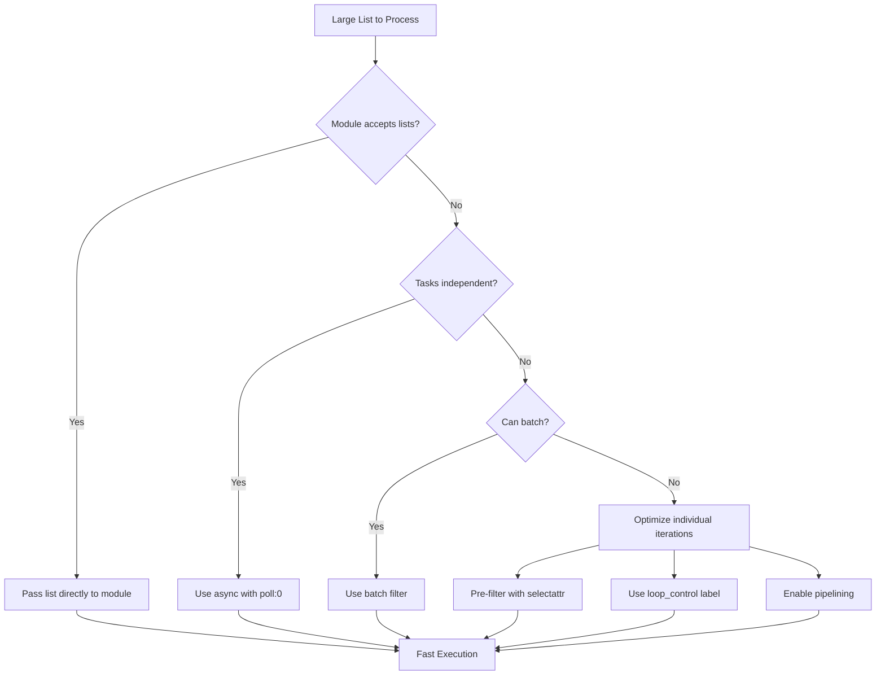

# How to Optimize Ansible Loop Performance for Large Lists

Author: [nawazdhandala](https://www.github.com/nawazdhandala)

Tags: Ansible, Performance, Optimization, Automation

Description: Learn how to optimize Ansible loop performance when processing large lists with techniques like batching, free strategy, async, and module-level lists.

---

Ansible loops work fine for small lists, but when you need to process hundreds or thousands of items, performance becomes a real concern. Each loop iteration involves module loading, SSH connections (or connection plugin overhead), fact gathering, and result processing. At scale, those small overheads multiply into minutes or hours of wasted time.

This post covers practical optimization techniques for Ansible loops, from simple changes that give you immediate wins to architectural approaches for handling truly large data sets.

## The Biggest Win: Avoid Loops When Possible

Many Ansible modules accept lists natively. Passing a list to the module is always faster than iterating one at a time because it reduces the number of module invocations and SSH round trips.

```yaml
# SLOW: One module call per package (15 SSH round trips)
- name: Install packages one at a time
  ansible.builtin.apt:
    name: "{{ item }}"
    state: present
  loop:
    - nginx
    - curl
    - git
    - htop
    - vim
    - wget
    - unzip
    - jq
    - tmux
    - python3-pip
    - certbot
    - fail2ban
    - logrotate
    - rsync
    - tree

# FAST: One module call for all packages (1 SSH round trip)
- name: Install all packages at once
  ansible.builtin.apt:
    name:
      - nginx
      - curl
      - git
      - htop
      - vim
      - wget
      - unzip
      - jq
      - tmux
      - python3-pip
      - certbot
      - fail2ban
      - logrotate
      - rsync
      - tree
    state: present
    update_cache: true
```

Modules that accept lists include: `apt`, `yum`, `dnf`, `pip`, `npm`, and `gem`. Always check the module documentation for a `name` parameter that accepts a list.

## Performance Comparison

Here is a rough comparison for installing 20 packages on Ubuntu 22.04 over SSH.

| Approach | Module Calls | SSH Round Trips | Approx Time |
|----------|-------------|-----------------|-------------|
| Loop with `item` | 20 | 20 | 45-90 sec |
| Direct list in `name` | 1 | 1 | 8-15 sec |
| Async loop (`poll: 0`) | 20 + 20 | ~40 | 30-45 sec |

The direct list approach is 3-6x faster for package installation.

## Use free Strategy for Independent Tasks

The default `linear` strategy waits for all hosts to complete a task before moving to the next. The `free` strategy lets faster hosts proceed without waiting.

```yaml
# free-strategy.yml
# Uses free strategy so hosts do not wait for each other
- name: Configure servers independently
  hosts: all
  strategy: free
  become: true
  tasks:
    - name: Install packages
      ansible.builtin.apt:
        name: "{{ item }}"
        state: present
      loop: "{{ host_packages }}"
```

This does not speed up loops on a single host, but when running against many hosts, faster hosts do not idle waiting for slower ones.

## Batch Processing for API Calls

When calling APIs or services that accept batch operations, combine items before the loop.

```yaml
# batch-api.yml
# Sends batch API requests instead of individual ones
- name: Create DNS records in batches
  hosts: localhost
  gather_facts: false
  vars:
    dns_records:
      - { name: "web-01.example.com", type: "A", value: "10.0.1.10" }
      - { name: "web-02.example.com", type: "A", value: "10.0.1.11" }
      - { name: "db-01.example.com", type: "A", value: "10.0.2.10" }
      # ... potentially hundreds more
  tasks:
    - name: Create records in batches of 50
      ansible.builtin.uri:
        url: https://dns-api.example.com/v1/records/batch
        method: POST
        body:
          records: "{{ item }}"
        body_format: json
        headers:
          Authorization: "Bearer {{ api_token }}"
      loop: "{{ dns_records | batch(50) | list }}"
      loop_control:
        label: "Batch of {{ item | length }} records"
```

Instead of 100 API calls, this makes just 2 calls (with 50 records each).

## Async for Parallel Execution

For tasks that do not support native list parameters, `async` with `poll: 0` runs iterations in parallel.

```yaml
# async-parallel.yml
# Runs slow tasks in parallel using async
- name: Run database migrations in parallel
  hosts: dbservers
  tasks:
    - name: Start migrations for all databases
      ansible.builtin.command: "/opt/scripts/migrate.sh {{ item }}"
      loop:
        - production_app
        - production_analytics
        - production_reporting
        - production_audit
        - production_logs
      async: 1800
      poll: 0
      register: migration_jobs

    - name: Wait for all migrations to complete
      ansible.builtin.async_status:
        jid: "{{ item.ansible_job_id }}"
      loop: "{{ migration_jobs.results }}"
      register: job_results
      until: job_results.finished
      retries: 60
      delay: 30
      loop_control:
        label: "{{ item.item }}"
```

## Reduce Output Overhead with loop_control

By default, Ansible prints the full `item` value for each loop iteration. For large dictionaries, this generates massive output that slows down the controller.

```yaml
# Use label to reduce output size
- name: Process servers with minimal output
  ansible.builtin.template:
    src: config.j2
    dest: "/etc/configs/{{ item.name }}.conf"
  loop: "{{ large_server_list }}"
  loop_control:
    label: "{{ item.name }}"
```

## Pre-filter Data Before Looping

Filtering inside the loop (with `when`) means Ansible still processes each iteration, evaluating the condition and displaying "skipped" in the output. Pre-filtering with `selectattr` eliminates skipped iterations entirely.

```yaml
# SLOW: Filter inside the loop (all items evaluated, many skipped)
- name: Process only production servers
  ansible.builtin.template:
    src: config.j2
    dest: "/etc/configs/{{ item.name }}.conf"
  loop: "{{ all_servers }}"
  when: item.environment == "production"

# FAST: Pre-filter before the loop (only matching items processed)
- name: Process only production servers
  ansible.builtin.template:
    src: config.j2
    dest: "/etc/configs/{{ item.name }}.conf"
  loop: "{{ all_servers | selectattr('environment', 'equalto', 'production') | list }}"
```

## Minimize Fact Gathering

If your loop tasks do not need facts, disable fact gathering. This saves one SSH round trip per host.

```yaml
# Skip fact gathering when not needed
- name: Simple file deployment
  hosts: all
  gather_facts: false
  tasks:
    - name: Deploy config files
      ansible.builtin.copy:
        src: "{{ item }}"
        dest: /etc/myapp/
      loop: "{{ config_files }}"
```

## Use Pipelining

SSH pipelining reduces the number of SSH operations per task. Enable it in `ansible.cfg`.

```ini
# ansible.cfg
[ssh_connection]
pipelining = True
```

This can cut task execution time by 30-50% because it eliminates the need for a separate SSH session to transfer the module to the remote host.

## Performance Flow Diagram



## Increase Parallelism with Forks

The `forks` setting controls how many hosts Ansible manages simultaneously. The default is 5.

```ini
# ansible.cfg
[defaults]
forks = 20
```

This does not speed up loops on a single host, but when running against 50+ hosts, increasing forks from 5 to 20 means 4x more hosts are processed simultaneously.

## Use Mitogen for Connection Speed

The Mitogen strategy plugin dramatically speeds up Ansible by reducing SSH overhead. It replaces the standard SSH connection with a persistent Python-to-Python channel.

```ini
# ansible.cfg
[defaults]
strategy_plugins = /path/to/mitogen/ansible_mitogen/plugins/strategy
strategy = mitogen_linear
```

With Mitogen, loop-heavy playbooks can run 2-7x faster because the per-iteration connection overhead is nearly eliminated.

## Caching for Repeated Lookups

If your loop includes lookups that hit the same source repeatedly, cache the results.

```yaml
# SLOW: Lookup runs on every iteration
- name: Process items with repeated lookups
  ansible.builtin.debug:
    msg: "{{ item }}: {{ lookup('file', '/opt/data/config.json') | from_json }}"
  loop: "{{ items }}"

# FAST: Lookup runs once, result is cached in a fact
- name: Cache the lookup result
  ansible.builtin.set_fact:
    config_data: "{{ lookup('file', '/opt/data/config.json') | from_json }}"

- name: Process items using cached data
  ansible.builtin.debug:
    msg: "{{ item }}: {{ config_data }}"
  loop: "{{ items }}"
```

## Profiling Your Playbooks

Enable the `timer` and `profile_tasks` callback plugins to identify slow loops.

```ini
# ansible.cfg
[defaults]
callbacks_enabled = timer, profile_tasks
```

This shows execution time for each task, making it easy to spot which loops are the bottleneck.

```
TASK [Install packages one at a time] ******************************************
Monday 21 February 2026  10:15:32 +0000 (0:00:45.123)

TASK [Install packages in bulk] ************************************************
Monday 21 February 2026  10:15:42 +0000 (0:00:09.876)
```

## Summary

The fastest Ansible loop is the one you do not run. Always check if the module accepts a list parameter before reaching for `loop`. When you must loop, pre-filter data with `selectattr`, use `loop_control.label` to reduce output overhead, and enable SSH pipelining. For independent long-running tasks, `async` with `poll: 0` gives you parallelism. For API calls, batch items together. And for large fleets, increase `forks` and consider Mitogen for dramatically faster connections. Profile your playbooks with `profile_tasks` to find bottlenecks and measure the impact of your optimizations.
