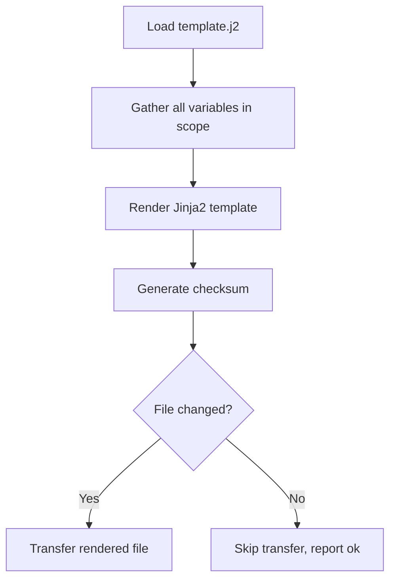

# How to Optimize Ansible Template Rendering

Author: [nawazdhandala](https://www.github.com/nawazdhandala)

Tags: Ansible, Jinja2, Templates, Performance

Description: Speed up Ansible template rendering with optimized Jinja2 patterns, pre-computation of variables, and reduced template complexity.

---

Templates are a core part of Ansible workflows. The `template` module renders Jinja2 files on the control node and transfers the result to remote hosts. When templates are complex or when variables require expensive lookups, rendering can become a significant bottleneck. This post covers techniques to make template rendering faster and more efficient.

## How Template Rendering Works

When Ansible processes a `template` task, this is what happens:

1. The Jinja2 template file is loaded from the control node
2. All variables in scope (facts, host_vars, group_vars, registered variables) are passed to the Jinja2 engine
3. The template is rendered into a string
4. The string is compared with the existing file on the remote host (if any)
5. If different, the rendered content is transferred to the remote host



Steps 2 and 3 are where performance problems typically occur. Large variable sets take time to serialize, and complex Jinja2 expressions take time to evaluate.

## Problem: Expensive Loops in Templates

One of the most common performance issues is using loops that iterate over large data sets:

```jinja2
{# Bad: iterating over all hosts for every template render #}

server {{ host }} {{ hostvars[host]['ansible_default_ipv4']['address'] }}:8080;

```

If you have 500 hosts, this loop runs 500 times, and each `hostvars[host]` lookup requires resolving that host's complete variable set. With 100 web servers each rendering this template, that is 50,000 hostvars lookups.

### Solution: Pre-compute Values

Pre-compute the data once and pass it as a simple list:

```yaml
---
- hosts: webservers
  tasks:
    - name: Build server list once
      set_fact:
        backend_servers: >-
          {{ groups['app_servers'] | map('extract', hostvars, ['ansible_default_ipv4', 'address']) | list }}
      run_once: true

    - name: Render nginx config with pre-computed list
      template:
        src: nginx-upstream.conf.j2
        dest: /etc/nginx/conf.d/upstream.conf
```

```jinja2
{# Good: iterate over a pre-computed simple list #}

server {{ server_ip }}:8080;

```

The difference is significant. The `set_fact` runs once, and each template render just iterates over a simple list of strings instead of performing expensive hostvars lookups.

## Problem: Deeply Nested Conditionals

Templates with many nested `` blocks are slow to evaluate:

```jinja2
{# Bad: deeply nested conditions #}




config_option = high_performance

config_option = standard




```

### Solution: Simplify with Filters and Defaults

```jinja2
{# Good: use Jinja2 tests and filters #}





config_option = high_performance

config_option = standard

```

The flattened version is easier to read and evaluates faster because it avoids redundant condition checking when outer conditions are false.

## Problem: Large Templates with Many Includes

Jinja2 `include` statements add overhead because each include requires loading and parsing another file:

```jinja2
{# Bad: many includes for small fragments #}







```

### Solution: Consolidate Small Templates

If the included files are small (under 50 lines each), consider merging them into a single template. The file I/O savings from avoiding multiple reads outweigh the organizational benefit of separate files.

For templates that must remain modular, use Jinja2 macros instead of includes:

```jinja2
{# Better: use macros defined in the same file #}

[database]
host = {{ host }}
port = {{ port }}
name = {{ name }}
pool_size = {{ (ansible_memtotal_mb / 1024) | int * 5 }}



[cache]
host = {{ host }}
port = {{ port }}
ttl = 3600


{{ database_config(db_host, db_port, db_name) }}
{{ cache_config(cache_host, cache_port) }}
```

## Problem: String Operations in Loops

String concatenation inside loops is expensive in Jinja2:

```jinja2
{# Bad: string building in a loop #}




servers = {{ server_list.rstrip(",") }}
```

### Solution: Use join Filter

```jinja2
{# Good: use the join filter #}
servers = {{ app_servers | join(",") }}
```

The `join` filter is implemented in Python and runs much faster than the Jinja2 loop equivalent.

## Problem: Repeated Expensive Lookups

When the same expression appears multiple times in a template, it gets evaluated each time:

```jinja2
{# Bad: same lookup evaluated 4 times #}
max_connections = {{ (ansible_memtotal_mb / 1024 * 50) | int }}
buffer_pool = {{ (ansible_memtotal_mb / 1024 * 50) | int * 8 }}MB
sort_buffer = {{ (ansible_memtotal_mb / 1024 * 50) | int / 10 }}MB
max_open_files = {{ (ansible_memtotal_mb / 1024 * 50) | int * 4 }}
```

### Solution: Compute Once with set

```jinja2
{# Good: compute once, reference many times #}

max_connections = {{ max_conn }}
buffer_pool = {{ max_conn * 8 }}MB
sort_buffer = {{ (max_conn / 10) | int }}MB
max_open_files = {{ max_conn * 4 }}
```

## Technique: Move Logic to Ansible, Not Templates

Complex logic belongs in Ansible tasks, not in templates. Keep templates simple:

```yaml
---
# Do the complex work in Ansible
- hosts: webservers
  tasks:
    - name: Calculate configuration values
      set_fact:
        app_config:
          max_workers: "{{ ansible_processor_vcpus * 2 }}"
          memory_limit: "{{ (ansible_memtotal_mb * 0.8) | int }}"
          cache_size: "{{ (ansible_memtotal_mb * 0.2) | int }}"
          upstream_servers: "{{ groups['app_servers'] | map('extract', hostvars, ['ansible_host']) | list }}"
          log_level: "{{ 'debug' if env == 'staging' else 'warn' }}"

    - name: Render simple template
      template:
        src: app.conf.j2
        dest: /etc/myapp/app.conf
```

```jinja2
{# Simple template - just variable substitution #}
[application]
max_workers = {{ app_config.max_workers }}
memory_limit = {{ app_config.memory_limit }}MB
cache_size = {{ app_config.cache_size }}MB
log_level = {{ app_config.log_level }}

[upstream]

server {{ server }}:8080

```

This pattern makes templates faster because they perform simple variable substitution instead of complex computation.

## Technique: Use copy Instead of template When Possible

If a file does not contain any Jinja2 expressions, use `copy` instead of `template`:

```yaml
# Bad: using template for a static file
- name: Deploy static config
  template:
    src: static-config.conf
    dest: /etc/myapp/static.conf

# Good: use copy for files without Jinja2
- name: Deploy static config
  copy:
    src: static-config.conf
    dest: /etc/myapp/static.conf
```

The `copy` module skips Jinja2 rendering entirely, which is faster for static files.

## Technique: Cache Template Lookups

If you use `lookup` plugins in templates, they execute on every render. Cache the results:

```yaml
# Bad: lookup runs for every host
- name: Render template with lookup
  template:
    src: config.j2
    dest: /etc/myapp/config.yml
  # Template contains: 

# Good: run lookup once and pass the result
- name: Read secret once
  set_fact:
    app_secret: "{{ lookup('file', '/path/to/secret') }}"
  run_once: true
  delegate_to: localhost
  no_log: true

- name: Render template with cached value
  template:
    src: config.j2
    dest: /etc/myapp/config.yml
  # Template uses: {{ app_secret }}
```

## Measuring Template Performance

Profile template rendering time:

```bash
# Enable profile_tasks and look for template task timings
ANSIBLE_CALLBACKS_ENABLED=profile_tasks ansible-playbook deploy.yml 2>&1 | grep "template"
```

If templates are consistently slow, test the rendering in isolation:

```bash
# Render a template without applying it (check mode)
ansible-playbook deploy.yml --check --diff --tags templates
```

The `--diff` flag shows what would change, which also reveals how much rendered content Ansible is processing.

## Summary

The key principles for fast Ansible template rendering are:

1. Pre-compute complex values in Ansible tasks, not in templates
2. Avoid hostvars lookups inside template loops
3. Use Jinja2 filters (`join`, `map`, `select`) instead of loops where possible
4. Cache results with `set` variables for repeated expressions
5. Use `copy` for static files
6. Run lookups once with `run_once` and pass results as variables

Fast templates are simple templates. Move the complexity into your Ansible tasks where it runs once, and keep your Jinja2 files focused on straightforward variable substitution.
