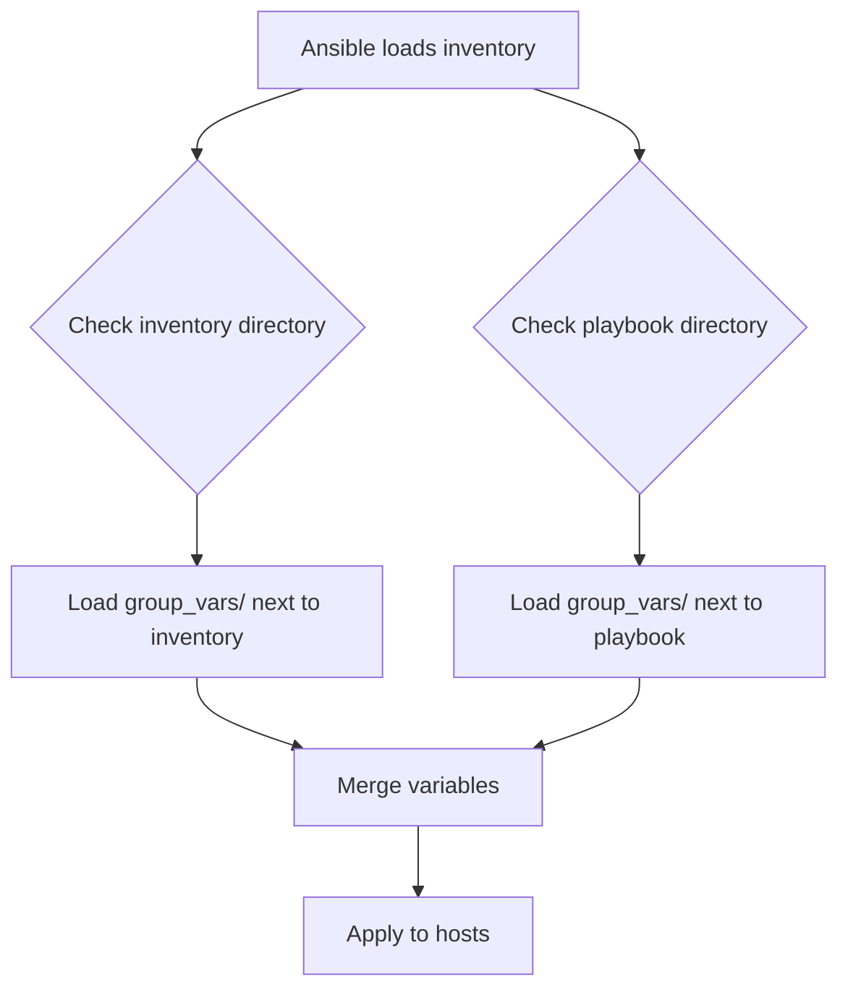

# How to Organize Ansible Inventory with group_vars Directory

Author: [nawazdhandala](https://www.github.com/nawazdhandala)

Tags: Ansible, Inventory, group_vars, DevOps, Best Practices

Description: A complete guide to organizing Ansible group variables using the group_vars directory structure with file splitting, vault integration, and production-ready layouts.

---

The `group_vars` directory is where Ansible looks for variables that apply to entire groups of hosts. Instead of cramming variables into your inventory file, you put them in separate YAML files organized by group name. This keeps your inventory clean, makes variables easy to find, and gives you proper version control diffs when settings change.

## Basic group_vars Structure

Create a `group_vars` directory alongside your inventory file. Inside it, create a YAML file for each group.

```
project/
  ansible.cfg
  inventory.ini
  group_vars/
    all.yml           # Variables for every host
    webservers.yml    # Variables for the webservers group
    databases.yml     # Variables for the databases group
  playbooks/
    site.yml
```

The inventory file stays minimal:

```ini
# inventory.ini
# Clean inventory with no inline variables
[webservers]
web1.example.com ansible_host=10.0.1.10
web2.example.com ansible_host=10.0.1.11

[databases]
db1.example.com ansible_host=10.0.2.10
db2.example.com ansible_host=10.0.2.11

[production:children]
webservers
databases
```

The variables live in their own files:

```yaml
# group_vars/all.yml
# Settings that apply to every single host
ansible_python_interpreter: /usr/bin/python3
ansible_become: true
timezone: UTC
ntp_servers:
  - 0.pool.ntp.org
  - 1.pool.ntp.org
```

```yaml
# group_vars/webservers.yml
# Web server specific configuration
ansible_user: deploy
nginx_version: "1.24"
nginx_worker_processes: auto
nginx_worker_connections: 4096
ssl_protocols: "TLSv1.2 TLSv1.3"
document_root: /var/www/html
```

```yaml
# group_vars/databases.yml
# Database server configuration
ansible_user: dbadmin
postgresql_version: 16
pg_max_connections: 200
pg_shared_buffers: 4GB
pg_effective_cache_size: 12GB
pg_data_directory: /var/lib/postgresql/16/main
```

## How Ansible Finds group_vars

Ansible searches for `group_vars` in two locations:

1. Next to the inventory file
2. Next to the playbook file



If both locations have group_vars, Ansible merges them. The playbook-adjacent `group_vars` takes precedence over the inventory-adjacent one.

You can configure the paths in `ansible.cfg` if you want a custom location:

```ini
# ansible.cfg
[defaults]
inventory = ./inventory
# Ansible will look for group_vars inside the inventory directory
# and also next to the playbook being run
```

## Splitting group_vars into Subdirectories

When a group has many variables, a single YAML file becomes hard to manage. Instead, create a directory named after the group and put multiple files inside it.

```
project/
  inventory.ini
  group_vars/
    all/
      connection.yml
      ntp.yml
      security.yml
    webservers/
      nginx.yml
      ssl.yml
      firewall.yml
      app.yml
    databases/
      postgresql.yml
      backup.yml
      replication.yml
      monitoring.yml
```

Ansible loads every YAML file inside the directory and merges them into a single set of variables for the group.

```yaml
# group_vars/webservers/nginx.yml
# Nginx configuration for all web servers
nginx_version: "1.24"
nginx_worker_processes: auto
nginx_worker_connections: 4096
nginx_client_max_body_size: 50m
nginx_proxy_read_timeout: 300
nginx_proxy_connect_timeout: 60
nginx_access_log: /var/log/nginx/access.log
nginx_error_log: /var/log/nginx/error.log
```

```yaml
# group_vars/webservers/ssl.yml
# TLS/SSL settings for all web servers
ssl_enabled: true
ssl_protocols: "TLSv1.2 TLSv1.3"
ssl_ciphers: "ECDHE-ECDSA-AES128-GCM-SHA256:ECDHE-RSA-AES128-GCM-SHA256"
ssl_certificate: /etc/ssl/certs/wildcard.example.com.pem
ssl_certificate_key: /etc/ssl/private/wildcard.example.com.key
ssl_session_timeout: 1d
ssl_session_cache: "shared:TLS:10m"
ssl_stapling: true
```

```yaml
# group_vars/webservers/firewall.yml
# Firewall rules for all web servers
firewall_enabled: true
firewall_default_incoming: deny
firewall_default_outgoing: allow
firewall_rules:
  - port: 80
    proto: tcp
    action: allow
  - port: 443
    proto: tcp
    action: allow
  - port: 22
    proto: tcp
    action: allow
    from: 10.0.0.0/8
```

This approach makes it easy for different team members to work on different aspects of the configuration without merge conflicts.

## Integrating Ansible Vault

The subdirectory approach pairs perfectly with Ansible Vault for secrets management. The convention is to have a `vault.yml` file for encrypted values and reference those from the regular files.

```
group_vars/
  databases/
    postgresql.yml      # Plain text, references vault variables
    backup.yml          # Plain text
    vault.yml           # Encrypted with ansible-vault
```

```bash
# Create the encrypted vault file
ansible-vault create group_vars/databases/vault.yml
```

```yaml
# group_vars/databases/vault.yml (encrypted at rest)
vault_db_admin_password: "s3cret-pa55word"
vault_replication_password: "r3pl1cat10n-pw"
vault_backup_encryption_key: "backup-3ncrypt10n-k3y"
```

```yaml
# group_vars/databases/postgresql.yml
# Reference vault variables using the vault_ prefix
postgresql_version: 16
pg_admin_password: "{{ vault_db_admin_password }}"
pg_replication_password: "{{ vault_replication_password }}"
pg_max_connections: 200
pg_listen_addresses: "*"
```

The `vault_` prefix convention makes it obvious which values come from encrypted storage.

## group_vars for Parent and Child Groups

When you have nested groups, each level can have its own group_vars file.

```ini
# inventory.ini
[web_prod]
web-prod-01.example.com
web-prod-02.example.com

[web_staging]
web-stg-01.example.com

[webservers:children]
web_prod
web_staging

[production:children]
web_prod
```

```
group_vars/
  all.yml                # Applied to every host
  production.yml         # Applied to all production hosts
  webservers.yml         # Applied to all web servers
  web_prod.yml           # Applied only to production web servers
  web_staging.yml        # Applied only to staging web servers
```

```yaml
# group_vars/production.yml
# Variables for all production servers
env: production
log_level: warn
monitoring_enabled: true
backup_enabled: true
```

```yaml
# group_vars/webservers.yml
# Variables for all web servers (prod and staging)
nginx_version: "1.24"
nginx_worker_processes: auto
ssl_enabled: true
```

```yaml
# group_vars/web_prod.yml
# Only for production web servers
nginx_worker_connections: 8192
nginx_cache_enabled: true
rate_limiting_enabled: true
```

```yaml
# group_vars/web_staging.yml
# Only for staging web servers
nginx_worker_connections: 1024
nginx_cache_enabled: false
rate_limiting_enabled: false
debug_mode: true
```

The variable precedence flows from general to specific: `all` < `production` < `webservers` < `web_prod`.

## Production-Ready Directory Layout

Here is a complete directory structure for a multi-environment Ansible project:

```
ansible-project/
  ansible.cfg
  inventory/
    production/
      hosts.ini
      group_vars/
        all/
          connection.yml
          monitoring.yml
          vault.yml
        webservers/
          nginx.yml
          app.yml
          vault.yml
        databases/
          postgresql.yml
          backup.yml
          vault.yml
    staging/
      hosts.ini
      group_vars/
        all/
          connection.yml
        webservers/
          nginx.yml
        databases/
          postgresql.yml
  playbooks/
    site.yml
    deploy.yml
  roles/
    nginx/
    postgresql/
```

Run playbooks against a specific environment:

```bash
# Deploy to production
ansible-playbook -i inventory/production playbooks/deploy.yml

# Deploy to staging
ansible-playbook -i inventory/staging playbooks/deploy.yml
```

Each environment has its own inventory and group_vars, so production and staging can have completely different variable values without any risk of mixing them up.

## Debugging group_vars

When variables are not being picked up as expected, use these commands to troubleshoot:

```bash
# Show all variables for a specific host (includes group_vars)
ansible-inventory -i inventory.ini --host web1.example.com

# Show which groups a host belongs to
ansible-inventory -i inventory.ini --graph

# Run a playbook with verbose output to see variable loading
ansible-playbook -i inventory.ini site.yml -vvv
```

The triple-verbose flag (`-vvv`) shows which files Ansible loads and in what order, which is invaluable for debugging precedence issues.

## Common Mistakes

1. **File naming mismatch**: The group_vars filename must match the group name exactly. If your group is called `webservers`, the file must be `group_vars/webservers.yml` or the directory must be `group_vars/webservers/`.

2. **Wrong directory location**: group_vars must be in the same directory as the inventory file or the playbook. Putting it somewhere else means Ansible will not find it.

3. **YAML syntax errors**: A single indentation mistake in a group_vars file can cause Ansible to silently ignore variables or fail with cryptic errors. Always validate your YAML.

4. **Variable name collisions**: If `group_vars/webservers/nginx.yml` and `group_vars/webservers/app.yml` both define `max_connections`, one will silently override the other. Use distinct, prefixed variable names.

The `group_vars` directory is the backbone of well-organized Ansible projects. It keeps your inventory files lean, your variables discoverable, and your secrets encrypted. Start using it from day one and your future self will thank you.
