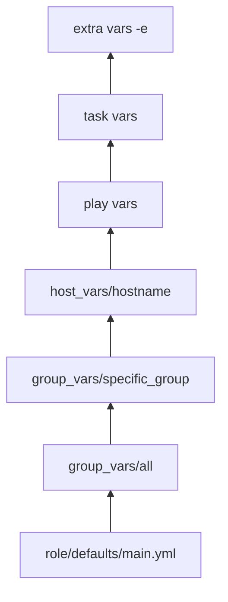

# How to Organize Ansible Playbooks in a Project Directory

Author: [nawazdhandala](https://www.github.com/nawazdhandala)

Tags: Ansible, Project Structure, Best Practices, DevOps

Description: Learn how to organize Ansible playbooks, roles, inventories, and variables in a clean project directory structure that scales with your infrastructure.

---

A well-organized Ansible project is the difference between a codebase that three people can maintain and one that turns into an unmaintainable mess within six months. When you start with Ansible, everything fits in a single playbook. But as your infrastructure grows, you need a directory structure that keeps things findable, reusable, and testable. This guide covers the standard project layout and explains why each directory exists.

## The Standard Directory Layout

Ansible has a recommended directory structure. Here is what a production-ready project looks like:

```
ansible-project/
  ansible.cfg
  requirements.yml
  site.yml
  webservers.yml
  dbservers.yml
  inventories/
    production/
      hosts.ini
      group_vars/
        all.yml
        webservers.yml
        dbservers.yml
      host_vars/
        web1.example.com.yml
    staging/
      hosts.ini
      group_vars/
        all.yml
        webservers.yml
  roles/
    common/
      tasks/
        main.yml
      handlers/
        main.yml
      templates/
        ntp.conf.j2
      files/
        authorized_keys
      vars/
        main.yml
      defaults/
        main.yml
      meta/
        main.yml
    nginx/
      tasks/
        main.yml
      handlers/
        main.yml
      templates/
        nginx.conf.j2
        site.conf.j2
      defaults/
        main.yml
    myapp/
      tasks/
        main.yml
        deploy.yml
        rollback.yml
      handlers/
        main.yml
      templates/
        config.yml.j2
      defaults/
        main.yml
  group_vars/
    all.yml
  host_vars/
  library/
  filter_plugins/
  callback_plugins/
```

Let me explain each part.

## ansible.cfg

This file lives at the project root and configures Ansible for the project:

```ini
# ansible.cfg - Project-level configuration
[defaults]
inventory = inventories/production/hosts.ini
roles_path = roles
retry_files_enabled = False
host_key_checking = False
forks = 20
gathering = smart
fact_caching = jsonfile
fact_caching_connection = /tmp/ansible_facts
fact_caching_timeout = 3600

[ssh_connection]
pipelining = True
ssh_args = -o ControlMaster=auto -o ControlPersist=60s

[privilege_escalation]
become = True
become_method = sudo
become_user = root
```

## Inventory Organization

Separate inventories by environment. Each environment gets its own directory with its own host list and variables:

```ini
# inventories/production/hosts.ini
[webservers]
web1.example.com
web2.example.com
web3.example.com

[dbservers]
db1.example.com
db2.example.com

[monitoring]
grafana.example.com
prometheus.example.com

[all:children]
webservers
dbservers
monitoring
```

```ini
# inventories/staging/hosts.ini
[webservers]
staging-web1.example.com

[dbservers]
staging-db1.example.com
```

Group variables per environment:

```yaml
# inventories/production/group_vars/all.yml
---
env: production
ntp_server: ntp.example.com
dns_servers:
  - 10.0.0.53
  - 10.0.0.54
monitoring_endpoint: https://prometheus.example.com
```

```yaml
# inventories/staging/group_vars/all.yml
---
env: staging
ntp_server: pool.ntp.org
dns_servers:
  - 8.8.8.8
  - 8.8.4.4
monitoring_endpoint: https://staging-prometheus.example.com
```

## Site Playbook

The `site.yml` is the master playbook that applies all roles to all host groups:

```yaml
# site.yml - Master playbook
---
- name: Apply common configuration to all hosts
  hosts: all
  roles:
    - common

- name: Configure web servers
  hosts: webservers
  roles:
    - nginx
    - myapp

- name: Configure database servers
  hosts: dbservers
  roles:
    - postgresql
```

Create purpose-specific playbooks for targeted runs:

```yaml
# webservers.yml - Only web server configuration
---
- name: Configure web servers
  hosts: webservers
  roles:
    - common
    - nginx
    - myapp
```

```yaml
# deploy.yml - Application deployment only
---
- name: Deploy application
  hosts: webservers
  serial: 3

  tasks:
    - name: Deploy application
      include_role:
        name: myapp
        tasks_from: deploy
```

## Role Structure

Each role follows a standard structure. Here is a complete example:

```yaml
# roles/nginx/defaults/main.yml - Default variables (lowest priority)
---
nginx_worker_processes: auto
nginx_worker_connections: 1024
nginx_keepalive_timeout: 65
nginx_client_max_body_size: 10m
nginx_ssl_protocols: "TLSv1.2 TLSv1.3"
```

```yaml
# roles/nginx/tasks/main.yml - Main task file
---
- name: Install nginx
  apt:
    name: nginx
    state: present
  notify: Restart nginx

- name: Deploy nginx main configuration
  template:
    src: nginx.conf.j2
    dest: /etc/nginx/nginx.conf
    owner: root
    group: root
    mode: '0644'
  notify: Reload nginx

- name: Deploy site configurations
  template:
    src: "{{ item.template }}"
    dest: "/etc/nginx/sites-available/{{ item.name }}.conf"
  loop: "{{ nginx_sites }}"
  notify: Reload nginx

- name: Enable sites
  file:
    src: "/etc/nginx/sites-available/{{ item.name }}.conf"
    dest: "/etc/nginx/sites-enabled/{{ item.name }}.conf"
    state: link
  loop: "{{ nginx_sites }}"
  notify: Reload nginx

- name: Remove default site
  file:
    path: /etc/nginx/sites-enabled/default
    state: absent
  notify: Reload nginx
```

```yaml
# roles/nginx/handlers/main.yml
---
- name: Restart nginx
  systemd:
    name: nginx
    state: restarted

- name: Reload nginx
  systemd:
    name: nginx
    state: reloaded
```

```yaml
# roles/nginx/meta/main.yml - Role metadata and dependencies
---
dependencies:
  - role: common

galaxy_info:
  author: DevOps Team
  description: Install and configure nginx
  company: Example Corp
  min_ansible_version: "2.12"
  platforms:
    - name: Ubuntu
      versions:
        - focal
        - jammy
```

## Group Variables

Use `group_vars` for variables shared across hosts in a group:

```yaml
# group_vars/webservers.yml - Shared web server settings
---
nginx_sites:
  - name: myapp
    template: myapp-site.conf.j2
    server_name: myapp.example.com
    ssl_certificate: /etc/ssl/certs/myapp.crt
    ssl_key: /etc/ssl/private/myapp.key

app_port: 8080
app_workers: 4
```

For sensitive data, use a separate vault-encrypted file:

```yaml
# group_vars/webservers/vars.yml - Non-sensitive variables
---
app_port: 8080
app_workers: 4
```

```yaml
# group_vars/webservers/vault.yml - Encrypted sensitive variables
---
db_password: !vault |
  $ANSIBLE_VAULT;1.1;AES256
  ...
api_secret_key: !vault |
  $ANSIBLE_VAULT;1.1;AES256
  ...
```

## Host Variables

Use `host_vars` for host-specific overrides:

```yaml
# host_vars/web1.example.com.yml
---
nginx_worker_processes: 4  # This server has 4 CPUs
app_workers: 8             # Override the group default
```

## External Role Dependencies

Use `requirements.yml` to manage roles from Galaxy or Git:

```yaml
# requirements.yml - External role dependencies
---
roles:
  - name: geerlingguy.docker
    version: "6.1.0"
  - name: geerlingguy.certbot
    version: "5.0.0"
  - src: https://github.com/myorg/ansible-role-custom.git
    scm: git
    version: v1.2.0
    name: custom_role

collections:
  - name: community.general
    version: "6.0.0"
  - name: ansible.posix
    version: "1.5.0"
```

Install them:

```bash
# Install all external roles and collections
ansible-galaxy install -r requirements.yml
ansible-galaxy collection install -r requirements.yml
```

## Task Organization Within Roles

For complex roles, split tasks into separate files:

```yaml
# roles/myapp/tasks/main.yml - Entry point that includes others
---
- name: Include installation tasks
  include_tasks: install.yml

- name: Include configuration tasks
  include_tasks: configure.yml

- name: Include service tasks
  include_tasks: service.yml
```

```yaml
# roles/myapp/tasks/install.yml
---
- name: Create application user
  user:
    name: myapp
    system: yes
    shell: /bin/bash

- name: Install application dependencies
  apt:
    name: "{{ myapp_dependencies }}"
    state: present
```

```yaml
# roles/myapp/tasks/deploy.yml - Callable separately via include_role
---
- name: Download release
  get_url:
    url: "{{ myapp_release_url }}"
    dest: /tmp/myapp-latest.tar.gz

- name: Extract release
  unarchive:
    src: /tmp/myapp-latest.tar.gz
    dest: /opt/myapp
    remote_src: yes
  notify: Restart myapp
```

## The Variable Precedence Hierarchy

Understanding where to put variables matters because Ansible has a complex precedence order. Here is a simplified view of the most commonly used levels, from lowest to highest priority:



Put default values in role defaults. Put environment-specific values in group_vars. Put host overrides in host_vars. Use `-e` for one-time overrides.

## Running Against Different Environments

With this structure, switching environments is just changing the inventory:

```bash
# Deploy to production
ansible-playbook -i inventories/production/hosts.ini site.yml

# Deploy to staging
ansible-playbook -i inventories/staging/hosts.ini site.yml

# Deploy only web servers in production
ansible-playbook -i inventories/production/hosts.ini webservers.yml

# Quick deploy to production
ansible-playbook -i inventories/production/hosts.ini deploy.yml -e version=2.1.0
```

## Summary

A well-organized Ansible project separates concerns: inventories per environment, roles per service, variables per scope, and playbooks per purpose. Start with this standard layout and you will have a project that multiple team members can navigate, extend, and maintain without confusion. The key principle is: everything has exactly one place where it belongs.
