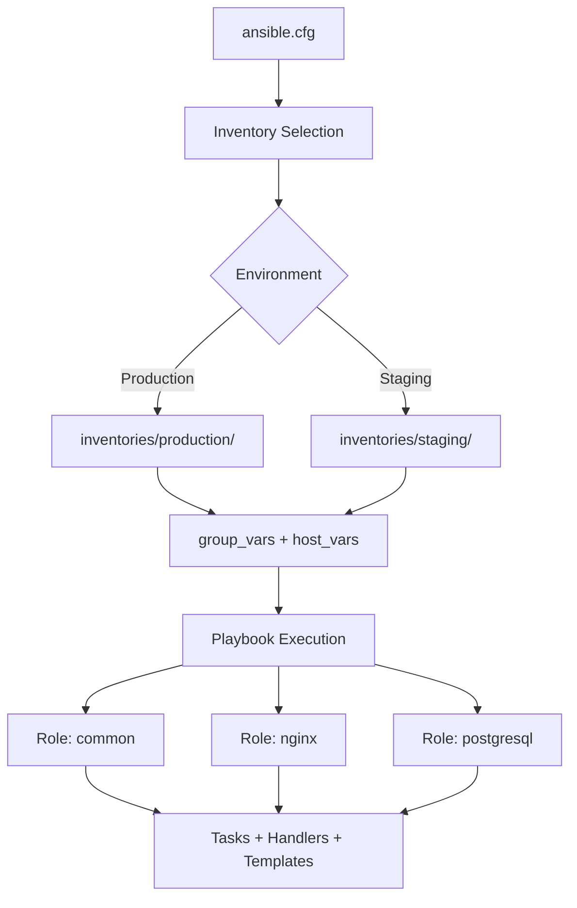

# How to Organize Ansible Project Directory Structure

Author: [nawazdhandala](https://www.github.com/nawazdhandala)

Tags: Ansible, DevOps, Project Structure, Automation

Description: Learn how to organize your Ansible project directory structure for maintainability, scalability, and team collaboration with practical examples.

---

A well-organized Ansible project directory is the difference between a team that ships confidently and one that dreads making changes. I have seen projects where playbooks, roles, variables, and inventories were all dumped into a single folder. Debugging those setups was painful. After years of working with Ansible in production, here is the directory structure that works best.

## The Standard Ansible Directory Layout

Ansible has a recommended directory layout, and for good reason. Following it means anyone familiar with Ansible can jump into your project and know where everything lives.

Here is the full recommended structure:

```
ansible-project/
├── inventories/
│   ├── production/
│   │   ├── hosts.yml
│   │   ├── group_vars/
│   │   │   ├── all.yml
│   │   │   ├── webservers.yml
│   │   │   └── dbservers.yml
│   │   └── host_vars/
│   │       ├── web01.yml
│   │       └── db01.yml
│   └── staging/
│       ├── hosts.yml
│       ├── group_vars/
│       │   ├── all.yml
│       │   └── webservers.yml
│       └── host_vars/
│           └── web01.yml
├── roles/
│   ├── common/
│   │   ├── tasks/
│   │   │   └── main.yml
│   │   ├── handlers/
│   │   │   └── main.yml
│   │   ├── templates/
│   │   │   └── ntp.conf.j2
│   │   ├── files/
│   │   │   └── motd
│   │   ├── vars/
│   │   │   └── main.yml
│   │   ├── defaults/
│   │   │   └── main.yml
│   │   ├── meta/
│   │   │   └── main.yml
│   │   └── README.md
│   ├── nginx/
│   └── postgresql/
├── playbooks/
│   ├── site.yml
│   ├── webservers.yml
│   ├── dbservers.yml
│   └── deploy.yml
├── library/
│   └── custom_module.py
├── filter_plugins/
│   └── custom_filters.py
├── callback_plugins/
│   └── custom_callback.py
├── group_vars/
│   └── all.yml
├── ansible.cfg
├── requirements.yml
└── Makefile
```

## Setting Up the Inventory Directory

The inventory directory is where you define your hosts and environment-specific variables. Keeping separate directories for each environment prevents accidental cross-environment deployments.

Here is an example production inventory file:

```yaml
# inventories/production/hosts.yml
# Define all production hosts grouped by function
all:
  children:
    webservers:
      hosts:
        web01.prod.example.com:
          ansible_host: 10.0.1.10
        web02.prod.example.com:
          ansible_host: 10.0.1.11
    dbservers:
      hosts:
        db01.prod.example.com:
          ansible_host: 10.0.2.10
        db02.prod.example.com:
          ansible_host: 10.0.2.11
    loadbalancers:
      hosts:
        lb01.prod.example.com:
          ansible_host: 10.0.0.10
```

And the corresponding group variables file:

```yaml
# inventories/production/group_vars/all.yml
# Variables that apply to every host in production
env: production
ntp_server: ntp.prod.example.com
dns_servers:
  - 10.0.0.2
  - 10.0.0.3
monitoring_endpoint: https://monitor.prod.example.com
```

## Structuring Roles Properly

Each role should handle one concern. Do not create a role called "setup-everything." Instead, break it down into focused roles like `common`, `nginx`, `postgresql`, `monitoring`, and so on.

Here is a well-structured common role:

```yaml
# roles/common/tasks/main.yml
# Base system configuration applied to all servers
- name: Update apt cache
  ansible.builtin.apt:
    update_cache: yes
    cache_valid_time: 3600
  when: ansible_os_family == "Debian"

- name: Install essential packages
  ansible.builtin.package:
    name: "{{ common_packages }}"
    state: present

- name: Configure NTP
  ansible.builtin.template:
    src: ntp.conf.j2
    dest: /etc/ntp.conf
    owner: root
    group: root
    mode: '0644'
  notify: restart ntp

- name: Ensure NTP is running
  ansible.builtin.service:
    name: ntp
    state: started
    enabled: yes
```

The defaults file sets sane fallback values:

```yaml
# roles/common/defaults/main.yml
# Default packages installed on every server
common_packages:
  - vim
  - htop
  - curl
  - wget
  - unzip
  - git
  - ntp

# Default NTP configuration
ntp_servers:
  - 0.pool.ntp.org
  - 1.pool.ntp.org
```

The meta file declares dependencies:

```yaml
# roles/common/meta/main.yml
# Role metadata and dependencies
galaxy_info:
  author: devops-team
  description: Common base configuration for all servers
  min_ansible_version: "2.14"
  platforms:
    - name: Ubuntu
      versions:
        - jammy
        - focal
dependencies: []
```

## Organizing Playbooks

Keep your playbooks in a dedicated directory. The top-level `site.yml` should include all other playbooks so you can run everything with a single command or target specific groups.

```yaml
# playbooks/site.yml
# Master playbook that applies all roles to all hosts
- name: Apply common configuration to all nodes
  hosts: all
  become: yes
  roles:
    - common

- name: Configure web servers
  hosts: webservers
  become: yes
  roles:
    - nginx
    - app_deploy

- name: Configure database servers
  hosts: dbservers
  become: yes
  roles:
    - postgresql
    - backup
```

## The ansible.cfg File

Place your `ansible.cfg` in the project root. This keeps configuration portable and version-controlled.

```ini
# ansible.cfg
# Project-level Ansible configuration
[defaults]
inventory = inventories/production/hosts.yml
roles_path = roles
retry_files_enabled = false
host_key_checking = false
stdout_callback = yaml
callbacks_enabled = timer, profile_tasks

[privilege_escalation]
become = true
become_method = sudo
become_user = root
become_ask_pass = false

[ssh_connection]
pipelining = true
control_path_dir = /tmp/ansible-ssh-%%h-%%p-%%r
```

## Managing External Dependencies

Use `requirements.yml` to track external roles and collections:

```yaml
# requirements.yml
# External roles and collections needed by this project
roles:
  - name: geerlingguy.docker
    version: 6.1.0
  - name: geerlingguy.certbot
    version: 5.0.0

collections:
  - name: community.general
    version: ">=7.0.0"
  - name: ansible.posix
    version: ">=1.5.0"
```

Install them with:

```bash
# Install all external dependencies
ansible-galaxy install -r requirements.yml
ansible-galaxy collection install -r requirements.yml
```

## Using a Makefile for Common Commands

A Makefile saves your team from memorizing long Ansible commands:

```makefile
# Makefile
# Convenience targets for common Ansible operations

.PHONY: ping deploy-prod deploy-staging lint

ping:
	ansible all -m ping -i inventories/production/hosts.yml

deploy-prod:
	ansible-playbook playbooks/site.yml -i inventories/production/hosts.yml

deploy-staging:
	ansible-playbook playbooks/site.yml -i inventories/staging/hosts.yml

lint:
	ansible-lint playbooks/ roles/

check-prod:
	ansible-playbook playbooks/site.yml -i inventories/production/hosts.yml --check --diff
```

## Visualizing the Workflow



## Common Mistakes to Avoid

First, do not put variables in playbooks. Use `group_vars` and `host_vars` instead. This keeps your playbooks clean and your variables discoverable.

Second, avoid deeply nested role directories. If a role has more than 3 levels of task includes, it is doing too much. Split it into multiple roles.

Third, never hardcode IP addresses or hostnames in playbooks. Always use inventory groups and variables.

Fourth, keep your `group_vars/all.yml` minimal. Only put truly global variables there. Environment-specific values belong in the environment inventory directory.

## Wrapping Up

A solid directory structure pays dividends as your Ansible project grows. Start with the standard layout from day one, even if your project is small. It takes minutes to set up and saves hours of refactoring later. The key principles are: separate environments in your inventory, keep roles focused on a single concern, use `group_vars` and `host_vars` for variable management, and document everything with a Makefile and README files in each role.
