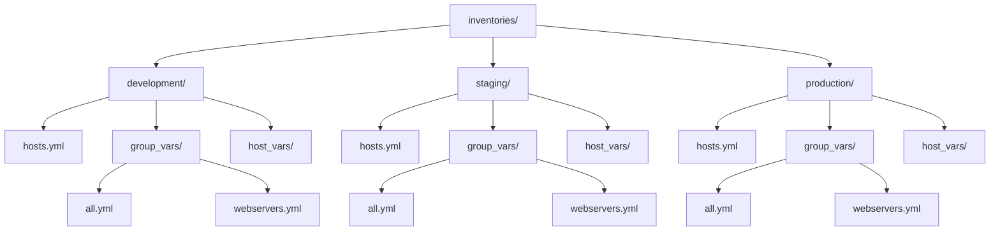

# How to Organize Inventory for Multi-Environment Deployments

Author: [nawazdhandala](https://www.github.com/nawazdhandala)

Tags: Ansible, Inventory, Multi-Environment, DevOps, Best Practices

Description: Learn how to structure Ansible inventory for managing multiple environments like development, staging, and production effectively.

---

Most teams run the same application across multiple environments: development, staging, production, and maybe a QA or performance testing environment. Each environment has its own hosts, its own configuration values, and its own access controls. Getting the inventory structure right from the start saves you from painful reorganization later. This post walks through proven patterns for organizing Ansible inventory across multiple environments.

## The Naive Approach (And Why It Breaks Down)

The first instinct is to put everything in one inventory file with environment-based groups:

```ini
# inventory/hosts.ini - this gets messy fast
[webservers_dev]
dev-web01 ansible_host=10.1.1.10

[webservers_staging]
stg-web01 ansible_host=10.2.1.10

[webservers_production]
prod-web01 ansible_host=10.3.1.10
prod-web02 ansible_host=10.3.1.11
```

This works for small setups, but it quickly becomes unmanageable. You end up with duplicate group definitions, environment prefixes on everything, and no clean way to run a playbook against just one environment.

## Pattern 1: Separate Inventory Directories per Environment

The recommended approach is a separate inventory directory for each environment:

```
inventories/
  development/
    hosts.yml
    group_vars/
      all.yml
      webservers.yml
      appservers.yml
      databases.yml
    host_vars/
      dev-web01.yml
  staging/
    hosts.yml
    group_vars/
      all.yml
      webservers.yml
      appservers.yml
      databases.yml
    host_vars/
      stg-web01.yml
  production/
    hosts.yml
    group_vars/
      all.yml
      webservers.yml
      appservers.yml
      databases.yml
    host_vars/
      prod-web01.yml
      prod-web02.yml
```

Each environment has its own complete inventory. The group names are the same across environments (just `webservers`, not `webservers_production`), which means your playbooks do not need environment-specific logic:

```yaml
# inventories/development/hosts.yml
all:
  children:
    webservers:
      hosts:
        dev-web01:
          ansible_host: 10.1.1.10
    appservers:
      hosts:
        dev-app01:
          ansible_host: 10.1.2.20
    databases:
      hosts:
        dev-db01:
          ansible_host: 10.1.3.30
```

```yaml
# inventories/production/hosts.yml
all:
  children:
    webservers:
      hosts:
        prod-web01:
          ansible_host: 10.3.1.10
        prod-web02:
          ansible_host: 10.3.1.11
    appservers:
      hosts:
        prod-app01:
          ansible_host: 10.3.2.20
        prod-app02:
          ansible_host: 10.3.2.21
    databases:
      hosts:
        prod-db01:
          ansible_host: 10.3.3.30
        prod-db02:
          ansible_host: 10.3.3.31
```

Target a specific environment by pointing to its inventory directory:

```bash
# Deploy to development
ansible-playbook -i inventories/development/ site.yml

# Deploy to production
ansible-playbook -i inventories/production/ site.yml
```

## Environment-Specific Variables

The `group_vars/all.yml` in each environment directory holds environment-specific settings:

```yaml
# inventories/development/group_vars/all.yml
environment: development
domain: dev.example.com
ssl_enabled: false
log_level: debug
app_replicas: 1
db_backup_enabled: false
monitoring_alert_channel: "#dev-alerts"
```

```yaml
# inventories/staging/group_vars/all.yml
environment: staging
domain: staging.example.com
ssl_enabled: true
log_level: info
app_replicas: 2
db_backup_enabled: true
monitoring_alert_channel: "#staging-alerts"
```

```yaml
# inventories/production/group_vars/all.yml
environment: production
domain: example.com
ssl_enabled: true
log_level: warn
app_replicas: 4
db_backup_enabled: true
monitoring_alert_channel: "#prod-alerts"
```

Group-specific variables can also differ per environment:

```yaml
# inventories/development/group_vars/databases.yml
db_max_connections: 50
db_shared_buffers: "256MB"
db_maintenance_window: "anytime"
```

```yaml
# inventories/production/group_vars/databases.yml
db_max_connections: 500
db_shared_buffers: "4GB"
db_maintenance_window: "sunday 02:00-04:00"
```

## Pattern 2: Shared Variables with Environment Overrides

If most of your configuration is the same across environments and only a few values change, you can use a shared group_vars directory with environment-specific overrides:

```
inventories/
  shared_group_vars/
    all.yml
    webservers.yml
    databases.yml
  development/
    hosts.yml
    group_vars/
      all.yml          # overrides shared values
  staging/
    hosts.yml
    group_vars/
      all.yml
  production/
    hosts.yml
    group_vars/
      all.yml
```

```yaml
# inventories/shared_group_vars/all.yml
# Shared defaults across all environments
ntp_servers:
  - ntp1.example.com
  - ntp2.example.com
dns_servers:
  - 10.0.0.53
  - 10.0.0.54
ansible_user: deploy
common_packages:
  - vim
  - curl
  - htop
  - jq
```

Reference the shared variables from your playbooks using `vars_files` or set up symlinks:

```bash
# Create symlinks to shared group_vars in each environment
cd inventories/development/group_vars
ln -s ../../shared_group_vars/webservers.yml webservers_shared.yml
```

Or use a more elegant approach with `ansible.cfg`:

```ini
# ansible.cfg
[defaults]
# Load shared vars first, then environment-specific ones override
vars_plugins_enabled = host_group_vars
```

## Pattern 3: Using the constructed Plugin for Environment Groups

If you want a single inventory file but still need environment separation, the `constructed` plugin can create environment groups dynamically:

```yaml
# inventories/all_hosts.yml
all:
  children:
    webservers:
      hosts:
        dev-web01:
          ansible_host: 10.1.1.10
          env: development
        stg-web01:
          ansible_host: 10.2.1.10
          env: staging
        prod-web01:
          ansible_host: 10.3.1.10
          env: production
        prod-web02:
          ansible_host: 10.3.1.11
          env: production
```

```yaml
# inventories/constructed.yml
plugin: ansible.builtin.constructed
strict: false

# Create environment groups from the env variable
groups:
  development: env == 'development'
  staging: env == 'staging'
  production: env == 'production'
```

Target environment and role intersections:

```bash
# Run on production webservers only
ansible-playbook -i inventories/ site.yml --limit 'production:&webservers'
```

## Playbooks That Work Across Environments

The whole point of this structure is that your playbooks stay environment-agnostic:

```yaml
# site.yml
- hosts: webservers
  roles:
    - common
    - nginx
  vars:
    # These come from group_vars, which differ per environment
    server_name: "{{ domain }}"
    enable_ssl: "{{ ssl_enabled }}"

- hosts: appservers
  roles:
    - common
    - app_deploy
  vars:
    replicas: "{{ app_replicas }}"

- hosts: databases
  roles:
    - common
    - postgresql
  vars:
    max_connections: "{{ db_max_connections }}"
```

The same playbook runs against development, staging, or production. Only the inventory changes.

## Directory Structure Visualization



## Wrapper Script for Safety

A wrapper script adds a safety layer to prevent accidentally running production playbooks:

```bash
#!/bin/bash
# deploy.sh
# Wrapper script that requires explicit environment selection

ENV="$1"
PLAYBOOK="${2:-site.yml}"

if [ -z "$ENV" ]; then
    echo "Usage: $0 <environment> [playbook]"
    echo "Environments: development, staging, production"
    exit 1
fi

if [ ! -d "inventories/$ENV" ]; then
    echo "Error: Environment '$ENV' not found"
    exit 1
fi

# Extra confirmation for production
if [ "$ENV" = "production" ]; then
    echo "WARNING: You are about to run against PRODUCTION"
    read -p "Type 'yes' to continue: " confirm
    if [ "$confirm" != "yes" ]; then
        echo "Aborted"
        exit 1
    fi
fi

ansible-playbook -i "inventories/$ENV/" "$PLAYBOOK" "${@:3}"
```

Usage:

```bash
# Deploy to staging
./deploy.sh staging site.yml

# Deploy to production (requires confirmation)
./deploy.sh production site.yml

# Pass extra flags
./deploy.sh staging site.yml --check --diff
```

## Best Practices Summary

Keep the same group names across all environments. Your playbooks should not know or care which environment they target.

Put environment-specific values in `group_vars/all.yml` within each environment directory. This makes it obvious what differs between environments.

Use host_vars sparingly. Most configuration should be at the group level, with host_vars reserved for genuinely unique per-host settings.

Never hardcode environment names in playbooks. Instead, use variables from the inventory (like `{{ environment }}`) when you need to reference the current environment.

Test your playbooks against development first, then staging, then production. The separate inventory directories make this workflow natural.

The separate-directory pattern (Pattern 1) is what I recommend for most teams. It scales well, keeps things clear, and makes it nearly impossible to accidentally apply production settings to development or vice versa.
