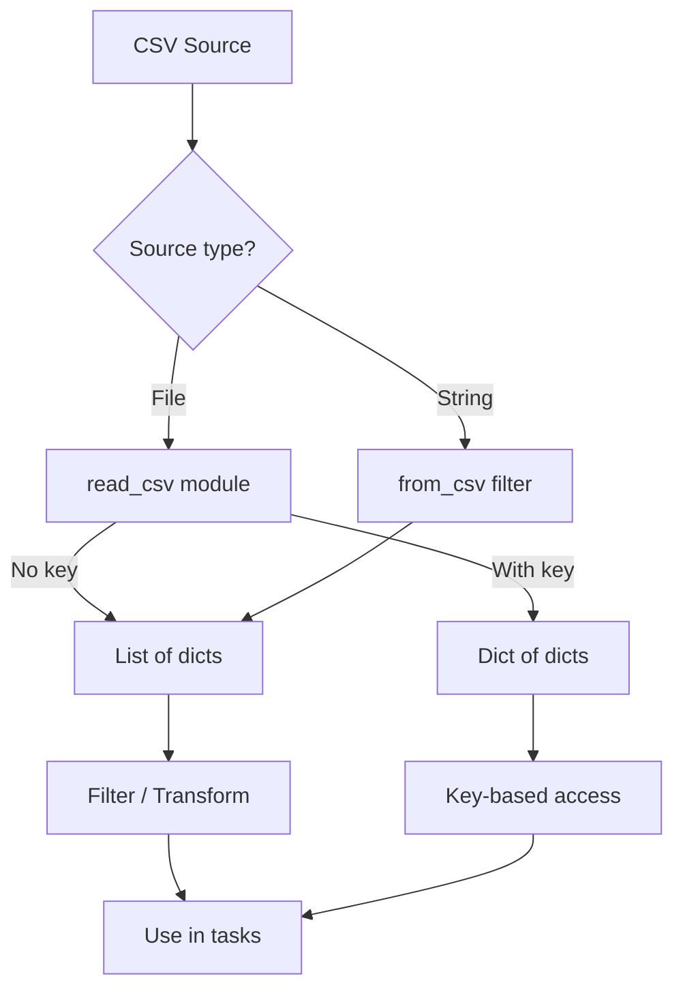

# How to Parse CSV Data in Ansible

Author: [nawazdhandala](https://www.github.com/nawazdhandala)

Tags: Ansible, CSV, Data Parsing, Automation

Description: Learn how to parse CSV data in Ansible using the read_csv module, from_csv filter, and custom parsing techniques for importing tabular data into playbooks.

---

CSV files are still one of the most common ways to exchange tabular data. You might get a CSV export from a CMDB, a spreadsheet of server inventory, or a report from a monitoring system. Ansible has the `community.general.read_csv` module and the `from_csv` filter for parsing CSV data right in your playbooks.

## Using the read_csv Module

The `community.general.read_csv` module reads a CSV file and returns a list of dictionaries, using the header row as keys:

```yaml
# playbook-read-csv.yml
# Reads a CSV file containing server inventory into Ansible variables
- name: Read CSV file
  hosts: localhost
  gather_facts: false

  tasks:
    - name: Read server inventory CSV
      community.general.read_csv:
        path: /tmp/servers.csv
      register: csv_data

    - name: Show all records
      ansible.builtin.debug:
        var: csv_data.list

    - name: Loop over CSV records
      ansible.builtin.debug:
        msg: "Server {{ item.hostname }} at {{ item.ip }} in {{ item.region }}"
      loop: "{{ csv_data.list }}"
```

Given a CSV file like this:

```csv
hostname,ip,region,role
web-01,10.0.1.10,us-east-1,webserver
db-01,10.0.2.10,us-east-1,database
cache-01,10.0.3.10,eu-west-1,cache
```

The `csv_data.list` variable contains:

```json
[
    {"hostname": "web-01", "ip": "10.0.1.10", "region": "us-east-1", "role": "webserver"},
    {"hostname": "db-01", "ip": "10.0.2.10", "region": "us-east-1", "role": "database"},
    {"hostname": "cache-01", "ip": "10.0.3.10", "region": "eu-west-1", "role": "cache"}
]
```

## Using a Key Field

You can specify a `key` field to get the data as a dictionary instead of a list:

```yaml
# playbook-csv-keyed.yml
# Reads CSV with a key field so records can be accessed by hostname
- name: Read CSV with key field
  hosts: localhost
  gather_facts: false

  tasks:
    - name: Read CSV keyed by hostname
      community.general.read_csv:
        path: /tmp/servers.csv
        key: hostname
      register: csv_data

    - name: Access a specific server by name
      ansible.builtin.debug:
        msg: "web-01 IP is {{ csv_data.dict['web-01'].ip }}"

    - name: Show all keys
      ansible.builtin.debug:
        msg: "{{ csv_data.dict.keys() | list }}"
```

## Custom Delimiters

Not all CSV files use commas. Some use tabs, semicolons, or pipes:

```yaml
# playbook-csv-delimiter.yml
# Reads a pipe-delimited file and a tab-delimited file
- name: Read CSV with custom delimiter
  hosts: localhost
  gather_facts: false

  tasks:
    - name: Read pipe-delimited file
      community.general.read_csv:
        path: /tmp/data.psv
        delimiter: "|"
      register: pipe_data

    - name: Read tab-delimited file
      community.general.read_csv:
        path: /tmp/data.tsv
        delimiter: "\t"
      register: tab_data

    - name: Show pipe-delimited results
      ansible.builtin.debug:
        var: pipe_data.list
```

## Parsing CSV Strings with from_csv

If you have CSV data as a string (from a command or variable), use the `from_csv` filter:

```yaml
# playbook-from-csv.yml
# Parses a CSV string from a command output into structured data
- name: Parse CSV string
  hosts: localhost
  gather_facts: false

  tasks:
    - name: Simulate a command that outputs CSV
      ansible.builtin.shell: |
        echo "name,size,used,available,mount"
        df -h --output=target,size,used,avail | tail -n +2 | awk '{print $1","$2","$3","$4","$1}'
      register: df_output
      changed_when: false

    - name: Parse the CSV output
      ansible.builtin.set_fact:
        disk_usage: "{{ df_output.stdout | community.general.from_csv }}"

    - name: Show disk usage
      ansible.builtin.debug:
        var: disk_usage
```

## CSV Files Without Headers

When your CSV lacks headers, provide them manually:

```yaml
# playbook-no-header.yml
# Reads a CSV file that has no header row by specifying field names
- name: Read headerless CSV
  hosts: localhost
  gather_facts: false

  tasks:
    - name: Read CSV with custom headers
      community.general.read_csv:
        path: /tmp/data_no_header.csv
        fieldnames:
          - hostname
          - ip_address
          - port
          - protocol
      register: csv_data

    - name: Show parsed data
      ansible.builtin.debug:
        var: csv_data.list
```

## CSV Data Processing Pipeline



## Filtering CSV Data

After parsing, you can use standard Ansible filters on the resulting list:

```yaml
# playbook-filter-csv.yml
# Reads a CSV file and filters records by region and role
- name: Filter CSV data
  hosts: localhost
  gather_facts: false

  tasks:
    - name: Read inventory CSV
      community.general.read_csv:
        path: /tmp/inventory.csv
      register: inventory

    - name: Get only webservers
      ansible.builtin.set_fact:
        webservers: >-
          {{ inventory.list | selectattr('role', 'equalto', 'webserver') | list }}

    - name: Get servers in us-east-1
      ansible.builtin.set_fact:
        us_east_servers: >-
          {{ inventory.list | selectattr('region', 'equalto', 'us-east-1') | list }}

    - name: Get count by region
      ansible.builtin.debug:
        msg: |
          
          {{ region }}: {{ hosts | length }} servers
          
```

## Generating CSV Output

You can also create CSV files from Ansible data:

```yaml
# playbook-write-csv.yml
# Generates a CSV report file from gathered host data
- name: Generate CSV report
  hosts: localhost
  gather_facts: false
  vars:
    report_data:
      - hostname: web-01
        status: healthy
        uptime: "45 days"
        cpu: 42
      - hostname: db-01
        status: healthy
        uptime: "120 days"
        cpu: 67
      - hostname: cache-01
        status: degraded
        uptime: "3 days"
        cpu: 89

  tasks:
    - name: Write CSV report
      ansible.builtin.copy:
        content: |
          hostname,status,uptime,cpu_percent
          
          {{ item.hostname }},{{ item.status }},{{ item.uptime }},{{ item.cpu }}
          
        dest: /tmp/health_report.csv

    - name: Verify CSV content
      ansible.builtin.debug:
        msg: "Generated report with {{ report_data | length }} entries"
```

## Practical Example: Provisioning from a CMDB Export

This is a common real-world pattern where you get a CSV export from a Configuration Management Database and use it to provision infrastructure:

```yaml
# playbook-cmdb-provision.yml
# Uses a CMDB CSV export to provision servers and configure them
- name: Provision from CMDB CSV export
  hosts: localhost
  gather_facts: false

  tasks:
    - name: Read CMDB export
      community.general.read_csv:
        path: /tmp/cmdb_export.csv
        key: hostname
      register: cmdb

    - name: Show all servers to provision
      ansible.builtin.debug:
        msg: "Will provision {{ cmdb.dict | length }} servers"

    - name: Create DNS entries for each server
      ansible.builtin.debug:
        msg: "DNS: {{ item.key }} -> {{ item.value.ip_address }}"
      loop: "{{ cmdb.dict | dict2items }}"
      loop_control:
        label: "{{ item.key }}"

    - name: Group servers by environment
      ansible.builtin.debug:
        msg: |
          
          {{ env }}: {{ servers | map(attribute='hostname') | join(', ') }}
          
```

## Handling CSV Edge Cases

CSV can have quoting, escaping, and encoding issues. Here are tips for common problems:

```yaml
# playbook-csv-edge-cases.yml
# Handles CSV files with special quoting and encoding
- name: Handle CSV edge cases
  hosts: localhost
  gather_facts: false

  tasks:
    - name: Read CSV with quoted fields (handles automatically)
      community.general.read_csv:
        path: /tmp/quoted_data.csv
      register: quoted_csv

    - name: Read CSV and skip comment lines
      ansible.builtin.shell: "grep -v '^#' /tmp/data_with_comments.csv"
      register: clean_csv
      changed_when: false

    - name: Parse cleaned CSV
      ansible.builtin.set_fact:
        clean_data: "{{ clean_csv.stdout | community.general.from_csv }}"

    - name: Handle empty fields with defaults
      ansible.builtin.debug:
        msg: "{{ item.hostname }}: port {{ item.port | default('8080') }}"
      loop: "{{ quoted_csv.list }}"
```

## Summary

The `community.general.read_csv` module handles CSV file reading with support for custom delimiters, key fields, and custom headers. For CSV strings, the `from_csv` filter does the same inline. Once parsed, CSV data becomes standard Ansible lists and dictionaries, which means you can use all the usual filters like `selectattr`, `groupby`, `sort`, and `map` to process it. For writing CSV, a simple Jinja2 template works well. These patterns cover the most common CSV scenarios you will encounter when integrating Ansible with other tools and data sources.
