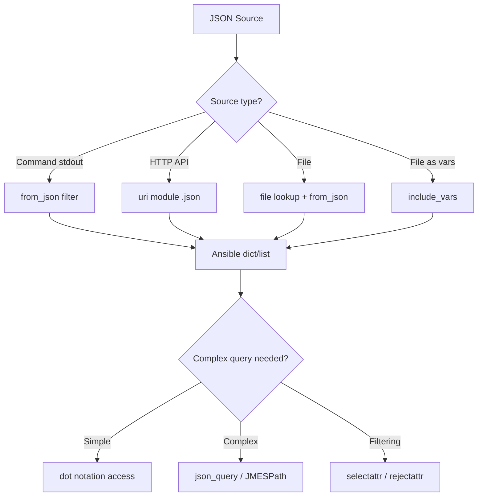

# How to Parse JSON Data in Ansible

Author: [nawazdhandala](https://www.github.com/nawazdhandala)

Tags: Ansible, JSON, Data Parsing, Automation

Description: Learn how to parse JSON data in Ansible from APIs, files, and command outputs using from_json filter, uri module, and json_query for data extraction.

---

JSON is everywhere in modern infrastructure. APIs return it, configuration tools produce it, and monitoring systems emit it. Knowing how to parse and work with JSON in Ansible is essential for building useful automation. This post covers all the common patterns for getting JSON data into your playbooks and extracting what you need from it.

## Parsing JSON from Command Output

When a command returns JSON as stdout, you can parse it with the `from_json` filter:

```yaml
# playbook-parse-stdout.yml
# Parses JSON output from a docker inspect command
- name: Parse JSON from command output
  hosts: localhost
  gather_facts: false

  tasks:
    - name: Get Docker container info
      ansible.builtin.shell: docker inspect my_container
      register: docker_output
      changed_when: false

    - name: Parse the JSON output
      ansible.builtin.set_fact:
        container_info: "{{ docker_output.stdout | from_json }}"

    - name: Extract specific fields
      ansible.builtin.debug:
        msg:
          name: "{{ container_info[0].Name }}"
          state: "{{ container_info[0].State.Status }}"
          ip: "{{ container_info[0].NetworkSettings.IPAddress }}"
```

## Loading JSON from Files

Use the `file` lookup to read a JSON file and `from_json` to parse it:

```yaml
# playbook-load-file.yml
# Reads and parses a JSON configuration file
- name: Load JSON from a file
  hosts: localhost
  gather_facts: false

  tasks:
    - name: Read and parse JSON config file
      ansible.builtin.set_fact:
        app_config: "{{ lookup('file', '/etc/myapp/config.json') | from_json }}"

    - name: Use values from the config
      ansible.builtin.debug:
        msg: "Database host: {{ app_config.database.host }}, port: {{ app_config.database.port }}"
```

You can also use `include_vars` for JSON files:

```yaml
# playbook-include-vars.yml
# Loads a JSON file directly as Ansible variables
- name: Load JSON with include_vars
  hosts: localhost
  gather_facts: false

  tasks:
    - name: Load JSON file as variables
      ansible.builtin.include_vars:
        file: config.json
        name: config

    - name: Access loaded variables
      ansible.builtin.debug:
        var: config
```

## Parsing JSON from API Responses

The `uri` module is the standard way to interact with HTTP APIs. It automatically parses JSON responses:

```yaml
# playbook-api-json.yml
# Fetches JSON data from a REST API and extracts information
- name: Parse JSON from API response
  hosts: localhost
  gather_facts: false

  tasks:
    - name: Call REST API
      ansible.builtin.uri:
        url: "https://api.github.com/repos/ansible/ansible"
        method: GET
        return_content: true
        headers:
          Accept: application/json
      register: api_response

    - name: Access parsed JSON fields directly
      ansible.builtin.debug:
        msg:
          repo_name: "{{ api_response.json.full_name }}"
          stars: "{{ api_response.json.stargazers_count }}"
          language: "{{ api_response.json.language }}"
          open_issues: "{{ api_response.json.open_issues_count }}"
```

The `uri` module puts the parsed JSON in `api_response.json` automatically when the response Content-Type is application/json.

## Navigating Nested JSON Structures

JSON from real APIs tends to be deeply nested. Here is how to navigate complex structures:

```yaml
# playbook-nested-json.yml
# Navigates a deeply nested JSON structure from a cloud API response
- name: Navigate nested JSON
  hosts: localhost
  gather_facts: false
  vars:
    api_response:
      status: success
      data:
        cluster:
          name: production
          nodes:
            - id: node-1
              status: healthy
              resources:
                cpu: 75
                memory: 82
            - id: node-2
              status: healthy
              resources:
                cpu: 45
                memory: 60
            - id: node-3
              status: degraded
              resources:
                cpu: 95
                memory: 91

  tasks:
    - name: Get cluster name
      ansible.builtin.debug:
        msg: "Cluster: {{ api_response.data.cluster.name }}"

    - name: Get all node IDs
      ansible.builtin.debug:
        msg: "{{ api_response.data.cluster.nodes | map(attribute='id') | list }}"

    - name: Find nodes with high CPU
      ansible.builtin.set_fact:
        high_cpu_nodes: >-
          {{ api_response.data.cluster.nodes |
             selectattr('resources.cpu', 'gt', 80) |
             map(attribute='id') | list }}

    - name: Show high CPU nodes
      ansible.builtin.debug:
        var: high_cpu_nodes
```

## Using json_query for Complex Extraction

The `json_query` filter uses JMESPath syntax for powerful querying:

```yaml
# playbook-json-query.yml
# Uses JMESPath queries to extract data from complex JSON structures
- name: Use json_query for complex extraction
  hosts: localhost
  gather_facts: false
  vars:
    infrastructure:
      regions:
        - name: us-east-1
          instances:
            - id: i-001
              type: t3.medium
              state: running
            - id: i-002
              type: t3.large
              state: stopped
        - name: eu-west-1
          instances:
            - id: i-003
              type: t3.medium
              state: running

  tasks:
    - name: Get all instance IDs across all regions
      ansible.builtin.debug:
        msg: "{{ infrastructure | json_query('regions[].instances[].id') }}"

    - name: Get only running instance IDs
      ansible.builtin.debug:
        msg: "{{ infrastructure | json_query(\"regions[].instances[?state=='running'].id[]\") }}"

    - name: Get instances of a specific type
      ansible.builtin.debug:
        msg: "{{ infrastructure | json_query(\"regions[].instances[?type=='t3.medium'].id[]\") }}"
```

## JSON Parsing Flow



## Handling JSON Parsing Errors

Always account for the possibility that JSON parsing might fail:

```yaml
# playbook-error-handling.yml
# Safely parses JSON with error handling for malformed data
- name: Handle JSON parsing errors
  hosts: localhost
  gather_facts: false

  tasks:
    - name: Try to parse potentially invalid JSON
      block:
        - name: Run command that might return bad JSON
          ansible.builtin.shell: "cat /tmp/maybe_json.txt"
          register: raw_output
          changed_when: false

        - name: Parse the output
          ansible.builtin.set_fact:
            parsed_data: "{{ raw_output.stdout | from_json }}"

        - name: Use parsed data
          ansible.builtin.debug:
            var: parsed_data

      rescue:
        - name: Handle parse failure
          ansible.builtin.debug:
            msg: "Failed to parse JSON. Raw output was: {{ raw_output.stdout | default('empty') }}"
```

## Converting Ansible Data to JSON

To go the other direction, converting Ansible variables to JSON, use the `to_json` or `to_nice_json` filters:

```yaml
# playbook-to-json.yml
# Converts Ansible variables to formatted JSON for file output
- name: Convert data to JSON
  hosts: localhost
  gather_facts: false
  vars:
    app_config:
      server:
        host: "0.0.0.0"
        port: 8080
      database:
        host: db.internal
        port: 5432
        name: myapp
      features:
        - caching
        - logging
        - metrics

  tasks:
    - name: Write config as formatted JSON
      ansible.builtin.copy:
        content: "{{ app_config | to_nice_json(indent=2) }}"
        dest: /tmp/app_config.json

    - name: Show compact JSON
      ansible.builtin.debug:
        msg: "{{ app_config | to_json }}"
```

## Practical Example: Processing Terraform State

```yaml
# playbook-terraform-state.yml
# Reads Terraform state file and extracts resource information
- name: Parse Terraform state for inventory
  hosts: localhost
  gather_facts: false

  tasks:
    - name: Read Terraform state
      ansible.builtin.shell: terraform show -json
      register: tf_state_raw
      changed_when: false

    - name: Parse state JSON
      ansible.builtin.set_fact:
        tf_state: "{{ tf_state_raw.stdout | from_json }}"

    - name: Extract EC2 instance details
      ansible.builtin.set_fact:
        ec2_instances: >-
          {{ tf_state | json_query("values.root_module.resources[?type=='aws_instance'].values") }}

    - name: Display instance info
      ansible.builtin.debug:
        msg: "Instance {{ item.tags.Name }}: {{ item.private_ip }}"
      loop: "{{ ec2_instances }}"
      loop_control:
        label: "{{ item.tags.Name | default('unnamed') }}"
```

## Summary

Ansible handles JSON naturally since its internal data structures map directly to JSON. Use `from_json` for parsing raw strings, the `uri` module for API calls (which parses automatically), and `include_vars` or `file` lookup for files. For querying complex JSON structures, `json_query` with JMESPath gives you the most power. For simpler access patterns, dot notation and standard Ansible filters like `selectattr` and `map` work well. Always wrap JSON parsing in error handling blocks when dealing with external data sources that might return unexpected formats.
