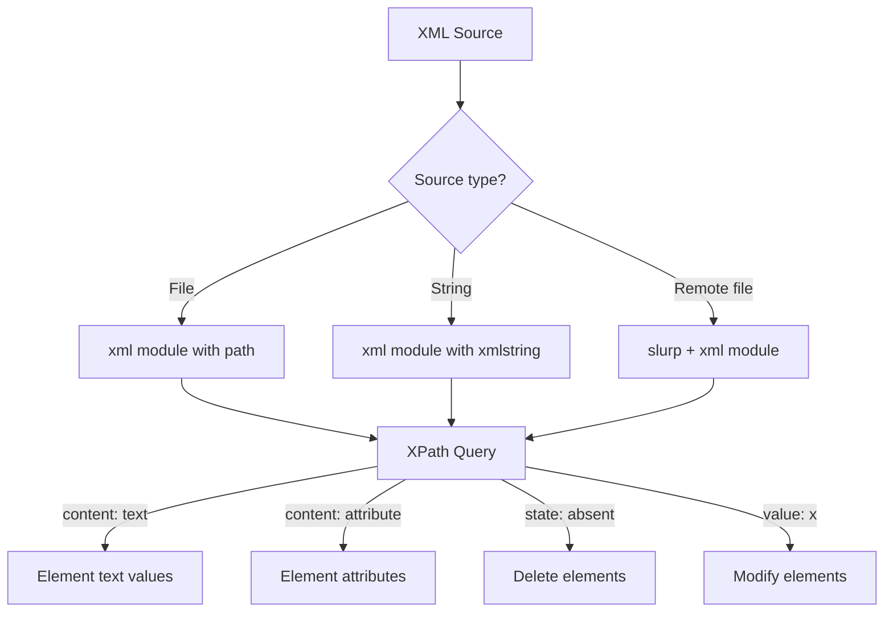

# How to Parse XML Data in Ansible

Author: [nawazdhandala](https://www.github.com/nawazdhandala)

Tags: Ansible, XML, Data Parsing, Automation

Description: Learn how to parse XML data in Ansible using the xml module, XPath queries, and community filters for extracting configuration from XML-based systems.

---

XML might not be as trendy as JSON these days, but it is still everywhere. Network device configurations, Java application settings, SOAP API responses, Maven build files, and countless enterprise systems still rely on XML. Ansible has solid support for working with XML data through the `community.general.xml` module and various parsing techniques.

## Reading XML Files with the xml Module

The `community.general.xml` module can read, query, and modify XML files. Here is how to read and extract data:

```yaml
# playbook-read-xml.yml
# Reads an XML configuration file and extracts values using XPath
- name: Read XML configuration
  hosts: localhost
  gather_facts: false

  tasks:
    - name: Get value from XML file using XPath
      community.general.xml:
        path: /etc/myapp/config.xml
        xpath: /configuration/database/host
        content: text
      register: db_host

    - name: Display extracted value
      ansible.builtin.debug:
        msg: "Database host: {{ db_host.matches[0]['{configuration/database/host}'] | default(db_host.matches[0]) }}"
```

## Parsing XML Strings

When you get XML as a string (from a command or API), you can use the `community.general.xml` module with the `xmlstring` parameter:

```yaml
# playbook-parse-xml-string.yml
# Parses an XML string and extracts data using XPath expressions
- name: Parse XML string
  hosts: localhost
  gather_facts: false
  vars:
    xml_response: |
      <?xml version="1.0"?>
      <servers>
        <server name="web-01" ip="10.0.1.10" role="webserver"/>
        <server name="db-01" ip="10.0.2.10" role="database"/>
        <server name="cache-01" ip="10.0.3.10" role="cache"/>
      </servers>

  tasks:
    - name: Extract all server elements
      community.general.xml:
        xmlstring: "{{ xml_response }}"
        xpath: /servers/server
        content: attribute
      register: servers_xml

    - name: Show extracted server data
      ansible.builtin.debug:
        var: servers_xml.matches

    - name: Extract just web servers
      community.general.xml:
        xmlstring: "{{ xml_response }}"
        xpath: "/servers/server[@role='webserver']"
        content: attribute
      register: web_servers

    - name: Show web servers
      ansible.builtin.debug:
        var: web_servers.matches
```

## XPath Queries

XPath is the query language for XML. Here are common patterns:

```yaml
# playbook-xpath.yml
# Demonstrates various XPath query patterns for XML data extraction
- name: XPath query examples
  hosts: localhost
  gather_facts: false
  vars:
    catalog_xml: |
      <?xml version="1.0"?>
      <catalog>
        <product id="1" category="electronics">
          <name>Laptop</name>
          <price>999.99</price>
          <stock>45</stock>
        </product>
        <product id="2" category="electronics">
          <name>Phone</name>
          <price>699.99</price>
          <stock>120</stock>
        </product>
        <product id="3" category="furniture">
          <name>Desk</name>
          <price>299.99</price>
          <stock>15</stock>
        </product>
      </catalog>

  tasks:
    - name: Get all product names
      community.general.xml:
        xmlstring: "{{ catalog_xml }}"
        xpath: /catalog/product/name
        content: text
      register: product_names

    - name: Show product names
      ansible.builtin.debug:
        msg: "{{ product_names.matches | map('dict2items') | flatten | map(attribute='value') | list }}"

    - name: Get electronics products (by attribute)
      community.general.xml:
        xmlstring: "{{ catalog_xml }}"
        xpath: "/catalog/product[@category='electronics']"
        content: attribute
      register: electronics

    - name: Get product with specific ID
      community.general.xml:
        xmlstring: "{{ catalog_xml }}"
        xpath: "/catalog/product[@id='2']/name"
        content: text
      register: product_2

    - name: Show results
      ansible.builtin.debug:
        msg:
          electronics: "{{ electronics.matches }}"
          product_2: "{{ product_2.matches }}"
```

## Modifying XML Files

The xml module can also modify XML in place:

```yaml
# playbook-modify-xml.yml
# Modifies values in an XML configuration file
- name: Modify XML configuration
  hosts: localhost
  gather_facts: false

  tasks:
    - name: Update database host in XML config
      community.general.xml:
        path: /etc/myapp/config.xml
        xpath: /configuration/database/host
        value: "db.production.internal"

    - name: Update a specific attribute
      community.general.xml:
        path: /etc/myapp/config.xml
        xpath: /configuration/server
        attribute: port
        value: "9090"

    - name: Add a new element
      community.general.xml:
        path: /etc/myapp/config.xml
        xpath: /configuration/features
        add_children:
          - feature:
              _:
                name: "caching"
                enabled: "true"

    - name: Remove an element
      community.general.xml:
        path: /etc/myapp/config.xml
        xpath: /configuration/deprecated_setting
        state: absent
```

## XML Processing Pipeline



## Parsing Network Device XML Output

Many network devices return XML. Here is a pattern for parsing Cisco or Juniper output:

```yaml
# playbook-network-xml.yml
# Parses XML output from a network device command
- name: Parse network device XML
  hosts: localhost
  gather_facts: false
  vars:
    netconf_response: |
      <rpc-reply>
        <interface-information>
          <physical-interface>
            <name>ge-0/0/0</name>
            <admin-status>up</admin-status>
            <oper-status>up</oper-status>
            <speed>1000mbps</speed>
          </physical-interface>
          <physical-interface>
            <name>ge-0/0/1</name>
            <admin-status>up</admin-status>
            <oper-status>down</oper-status>
            <speed>1000mbps</speed>
          </physical-interface>
        </interface-information>
      </rpc-reply>

  tasks:
    - name: Get all interface names
      community.general.xml:
        xmlstring: "{{ netconf_response }}"
        xpath: /rpc-reply/interface-information/physical-interface/name
        content: text
      register: interfaces

    - name: Show interface names
      ansible.builtin.debug:
        var: interfaces.matches

    - name: Find interfaces that are operationally down
      community.general.xml:
        xmlstring: "{{ netconf_response }}"
        xpath: "/rpc-reply/interface-information/physical-interface[oper-status='down']/name"
        content: text
      register: down_interfaces

    - name: Show down interfaces
      ansible.builtin.debug:
        var: down_interfaces.matches
```

## Converting XML to a Dictionary

For easier manipulation, you can convert XML to a Python dictionary using the `xmltodict` approach:

```yaml
# playbook-xml-to-dict.yml
# Converts XML to a Python dictionary using a custom filter plugin or inline Python
- name: Convert XML to dictionary
  hosts: localhost
  gather_facts: false

  tasks:
    - name: Parse XML and convert to dictionary structure
      ansible.builtin.shell: |
        python3 -c "
        import xmltodict, json
        with open('/etc/myapp/config.xml') as f:
            d = xmltodict.parse(f.read())
        print(json.dumps(d))
        "
      register: xml_as_json
      changed_when: false

    - name: Parse the JSON output
      ansible.builtin.set_fact:
        config_dict: "{{ xml_as_json.stdout | from_json }}"

    - name: Access XML data as dictionary
      ansible.builtin.debug:
        var: config_dict
```

## Practical Example: Managing Maven pom.xml

```yaml
# playbook-maven.yml
# Reads and updates version numbers in a Maven pom.xml file
- name: Manage Maven pom.xml
  hosts: build_servers
  vars:
    app_version: "2.1.0"
    java_version: "17"

  tasks:
    - name: Get current version from pom.xml
      community.general.xml:
        path: /opt/app/pom.xml
        xpath: /project/version
        content: text
        namespaces:
          pom: "http://maven.apache.org/POM/4.0.0"
      register: current_version

    - name: Show current version
      ansible.builtin.debug:
        msg: "Current version: {{ current_version.matches }}"

    - name: Update project version
      community.general.xml:
        path: /opt/app/pom.xml
        xpath: /project/version
        value: "{{ app_version }}"
        namespaces:
          pom: "http://maven.apache.org/POM/4.0.0"

    - name: Update Java version property
      community.general.xml:
        path: /opt/app/pom.xml
        xpath: /project/properties/java.version
        value: "{{ java_version }}"
        namespaces:
          pom: "http://maven.apache.org/POM/4.0.0"
```

## Handling XML Namespaces

XML namespaces are a common pain point. The xml module supports them via the `namespaces` parameter:

```yaml
# playbook-namespaces.yml
# Handles XML with namespace prefixes in XPath queries
- name: Handle XML namespaces
  hosts: localhost
  gather_facts: false
  vars:
    soap_response: |
      <soap:Envelope xmlns:soap="http://schemas.xmlsoap.org/soap/envelope/">
        <soap:Body>
          <m:GetStatusResponse xmlns:m="http://example.com/api">
            <m:Status>healthy</m:Status>
            <m:Uptime>99.97</m:Uptime>
          </m:GetStatusResponse>
        </soap:Body>
      </soap:Envelope>

  tasks:
    - name: Extract status from SOAP response
      community.general.xml:
        xmlstring: "{{ soap_response }}"
        xpath: /soap:Envelope/soap:Body/m:GetStatusResponse/m:Status
        content: text
        namespaces:
          soap: "http://schemas.xmlsoap.org/soap/envelope/"
          m: "http://example.com/api"
      register: status

    - name: Show status
      ansible.builtin.debug:
        var: status.matches
```

## Summary

The `community.general.xml` module is the primary tool for XML operations in Ansible. It supports reading with XPath queries, modifying values and attributes, adding and removing elements, and handling namespaces. For complex XML manipulation, converting to a dictionary via `xmltodict` and then working with standard Ansible filters can be more convenient. When dealing with network devices, the XML parsing capabilities integrate well with NETCONF and other XML-based management protocols. Always install the `lxml` Python library on your Ansible controller since the xml module depends on it.
