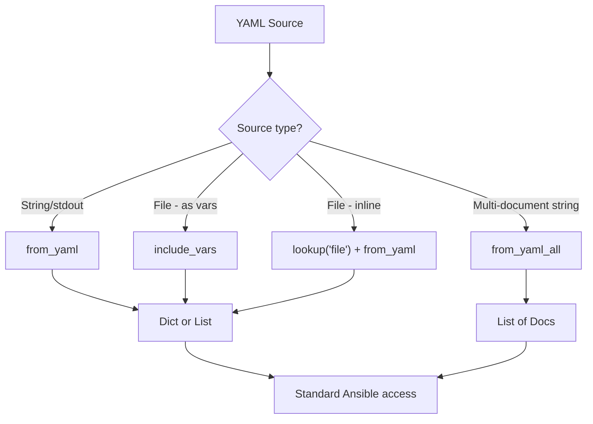

# How to Parse YAML Data in Ansible

Author: [nawazdhandala](https://www.github.com/nawazdhandala)

Tags: Ansible, YAML, Data Parsing, Configuration Management

Description: Learn how to parse YAML data in Ansible from files, strings, and remote sources using from_yaml, include_vars, and lookup plugins for flexible data handling.

---

YAML is the native language of Ansible. Playbooks, variable files, and inventory files are all YAML. But what about when you need to parse YAML from external sources, like files generated by other tools, API responses in YAML format, or dynamic data embedded in strings? Ansible provides several ways to handle this.

## Parsing YAML Strings with from_yaml

The `from_yaml` filter converts a YAML-formatted string into an Ansible data structure (dictionary or list):

```yaml
# playbook-from-yaml.yml
# Parses a YAML string from command output into Ansible variables
- name: Parse YAML string
  hosts: localhost
  gather_facts: false

  tasks:
    - name: Simulate getting YAML from a command
      ansible.builtin.shell: |
        kubectl get configmap myapp-config -o yaml
      register: configmap_output
      changed_when: false

    - name: Parse the YAML output
      ansible.builtin.set_fact:
        configmap: "{{ configmap_output.stdout | from_yaml }}"

    - name: Access parsed data
      ansible.builtin.debug:
        msg:
          name: "{{ configmap.metadata.name }}"
          data: "{{ configmap.data }}"
```

## Parsing Multi-Document YAML

Some YAML files contain multiple documents separated by `---`. Use `from_yaml_all` to parse all documents:

```yaml
# playbook-multi-doc.yml
# Parses a multi-document YAML string into a list of documents
- name: Parse multi-document YAML
  hosts: localhost
  gather_facts: false
  vars:
    multi_doc_yaml: |
      ---
      name: service-a
      port: 8080
      ---
      name: service-b
      port: 9090
      ---
      name: service-c
      port: 7070

  tasks:
    - name: Parse all YAML documents
      ansible.builtin.set_fact:
        all_services: "{{ multi_doc_yaml | from_yaml_all | list }}"

    - name: Show parsed documents
      ansible.builtin.debug:
        var: all_services

    - name: Loop over each document
      ansible.builtin.debug:
        msg: "Service {{ item.name }} runs on port {{ item.port }}"
      loop: "{{ all_services }}"
```

## Loading YAML from Files

The `include_vars` module is purpose-built for loading variable files:

```yaml
# playbook-include-vars.yml
# Loads YAML variable files and uses them in tasks
- name: Load YAML files
  hosts: localhost
  gather_facts: false

  tasks:
    - name: Load a single YAML file
      ansible.builtin.include_vars:
        file: /etc/myapp/settings.yml
        name: app_settings

    - name: Load all YAML files from a directory
      ansible.builtin.include_vars:
        dir: /etc/myapp/conf.d/
        extensions:
          - yml
          - yaml
        name: extra_config

    - name: Use loaded variables
      ansible.builtin.debug:
        msg: "App setting: {{ app_settings.database_host }}"
```

## Using the file Lookup with from_yaml

For inline parsing, combine the `file` lookup with `from_yaml`:

```yaml
# playbook-file-lookup.yml
# Reads a YAML file inline using lookup and parses it
- name: Parse YAML file inline
  hosts: localhost
  gather_facts: false

  tasks:
    - name: Read and parse YAML file
      ansible.builtin.set_fact:
        docker_compose: "{{ lookup('file', './docker-compose.yml') | from_yaml }}"

    - name: List all services defined in docker-compose
      ansible.builtin.debug:
        msg: "{{ docker_compose.services.keys() | list }}"

    - name: Get ports for each service
      ansible.builtin.debug:
        msg: "{{ item.key }}: {{ item.value.ports | default(['no ports']) }}"
      loop: "{{ docker_compose.services | dict2items }}"
      loop_control:
        label: "{{ item.key }}"
```

## Parsing Kubernetes YAML

Kubernetes manifests are a very common source of YAML data:

```yaml
# playbook-k8s-yaml.yml
# Parses Kubernetes deployment YAML to extract container information
- name: Parse Kubernetes manifests
  hosts: localhost
  gather_facts: false

  tasks:
    - name: Get deployment YAML from cluster
      ansible.builtin.shell: kubectl get deployment myapp -o yaml
      register: k8s_output
      changed_when: false

    - name: Parse the deployment manifest
      ansible.builtin.set_fact:
        deployment: "{{ k8s_output.stdout | from_yaml }}"

    - name: Extract useful information
      ansible.builtin.debug:
        msg:
          name: "{{ deployment.metadata.name }}"
          replicas: "{{ deployment.spec.replicas }}"
          image: "{{ deployment.spec.template.spec.containers[0].image }}"
          labels: "{{ deployment.metadata.labels }}"
```

## YAML Parsing Flow



## Handling YAML Parsing Errors

External YAML might be malformed. Use block/rescue for safe parsing:

```yaml
# playbook-safe-parse.yml
# Safely parses YAML with error handling for malformed content
- name: Safe YAML parsing
  hosts: localhost
  gather_facts: false

  tasks:
    - name: Attempt to parse YAML safely
      block:
        - name: Read YAML file
          ansible.builtin.slurp:
            src: /tmp/external_config.yml
          register: yaml_file

        - name: Parse YAML content
          ansible.builtin.set_fact:
            external_config: "{{ yaml_file.content | b64decode | from_yaml }}"

        - name: Use parsed config
          ansible.builtin.debug:
            var: external_config

      rescue:
        - name: Handle YAML parse failure
          ansible.builtin.debug:
            msg: "Could not parse YAML file. It may be malformed."

        - name: Set default values
          ansible.builtin.set_fact:
            external_config:
              port: 8080
              log_level: info
```

## Reading Remote YAML Files

Use `slurp` to read files from remote hosts and parse them locally:

```yaml
# playbook-remote-yaml.yml
# Reads a YAML configuration file from a remote host and parses it
- name: Parse YAML from remote hosts
  hosts: webservers

  tasks:
    - name: Read YAML config from remote host
      ansible.builtin.slurp:
        src: /etc/myapp/config.yml
      register: remote_config_raw

    - name: Parse the YAML content
      ansible.builtin.set_fact:
        remote_config: "{{ remote_config_raw.content | b64decode | from_yaml }}"

    - name: Show remote configuration
      ansible.builtin.debug:
        msg: "Host {{ inventory_hostname }} has config: {{ remote_config }}"
```

## Converting Ansible Data to YAML

Use `to_yaml` or `to_nice_yaml` to convert Ansible variables back to YAML strings:

```yaml
# playbook-to-yaml.yml
# Converts Ansible variables to YAML format and writes to a file
- name: Convert data to YAML
  hosts: localhost
  gather_facts: false
  vars:
    service_config:
      apiVersion: v1
      kind: Service
      metadata:
        name: myapp
        labels:
          app: myapp
      spec:
        selector:
          app: myapp
        ports:
          - protocol: TCP
            port: 80
            targetPort: 8080

  tasks:
    - name: Write Kubernetes manifest
      ansible.builtin.copy:
        content: "{{ service_config | to_nice_yaml(indent=2) }}"
        dest: /tmp/service.yml

    - name: Show compact YAML
      ansible.builtin.debug:
        msg: "{{ service_config | to_yaml }}"
```

## Practical Example: Merging Multiple YAML Config Files

```yaml
# playbook-merge-configs.yml
# Loads multiple YAML config files and merges them with precedence
- name: Merge multiple YAML configuration files
  hosts: localhost
  gather_facts: false

  tasks:
    - name: Find all config files
      ansible.builtin.find:
        paths: /etc/myapp/conf.d/
        patterns: "*.yml"
      register: config_files

    - name: Load and parse each config file
      ansible.builtin.set_fact:
        config_fragments: >-
          {{ config_fragments | default([]) +
             [lookup('file', item.path) | from_yaml] }}
      loop: "{{ config_files.files | sort(attribute='path') }}"
      loop_control:
        label: "{{ item.path }}"

    - name: Merge all configs with later files taking precedence
      ansible.builtin.set_fact:
        final_config: "{{ final_config | default({}) | combine(item, recursive=true) }}"
      loop: "{{ config_fragments }}"

    - name: Write merged config
      ansible.builtin.copy:
        content: |
          # Merged configuration - generated by Ansible
          # Source files: {{ config_files.files | map(attribute='path') | join(', ') }}
          {{ final_config | to_nice_yaml(indent=2) }}
        dest: /etc/myapp/merged_config.yml
```

## Summary

Since YAML is Ansible's native format, parsing it is straightforward. Use `from_yaml` for strings and `from_yaml_all` for multi-document strings. For files, `include_vars` loads them as variables directly, while the `file` lookup combined with `from_yaml` gives you inline parsing. Remote files can be read with `slurp` and then decoded and parsed. Always wrap external YAML parsing in error handling since you cannot guarantee the format will be valid. And when you need to produce YAML output, `to_nice_yaml` with an indent parameter generates clean, readable YAML.
