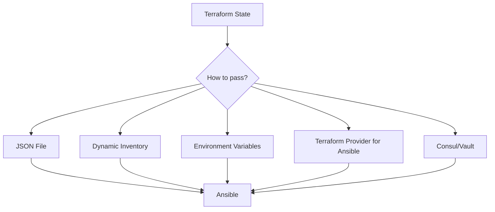

# How to Pass Terraform Outputs to Ansible

Author: [nawazdhandala](https://www.github.com/nawazdhandala)

Tags: Ansible, Terraform, DevOps, Infrastructure as Code

Description: Explore multiple methods to pass Terraform outputs to Ansible including JSON files, dynamic inventory, and environment variables.

---

One of the most common questions when combining Terraform and Ansible is "how do I get the IP addresses and resource IDs from Terraform into Ansible?" There are several approaches, each with their own trade-offs. I have used all of them in production and can tell you which ones work best for different situations.

This post covers five distinct methods for passing Terraform outputs to Ansible, with working examples for each.

## The Problem

Terraform provisions resources and knows their details (IP addresses, endpoints, identifiers). Ansible needs those details to do its job but has no built-in way to read Terraform state. You need a bridge between them.



## Method 1: JSON File Export

The simplest and most reliable approach. Export Terraform outputs to a JSON file and have Ansible read it.

First, define your Terraform outputs.

```hcl
# terraform/outputs.tf

output "web_server_ips" {
  value = aws_instance.web[*].public_ip
}

output "db_endpoint" {
  value = aws_db_instance.main.endpoint
}

output "redis_endpoint" {
  value = aws_elasticache_replication_group.main.primary_endpoint_address
}

output "s3_bucket_name" {
  value = aws_s3_bucket.app.id
}

output "vpc_cidr" {
  value = aws_vpc.main.cidr_block
}
```

After running `terraform apply`, export the outputs.

```bash
# Export all outputs to a JSON file
terraform output -json > ../ansible/group_vars/all/terraform_outputs.json
```

The JSON file looks something like this.

```json
{
  "web_server_ips": {
    "value": ["54.123.45.67", "54.123.45.68", "54.123.45.69"],
    "type": ["list", "string"]
  },
  "db_endpoint": {
    "value": "mydb.abcdef123456.us-east-1.rds.amazonaws.com:5432",
    "type": "string"
  },
  "redis_endpoint": {
    "value": "redis.abcdef.ng.0001.use1.cache.amazonaws.com",
    "type": "string"
  },
  "s3_bucket_name": {
    "value": "my-app-assets-prod",
    "type": "string"
  }
}
```

In Ansible, the file is automatically loaded because it sits in `group_vars/all/`. But the nested `value`/`type` structure is awkward. You can flatten it with a pre-task.

```yaml
# playbooks/use-terraform-outputs.yml
---
- name: Use Terraform outputs in Ansible
  hosts: all
  become: true

  pre_tasks:
    # Read and parse the raw Terraform outputs
    - name: Load Terraform outputs
      ansible.builtin.include_vars:
        file: "{{ playbook_dir }}/../group_vars/all/terraform_outputs.json"
        name: tf_raw
      run_once: true

    # Flatten the outputs so we can use them directly
    - name: Flatten Terraform outputs
      ansible.builtin.set_fact:
        tf_db_endpoint: "{{ tf_raw.db_endpoint.value }}"
        tf_redis_endpoint: "{{ tf_raw.redis_endpoint.value }}"
        tf_s3_bucket: "{{ tf_raw.s3_bucket_name.value }}"
        tf_web_ips: "{{ tf_raw.web_server_ips.value }}"
      run_once: true

  tasks:
    - name: Template application config with Terraform values
      ansible.builtin.template:
        src: app-config.j2
        dest: /etc/myapp/config.yml
        mode: '0644'
```

The template uses the flattened variables.

```yaml
# templates/app-config.j2
database:
  host: {{ tf_db_endpoint | regex_replace(':.*', '') }}
  port: {{ tf_db_endpoint | regex_replace('.*:', '') }}
  name: myapp

cache:
  host: {{ tf_redis_endpoint }}
  port: 6379

storage:
  bucket: {{ tf_s3_bucket }}
  region: us-east-1
```

## Method 2: Dynamic Inventory from Terraform State

Read the Terraform state file directly to build an inventory. This avoids the intermediate JSON file.

```python
#!/usr/bin/env python3
# ansible/inventory/terraform_state.py
"""
Dynamic inventory that reads Terraform state directly.
Works with both local and remote state backends.
"""

import json
import subprocess
import sys
import os

TERRAFORM_DIR = os.environ.get(
    "TF_DIR",
    os.path.join(os.path.dirname(__file__), "../../terraform")
)


def get_terraform_state():
    """Pull resources from Terraform state."""
    result = subprocess.run(
        ["terraform", "show", "-json"],
        cwd=TERRAFORM_DIR,
        capture_output=True,
        text=True,
    )
    if result.returncode != 0:
        return {}
    return json.loads(result.stdout)


def extract_instances(state):
    """Extract EC2 instances from Terraform state."""
    inventory = {
        "_meta": {"hostvars": {}},
        "all": {"children": ["webservers", "databases", "appservers"]},
        "webservers": {"hosts": []},
        "databases": {"hosts": []},
        "appservers": {"hosts": []},
    }

    resources = state.get("values", {}).get("root_module", {}).get("resources", [])

    for resource in resources:
        if resource["type"] != "aws_instance":
            continue

        values = resource["values"]
        tags = values.get("tags", {})
        name = tags.get("Name", resource["name"])
        role = tags.get("Role", "unknown")

        host_vars = {
            "ansible_host": values.get("public_ip") or values.get("private_ip"),
            "ansible_user": "ubuntu",
            "private_ip": values.get("private_ip"),
            "instance_id": values.get("id"),
            "instance_type": values.get("instance_type"),
            "az": values.get("availability_zone"),
        }

        inventory["_meta"]["hostvars"][name] = host_vars

        # Map role tag to Ansible group
        group_map = {
            "web": "webservers",
            "app": "appservers",
            "db": "databases",
        }
        group = group_map.get(role, "ungrouped")
        if group not in inventory:
            inventory[group] = {"hosts": []}
        inventory[group]["hosts"].append(name)

    return inventory


if __name__ == "__main__":
    if "--list" in sys.argv:
        state = get_terraform_state()
        inv = extract_instances(state)
        print(json.dumps(inv, indent=2))
    else:
        print(json.dumps({}))
```

## Method 3: Environment Variables

For simple cases where you only need a few values, pass them as environment variables.

```bash
#!/bin/bash
# deploy.sh - Pass Terraform outputs as environment variables

cd terraform/
terraform apply -auto-approve

# Export specific outputs as environment variables
export DB_ENDPOINT=$(terraform output -raw db_endpoint)
export REDIS_ENDPOINT=$(terraform output -raw redis_endpoint)
export S3_BUCKET=$(terraform output -raw s3_bucket_name)

cd ../ansible/
ansible-playbook playbooks/site.yml \
  -e "db_endpoint=${DB_ENDPOINT}" \
  -e "redis_endpoint=${REDIS_ENDPOINT}" \
  -e "s3_bucket=${S3_BUCKET}"
```

In the playbook, these variables are available directly.

```yaml
# playbooks/site.yml
---
- name: Configure application
  hosts: webservers
  become: true

  tasks:
    # Variables passed via -e are already available
    - name: Deploy application config
      ansible.builtin.template:
        src: config.j2
        dest: /etc/myapp/config.yml
        mode: '0644'
      vars:
        database_host: "{{ db_endpoint }}"
        cache_host: "{{ redis_endpoint }}"
        storage_bucket: "{{ s3_bucket }}"
```

## Method 4: Ansible Lookup Plugin

Use the Ansible `pipe` lookup to call `terraform output` on the fly. This works when you want Ansible to pull outputs at runtime without a pre-export step.

```yaml
# playbooks/lookup-terraform.yml
---
- name: Pull Terraform outputs at runtime
  hosts: all
  become: true

  vars:
    terraform_dir: "{{ playbook_dir }}/../../terraform"
    # Use the pipe lookup to run terraform output
    tf_db: "{{ lookup('pipe', 'cd ' + terraform_dir + ' && terraform output -raw db_endpoint') }}"
    tf_redis: "{{ lookup('pipe', 'cd ' + terraform_dir + ' && terraform output -raw redis_endpoint') }}"
    tf_bucket: "{{ lookup('pipe', 'cd ' + terraform_dir + ' && terraform output -raw s3_bucket_name') }}"

  tasks:
    - name: Display pulled values
      ansible.builtin.debug:
        msg: |
          DB: {{ tf_db }}
          Redis: {{ tf_redis }}
          Bucket: {{ tf_bucket }}
      run_once: true

    - name: Use values in configuration
      ansible.builtin.template:
        src: config.j2
        dest: /etc/myapp/config.yml
        mode: '0644'
```

This approach is convenient but has a catch: it runs `terraform output` multiple times if you have many lookups, and it requires Terraform to be installed on your Ansible control node.

## Method 5: Shared State Store (Consul or SSM)

For teams with more complex setups, push Terraform outputs to a shared key-value store that Ansible can query.

```hcl
# terraform/consul_outputs.tf

# Write outputs to Consul for Ansible to read
resource "consul_keys" "ansible_vars" {
  key {
    path  = "ansible/infrastructure/db_endpoint"
    value = aws_db_instance.main.endpoint
  }
  key {
    path  = "ansible/infrastructure/redis_endpoint"
    value = aws_elasticache_replication_group.main.primary_endpoint_address
  }
  key {
    path  = "ansible/infrastructure/s3_bucket"
    value = aws_s3_bucket.app.id
  }
}
```

Then in Ansible, read from Consul.

```yaml
# playbooks/from-consul.yml
---
- name: Read infrastructure config from Consul
  hosts: all
  become: true

  tasks:
    # Pull each value from Consul
    - name: Get DB endpoint from Consul
      ansible.builtin.set_fact:
        db_endpoint: "{{ lookup('community.general.consul_kv', 'ansible/infrastructure/db_endpoint') }}"
        redis_endpoint: "{{ lookup('community.general.consul_kv', 'ansible/infrastructure/redis_endpoint') }}"
        s3_bucket: "{{ lookup('community.general.consul_kv', 'ansible/infrastructure/s3_bucket') }}"
      run_once: true
```

## Which Method Should You Pick?

| Method | Best For | Drawback |
|--------|----------|----------|
| JSON file | Most teams, CI/CD pipelines | Stale if Terraform changes without re-export |
| Dynamic inventory | Ongoing management of long-lived infra | Requires Terraform CLI on control node |
| Environment variables | Simple setups with few values | Does not scale to many outputs |
| Lookup plugin | Quick prototyping | Slow with many lookups |
| Consul/SSM | Multi-team orgs with shared infra | Extra infrastructure dependency |

For most teams, start with the JSON file approach. It is simple, reliable, and works well in CI/CD pipelines. Move to dynamic inventory or Consul when your infrastructure gets complex enough to justify it.
