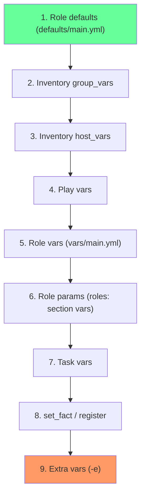

# How to Pass Variables to Roles in Ansible

Author: [nawazdhandala](https://www.github.com/nawazdhandala)

Tags: Ansible, Roles, Variables, Playbook Configuration

Description: Learn every method for passing variables to Ansible roles including role params, vars, defaults, inventory, and extra vars.

---

One of the main reasons Ansible roles exist is reusability, and reusability depends on being able to customize role behavior through variables. There are multiple ways to pass variables to roles in Ansible, and each method has different precedence. Understanding these methods lets you build roles that are flexible without being fragile. This post covers every way to pass variables to roles and explains when each approach makes sense.

## Method 1: Role Parameters (Highest Precedence)

When you list a role under the `roles:` keyword, you can pass variables directly as role parameters:

```yaml
# site.yml
# Pass variables as role parameters
---
- hosts: web_servers
  roles:
    - role: nginx
      vars:
        nginx_port: 8080
        nginx_server_name: app.example.com
        nginx_worker_processes: 4
```

Role parameters have very high precedence. They override role defaults, group vars, host vars, and even role vars. Only extra vars (`-e`) can override them.

## Method 2: Using include_role with vars

When including roles dynamically, pass variables in the `vars` section:

```yaml
# site.yml
# Pass variables to a dynamically included role
---
- hosts: web_servers
  tasks:
    - name: Deploy application
      ansible.builtin.include_role:
        name: app_deploy
      vars:
        app_version: "3.2.1"
        app_port: 9090
        app_environment: staging
```

## Method 3: Using import_role with vars

Same syntax for static imports:

```yaml
# site.yml
# Pass variables to a statically imported role
---
- hosts: web_servers
  tasks:
    - name: Deploy Nginx
      ansible.builtin.import_role:
        name: nginx
      vars:
        nginx_port: 443
        nginx_enable_tls: true
```

## Method 4: Playbook-Level Variables

Variables defined at the play level are available to all roles in that play:

```yaml
# site.yml
# Play-level variables available to all roles
---
- hosts: web_servers
  vars:
    environment_name: production
    log_level: warn
    monitoring_enabled: true
  roles:
    - common
    - nginx
    - app_deploy
    - monitoring
```

All four roles receive `environment_name`, `log_level`, and `monitoring_enabled`. This is useful for shared settings that multiple roles need.

## Method 5: Inventory Variables (group_vars and host_vars)

Inventory variables are automatically available to roles:

```yaml
# group_vars/web_servers.yml
# Group-level variables for all web servers
---
nginx_port: 80
nginx_worker_processes: auto
app_version: "3.1.0"
```

```yaml
# host_vars/web01.example.com.yml
# Host-specific overrides
---
nginx_worker_processes: 8
nginx_port: 8080
```

```yaml
# site.yml
---
- hosts: web_servers
  roles:
    - nginx    # Picks up nginx_port and nginx_worker_processes from inventory
```

## Method 6: Extra Variables (Highest Override)

Extra vars passed on the command line override everything:

```bash
# Extra vars override all other variable sources
ansible-playbook site.yml -e "nginx_port=9090 app_version=4.0.0"
```

Or from a file:

```bash
# Load extra vars from a JSON or YAML file
ansible-playbook site.yml -e @deploy_vars.yml
```

```yaml
# deploy_vars.yml
---
app_version: "4.0.0"
app_environment: canary
rollback_enabled: true
```

## Method 7: set_fact Before Role Application

You can compute variables before applying a role:

```yaml
# site.yml
# Compute variables then pass them to the role
---
- hosts: web_servers
  pre_tasks:
    - name: Calculate worker count based on CPU cores
      ansible.builtin.set_fact:
        nginx_worker_processes: "{{ ansible_processor_vcpus }}"

    - name: Set application version from deployment manifest
      ansible.builtin.set_fact:
        app_version: "{{ lookup('file', 'manifest.json') | from_json | json_query('version') }}"

  roles:
    - nginx
    - app_deploy
```

Variables set with `set_fact` have high precedence and will be available to all subsequent roles.

## Variable Precedence Summary

Here is the precedence order for variables that affect roles, from lowest to highest:



## Practical Example: Passing Variables at Multiple Levels

Here is a realistic scenario showing how variables cascade:

```yaml
# roles/app_deploy/defaults/main.yml
# Lowest priority - fallback values
---
app_name: myapp
app_port: 8080
app_environment: development
app_log_level: debug
app_replicas: 1
```

```yaml
# group_vars/production.yml
# Overrides defaults for production hosts
---
app_environment: production
app_log_level: warn
app_replicas: 3
```

```yaml
# host_vars/app01.example.com.yml
# Override for a specific host
---
app_replicas: 5
```

```yaml
# site.yml
# Role-level override for a specific setting
---
- hosts: production
  roles:
    - role: app_deploy
      vars:
        app_name: myapp-v2
```

For host `app01.example.com`, the final variable values would be:

| Variable | Value | Source |
|----------|-------|--------|
| app_name | myapp-v2 | Role params |
| app_port | 8080 | Role defaults |
| app_environment | production | group_vars |
| app_log_level | warn | group_vars |
| app_replicas | 5 | host_vars |

## Passing Complex Data Structures

You can pass lists, dictionaries, and nested structures:

```yaml
# site.yml
# Pass complex data structures to a role
---
- hosts: web_servers
  roles:
    - role: nginx
      vars:
        nginx_virtual_hosts:
          - server_name: app1.example.com
            port: 80
            root: /var/www/app1
            locations:
              - path: /
                proxy_pass: http://localhost:3000
              - path: /static
                alias: /var/www/app1/static
          - server_name: app2.example.com
            port: 80
            root: /var/www/app2
            locations:
              - path: /
                proxy_pass: http://localhost:3001
```

## Combining Multiple Variable Files with vars_files

```yaml
# site.yml
# Load variables from external files before applying roles
---
- hosts: web_servers
  vars_files:
    - vars/common.yml
    - "vars/{{ deployment_env }}.yml"
    - "vars/{{ ansible_os_family | lower }}.yml"
  roles:
    - common
    - nginx
    - app_deploy
```

This loads variable files in order. Later files override earlier ones if they define the same variable names.

## Using Vault-Encrypted Variables

Sensitive variables can be encrypted with Ansible Vault and passed to roles like any other variable:

```yaml
# group_vars/production/vault.yml (encrypted)
# Sensitive values encrypted with ansible-vault
---
vault_db_password: supersecret123
vault_api_key: abc123def456
```

```yaml
# group_vars/production/vars.yml (plain text, references vault vars)
---
app_database_password: "{{ vault_db_password }}"
app_api_key: "{{ vault_api_key }}"
```

```bash
# Run the playbook with vault password
ansible-playbook site.yml --ask-vault-pass
```

## Best Practices

1. **Use role defaults for all configurable values.** This makes it obvious what can be customized.

2. **Namespace all variables with the role name.** Use `nginx_port` instead of `port` to avoid collisions.

3. **Document what each variable does** in comments within `defaults/main.yml`.

4. **Prefer inventory variables for environment-specific values.** Put production settings in `group_vars/production.yml`, not in the playbook.

5. **Use extra vars for one-off overrides** like emergency deployments or testing a specific version.

6. **Avoid passing too many variables at the role level.** If you find yourself passing 20 variables to a role, consider whether some should be in group_vars or defaults.

## Wrapping Up

Ansible provides many ways to pass variables to roles, and each has a specific place in the precedence hierarchy. Role defaults are the public API of your role, inventory variables customize per-environment and per-host, role parameters provide per-invocation overrides, and extra vars give you the final say. Understanding this hierarchy means you can build roles that work correctly across environments without worrying about variable conflicts or unexpected overrides.
