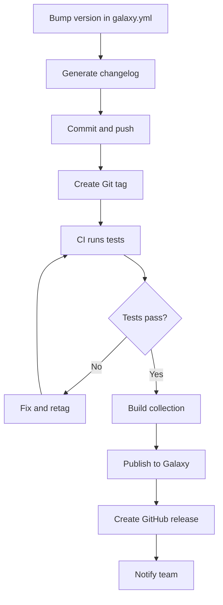

# How to Publish Ansible Collections to Galaxy

Author: [nawazdhandala](https://www.github.com/nawazdhandala)

Tags: Ansible, Galaxy, Collections, Publishing, Open Source

Description: Step-by-step guide to publishing Ansible collections on Ansible Galaxy including namespace setup, API tokens, versioning, and automated releases.

---

Publishing your Ansible collection to Galaxy makes it available to the entire Ansible community. Anyone can install it with a single `ansible-galaxy collection install` command. The process involves setting up a Galaxy namespace, getting an API token, building your collection, and uploading the tarball. It sounds simple, and it is once you have done it, but there are details worth getting right the first time.

## Setting Up Your Galaxy Namespace

Before you can publish, you need a namespace on Galaxy that matches the namespace in your `galaxy.yml`.

1. Go to [https://galaxy.ansible.com](https://galaxy.ansible.com)
2. Sign in with your GitHub account
3. Navigate to My Namespaces
4. Create a new namespace or use your existing one

Your GitHub username is automatically available as a namespace. For organization namespaces, you need to create them manually and they need to be approved by the Galaxy admins.

The namespace in your `galaxy.yml` must exactly match a namespace you own on Galaxy:

```yaml
# galaxy.yml - Namespace must match your Galaxy namespace
---
namespace: your_namespace
name: your_collection
version: 1.0.0
```

If the namespace does not match, the upload will be rejected.

## Getting Your Galaxy API Token

You need an API token to authenticate uploads:

1. Log in to Galaxy
2. Go to Collections > API Token (or navigate to your profile settings)
3. Click "Load token" to generate a new token
4. Copy the token and store it securely

You can use the token in several ways:

```bash
# Pass it directly on the command line (not recommended for shared machines)
ansible-galaxy collection publish ./my_namespace-my_collection-1.0.0.tar.gz --api-key YOUR_TOKEN

# Set it as an environment variable
export ANSIBLE_GALAXY_TOKEN=YOUR_TOKEN
ansible-galaxy collection publish ./my_namespace-my_collection-1.0.0.tar.gz

# Store it in ansible.cfg
```

For `ansible.cfg`:

```ini
# ansible.cfg - Galaxy server with token
[galaxy]
server_list = galaxy

[galaxy_server.galaxy]
url = https://galaxy.ansible.com/
token = YOUR_TOKEN
```

The safest approach for CI/CD is to use an environment variable or a secrets manager.

## Preparing for Publication

Before uploading, make sure everything is in order.

### Validate Your Metadata

```bash
# Check galaxy.yml is valid
python3 -c "
import yaml
with open('galaxy.yml') as f:
    data = yaml.safe_load(f)
    required = ['namespace', 'name', 'version', 'authors', 'description']
    for field in required:
        if field not in data:
            print(f'Missing required field: {field}')
        else:
            print(f'{field}: {data[field]}')
"
```

### Run Tests

```bash
# Run the full test suite
ansible-test sanity --docker
ansible-test units --docker
ansible-test integration --docker
```

### Build the Collection

```bash
# Build the tarball
ansible-galaxy collection build --output-path ./dist/
```

### Test the Installation

```bash
# Install from the tarball in a clean environment
ansible-galaxy collection install ./dist/my_namespace-my_collection-1.0.0.tar.gz --force
ansible-doc my_namespace.my_collection.my_module
```

## Publishing to Galaxy

With the tarball built and validated, publish it:

```bash
# Publish the collection to Galaxy
ansible-galaxy collection publish ./dist/my_namespace-my_collection-1.0.0.tar.gz --api-key YOUR_TOKEN
```

If successful, you will see output like:

```
Publishing collection artifact './dist/my_namespace-my_collection-1.0.0.tar.gz' to default https://galaxy.ansible.com/
Collection has been published to the Galaxy server default https://galaxy.ansible.com/
Waiting until Galaxy import task has completed...
Collection has been successfully published and imported to the Galaxy server
```

The collection is now available. Anyone can install it:

```bash
ansible-galaxy collection install my_namespace.my_collection
```

## Understanding the Import Process

After uploading, Galaxy runs an import process that:

1. Extracts the tarball
2. Validates the metadata
3. Checks for required files (`galaxy.yml`, `MANIFEST.json`)
4. Indexes module and plugin documentation
5. Makes the collection available for download

If the import fails, Galaxy provides error details. Common import failures include:

- Invalid or duplicate version numbers
- Malformed documentation strings in modules
- Missing required metadata fields
- Namespace mismatch between `galaxy.yml` and your Galaxy account

Check import status:

```bash
# Check recent imports for your namespace
# Visit: https://galaxy.ansible.com/ui/my-imports/
```

## Versioning and Updates

Galaxy does not allow overwriting a published version. Once `1.0.0` is published, it is permanent. To publish an update:

1. Bump the version in `galaxy.yml`
2. Build a new tarball
3. Publish the new version

```bash
# Update version in galaxy.yml (manually or with a script)
# version: 1.0.0 -> version: 1.0.1

# Build new version
ansible-galaxy collection build --output-path ./dist/

# Publish new version
ansible-galaxy collection publish ./dist/my_namespace-my_collection-1.0.1.tar.gz --api-key YOUR_TOKEN
```

Users can choose which version to install:

```bash
# Install specific version
ansible-galaxy collection install my_namespace.my_collection:1.0.1

# Install latest
ansible-galaxy collection install my_namespace.my_collection

# Upgrade to latest
ansible-galaxy collection install my_namespace.my_collection --force
```

## Automating Publishing with GitHub Actions

Here is a complete CI/CD pipeline that tests, builds, and publishes your collection when you push a tag:

```yaml
# .github/workflows/publish.yml
---
name: Publish Collection
on:
  push:
    tags:
      - "v*"

jobs:
  test:
    runs-on: ubuntu-latest
    steps:
      - uses: actions/checkout@v4
        with:
          path: ansible_collections/my_namespace/my_collection

      - uses: actions/setup-python@v5
        with:
          python-version: "3.11"

      - name: Install ansible-core
        run: pip install ansible-core

      - name: Run sanity tests
        working-directory: ansible_collections/my_namespace/my_collection
        run: ansible-test sanity --local

      - name: Run unit tests
        working-directory: ansible_collections/my_namespace/my_collection
        run: ansible-test units --local

  publish:
    needs: test
    runs-on: ubuntu-latest
    steps:
      - uses: actions/checkout@v4
        with:
          path: ansible_collections/my_namespace/my_collection

      - uses: actions/setup-python@v5
        with:
          python-version: "3.11"

      - name: Install ansible-core
        run: pip install ansible-core

      - name: Extract version from tag
        id: version
        run: echo "VERSION=${GITHUB_REF#refs/tags/v}" >> $GITHUB_OUTPUT

      - name: Verify version matches galaxy.yml
        working-directory: ansible_collections/my_namespace/my_collection
        run: |
          GALAXY_VERSION=$(grep "^version:" galaxy.yml | awk '{print $2}')
          TAG_VERSION="${{ steps.version.outputs.VERSION }}"
          if [ "${GALAXY_VERSION}" != "${TAG_VERSION}" ]; then
            echo "Version mismatch: galaxy.yml=${GALAXY_VERSION}, tag=${TAG_VERSION}"
            exit 1
          fi

      - name: Build collection
        working-directory: ansible_collections/my_namespace/my_collection
        run: ansible-galaxy collection build --output-path ./dist/

      - name: Publish to Galaxy
        working-directory: ansible_collections/my_namespace/my_collection
        run: >
          ansible-galaxy collection publish
          ./dist/*.tar.gz
          --api-key "${{ secrets.GALAXY_API_KEY }}"

      - name: Create GitHub Release
        uses: softprops/action-gh-release@v1
        with:
          files: ansible_collections/my_namespace/my_collection/dist/*.tar.gz
          body: |
            Release ${{ steps.version.outputs.VERSION }}
            Install: `ansible-galaxy collection install my_namespace.my_collection:${{ steps.version.outputs.VERSION }}`
```

Store your Galaxy API token as a GitHub secret named `GALAXY_API_KEY`.

## Release Workflow



## Publishing to Both Galaxy and Automation Hub

If you want to publish to Red Hat Automation Hub as well, configure both servers:

```ini
# ansible.cfg - Multiple publishing targets
[galaxy]
server_list = automation_hub, galaxy

[galaxy_server.automation_hub]
url = https://console.redhat.com/api/automation-hub/content/inbound-my_namespace/
auth_url = https://sso.redhat.com/auth/realms/redhat-external/protocol/openid-connect/token
token = YOUR_AH_TOKEN

[galaxy_server.galaxy]
url = https://galaxy.ansible.com/
token = YOUR_GALAXY_TOKEN
```

Publish to each:

```bash
# Publish to Galaxy
ansible-galaxy collection publish ./dist/my_namespace-my_collection-1.0.0.tar.gz --server galaxy

# Publish to Automation Hub
ansible-galaxy collection publish ./dist/my_namespace-my_collection-1.0.0.tar.gz --server automation_hub
```

## Deprecating and Removing Versions

Galaxy does not support deleting published versions, but you can deprecate a collection:

1. Log in to Galaxy
2. Navigate to your collection
3. Use the deprecation option

Users will see a deprecation warning when installing. For module-level deprecation, use the `deprecated` field in DOCUMENTATION and routing in `meta/runtime.yml`.

## Troubleshooting Publication

**"HTTP Error 401: Unauthorized"**: Your API token is invalid or expired. Generate a new one from the Galaxy web interface.

**"HTTP Error 409: Conflict"**: The version already exists on Galaxy. Bump the version number.

**"Namespace does not match"**: The namespace in `galaxy.yml` must match a namespace you own on Galaxy.

**Import fails after upload**: Check the import log on Galaxy for specific errors. Common causes are invalid documentation strings and malformed YAML.

```bash
# Add verbose output for troubleshooting
ansible-galaxy collection publish ./dist/*.tar.gz --api-key YOUR_TOKEN -vvv
```

## Conclusion

Publishing to Galaxy is the final step in sharing your automation work with the community. Set up your namespace once, automate the build and publish pipeline, and keep your versions incrementing cleanly. The biggest time saver is a CI/CD workflow that handles everything from testing to publication on a Git tag push, so releasing a new version becomes as simple as updating the version number and creating a tag.
