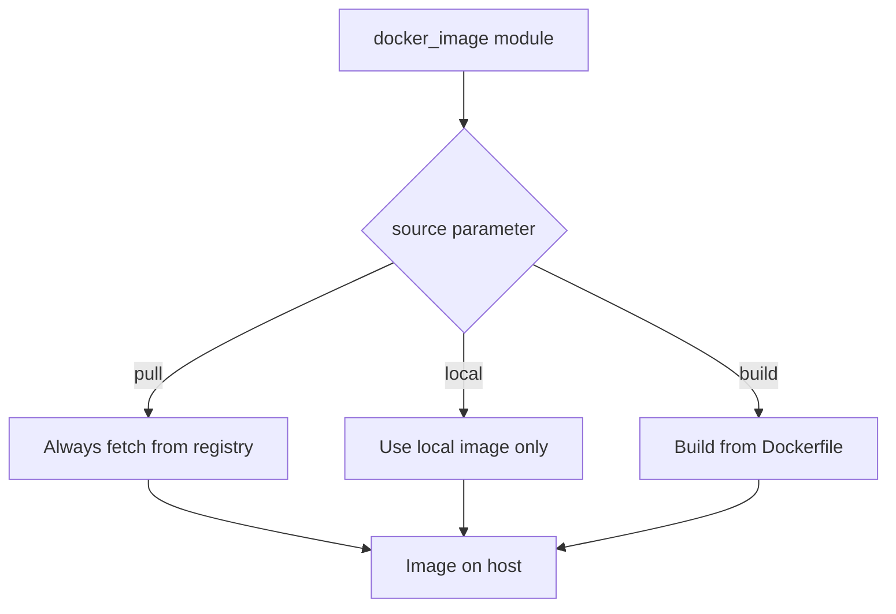
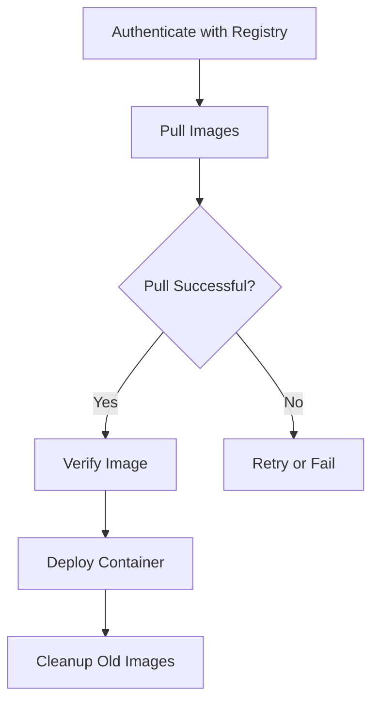

# How to Pull Docker Images with Ansible

Author: [nawazdhandala](https://www.github.com/nawazdhandala)

Tags: Ansible, Docker, Docker Images, Container Registry, Automation

Description: Learn how to pull Docker images from public and private registries using Ansible, including authentication, version pinning, and image management.

---

Pulling Docker images is the first step in any container deployment. Whether you are pulling from Docker Hub, Google Container Registry, Amazon ECR, or your own private registry, Ansible can automate the entire process. In this post, we will cover everything from pulling a simple public image to authenticating with private registries and managing image versions across your fleet.

## Why Manage Image Pulls with Ansible?

You might think pulling images is too simple to automate. Just run `docker pull` and you are done, right? But consider these scenarios:

- You need to pre-pull images on 50 servers before a deployment to reduce startup time
- You need to ensure specific image versions are available across your fleet
- You need to authenticate with a private registry on every server
- You need to clean up old images to free disk space
- You need an audit trail of which images are on which servers

Ansible handles all of these scenarios with its `community.docker.docker_image` module.

## Prerequisites

```bash
# Install the community.docker collection
ansible-galaxy collection install community.docker

# Install the Docker Python SDK
pip install docker
```

## Pulling a Public Image

The simplest case is pulling an image from Docker Hub.

```yaml
# pull-basic.yml - Pull a public Docker image
---
- name: Pull Docker Images
  hosts: docker_hosts
  become: true

  tasks:
    # Pull a specific version
    - name: Pull nginx 1.25
      community.docker.docker_image:
        name: nginx
        tag: "1.25"
        source: pull

    # Pull the latest tag
    - name: Pull the latest Redis image
      community.docker.docker_image:
        name: redis
        tag: latest
        source: pull

    # Pull from a specific registry
    - name: Pull an image from a specific registry
      community.docker.docker_image:
        name: gcr.io/google-containers/busybox
        tag: "1.27"
        source: pull
```

The `source: pull` parameter tells Ansible to always pull the image from the registry rather than just checking if it exists locally. Without it, Ansible might skip the pull if an image with the same name and tag already exists locally.

## Understanding the source Parameter

The `source` parameter controls where the image comes from:



- **pull**: Fetch the image from a registry
- **local**: Use an existing local image (error if not found)
- **build**: Build the image from a Dockerfile

## Pulling Multiple Images

Most deployments need several images. Use a loop to pull them all.

```yaml
# pull-multiple.yml - Pull multiple images efficiently
---
- name: Pull Multiple Docker Images
  hosts: docker_hosts
  become: true

  vars:
    # Define all images needed for the application
    required_images:
      - name: nginx
        tag: "1.25"
      - name: postgres
        tag: "16"
      - name: redis
        tag: "7-alpine"
      - name: node
        tag: "20-slim"
      - name: python
        tag: "3.12-slim"
      - name: myregistry.io/myapp/api
        tag: "2.5.0"
      - name: myregistry.io/myapp/worker
        tag: "2.5.0"

  tasks:
    - name: Pull all required images
      community.docker.docker_image:
        name: "{{ item.name }}"
        tag: "{{ item.tag }}"
        source: pull
      loop: "{{ required_images }}"
      register: pull_results

    - name: Show pull results
      ansible.builtin.debug:
        msg: "{{ item.item.name }}:{{ item.item.tag }} - {{ 'pulled' if item.changed else 'already present' }}"
      loop: "{{ pull_results.results }}"
```

## Authenticating with Private Registries

Private registries require authentication before you can pull images.

```yaml
# pull-private.yml - Pull from private registries with authentication
---
- name: Pull from Private Registries
  hosts: docker_hosts
  become: true

  vars:
    docker_hub_username: "{{ vault_docker_hub_username }}"
    docker_hub_password: "{{ vault_docker_hub_password }}"

  tasks:
    # Login to Docker Hub
    - name: Authenticate with Docker Hub
      community.docker.docker_login:
        username: "{{ docker_hub_username }}"
        password: "{{ docker_hub_password }}"
      no_log: true

    # Login to Google Container Registry
    - name: Authenticate with GCR
      community.docker.docker_login:
        registry_url: "https://gcr.io"
        username: "_json_key"
        password: "{{ lookup('file', gcp_service_account_file) }}"
      no_log: true

    # Login to GitHub Container Registry
    - name: Authenticate with GHCR
      community.docker.docker_login:
        registry_url: "https://ghcr.io"
        username: "{{ github_username }}"
        password: "{{ github_token }}"
      no_log: true

    # Login to Amazon ECR
    - name: Get ECR login token
      ansible.builtin.command: >
        aws ecr get-login-password --region us-east-1
      register: ecr_token
      changed_when: false
      no_log: true

    - name: Authenticate with ECR
      community.docker.docker_login:
        registry_url: "https://123456789.dkr.ecr.us-east-1.amazonaws.com"
        username: "AWS"
        password: "{{ ecr_token.stdout }}"
      no_log: true

    # Now pull images from any authenticated registry
    - name: Pull private application image
      community.docker.docker_image:
        name: "gcr.io/my-project/my-app"
        tag: "v2.5.0"
        source: pull

    - name: Pull from GitHub Container Registry
      community.docker.docker_image:
        name: "ghcr.io/myorg/myservice"
        tag: "latest"
        source: pull

    # Logout when done (optional but good practice)
    - name: Logout from Docker Hub
      community.docker.docker_login:
        state: absent
```

## Pre-Pulling Images Before Deployment

A common strategy is to pull images on all servers before deploying, so the actual deployment (starting containers) is fast.

```yaml
# pre-pull.yml - Pre-pull images before deployment
---
- name: Pre-Pull Deployment Images
  hosts: docker_hosts
  become: true

  vars:
    deploy_version: "2.5.0"
    registry: "gcr.io/my-project"
    images:
      - "api-service"
      - "web-frontend"
      - "worker-service"
      - "scheduler-service"

  tasks:
    - name: Authenticate with the registry
      community.docker.docker_login:
        registry_url: "https://gcr.io"
        username: "_json_key"
        password: "{{ lookup('file', '/path/to/service-account.json') }}"
      no_log: true

    - name: Pre-pull all deployment images
      community.docker.docker_image:
        name: "{{ registry }}/{{ item }}"
        tag: "{{ deploy_version }}"
        source: pull
      loop: "{{ images }}"
      register: pull_results

    - name: Verify all images pulled successfully
      ansible.builtin.assert:
        that:
          - item.image is defined
        fail_msg: "Failed to pull {{ item.item }}"
        success_msg: "{{ item.item }}:{{ deploy_version }} ready"
      loop: "{{ pull_results.results }}"

    - name: All images ready for deployment
      ansible.builtin.debug:
        msg: |
          Pre-pull complete. {{ images | length }} images ready.
          Version: {{ deploy_version }}
          Proceed with deployment.
```

## Force Pulling to Get the Latest Image

Docker caches images locally. If you use the `latest` tag (which you generally should not in production), you need to force a pull to get the newest version.

```yaml
# force-pull.yml - Always get the newest version of an image
---
- name: Force Pull Latest Images
  hosts: docker_hosts
  become: true

  tasks:
    # force_source: true ensures a fresh pull even if the tag exists locally
    - name: Force pull latest image
      community.docker.docker_image:
        name: myapp
        tag: latest
        source: pull
        force_source: true
      register: pull_result

    - name: Show if the image was updated
      ansible.builtin.debug:
        msg: "Image {{ 'was updated' if pull_result.changed else 'is already latest' }}"
```

## Checking Image Information

Before pulling, you might want to check what images are already available locally.

```yaml
# image-info.yml - Inspect local Docker images
---
- name: Docker Image Information
  hosts: docker_hosts
  become: true

  tasks:
    # Get info about a specific image
    - name: Check if nginx image exists locally
      community.docker.docker_image_info:
        name: "nginx:1.25"
      register: image_info

    - name: Show image details
      ansible.builtin.debug:
        msg: |
          Image exists: {{ image_info.images | length > 0 }}
          
          Size: {{ (image_info.images[0].Size / 1024 / 1024) | round(1) }} MB
          Created: {{ image_info.images[0].Created }}
          

    # Get info about all images
    - name: Get Docker host image inventory
      community.docker.docker_host_info:
        images: true
      register: host_info

    - name: List all local images
      ansible.builtin.debug:
        msg: "{{ item.RepoTags | default(['<none>']) | first }}: {{ (item.Size / 1024 / 1024) | round(1) }} MB"
      loop: "{{ host_info.images }}"
      when: item.RepoTags is defined
```

## Cleaning Up Old Images

Old images waste disk space. Here is how to clean them up.

```yaml
# cleanup-images.yml - Remove unused Docker images
---
- name: Cleanup Docker Images
  hosts: docker_hosts
  become: true

  vars:
    # Images to keep (everything else gets cleaned up)
    keep_images:
      - "nginx:1.25"
      - "postgres:16"
      - "redis:7-alpine"
      - "myapp:2.5.0"

  tasks:
    # Remove dangling images (layers not referenced by any tag)
    - name: Remove dangling images
      community.docker.docker_prune:
        images: true
        images_filters:
          dangling: true
      register: prune_result

    - name: Show cleanup results
      ansible.builtin.debug:
        msg: "Removed {{ prune_result.images | default([]) | length }} dangling images"

    # Remove specific old images
    - name: Remove old application versions
      community.docker.docker_image:
        name: "{{ item }}"
        state: absent
      loop:
        - "myapp:2.3.0"
        - "myapp:2.4.0"
      ignore_errors: true

    # Aggressive cleanup: remove all unused images
    - name: Remove all unused images
      community.docker.docker_prune:
        images: true
        images_filters:
          dangling: false
      register: full_prune

    - name: Show space reclaimed
      ansible.builtin.debug:
        msg: "Reclaimed {{ (full_prune.images_space_reclaimed | default(0) / 1024 / 1024) | round(1) }} MB"
```

## Image Pull Workflow



## Best Practices

1. **Never use `latest` in production.** Always pin specific version tags. The `latest` tag is mutable, meaning it can point to different images over time.

2. **Use `no_log: true` for registry authentication.** Registry passwords should never appear in Ansible output.

3. **Pre-pull images before deployment.** This reduces the time containers are down during updates.

4. **Use digest-based references for maximum reproducibility.** Instead of `nginx:1.25`, use `nginx@sha256:abc123...`. This guarantees you get the exact same image every time.

5. **Clean up old images regularly.** Docker images can consume significant disk space. Schedule regular cleanup playbooks.

6. **Store registry credentials in Ansible Vault.** Never hardcode credentials in playbooks.

7. **Use `force_source: true` sparingly.** It forces a network call every time, which slows down playbook runs. Only use it when you genuinely need the absolute latest version.

## Conclusion

Pulling Docker images with Ansible gives you control over image management across your entire fleet. Whether you are pre-staging images for zero-downtime deployments, managing authentication with multiple private registries, or cleaning up old images to reclaim disk space, Ansible provides a consistent, automated approach. The key is to pin your image versions, authenticate securely, and build image cleanup into your regular maintenance workflows.
