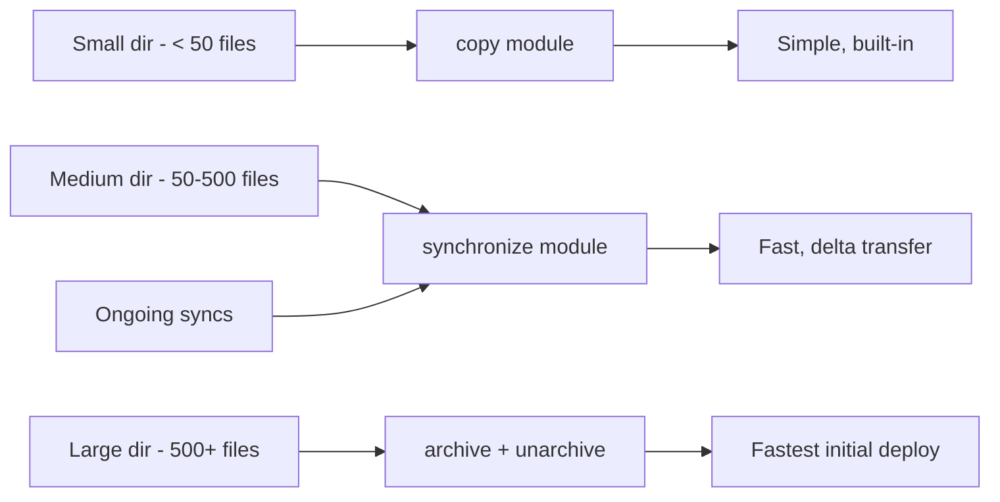

# How to Recursively Copy Directories with Ansible

Author: [nawazdhandala](https://www.github.com/nawazdhandala)

Tags: Ansible, File Management, DevOps, Automation

Description: Learn how to recursively copy directories with Ansible using the copy module, synchronize module, and other techniques for large-scale file deployments.

---

Copying entire directory trees to remote hosts is a bread-and-butter task in configuration management. Whether you are deploying a web application's static assets, distributing configuration directories, or setting up application file structures, Ansible provides several ways to handle recursive directory copies. Each approach has different performance characteristics and trade-offs.

## Using the copy Module for Small Directories

The `copy` module handles recursive directory copies natively. When the `src` parameter points to a directory, it copies the entire directory tree to the destination.

```yaml
# Copy a directory tree from the controller to remote hosts
- name: Copy application config directory to remote
  ansible.builtin.copy:
    src: files/myapp-config/
    dest: /etc/myapp/
    owner: myapp
    group: myapp
    mode: '0644'
    directory_mode: '0755'
```

Notice the trailing slash on the `src` path. This matters:
- `src: files/myapp-config/` copies the **contents** of the directory into `/etc/myapp/`
- `src: files/myapp-config` copies the **directory itself** into `/etc/myapp/`, creating `/etc/myapp/myapp-config/`

The `directory_mode` parameter sets permissions on directories separately from files, which is useful since directories typically need the execute bit.

## Performance Warning with copy

The `copy` module checks every file individually using checksums. For small directory trees (a few dozen files), this is fine. But for large directories with hundreds or thousands of files, it becomes extremely slow because Ansible transfers each file as a separate SSH operation.

If your directory has more than about 50 files, consider using the `synchronize` module instead.

## Using synchronize for Large Directories

The `synchronize` module wraps rsync, which is dramatically faster for large directory transfers.

```yaml
# Use synchronize (rsync) for large directory copies
- name: Deploy web application static files
  ansible.posix.synchronize:
    src: files/webapp/static/
    dest: /var/www/html/static/
    recursive: yes
    delete: no
    rsync_opts:
      - "--chmod=D0755,F0644"
      - "--chown=www-data:www-data"
```

The `synchronize` module runs rsync from the controller to the remote host. It only transfers files that have changed, making subsequent runs very fast.

```yaml
# Synchronize with more options
- name: Deploy complete application directory
  ansible.posix.synchronize:
    src: /opt/build/output/myapp/
    dest: /opt/myapp/
    recursive: yes
    delete: yes
    rsync_opts:
      - "--exclude=*.log"
      - "--exclude=.git"
      - "--exclude=tmp/"
      - "--backup"
      - "--backup-dir=/opt/myapp-backup/"
  notify: Restart application
```

The `delete: yes` option removes files on the destination that do not exist in the source, keeping both sides in sync. Be careful with this option because it can delete files that were created on the remote host.

## Copying Between Remote Directories

To copy directories on the remote host itself, use the `copy` module with `remote_src: yes`.

```yaml
# Copy a directory on the remote host
- name: Copy config directory to backup location
  ansible.builtin.copy:
    src: /etc/myapp/
    dest: /opt/backups/myapp-config/
    remote_src: yes
    owner: root
    group: root
    mode: preserve
```

The `mode: preserve` option keeps the original file permissions, which is often what you want for backups.

## Using the find and copy Pattern

For selective recursive copies where you need to filter files, combine `find` with `copy` in a loop.

```yaml
# Copy only YAML files from a directory tree
- name: Find all YAML config files
  ansible.builtin.find:
    paths: /opt/templates/configs
    patterns: "*.yml,*.yaml"
    recurse: yes
  register: yaml_files
  delegate_to: localhost

- name: Copy YAML files preserving directory structure
  ansible.builtin.copy:
    src: "{{ item.path }}"
    dest: "/etc/myapp/{{ item.path | relpath('/opt/templates/configs') }}"
    owner: myapp
    group: myapp
    mode: '0644'
  loop: "{{ yaml_files.files }}"
```

## Creating the Directory Structure First

Sometimes you need to create the directory structure on the remote host before copying files into it.

```yaml
# Create a complex directory tree
- name: Create application directory structure
  ansible.builtin.file:
    path: "{{ item }}"
    state: directory
    owner: myapp
    group: myapp
    mode: '0755'
  loop:
    - /opt/myapp
    - /opt/myapp/bin
    - /opt/myapp/conf
    - /opt/myapp/data
    - /opt/myapp/logs
    - /opt/myapp/tmp

# Then copy files into the structure
- name: Copy binary files
  ansible.builtin.copy:
    src: files/bin/
    dest: /opt/myapp/bin/
    owner: myapp
    group: myapp
    mode: '0755'

- name: Copy configuration files
  ansible.builtin.copy:
    src: files/conf/
    dest: /opt/myapp/conf/
    owner: myapp
    group: myapp
    mode: '0644'
```

## Using unarchive for Large Directory Trees

For very large directory trees, archiving first and then extracting is often the fastest approach.

```yaml
# Archive locally, copy, and extract - fastest for very large dirs
- name: Create archive of application files
  ansible.builtin.archive:
    path: /opt/build/output/myapp/
    dest: /tmp/myapp-deploy.tar.gz
    format: gz
  delegate_to: localhost
  run_once: true

- name: Extract application archive on remote hosts
  ansible.builtin.unarchive:
    src: /tmp/myapp-deploy.tar.gz
    dest: /opt/myapp/
    owner: myapp
    group: myapp
    extra_opts:
      - '--strip-components=1'
```

## Handling File Permissions in Copied Directories

The `copy` module applies permissions uniformly. If you need different permissions for different file types, use separate tasks.

```yaml
# Copy directory, then set specific permissions
- name: Copy application directory
  ansible.builtin.copy:
    src: files/webapp/
    dest: /var/www/webapp/
    owner: www-data
    group: www-data

- name: Set directory permissions recursively
  ansible.builtin.command:
    cmd: find /var/www/webapp -type d -exec chmod 755 {} +
  changed_when: false

- name: Set file permissions recursively
  ansible.builtin.command:
    cmd: find /var/www/webapp -type f -exec chmod 644 {} +
  changed_when: false

- name: Set CGI scripts as executable
  ansible.builtin.command:
    cmd: find /var/www/webapp/cgi-bin -type f -exec chmod 755 {} +
  changed_when: false
```

Or use the `file` module with the `recurse` option and the `X` permission trick.

```yaml
# Use capital X to set execute only on directories
- name: Set permissions - executable on dirs, read on files
  ansible.builtin.file:
    path: /var/www/webapp
    state: directory
    recurse: yes
    mode: 'u=rwX,g=rX,o=rX'
    owner: www-data
    group: www-data
```

## Performance Comparison



| Method | Files | Speed | Idempotent | Delta Transfer |
|--------|-------|-------|------------|----------------|
| copy | < 50 | Slow for many files | Yes | No |
| synchronize | Any | Fast | Yes | Yes |
| archive + unarchive | Any | Fastest initial | With creates | No |
| command: rsync | Any | Fast | Manual | Yes |

## A Complete Deployment Role

Here is a role that deploys a web application with proper recursive copy handling.

```yaml
# tasks/main.yml
---
- name: Create web root directory
  ansible.builtin.file:
    path: /var/www/{{ app_name }}
    state: directory
    owner: www-data
    group: www-data
    mode: '0755'

- name: Deploy static assets using synchronize
  ansible.posix.synchronize:
    src: "{{ playbook_dir }}/files/{{ app_name }}/static/"
    dest: "/var/www/{{ app_name }}/static/"
    recursive: yes
    delete: yes
    rsync_opts:
      - "--chmod=D0755,F0644"
      - "--chown=www-data:www-data"
      - "--exclude=.DS_Store"
      - "--exclude=.gitkeep"
  notify: Reload web server

- name: Deploy configuration files using copy
  ansible.builtin.copy:
    src: "files/{{ app_name }}/conf/"
    dest: "/var/www/{{ app_name }}/conf/"
    owner: www-data
    group: www-data
    mode: '0640'
    directory_mode: '0750'
  notify: Reload web server

- name: Deploy templates
  ansible.builtin.template:
    src: "{{ item }}"
    dest: "/var/www/{{ app_name }}/conf/{{ item | basename | regex_replace('\\.j2$', '') }}"
    owner: www-data
    group: www-data
    mode: '0640'
  with_fileglob:
    - "templates/{{ app_name }}/*.j2"
  notify: Reload web server
```

## Summary

For recursive directory copies in Ansible, match your tool to your scale. The `copy` module works great for small directories and is the simplest option. The `synchronize` module (backed by rsync) is the best choice for medium to large directories and ongoing synchronization needs. For initial deployments of very large directory trees, the archive-and-extract approach gives the best throughput. Always set `directory_mode` separately from file mode, pay attention to trailing slashes in source paths, and use `delete: yes` with `synchronize` carefully to avoid removing files that belong on the remote host.
