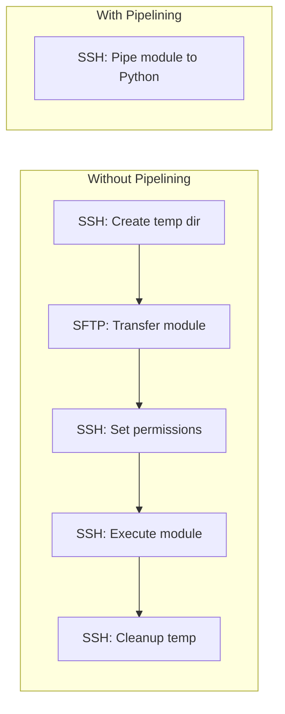

# How to Reduce Ansible Module Transfer Time

Author: [nawazdhandala](https://www.github.com/nawazdhandala)

Tags: Ansible, Performance, SSH, Module Optimization

Description: Reduce the time Ansible spends transferring modules to remote hosts with pipelining, compression, and smart module selection.

---

Every time Ansible runs a task, it transfers a Python module to the remote host, executes it, and cleans up. This transfer step happens over SSH using either SFTP or SCP, and for playbooks with many tasks across many hosts, the cumulative transfer time is significant. This post covers practical methods to reduce or eliminate that overhead.

## Understanding Module Transfer

Let us look at what happens when Ansible runs a single task. With maximum verbosity, you can see the transfer:

```bash
# Watch the module transfer process in detail
ansible webserver01 -m ping -vvvv
```

The output will show something like:

```
<webserver01> ESTABLISH SSH CONNECTION FOR USER: admin
<webserver01> SSH: EXEC ssh -o ControlMaster=auto ...
<webserver01> ESTABLISH SSH CONNECTION FOR USER: admin
<webserver01> SSH: EXEC sftp -b - admin@webserver01
<webserver01> PUT /tmp/ansible-local-12345/tmpXYZ TO /home/admin/.ansible/tmp/ansible-tmp-123456/AnsiballZ_ping.py
<webserver01> SSH: EXEC ssh admin@webserver01 '/bin/sh -c "chmod u+x /home/admin/.ansible/tmp/..."'
<webserver01> SSH: EXEC ssh admin@webserver01 '/bin/sh -c "/usr/bin/python3 /home/admin/.ansible/tmp/..."'
```

That is four SSH operations for a single task: establish connection, SFTP the module, chmod it, execute it. Multiply by 50 tasks and 100 hosts, and you are looking at 20,000 SSH operations.

## Method 1: Enable SSH Pipelining

The single most impactful change is enabling pipelining, which eliminates the SFTP transfer entirely:

```ini
# ansible.cfg - Enable pipelining
[ssh_connection]
pipelining = True
```

With pipelining, Ansible pipes the module code directly to the Python interpreter on the remote host through the existing SSH session. No temp files, no SFTP, no chmod. The four SSH operations per task drop to one.



Pipelining alone reduces per-task transfer overhead by 70-80%.

## Method 2: Use Module Compression

Ansible can compress modules before transferring them, reducing the amount of data sent over the wire:

```ini
# ansible.cfg - Enable module compression
[defaults]
module_compression = ZIP
```

This compresses the module's ZIP archive before transfer. The benefit depends on network bandwidth between your control node and remote hosts. On a fast LAN, the compression overhead might not help much. On WAN connections or satellite links, it can make a meaningful difference.

## Method 3: Use the raw Module for Simple Tasks

The `raw` module bypasses the entire Python module mechanism. It sends a command directly through SSH without transferring any module code:

```yaml
---
# Use raw for simple commands that don't need Python
- hosts: all
  gather_facts: false
  tasks:
    - name: Check if host is reachable
      raw: echo "alive"
      changed_when: false

    - name: Get uptime
      raw: uptime
      changed_when: false

    - name: Check disk space
      raw: df -h /
      changed_when: false
```

The `raw` module is useful for:
- Quick checks that do not need structured output
- Hosts that do not have Python installed
- Bootstrap tasks that install Python on new hosts

The downside is that `raw` returns unstructured text output, so you cannot use features like `changed_when` based on module return values (though you can parse stdout).

## Method 4: Use the command Module Over Shell

The `command` module is slightly faster than `shell` because it does not invoke a shell interpreter on the remote side:

```yaml
# command is faster than shell for simple commands
- name: Fast command execution
  command: /usr/bin/hostname
  changed_when: false

# shell is needed only when you need shell features (pipes, redirects)
- name: Slower but needed for shell features
  shell: ps aux | grep nginx | wc -l
  changed_when: false
```

This is a minor optimization, but it adds up across many tasks.

## Method 5: Reduce Module Size with set_fact

When you use `set_fact` to store large data structures, that data gets sent to the remote host with every subsequent module call. Keep facts lean:

```yaml
# Bad: storing large output as a fact
- name: Get all package info
  command: dpkg -l
  register: all_packages

- name: Store all package names
  set_fact:
    package_list: "{{ all_packages.stdout }}"
    # This large string gets transferred with every subsequent task

# Better: store only what you need
- name: Check specific package
  command: dpkg -l nginx
  register: nginx_package
  changed_when: false

- name: Store just the version
  set_fact:
    nginx_version: "{{ nginx_package.stdout_lines[5].split()[2] }}"
    # Much smaller fact to carry around
```

## Method 6: Use synchronize Instead of copy

The `copy` module transfers files through the Ansible module mechanism (module transfer + file transfer). The `synchronize` module uses rsync directly, which is much more efficient for large files or directories:

```yaml
# Slow: copy module transfers through Ansible
- name: Copy application directory (slow)
  copy:
    src: app/
    dest: /opt/myapp/

# Fast: synchronize uses rsync directly
- name: Sync application directory (fast)
  synchronize:
    src: app/
    dest: /opt/myapp/
    rsync_opts:
      - "--compress"
      - "--delete"
```

For a 100 MB application directory, `synchronize` can be 5-10x faster than `copy` because rsync only transfers changed files and supports compression natively.

## Method 7: Minimize Template Complexity

Templates are rendered on the control node and then transferred to the remote host. Complex templates with many loops and conditionals take longer to render and may produce larger output files:

```yaml
# Slow: complex template with many iterations
- name: Generate large config
  template:
    src: complex-config.j2
    dest: /etc/myapp/config.yml

# Faster: simple template with pre-computed values
- name: Pre-compute config values
  set_fact:
    config_entries: "{{ groups['webservers'] | map('extract', hostvars, 'ansible_host') | list }}"
  run_once: true
  delegate_to: localhost

- name: Generate config with pre-computed values
  template:
    src: simple-config.j2
    dest: /etc/myapp/config.yml
```

## Method 8: Use SCP Instead of SFTP

Some environments are faster with SCP than SFTP for module transfer. You can change the transfer method:

```ini
# ansible.cfg - Use SCP instead of SFTP
[ssh_connection]
scp_if_ssh = True
```

Or use the smart mode that tries SFTP first and falls back to SCP:

```ini
# Try SFTP first, fall back to SCP
[ssh_connection]
transfer_method = smart
```

In my testing, SCP is sometimes 10-15% faster than SFTP on high-latency connections.

## Method 9: Combine Tasks to Reduce Round Trips

Each task is a separate module transfer. Combining related operations into fewer tasks reduces the number of transfers:

```yaml
# Bad: 5 separate tasks = 5 module transfers
- name: Create dir 1
  file: path=/opt/app/logs state=directory
- name: Create dir 2
  file: path=/opt/app/data state=directory
- name: Create dir 3
  file: path=/opt/app/tmp state=directory
- name: Create dir 4
  file: path=/opt/app/config state=directory
- name: Create dir 5
  file: path=/opt/app/bin state=directory

# Better: 1 task with a loop = 1 module transfer (with loop optimization)
- name: Create all directories
  file:
    path: "{{ item }}"
    state: directory
  loop:
    - /opt/app/logs
    - /opt/app/data
    - /opt/app/tmp
    - /opt/app/config
    - /opt/app/bin
```

Even better, use a single `command` call:

```yaml
# Best: single command for multiple directories
- name: Create all directories at once
  command: mkdir -p /opt/app/{logs,data,tmp,config,bin}
  args:
    creates: /opt/app/logs
```

## Measuring Transfer Time

Profile module transfer time specifically:

```bash
# Measure time with and without pipelining
echo "=== Without pipelining ==="
ANSIBLE_PIPELINING=False ANSIBLE_CALLBACKS_ENABLED=profile_tasks \
    ansible-playbook benchmark.yml 2>&1 | tail -20

echo "=== With pipelining ==="
ANSIBLE_PIPELINING=True ANSIBLE_CALLBACKS_ENABLED=profile_tasks \
    ansible-playbook benchmark.yml 2>&1 | tail -20
```

The difference between these two runs is almost entirely module transfer overhead, since the actual module execution time is the same.

## Recommended Configuration

Here is an `ansible.cfg` that minimizes module transfer overhead:

```ini
[defaults]
forks = 50
gathering = smart
fact_caching = jsonfile
fact_caching_connection = /var/cache/ansible/facts
fact_caching_timeout = 86400

[ssh_connection]
pipelining = True
ssh_args = -o ControlMaster=auto -o ControlPersist=120s -o ControlPath=/tmp/ansible-%h-%p-%r
transfer_method = smart
retries = 3
```

With pipelining enabled, module transfer time drops to near zero because there is no actual file transfer happening. Combined with ControlPersist for SSH connection reuse and smart fact caching, this configuration eliminates most of the per-task overhead in Ansible playbook execution.
