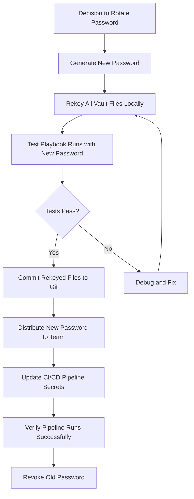

# How to Rekey Ansible Vault Files with a New Password

Author: [nawazdhandala](https://www.github.com/nawazdhandala)

Tags: Ansible, Vault, Security, Password Management

Description: Learn how to rekey Ansible Vault encrypted files to rotate passwords without decrypting and re-encrypting manually.

---

Password rotation is a fundamental security practice, and Ansible Vault files are no exception. When a team member leaves, when your password gets compromised, or when your organization's security policy mandates periodic rotation, you need to rekey your vault files. Ansible provides the `ansible-vault rekey` command specifically for this purpose. It changes the encryption password on vault-encrypted files without requiring you to decrypt and re-encrypt them manually.

## What Does Rekeying Actually Do?

When you rekey a vault file, Ansible decrypts the file contents with the old password and then immediately re-encrypts them with the new password. The plaintext is never written to disk during this process. The entire operation happens in memory, which makes it safe from a security standpoint.

The rekey process changes the `$ANSIBLE_VAULT` header and the encrypted payload, but the underlying plaintext data stays exactly the same.

## Basic Rekey Operation

The simplest way to rekey a vault file is the interactive method, where Ansible prompts you for both the old and new passwords.

```yaml
# First, let's create a sample vault-encrypted file to work with
# This creates a file called secrets.yml encrypted with your chosen password
ansible-vault create secrets.yml
```

Now rekey it with a new password:

```bash
# Rekey a single vault file interactively
# You'll be prompted for the current password, then the new password twice
ansible-vault rekey secrets.yml
```

The output looks like this:

```
Vault password:
New Vault password:
Confirm New Vault password:
Rekey successful
```

## Rekeying Multiple Files at Once

You can pass multiple files to a single rekey command. This is useful when you have several vault files all encrypted with the same password.

```bash
# Rekey multiple vault files in one command
# All files must share the same current password
ansible-vault rekey secrets.yml db_credentials.yml api_keys.yml
```

This saves time because you only enter the old and new passwords once, and Ansible applies the change across all specified files.

## Using Password Files for Rekeying

In automated or scripted environments, you do not want interactive password prompts. You can use password files instead.

```bash
# Create password files (in production, these would be secured properly)
echo "old-super-secret-password" > /tmp/old_vault_pass.txt
echo "new-super-secret-password" > /tmp/new_vault_pass.txt

# Set restrictive permissions on password files
chmod 600 /tmp/old_vault_pass.txt
chmod 600 /tmp/new_vault_pass.txt

# Rekey using password files instead of interactive prompts
ansible-vault rekey \
  --vault-password-file /tmp/old_vault_pass.txt \
  --new-vault-password-file /tmp/new_vault_pass.txt \
  secrets.yml

# Clean up password files after use
rm -f /tmp/old_vault_pass.txt /tmp/new_vault_pass.txt
```

## Rekeying with Vault IDs

If you use vault IDs (which let you tag encrypted content with a label), you need to specify the vault ID during rekey operations.

```bash
# Rekey a file that was encrypted with a specific vault ID
# The vault ID 'prod' must match what was used during encryption
ansible-vault rekey \
  --vault-id prod@/path/to/old_password_file \
  --new-vault-id prod@/path/to/new_password_file \
  prod_secrets.yml
```

Note that you can also change the vault ID label during a rekey, though this is uncommon:

```bash
# Change both the vault ID label and the password
ansible-vault rekey \
  --vault-id old_label@old_pass.txt \
  --new-vault-id new_label@new_pass.txt \
  secrets.yml
```

## Scripted Rekey with a Password Script

For more sophisticated password management, you can use a script that outputs the password to stdout.

```bash
#!/bin/bash
# get_vault_pass.sh - retrieves vault password from a secure source
# This could pull from a password manager, environment variable, or API

# Example: pull from environment variable
echo "${VAULT_PASSWORD}"
```

Make the script executable and use it:

```bash
chmod +x get_vault_pass.sh

# Rekey using scripts for both old and new passwords
ansible-vault rekey \
  --vault-password-file ./get_old_pass.sh \
  --new-vault-password-file ./get_new_pass.sh \
  secrets.yml
```

## Bulk Rekeying All Vault Files in a Project

When you need to rekey every vault file in your project, you need a way to find them all first. Here is a script that does exactly that.

```bash
#!/bin/bash
# rekey_all_vault_files.sh
# Finds all vault-encrypted files in the project and rekeys them

OLD_PASS_FILE="$1"
NEW_PASS_FILE="$2"
PROJECT_DIR="${3:-.}"

if [ -z "$OLD_PASS_FILE" ] || [ -z "$NEW_PASS_FILE" ]; then
  echo "Usage: $0 <old_pass_file> <new_pass_file> [project_dir]"
  exit 1
fi

# Find all files that start with the Ansible Vault header
VAULT_FILES=$(grep -rl '^\$ANSIBLE_VAULT' "$PROJECT_DIR" --include="*.yml" --include="*.yaml")

if [ -z "$VAULT_FILES" ]; then
  echo "No vault-encrypted files found in $PROJECT_DIR"
  exit 0
fi

echo "Found vault files:"
echo "$VAULT_FILES"
echo ""

# Rekey all found files
echo "$VAULT_FILES" | xargs ansible-vault rekey \
  --vault-password-file "$OLD_PASS_FILE" \
  --new-vault-password-file "$NEW_PASS_FILE"

echo "Rekey complete."
```

## Handling Rekey Failures

Sometimes a rekey fails partway through when processing multiple files. This can happen if one file uses a different password than the others.

```bash
# If rekey fails, check which files have which vault IDs
# This shows the vault header of each encrypted file
for f in $(grep -rl '^\$ANSIBLE_VAULT' . --include="*.yml"); do
  echo "=== $f ==="
  head -1 "$f"
done
```

The header line tells you the vault format version, the cipher used, and optionally the vault ID:

```
$ANSIBLE_VAULT;1.1;AES256
$ANSIBLE_VAULT;1.2;AES256;prod
```

Files with different vault IDs or encrypted with different passwords need to be rekeyed separately.

## Rekey Workflow for Teams

Here is a practical workflow for rotating vault passwords in a team setting:



## Common Pitfalls

There are a few things that trip people up when rekeying vault files.

First, never rekey files on a dirty git branch with uncommitted changes. If something goes wrong, you want to be able to `git checkout` back to the previous state.

Second, make sure all team members update their local password files or password manager entries before their next `git pull`. If they pull the rekeyed files but still have the old password configured, their playbook runs will fail with decryption errors.

Third, remember that inline vault-encrypted strings (created with `ansible-vault encrypt_string`) embedded in YAML files will NOT be rekeyed by `ansible-vault rekey`. The rekey command operates on entire files. For inline encrypted strings, you need to re-encrypt them individually with the new password.

## Verifying the Rekey Worked

After rekeying, verify that you can decrypt the files with the new password:

```bash
# Verify by viewing the decrypted content with the new password
ansible-vault view --vault-password-file /path/to/new_pass.txt secrets.yml

# Run a playbook that uses the vault file to confirm end-to-end
ansible-playbook site.yml --vault-password-file /path/to/new_pass.txt --check
```

## Summary

The `ansible-vault rekey` command is the right tool for rotating vault passwords. It handles single files, multiple files, vault IDs, and works with both interactive prompts and password files. For team environments, pair it with a structured rotation workflow that includes testing, committing, and distributing the new password before revoking the old one. Make rekeying a regular part of your security hygiene rather than something you only do during incidents.
