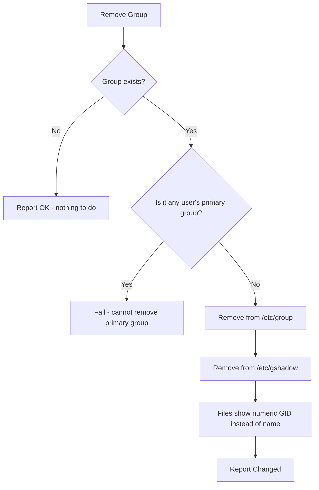

# How to Remove Groups with the Ansible group Module

Author: [nawazdhandala](https://www.github.com/nawazdhandala)

Tags: Ansible, Group Management, Linux, System Administration

Description: Learn how to safely remove Linux groups using the Ansible group module, including dependency checks and cleanup procedures.

---

Removing groups from Linux systems is less common than creating them, but it is an important part of lifecycle management. When a project ends, a team restructures, or a service is decommissioned, the associated groups should be cleaned up. The Ansible `group` module handles group removal, but there are some important considerations to keep in mind before you delete a group.

## Basic Group Removal

Removing a group is straightforward. Set `state: absent`:

```yaml
# remove-group-basic.yml - Remove a group
- name: Remove a group
  hosts: all
  become: yes
  tasks:
    - name: Remove the old-project group
      ansible.builtin.group:
        name: old-project
        state: absent
```

If the group exists, Ansible removes it and reports "changed". If it does not exist, Ansible reports "ok" and moves on. The idempotent behavior means running this multiple times is safe.

## What Happens When You Remove a Group

When a group is removed:

1. The group entry is deleted from `/etc/group` and `/etc/gshadow`
2. Files previously owned by that group now show a numeric GID instead of the group name
3. Users who had this as their supplementary group lose that membership
4. Users whose primary group was this group are NOT removed (they keep the orphaned GID)

Here is the flow:



## The Primary Group Restriction

You cannot remove a group that is the primary group of any user. Linux enforces this rule, and the `group` module will fail if you try:

```yaml
# remove-primary-group-fail.yml - This will fail
- name: Attempt to remove a primary group
  hosts: all
  become: yes
  tasks:
    # This will fail if any user has 'developers' as their primary group
    - name: Try to remove developers group
      ansible.builtin.group:
        name: developers
        state: absent
```

The error message will look something like: `groupdel: cannot remove the primary group of user 'alice'`.

To handle this, remove or reassign users first:

```yaml
# safe-remove-primary.yml - Reassign users before removing group
- name: Safely remove a primary group
  hosts: all
  become: yes
  vars:
    group_to_remove: old-team
  tasks:
    # Find users whose primary group is the one we want to remove
    - name: Find users with this primary group
      ansible.builtin.shell: >
        awk -F: -v gid=$(getent group {{ group_to_remove }} | cut -d: -f3)
        '$4 == gid {print $1}' /etc/passwd
      register: affected_users
      changed_when: false
      failed_when: false

    # Change their primary group to something else
    - name: Reassign primary group for affected users
      ansible.builtin.user:
        name: "{{ item }}"
        group: users
      loop: "{{ affected_users.stdout_lines }}"
      when: affected_users.stdout_lines | length > 0

    # Now remove the group
    - name: Remove the group
      ansible.builtin.group:
        name: "{{ group_to_remove }}"
        state: absent
```

## Removing Multiple Groups

When cleaning up after a project or decommissioning a service, you might need to remove several groups at once:

```yaml
# remove-multiple-groups.yml - Remove several groups
- name: Remove decommissioned project groups
  hosts: all
  become: yes
  vars:
    groups_to_remove:
      - project-alpha
      - project-beta
      - project-gamma-staging
  tasks:
    - name: Remove project groups
      ansible.builtin.group:
        name: "{{ item }}"
        state: absent
      loop: "{{ groups_to_remove }}"
```

## Pre-Removal Safety Checks

In a production environment, you should check for dependencies before removing a group:

```yaml
# safe-group-removal.yml - Remove group with safety checks
- name: Safely remove a group
  hosts: all
  become: yes
  vars:
    group_to_remove: old-project
  tasks:
    # Check if the group exists first
    - name: Check if group exists
      ansible.builtin.getent:
        database: group
        key: "{{ group_to_remove }}"
      register: group_check
      failed_when: false

    - name: Skip if group does not exist
      ansible.builtin.debug:
        msg: "Group {{ group_to_remove }} does not exist, skipping"
      when: group_check is failed

    # Check for files owned by this group
    - name: Find files owned by group
      ansible.builtin.shell: >
        find /home /opt /srv -group {{ group_to_remove }} -maxdepth 3 2>/dev/null | head -20
      register: owned_files
      changed_when: false
      when: group_check is not failed

    - name: Warn about owned files
      ansible.builtin.debug:
        msg: "WARNING: {{ owned_files.stdout_lines | length }} files found owned by {{ group_to_remove }}"
      when:
        - group_check is not failed
        - owned_files.stdout_lines | length > 0

    # Check for group members
    - name: Get group members
      ansible.builtin.shell: "getent group {{ group_to_remove }} | cut -d: -f4"
      register: group_members
      changed_when: false
      when: group_check is not failed

    - name: Display group members
      ansible.builtin.debug:
        msg: "Members of {{ group_to_remove }}: {{ group_members.stdout }}"
      when:
        - group_check is not failed
        - group_members.stdout | length > 0

    # Remove the group if checks pass
    - name: Remove the group
      ansible.builtin.group:
        name: "{{ group_to_remove }}"
        state: absent
      when: group_check is not failed
```

## Cleaning Up Orphaned File Permissions

After removing a group, files that were owned by that group will show a numeric GID instead of a group name. You might want to reassign them:

```yaml
# cleanup-orphaned-group.yml - Clean up files after group removal
- name: Clean up after group removal
  hosts: all
  become: yes
  vars:
    old_gid: 2005
    new_group: developers
  tasks:
    - name: Find files with orphaned GID
      ansible.builtin.shell: "find / -gid {{ old_gid }} -not -path '/proc/*' -not -path '/sys/*' 2>/dev/null"
      register: orphaned_files
      changed_when: false

    - name: Reassign files to new group
      ansible.builtin.shell: "find / -gid {{ old_gid }} -not -path '/proc/*' -not -path '/sys/*' -exec chgrp {{ new_group }} {} + 2>/dev/null || true"
      when: orphaned_files.stdout | length > 0
```

## Group Removal with Audit Logging

For compliance, log all group changes:

```yaml
# audited-group-removal.yml - Remove group with audit trail
- name: Remove group with audit logging
  hosts: all
  become: yes
  vars:
    group_to_remove: decommissioned-team
    ticket: "JIRA-4567"
    operator: "admin@company.com"
  tasks:
    - name: Get group info before removal
      ansible.builtin.getent:
        database: group
        key: "{{ group_to_remove }}"
      register: group_info
      failed_when: false

    - name: Remove the group
      ansible.builtin.group:
        name: "{{ group_to_remove }}"
        state: absent
      register: removal_result
      when: group_info is not failed

    - name: Log the removal
      ansible.builtin.lineinfile:
        path: /var/log/group-changes.log
        line: >
          {{ ansible_date_time.iso8601 }} | REMOVE | {{ group_to_remove }} |
          GID: {{ group_info.ansible_facts.getent_group[group_to_remove][1] | default('unknown') }} |
          {{ ticket }} | {{ operator }} | {{ inventory_hostname }}
        create: yes
        mode: '0640'
      when:
        - group_info is not failed
        - removal_result.changed | default(false)
```

## Conditional Group Removal

Sometimes you only want to remove groups on certain server types:

```yaml
# conditional-removal.yml - Remove groups based on conditions
- name: Remove groups conditionally
  hosts: all
  become: yes
  tasks:
    # Remove Docker group only on servers where Docker is being decommissioned
    - name: Check if Docker is installed
      ansible.builtin.command: "docker --version"
      register: docker_check
      changed_when: false
      failed_when: false

    - name: Remove docker group if Docker is not installed
      ansible.builtin.group:
        name: docker
        state: absent
      when: docker_check.rc != 0

    # Remove staging groups on production servers
    - name: Remove staging groups from production
      ansible.builtin.group:
        name: "{{ item }}"
        state: absent
      loop:
        - staging-deploy
        - staging-admin
      when: env == 'production'
```

## Using a Role for Group Lifecycle Management

Wrap group management in a reusable role:

```yaml
# roles/group-manager/tasks/main.yml
- name: Create required groups
  ansible.builtin.group:
    name: "{{ item.name }}"
    gid: "{{ item.gid | default(omit) }}"
    system: "{{ item.system | default(false) }}"
    state: present
  loop: "{{ groups_present | default([]) }}"

- name: Remove obsolete groups
  ansible.builtin.group:
    name: "{{ item }}"
    state: absent
  loop: "{{ groups_absent | default([]) }}"
```

Use it in playbooks:

```yaml
# manage-all-groups.yml - Use the group-manager role
- name: Manage groups across all servers
  hosts: all
  become: yes
  roles:
    - role: group-manager
      vars:
        groups_present:
          - name: developers
            gid: 2000
          - name: operations
            gid: 2001
        groups_absent:
          - old-project
          - deprecated-team
```

## Best Practices

1. **Check for dependencies before removing**. Look for files owned by the group and users who have it as their primary group.

2. **Reassign files before removal**. After a group is deleted, files owned by it show a numeric GID, which is confusing and can cause issues.

3. **Never remove groups in a rush**. Take time to verify that no running services depend on the group. A misconfigured service can fail silently when its group disappears.

4. **Keep an audit trail**. Log all group removals with the ticket number, operator, and timestamp.

5. **Remove groups from all servers consistently**. A group that exists on some servers but not others creates confusion.

6. **Test in staging first**. Removing a group in production without testing can expose hidden dependencies.

Group removal is a cleanup task that is easy to get wrong. The `group` module handles the core operation, but the safety checks around it are where the real work happens.
