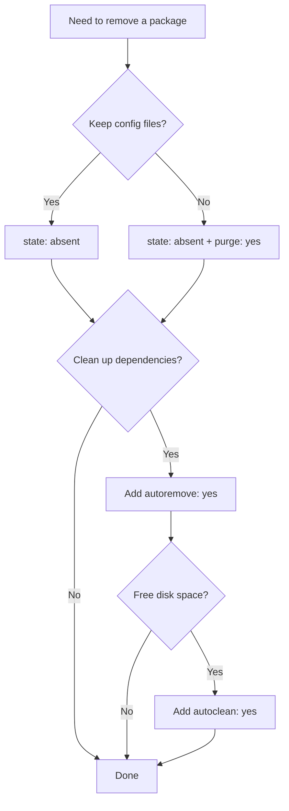

# How to Remove Packages with the Ansible apt Module

Author: [nawazdhandala](https://www.github.com/nawazdhandala)

Tags: Ansible, apt, Ubuntu, Package Management

Description: Learn how to safely remove packages on Debian and Ubuntu with Ansible apt module including purge, autoremove, and cleanup.

---

Removing packages is just as important as installing them. Whether you are decommissioning a service, hardening a server, or cleaning up after a migration, the Ansible `apt` module gives you several options for package removal. This post covers the different removal strategies and when to use each one.

## Basic Package Removal with state: absent

The simplest way to remove a package is setting `state: absent`:

```yaml
# Remove a single package
- name: Remove Apache
  ansible.builtin.apt:
    name: apache2
    state: absent
```

This is equivalent to running `apt-get remove apache2`. It removes the package binaries but leaves configuration files on disk. If you reinstall the package later, your old configuration will still be there.

## Removing Multiple Packages

Like installation, you can remove multiple packages in a single task:

```yaml
# Remove multiple packages at once
- name: Remove unnecessary packages from production server
  ansible.builtin.apt:
    name:
      - apache2
      - apache2-utils
      - libapache2-mod-php
      - telnet
      - ftp
    state: absent
```

This batches the removals into a single `apt-get` call, which is faster than running separate tasks.

## Purging Packages (Remove Everything)

If you want to remove both the package and its configuration files, use `purge: yes`:

```yaml
# Completely remove a package including its configuration files
- name: Purge old MySQL installation
  ansible.builtin.apt:
    name: mysql-server
    state: absent
    purge: yes
```

This is equivalent to `apt-get purge mysql-server`. It removes:

- The package binaries
- System-wide configuration files in `/etc`
- Any systemd service files
- Data directories that were created by the package maintainer scripts

It does NOT remove:

- User data (like MySQL databases in `/var/lib/mysql` unless the package scripts handle it)
- Log files created during runtime
- Anything you created manually

## Removing Orphaned Dependencies with autoremove

When you install a package, apt pulls in dependencies automatically. When you remove that package, those dependencies stay behind. The `autoremove: yes` parameter cleans them up:

```yaml
# Remove a package and its orphaned dependencies
- name: Remove nodejs and clean up
  ansible.builtin.apt:
    name: nodejs
    state: absent
    autoremove: yes
    purge: yes
```

You can also run autoremove as a standalone task without specifying a package:

```yaml
# Clean up all orphaned packages
- name: Remove all orphaned dependencies
  ansible.builtin.apt:
    autoremove: yes
    purge: yes
```

This is a good task to run at the end of any playbook that removes packages, or as part of a periodic cleanup job.

## Cleaning the apt Cache

Removing packages does not clean up the downloaded `.deb` files stored in `/var/cache/apt/archives/`. Over time, these accumulate and waste disk space. The `autoclean: yes` parameter handles this:

```yaml
# Clean up the apt cache after removals
- name: Clean apt cache
  ansible.builtin.apt:
    autoclean: yes
```

For a more aggressive cleanup that removes all cached packages (not just outdated ones), use a shell command:

```yaml
# Remove all cached .deb files
- name: Clear entire apt cache
  ansible.builtin.command:
    cmd: apt-get clean
  changed_when: true
```

## A Complete Cleanup Playbook

Here is a playbook that removes unwanted packages, cleans up dependencies, and frees disk space:

```yaml
# Full server cleanup playbook
- name: Clean up unnecessary packages
  hosts: all
  become: yes
  vars:
    packages_to_remove:
      - whoopsie
      - apport
      - ubuntu-report
      - popularity-contest
      - telnet
      - rsh-client
      - talk
    packages_to_purge:
      - snapd
      - lxd-installer
  tasks:
    - name: Remove unwanted packages
      ansible.builtin.apt:
        name: "{{ packages_to_remove }}"
        state: absent

    - name: Purge packages with config cleanup
      ansible.builtin.apt:
        name: "{{ packages_to_purge }}"
        state: absent
        purge: yes

    - name: Remove orphaned dependencies
      ansible.builtin.apt:
        autoremove: yes
        purge: yes

    - name: Clean apt cache
      ansible.builtin.apt:
        autoclean: yes
```

## Conditional Package Removal

Sometimes you only want to remove packages under certain conditions. Here are some common patterns:

```yaml
# Only remove a package if a certain condition is met
- name: Remove old PHP version if PHP 8.2 is installed
  ansible.builtin.apt:
    name:
      - php7.4
      - php7.4-fpm
      - php7.4-mysql
    state: absent
    purge: yes
  when: "'php8.2' in ansible_facts.packages"

# Check if a package is installed before attempting removal
- name: Gather package facts
  ansible.builtin.package_facts:
    manager: apt

- name: Remove nginx only if it is installed
  ansible.builtin.apt:
    name: nginx
    state: absent
  when: "'nginx' in ansible_facts.packages"
```

The `package_facts` module is useful here. It populates `ansible_facts.packages` with a dictionary of all installed packages, so you can make decisions based on what is actually on the system.

## Removing Packages During Service Migration

A common scenario is migrating from one service to another. For example, switching from Apache to Nginx:

```yaml
# Migrate from Apache to Nginx
- name: Migrate web server from Apache to Nginx
  hosts: web_servers
  become: yes
  tasks:
    - name: Stop Apache before removal
      ansible.builtin.service:
        name: apache2
        state: stopped
      ignore_errors: yes

    - name: Remove Apache and related modules
      ansible.builtin.apt:
        name:
          - apache2
          - apache2-bin
          - apache2-data
          - apache2-utils
          - libapache2-mod-php
          - libapache2-mod-security2
        state: absent
        purge: yes

    - name: Remove orphaned Apache dependencies
      ansible.builtin.apt:
        autoremove: yes
        purge: yes

    - name: Install Nginx
      ansible.builtin.apt:
        name:
          - nginx
          - nginx-extras
        state: present
        update_cache: yes

    - name: Ensure Nginx is running
      ansible.builtin.service:
        name: nginx
        state: started
        enabled: yes
```

Notice the `ignore_errors: yes` on the stop task. If Apache is already stopped (or was never running), the task would fail without this flag. The removal tasks do not need it because `apt` handles "package not installed" gracefully when using `state: absent`.

## Server Hardening: Removing Insecure Packages

Security hardening often involves removing packages that expose attack surface:

```yaml
# Remove insecure or unnecessary packages for hardening
- name: Harden server by removing risky packages
  ansible.builtin.apt:
    name:
      - telnet
      - rsh-client
      - rsh-redone-client
      - talk
      - ntalk
      - xinetd
      - nis
      - tftp
    state: absent
    purge: yes
```

## Removal Strategy Decision Guide



## Key Things to Remember

1. `state: absent` removes binaries, keeps config. Safe for "I might reinstall this later."
2. `purge: yes` removes everything the package manager knows about. Use this when you are done with a service for good.
3. `autoremove: yes` cleans up orphaned dependencies. Always run this after removing packages that pulled in many dependencies.
4. Always stop services before removing them. While `apt` usually handles this, explicitly stopping first avoids race conditions.
5. The `apt` module is idempotent for removals. Running `state: absent` on an already-removed package produces no changes and no errors.
6. Test removal playbooks in staging first. Removing the wrong dependency on a production database server is not something you want to debug at 2 AM.

Package removal with Ansible is straightforward once you understand the difference between remove and purge, and remember to clean up orphaned dependencies afterward.
