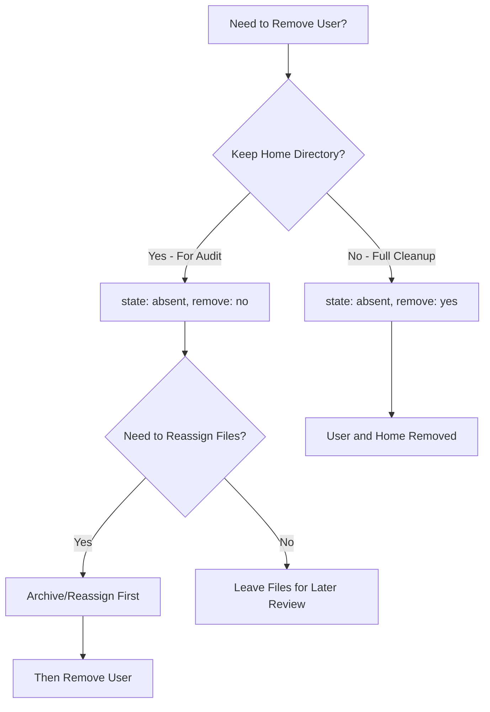

# How to Remove Users with the Ansible user Module

Author: [nawazdhandala](https://www.github.com/nawazdhandala)

Tags: Ansible, User Management, Linux, Security

Description: Learn how to safely remove user accounts from Linux servers using the Ansible user module, including home directory cleanup and best practices.

---

Removing user accounts is just as important as creating them. When someone leaves the team, changes roles, or when a service account is no longer needed, you need a reliable way to clean things up across all your servers. Doing this by hand is tedious and error-prone. The Ansible `user` module handles user removal cleanly, and in this post we will cover every aspect of it.

## Basic User Removal

The most straightforward way to remove a user is to set `state: absent` on the `user` module:

```yaml
# remove-user-basic.yml - Remove a user account
- name: Remove a user account
  hosts: all
  become: yes
  tasks:
    - name: Remove user 'oldemployee'
      ansible.builtin.user:
        name: oldemployee
        state: absent
```

This removes the user from `/etc/passwd`, `/etc/shadow`, and `/etc/group`. However, it does not remove the user's home directory or mail spool by default. The user's files remain on disk, which is sometimes what you want (keeping files for audit purposes) and sometimes not.

## Removing the Home Directory

If you want to remove the user's home directory along with the account, use the `remove` parameter:

```yaml
# remove-user-with-home.yml - Remove user and their home directory
- name: Remove user and clean up their files
  hosts: all
  become: yes
  tasks:
    - name: Remove user 'contractor' and their home directory
      ansible.builtin.user:
        name: contractor
        state: absent
        remove: yes
```

Setting `remove: yes` is equivalent to running `userdel -r` on the command line. It deletes the home directory and the mail spool. This is the option you want for a full cleanup.

## The Removal Decision Tree

Here is a visual guide for deciding how to handle user removal:



## Safely Removing Users with Pre-Removal Checks

In a real production environment, you should not just blindly delete users. You might want to check if they have running processes, archive their files, or revoke their access first. Here is a more comprehensive approach:

```yaml
# safe-user-removal.yml - Remove user with safety checks
- name: Safely remove a user account
  hosts: all
  become: yes
  vars:
    user_to_remove: jdoe
  tasks:
    # Kill any processes owned by the user before removal
    - name: Find processes owned by user
      ansible.builtin.shell: "pgrep -u {{ user_to_remove }} || true"
      register: user_processes
      changed_when: false

    - name: Kill user processes if any exist
      ansible.builtin.shell: "pkill -u {{ user_to_remove }} || true"
      when: user_processes.stdout | length > 0

    # Wait briefly for processes to terminate
    - name: Wait for processes to terminate
      ansible.builtin.pause:
        seconds: 5
      when: user_processes.stdout | length > 0

    # Force kill any remaining processes
    - name: Force kill remaining processes
      ansible.builtin.shell: "pkill -9 -u {{ user_to_remove }} || true"
      when: user_processes.stdout | length > 0

    # Archive the home directory before deletion
    - name: Archive user home directory
      community.general.archive:
        path: "/home/{{ user_to_remove }}"
        dest: "/var/backups/users/{{ user_to_remove }}-{{ ansible_date_time.date }}.tar.gz"
        format: gz
      ignore_errors: yes

    # Now remove the user
    - name: Remove the user account
      ansible.builtin.user:
        name: "{{ user_to_remove }}"
        state: absent
        remove: yes
```

## Removing Multiple Users

When offboarding a batch of users (like after a project ends or a team reorganization), looping is the way to go:

```yaml
# remove-multiple-users.yml - Batch user removal
- name: Remove multiple user accounts
  hosts: all
  become: yes
  vars:
    users_to_remove:
      - name: alice
        archive: yes
      - name: bob
        archive: no
      - name: charlie
        archive: yes
  tasks:
    - name: Archive home directories where requested
      community.general.archive:
        path: "/home/{{ item.name }}"
        dest: "/var/backups/users/{{ item.name }}-backup.tar.gz"
        format: gz
      loop: "{{ users_to_remove | selectattr('archive', 'equalto', true) | list }}"
      ignore_errors: yes

    - name: Remove all listed users
      ansible.builtin.user:
        name: "{{ item.name }}"
        state: absent
        remove: yes
      loop: "{{ users_to_remove }}"
```

## Handling Users That Do Not Exist

One nice thing about the `user` module is that it handles the case where the user does not exist gracefully. If you try to remove a user that is already gone, Ansible simply reports "ok" and moves on. No errors, no drama.

```yaml
# remove-nonexistent.yml - Removing a user that might not exist
- name: Remove user that might not exist
  hosts: all
  become: yes
  tasks:
    # This will not fail even if 'ghostuser' does not exist
    - name: Ensure ghostuser is removed
      ansible.builtin.user:
        name: ghostuser
        state: absent
        remove: yes
```

This idempotent behavior means you can run your removal playbook multiple times safely. It also means you can include user removal in your regular configuration management without worrying about first-run vs. subsequent-run scenarios.

## Revoking SSH Access Before Removal

Before removing a user, it is a good practice to revoke their SSH access first. This closes the window between when you decide to remove someone and when the playbook actually runs:

```yaml
# revoke-and-remove.yml - Revoke access then remove user
- name: Revoke access and remove user
  hosts: all
  become: yes
  vars:
    departing_user: jsmith
  tasks:
    # Lock the account immediately to prevent new logins
    - name: Lock the user account
      ansible.builtin.user:
        name: "{{ departing_user }}"
        password_lock: yes

    # Remove their SSH authorized keys
    - name: Remove SSH authorized keys file
      ansible.builtin.file:
        path: "/home/{{ departing_user }}/.ssh/authorized_keys"
        state: absent

    # Remove from sudoers if applicable
    - name: Remove user sudoers file
      ansible.builtin.file:
        path: "/etc/sudoers.d/{{ departing_user }}"
        state: absent

    # Finally remove the account
    - name: Remove the user account
      ansible.builtin.user:
        name: "{{ departing_user }}"
        state: absent
        remove: yes
```

## Using force Parameter

The `force` parameter works together with `remove` and controls what happens when files outside the home directory are owned by the user:

```yaml
# force-remove.yml - Force remove a user
- name: Force remove user
  hosts: all
  become: yes
  tasks:
    - name: Force remove user even if logged in
      ansible.builtin.user:
        name: stubborn_user
        state: absent
        remove: yes
        force: yes
```

Setting `force: yes` is equivalent to `userdel -f`. It forces the removal even if the user is currently logged in. Use this with caution because it can leave orphaned processes and open file handles.

## Cleaning Up After Removal

Even after removing a user, there might be files owned by their old UID scattered across the filesystem. Here is how to find and handle those:

```yaml
# cleanup-orphaned-files.yml - Find files owned by deleted users
- name: Clean up orphaned files after user removal
  hosts: all
  become: yes
  tasks:
    - name: Find files with no valid owner
      ansible.builtin.shell: "find /home /tmp /var -nouser -print 2>/dev/null || true"
      register: orphaned_files
      changed_when: false

    - name: Display orphaned files
      ansible.builtin.debug:
        msg: "Orphaned files found: {{ orphaned_files.stdout_lines }}"
      when: orphaned_files.stdout | length > 0

    - name: Remove orphaned files in /tmp
      ansible.builtin.shell: "find /tmp -nouser -delete 2>/dev/null || true"
      when: orphaned_files.stdout | length > 0
```

## Best Practices for User Removal

1. **Always archive first**. You never know when someone will ask for files that belonged to a departed user. Keeping backups for 30-90 days is a reasonable policy.

2. **Lock accounts before removing them**. This prevents the user from logging in during the gap between decision and execution.

3. **Check for running processes**. Removing a user with active processes can cause unexpected behavior in running services.

4. **Remove sudoers entries**. The `user` module does not clean up `/etc/sudoers.d/` files. You need to handle that separately.

5. **Run the playbook during a maintenance window** if the user owns any running services. Killing processes mid-production is not ideal.

6. **Use `remove: yes` for non-sensitive accounts** and manual archiving for accounts that might contain audit-relevant data.

User removal with Ansible is straightforward once you build the right workflow around it. The module itself handles the core removal, and you wrap it with the safety checks and cleanup steps that your organization requires.
