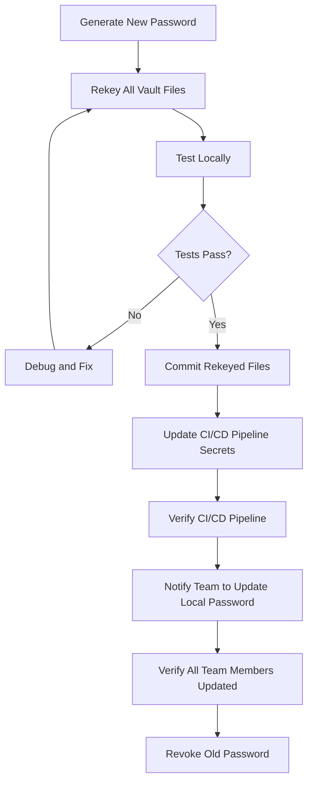

# How to Rotate Ansible Vault Passwords Safely

Author: [nawazdhandala](https://www.github.com/nawazdhandala)

Tags: Ansible, Vault, Security, Password Rotation, DevOps

Description: Learn a safe, step-by-step process for rotating Ansible Vault passwords without breaking deployments or losing access to encrypted secrets.

---

Password rotation is a security requirement in most organizations, but rotating Ansible Vault passwords has more moving parts than rotating a typical service password. You need to rekey every encrypted file, update every team member's local configuration, update CI/CD pipeline secrets, and make sure nobody gets locked out during the transition. Here is a structured, tested approach that minimizes the risk of something going wrong.

## Why Rotation Matters

Vault passwords should be rotated when:
- A team member with vault access leaves the organization
- Your security policy mandates periodic rotation (quarterly, annually)
- You suspect the password has been exposed
- You are migrating to a new secrets management approach

The risk of not rotating is simple: anyone who has ever known the password can decrypt your secrets, even long after they should have lost access.

## The Rotation Process Overview



## Step 1: Generate a New Password

Generate a strong random password:

```bash
# Generate a 32-byte random password, base64 encoded
NEW_PASSWORD=$(openssl rand -base64 32)
echo "New vault password: ${NEW_PASSWORD}"

# Save it to a temporary file for the rekey operation
echo "${NEW_PASSWORD}" > /tmp/new_vault_pass.txt
chmod 600 /tmp/new_vault_pass.txt
```

Store the new password in your team's password manager immediately, before proceeding. This way, even if something goes wrong, you will not lose the new password.

## Step 2: Inventory All Vault-Encrypted Files

Before rekeying, know exactly what needs to change:

```bash
#!/bin/bash
# find_vault_files.sh
# Lists all vault-encrypted files in the project with their vault IDs

echo "Scanning for vault-encrypted files..."
echo ""

grep -rl '^\$ANSIBLE_VAULT' . \
  --include="*.yml" \
  --include="*.yaml" | sort | while read -r file; do
  header=$(head -1 "$file")
  # Extract vault format version and vault ID
  version=$(echo "$header" | cut -d';' -f2)
  vault_id=$(echo "$header" | awk -F';' '{if(NF>=4) print $4; else print "(none)"}')
  printf "%-55s version=%-4s vault-id=%s\n" "$file" "$version" "$vault_id"
done
```

Sample output:

```
./group_vars/dev/vault.yml                              version=1.2  vault-id=dev
./group_vars/staging/vault.yml                          version=1.2  vault-id=staging
./group_vars/prod/vault.yml                             version=1.2  vault-id=prod
./roles/database/vars/vault.yml                         version=1.2  vault-id=prod
```

## Step 3: Rekey Files by Vault ID

If you use multiple vault IDs, rekey each group separately:

```bash
#!/bin/bash
# rekey_by_vault_id.sh
# Rekeys vault files grouped by vault ID

# Configuration: map vault IDs to their old and new password files
declare -A OLD_PASS
declare -A NEW_PASS

OLD_PASS[dev]="$HOME/.vault_pass_dev"
OLD_PASS[staging]="$HOME/.vault_pass_staging"
OLD_PASS[prod]="$HOME/.vault_pass_prod"

NEW_PASS[dev]="/tmp/new_vault_pass_dev.txt"
NEW_PASS[staging]="/tmp/new_vault_pass_staging.txt"
NEW_PASS[prod]="/tmp/new_vault_pass_prod.txt"

FAILED=0

for vault_id in dev staging prod; do
  echo "=== Rekeying vault ID: ${vault_id} ==="

  # Find files with this vault ID
  FILES=$(grep -rl "^\$ANSIBLE_VAULT;1\.[12];AES256;${vault_id}" . \
    --include="*.yml" --include="*.yaml" 2>/dev/null)

  if [ -z "${FILES}" ]; then
    echo "  No files found for vault ID '${vault_id}'"
    continue
  fi

  echo "${FILES}" | while read -r file; do
    echo "  Rekeying: ${file}"
    ansible-vault rekey \
      --vault-id "${vault_id}@${OLD_PASS[$vault_id]}" \
      --new-vault-id "${vault_id}@${NEW_PASS[$vault_id]}" \
      "${file}" 2>&1

    if [ $? -ne 0 ]; then
      echo "  ERROR: Failed to rekey ${file}"
      FAILED=1
    fi
  done
done

if [ ${FAILED} -eq 1 ]; then
  echo ""
  echo "Some files failed to rekey. Check errors above."
  exit 1
fi

echo ""
echo "All files rekeyed successfully."
```

For a single vault password (no vault IDs):

```bash
# Simple rekey for projects using a single vault password
ansible-vault rekey \
  --vault-password-file ~/.vault_pass.txt \
  --new-vault-password-file /tmp/new_vault_pass.txt \
  $(grep -rl '^\$ANSIBLE_VAULT' . --include="*.yml" --include="*.yaml")
```

## Step 4: Handle Inline Encrypted Strings

The `ansible-vault rekey` command does NOT handle inline encrypted strings (those created with `encrypt_string`). You need to re-encrypt these manually.

```bash
#!/bin/bash
# rekey_inline_strings.sh
# Finds files with inline vault strings and helps re-encrypt them

echo "Files containing inline vault-encrypted strings:"
echo "(These need manual re-encryption)"
echo ""

# Find YAML files that contain !vault tags (inline encrypted strings)
grep -rl '!vault' . \
  --include="*.yml" \
  --include="*.yaml" | while read -r file; do
  # Only list files that are NOT fully encrypted
  header=$(head -1 "$file")
  if [[ "${header}" != '$ANSIBLE_VAULT'* ]]; then
    echo "  ${file}"
  fi
done
```

For each file with inline encrypted strings, you need to:
1. Decrypt each value with the old password
2. Re-encrypt with the new password
3. Replace the encrypted blob in the file

This is tedious but necessary. A helper script can automate parts of it:

```bash
# For each inline encrypted variable, decrypt and re-encrypt
# Example for a single variable:
OLD_VALUE=$(ansible localhost -m debug -a "var=vault_db_password" \
  -e "@group_vars/prod/vars.yml" \
  --vault-password-file ~/.vault_pass_old.txt 2>/dev/null | grep -oP '(?<=: ).*')

# Re-encrypt with new password
echo -n "${OLD_VALUE}" | ansible-vault encrypt_string \
  --vault-password-file /tmp/new_vault_pass.txt \
  --stdin-name 'vault_db_password'
```

## Step 5: Test Everything Locally

Before committing, verify all vault files decrypt correctly with the new password:

```bash
#!/bin/bash
# test_vault_rekey.sh
# Verifies all vault files can be decrypted with the new password

NEW_PASS_FILE="/tmp/new_vault_pass.txt"
FAILED=0

echo "Testing vault decryption with new password..."
echo ""

grep -rl '^\$ANSIBLE_VAULT' . \
  --include="*.yml" --include="*.yaml" | while read -r file; do
  ansible-vault view --vault-password-file "${NEW_PASS_FILE}" "${file}" > /dev/null 2>&1
  if [ $? -eq 0 ]; then
    echo "  OK: ${file}"
  else
    echo "  FAIL: ${file}"
    FAILED=1
  fi
done

# Also run the playbook in check mode
echo ""
echo "Running playbook in check mode..."
ansible-playbook site.yml \
  --vault-password-file "${NEW_PASS_FILE}" \
  --check \
  --diff
```

## Step 6: Commit and Update Pipelines

```bash
# Commit the rekeyed files
git add -A
git commit -m "Rotate vault passwords per security policy"

# Update CI/CD pipeline secrets BEFORE pushing
# (Platform-specific: GitHub, GitLab, Jenkins, etc.)
# For GitHub:
gh secret set VAULT_PASSWORD < /tmp/new_vault_pass.txt

# Push the changes
git push origin main
```

## Step 7: Notify and Verify Team Updates

Send a notification to the team:

```
Subject: Ansible Vault Password Rotated

The Ansible Vault password has been rotated.

Action Required:
1. Get the new password from [team password manager location]
2. Update your local vault password file:
   echo "new-password-here" > ~/.vault_pass.txt
3. Verify by running: ansible-vault view group_vars/dev/vault.yml

The CI/CD pipeline has already been updated.
Please update your local setup within 24 hours.
```

## Step 8: Clean Up

```bash
# Remove temporary password files
rm -f /tmp/new_vault_pass.txt /tmp/new_vault_pass_*.txt

# Verify cleanup
ls /tmp/*vault* 2>/dev/null && echo "WARNING: temp files still exist" || echo "Cleanup complete"
```

## Emergency Procedures

If you lose the new password after rekeying but before distributing it, and you still have the old password, you are in trouble because the files are now encrypted with the new password. This is why you store the new password in the password manager FIRST, before starting the rekey.

If a rekey partially fails (some files rekeyed, some not), you have files encrypted with different passwords. The audit script from Step 2 combined with trying both passwords will help you identify which files use which password.

## Rotation Schedule

Recommended rotation frequency:

| Trigger | Action |
|---------|--------|
| Team member departure | Immediate rotation |
| Quarterly schedule | Rotate all vault IDs |
| Suspected compromise | Immediate rotation + audit |
| Annual security review | Rotate + review access list |

## Summary

Vault password rotation is a multi-step process that touches encrypted files, CI/CD pipelines, and team members' local configurations. The key to doing it safely is preparation: inventory all encrypted content first, store the new password in a secure location before rekeying, test thoroughly before committing, and update CI/CD before pushing. Handle inline encrypted strings separately since `rekey` does not cover them. With a structured approach, rotation becomes a routine maintenance task rather than a stressful emergency operation.
