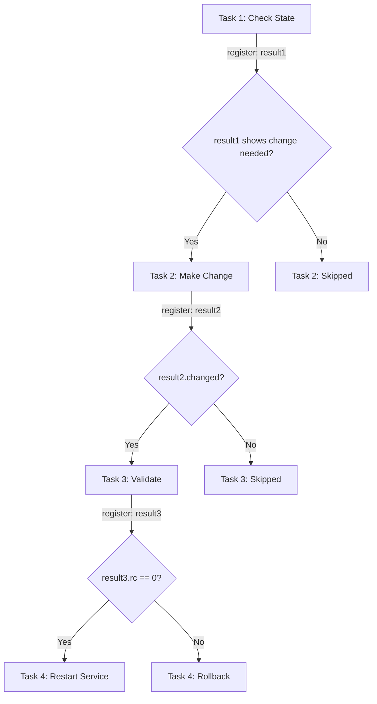

# How to Run a Task Based on the Previous Task Result in Ansible

Author: [nawazdhandala](https://www.github.com/nawazdhandala)

Tags: Ansible, Task Chaining, register, Conditionals, Workflow Control

Description: Learn how to chain Ansible tasks together using registered results to create dynamic workflows that react to previous task outcomes.

---

Linear task execution is fine for simple automation, but real-world deployments need tasks that adapt based on what happened before. Did the health check pass? Did the database migration produce any changes? Is the service already running? Ansible's `register` keyword combined with `when` conditionals lets you build workflows where each step reacts intelligently to the results of prior steps.

## The Basic Pattern

The pattern is straightforward: run a task, register its output, then use that output in the `when` clause of a subsequent task.

```yaml
# basic-chaining.yml - Simple task result chaining
---
- name: Basic task result chaining
  hosts: all
  gather_facts: false
  become: true
  tasks:
    - name: Check if application is running
      ansible.builtin.command:
        cmd: systemctl is-active myapp
      register: app_status
      failed_when: false
      changed_when: false

    - name: Start application if not running
      ansible.builtin.systemd:
        name: myapp
        state: started
      when: app_status.stdout != "active"

    - name: Skip restart if already running
      ansible.builtin.debug:
        msg: "Application is already running, skipping start"
      when: app_status.stdout == "active"
```

The `failed_when: false` on the check task is important. Without it, a non-zero return code (which `systemctl is-active` returns when the service is not active) would cause the task to fail and stop the playbook.

## Reacting to the changed Status

Many modules report whether they changed anything. You can use this to trigger follow-up actions:

```yaml
# react-to-changed.yml - React when something actually changed
---
- name: React to changes
  hosts: all
  gather_facts: false
  become: true
  tasks:
    - name: Update application configuration
      ansible.builtin.template:
        src: app.conf.j2
        dest: /etc/myapp/app.conf
        owner: app
        group: app
        mode: '0640'
      register: config_result

    - name: Validate new configuration
      ansible.builtin.command:
        cmd: /opt/myapp/bin/validate-config /etc/myapp/app.conf
      when: config_result.changed
      register: validation
      changed_when: false

    - name: Rollback if validation failed
      ansible.builtin.copy:
        src: /etc/myapp/app.conf.bak
        dest: /etc/myapp/app.conf
        remote_src: true
        mode: '0640'
      when:
        - config_result.changed
        - validation is defined
        - validation.rc != 0

    - name: Restart service if config is valid
      ansible.builtin.systemd:
        name: myapp
        state: restarted
      when:
        - config_result.changed
        - validation.rc == 0
```

## Multi-Step Deployment Pipeline

Here is a realistic deployment workflow where each step depends on the previous one:

```yaml
# deployment-pipeline.yml - Multi-step deployment
---
- name: Application deployment pipeline
  hosts: app_servers
  serial: 2
  gather_facts: true
  become: true
  tasks:
    # Step 1: Remove from load balancer
    - name: Drain connections from load balancer
      ansible.builtin.uri:
        url: "http://lb.internal/api/drain/{{ inventory_hostname }}"
        method: POST
        status_code: 200
      delegate_to: localhost
      register: drain_result

    # Step 2: Only proceed if drain succeeded
    - name: Stop application
      ansible.builtin.systemd:
        name: myapp
        state: stopped
      when: drain_result.status == 200
      register: stop_result

    # Step 3: Deploy new code
    - name: Deploy new application version
      ansible.builtin.unarchive:
        src: "/releases/myapp-{{ app_version }}.tar.gz"
        dest: /opt/myapp/
        remote_src: true
      when: stop_result is changed
      register: deploy_result

    # Step 4: Run migrations only if deployment succeeded
    - name: Run database migrations
      ansible.builtin.command:
        cmd: /opt/myapp/bin/migrate
      when:
        - deploy_result is changed
        - inventory_hostname == ansible_play_batch[0]  # Only on first host in batch
      register: migration_result
      changed_when: "'Migrated' in migration_result.stdout"
      run_once: true

    # Step 5: Start the application
    - name: Start application
      ansible.builtin.systemd:
        name: myapp
        state: started
      when: deploy_result is changed
      register: start_result

    # Step 6: Health check
    - name: Wait for application to be healthy
      ansible.builtin.uri:
        url: "http://localhost:8080/health"
        status_code: 200
      register: health_check
      until: health_check.status == 200
      retries: 30
      delay: 5
      when: start_result is changed

    # Step 7: Re-enable in load balancer only if healthy
    - name: Enable in load balancer
      ansible.builtin.uri:
        url: "http://lb.internal/api/enable/{{ inventory_hostname }}"
        method: POST
      delegate_to: localhost
      when: health_check is not skipped and health_check.status == 200
```

## Handling Command Output Parsing

Sometimes you need to parse the output of a command and make decisions based on specific content:

```yaml
# parse-output.yml - Parse command output for decisions
---
- name: Parse previous task output
  hosts: db_servers
  gather_facts: false
  become: true
  become_user: postgres
  tasks:
    - name: Check pending database migrations
      ansible.builtin.command:
        cmd: /opt/app/bin/check-migrations
      register: migration_check
      changed_when: false

    - name: Show pending migration count
      ansible.builtin.debug:
        msg: "Pending migrations: {{ migration_check.stdout_lines | length }}"

    - name: Run migrations if any are pending
      ansible.builtin.command:
        cmd: /opt/app/bin/run-migrations
      when: migration_check.stdout_lines | length > 0
      register: migration_run
      changed_when: true

    - name: Verify migrations completed
      ansible.builtin.command:
        cmd: /opt/app/bin/check-migrations
      register: post_migration_check
      changed_when: false
      when: migration_run is changed

    - name: Fail if migrations still pending
      ansible.builtin.fail:
        msg: "Migrations did not complete: {{ post_migration_check.stdout }}"
      when:
        - post_migration_check is not skipped
        - post_migration_check.stdout_lines | length > 0
```

## The Task Chain Flow



## Using block/rescue for Chained Error Handling

When a chain of dependent tasks needs error recovery:

```yaml
# chain-with-rescue.yml - Chained tasks with error recovery
---
- name: Deployment with rollback chain
  hosts: app_servers
  gather_facts: false
  become: true
  vars:
    current_version: "2.0.0"
    new_version: "2.1.0"
  tasks:
    - name: Deployment chain with rollback
      block:
        - name: Backup current version
          ansible.builtin.command:
            cmd: "cp -r /opt/app/{{ current_version }} /opt/app/{{ current_version }}.bak"
          register: backup_result
          changed_when: true

        - name: Deploy new version
          ansible.builtin.unarchive:
            src: "/releases/app-{{ new_version }}.tar.gz"
            dest: /opt/app/
            remote_src: true
          register: deploy_result

        - name: Update symlink
          ansible.builtin.file:
            src: "/opt/app/{{ new_version }}"
            dest: /opt/app/current
            state: link
          register: symlink_result

        - name: Restart service
          ansible.builtin.systemd:
            name: myapp
            state: restarted
          register: restart_result

        - name: Run smoke test
          ansible.builtin.uri:
            url: http://localhost:8080/health
            status_code: 200
          register: smoke_test
          retries: 10
          delay: 3
          until: smoke_test.status == 200

      rescue:
        - name: Rollback symlink to previous version
          ansible.builtin.file:
            src: "/opt/app/{{ current_version }}"
            dest: /opt/app/current
            state: link
          when: symlink_result is defined

        - name: Restart with old version
          ansible.builtin.systemd:
            name: myapp
            state: restarted

        - name: Notify about failure
          ansible.builtin.debug:
            msg: >
              Deployment of {{ new_version }} failed.
              Rolled back to {{ current_version }}.
              Last successful step: {{
                'smoke test' if smoke_test is defined else
                'restart' if restart_result is defined else
                'symlink' if symlink_result is defined else
                'deploy' if deploy_result is defined else
                'backup'
              }}
```

## Collecting Results Across Multiple Steps

When you need to make a decision based on the combined results of several prior tasks:

```yaml
# aggregate-results.yml - Decisions based on multiple results
---
- name: Multi-check decision making
  hosts: all
  gather_facts: true
  tasks:
    - name: Check disk space
      ansible.builtin.command:
        cmd: df -BG / --output=avail
      register: disk_check
      changed_when: false

    - name: Check memory
      ansible.builtin.command:
        cmd: free -m
      register: memory_check
      changed_when: false

    - name: Check CPU load
      ansible.builtin.command:
        cmd: uptime
      register: load_check
      changed_when: false

    - name: Determine if host is healthy enough for deployment
      ansible.builtin.set_fact:
        host_healthy: >-
          {{ (disk_check.stdout_lines[-1] | trim | regex_replace('G$', '') | int > 5) and
             (ansible_memfree_mb > 512) and
             (ansible_processor_vcpus > 1) }}

    - name: Proceed with deployment only on healthy hosts
      ansible.builtin.debug:
        msg: "Host {{ inventory_hostname }} is {{ 'healthy' if host_healthy else 'NOT healthy' }} for deployment"

    - name: Deploy only to healthy hosts
      ansible.builtin.copy:
        src: /releases/latest/
        dest: /opt/app/
        mode: '0755'
      when: host_healthy | bool
      become: true
```

## Best Practices

Always use `failed_when: false` on check tasks that might return non-zero exit codes. Use `changed_when: false` on tasks that are read-only checks. Check `is changed` rather than `.changed == true` for readability. Use `is skipped` to detect tasks that were conditionally skipped. When building long chains, use blocks with rescue for clean error handling. Name your registered variables descriptively so the chain is easy to follow. Remember that a skipped task's registered variable exists but lacks the usual module-specific fields.

Chaining tasks based on previous results transforms flat playbooks into intelligent workflows. The combination of `register` and `when` is the closest thing Ansible has to programming control flow, and mastering it is essential for building production-grade automation.
