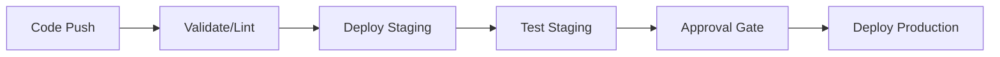

# How to Run Ansible Playbooks in Azure DevOps Pipelines

Author: [nawazdhandala](https://www.github.com/nawazdhandala)

Tags: Ansible, Azure DevOps, CI/CD, DevOps

Description: Configure Azure DevOps Pipelines to run Ansible playbooks for automated infrastructure deployments with approval gates and environments.

---

Azure DevOps Pipelines is a solid CI/CD platform that integrates well with Azure infrastructure, but it works just as well for running Ansible against any target. If your organization uses Azure DevOps for project management and source control, running your Ansible deployments there keeps everything centralized.

This guide covers setting up Azure DevOps Pipelines for Ansible, managing secrets through variable groups, and building multi-stage deployment pipelines with approval gates.

## Basic Pipeline Setup

Azure DevOps uses YAML pipeline files. Create an `azure-pipelines.yml` in the root of your repository.

```yaml
# azure-pipelines.yml - Basic Ansible pipeline
trigger:
  branches:
    include:
      - main
  paths:
    include:
      - ansible/**

pool:
  vmImage: 'ubuntu-latest'

steps:
  # Install Python and Ansible
  - task: UsePythonVersion@0
    inputs:
      versionSpec: '3.11'
    displayName: 'Set up Python 3.11'

  - script: |
      pip install ansible==8.7.0
      ansible-galaxy collection install -r ansible/requirements.yml
    displayName: 'Install Ansible and collections'

  # Run syntax check
  - script: |
      ansible-playbook --syntax-check ansible/playbooks/site.yml
    displayName: 'Syntax check'

  # Set up SSH and run playbook
  - task: InstallSSHKey@0
    inputs:
      knownHostsEntry: $(KNOWN_HOSTS)
      sshKeySecureFile: 'ansible-ssh-key'
    displayName: 'Install SSH key'

  - script: |
      cd ansible
      ansible-playbook -i inventory/staging.ini playbooks/site.yml
    displayName: 'Run Ansible playbook'
    env:
      ANSIBLE_HOST_KEY_CHECKING: 'false'
      ANSIBLE_FORCE_COLOR: 'true'
```

## Setting Up Secrets

Azure DevOps has multiple ways to handle secrets:

1. Pipeline variables (set in the pipeline UI)
2. Variable groups (shared across pipelines)
3. Secure files (for SSH keys and vault password files)
4. Azure Key Vault integration

Upload your SSH key as a secure file under Pipelines > Library > Secure files.

Create a variable group for Ansible secrets.

```yaml
# Reference a variable group in your pipeline
variables:
  - group: ansible-secrets  # Contains ANSIBLE_VAULT_PASSWORD, etc.
  - name: ANSIBLE_HOST_KEY_CHECKING
    value: 'false'
```

## Multi-Stage Pipeline

Here is a complete multi-stage pipeline with staging, testing, and production deployment.

```yaml
# azure-pipelines.yml - Multi-stage Ansible deployment
trigger:
  branches:
    include:
      - main

variables:
  - group: ansible-secrets
  - name: ANSIBLE_HOST_KEY_CHECKING
    value: 'false'
  - name: ANSIBLE_FORCE_COLOR
    value: 'true'

stages:
  # Stage 1: Validate
  - stage: Validate
    displayName: 'Validate Playbooks'
    jobs:
      - job: Lint
        pool:
          vmImage: 'ubuntu-latest'
        steps:
          - task: UsePythonVersion@0
            inputs:
              versionSpec: '3.11'

          - script: |
              pip install ansible==8.7.0 ansible-lint
              ansible-lint ansible/playbooks/
              ansible-playbook --syntax-check ansible/playbooks/site.yml
            displayName: 'Lint and syntax check'

  # Stage 2: Deploy to Staging
  - stage: DeployStaging
    displayName: 'Deploy to Staging'
    dependsOn: Validate
    jobs:
      - deployment: StagingDeploy
        environment: 'staging'
        pool:
          vmImage: 'ubuntu-latest'
        strategy:
          runOnce:
            deploy:
              steps:
                - checkout: self

                - task: UsePythonVersion@0
                  inputs:
                    versionSpec: '3.11'

                - script: |
                    pip install ansible==8.7.0
                    ansible-galaxy collection install -r ansible/requirements.yml
                  displayName: 'Install Ansible'

                - task: InstallSSHKey@0
                  inputs:
                    knownHostsEntry: $(KNOWN_HOSTS)
                    sshKeySecureFile: 'ansible-ssh-key'
                  displayName: 'Install SSH key'

                # Write vault password from pipeline variable
                - script: |
                    echo "$(ANSIBLE_VAULT_PASSWORD)" > /tmp/vault_pass.txt
                  displayName: 'Set up vault password'

                - script: |
                    cd ansible
                    ansible-playbook \
                      -i inventory/staging.ini \
                      --vault-password-file /tmp/vault_pass.txt \
                      -e "deploy_version=$(Build.BuildNumber)" \
                      playbooks/site.yml
                  displayName: 'Run Ansible on Staging'

                - script: rm -f /tmp/vault_pass.txt
                  displayName: 'Clean up vault password'
                  condition: always()

  # Stage 3: Test Staging
  - stage: TestStaging
    displayName: 'Test Staging'
    dependsOn: DeployStaging
    jobs:
      - job: SmokeTest
        pool:
          vmImage: 'ubuntu-latest'
        steps:
          - script: |
              curl -f https://staging.example.com/health || exit 1
              echo "Staging health check passed"
            displayName: 'Run smoke tests'

  # Stage 4: Deploy to Production (requires approval)
  - stage: DeployProduction
    displayName: 'Deploy to Production'
    dependsOn: TestStaging
    jobs:
      - deployment: ProductionDeploy
        environment: 'production'  # Configure approval in environment settings
        pool:
          vmImage: 'ubuntu-latest'
        strategy:
          runOnce:
            deploy:
              steps:
                - checkout: self

                - task: UsePythonVersion@0
                  inputs:
                    versionSpec: '3.11'

                - script: |
                    pip install ansible==8.7.0
                    ansible-galaxy collection install -r ansible/requirements.yml
                  displayName: 'Install Ansible'

                - task: InstallSSHKey@0
                  inputs:
                    knownHostsEntry: $(KNOWN_HOSTS)
                    sshKeySecureFile: 'ansible-ssh-key'

                - script: |
                    echo "$(ANSIBLE_VAULT_PASSWORD)" > /tmp/vault_pass.txt
                  displayName: 'Set up vault password'

                - script: |
                    cd ansible
                    ansible-playbook \
                      -i inventory/production.ini \
                      --vault-password-file /tmp/vault_pass.txt \
                      -e "deploy_version=$(Build.BuildNumber)" \
                      playbooks/site.yml
                  displayName: 'Run Ansible on Production'

                - script: rm -f /tmp/vault_pass.txt
                  displayName: 'Clean up'
                  condition: always()
```

## Pipeline Flow



## Using Azure Key Vault for Secrets

Azure Key Vault integration is a cleaner way to manage secrets compared to pipeline variables.

```yaml
# Reference Azure Key Vault secrets
variables:
  - group: ansible-keyvault-linked  # Variable group linked to Key Vault

steps:
  - task: AzureKeyVault@2
    inputs:
      azureSubscription: 'My-Azure-Connection'
      KeyVaultName: 'my-ansible-vault'
      SecretsFilter: 'ansible-vault-password,ssh-private-key'
    displayName: 'Fetch secrets from Key Vault'

  - script: |
      echo "$(ansible-vault-password)" > /tmp/vault_pass.txt
      ansible-playbook \
        -i inventory/staging.ini \
        --vault-password-file /tmp/vault_pass.txt \
        playbooks/site.yml
    displayName: 'Run playbook with Key Vault secrets'
```

## Self-Hosted Agents

If your targets are in a private network, use self-hosted agents.

```yaml
# Use a self-hosted agent pool
pool:
  name: 'my-private-agents'
  demands:
    - ansible  # Agent must have 'ansible' capability
```

Set up a self-hosted agent.

```bash
# On the agent machine, install the Azure Pipelines agent
mkdir myagent && cd myagent
wget https://vstsagentpackage.azureedge.net/agent/3.x.x/vsts-agent-linux-x64-3.x.x.tar.gz
tar zxvf vsts-agent-linux-x64-*.tar.gz
./config.sh

# Install Ansible on the agent
pip install ansible==8.7.0

# Register 'ansible' as a capability
# In Azure DevOps: Organization Settings > Agent Pools > Agents > Capabilities
```

## Using Templates for Reusable Steps

Azure DevOps supports YAML templates for reusable pipeline components.

```yaml
# templates/ansible-deploy.yml
parameters:
  - name: environment
    type: string
  - name: inventory
    type: string

steps:
  - task: UsePythonVersion@0
    inputs:
      versionSpec: '3.11'

  - script: |
      pip install ansible==8.7.0
      ansible-galaxy collection install -r ansible/requirements.yml
    displayName: 'Install Ansible'

  - task: InstallSSHKey@0
    inputs:
      knownHostsEntry: $(KNOWN_HOSTS)
      sshKeySecureFile: 'ansible-ssh-key'

  - script: |
      echo "$(ANSIBLE_VAULT_PASSWORD)" > /tmp/vault_pass.txt
      cd ansible
      ansible-playbook \
        -i inventory/${{ parameters.inventory }} \
        --vault-password-file /tmp/vault_pass.txt \
        playbooks/site.yml
    displayName: 'Deploy to ${{ parameters.environment }}'
```

Reference the template in your main pipeline.

```yaml
# azure-pipelines.yml
stages:
  - stage: Staging
    jobs:
      - deployment: Deploy
        environment: 'staging'
        strategy:
          runOnce:
            deploy:
              steps:
                - checkout: self
                - template: templates/ansible-deploy.yml
                  parameters:
                    environment: staging
                    inventory: staging.ini
```

## Tips for Azure DevOps with Ansible

1. Use the `deployment` job type instead of regular `job` for deployments. It gives you environment tracking and approval gates.
2. Configure approvals in Environments (Pipelines > Environments > your-env > Approvals and checks).
3. The `InstallSSHKey@0` task handles SSH key setup cleanly. Upload your key as a secure file first.
4. Use `condition: always()` on cleanup steps to ensure sensitive files are removed even when the playbook fails.
5. Variable groups linked to Azure Key Vault automatically rotate secrets when they change in Key Vault.
6. Use pipeline templates to keep your deployment steps DRY across multiple pipelines.

Azure DevOps Pipelines with Ansible provides a well-integrated deployment experience, especially when your infrastructure lives in Azure. The environment and approval features give you production-grade deployment controls out of the box.
