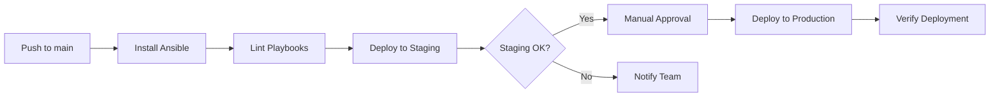

# How to Run Ansible Playbooks in GitHub Actions

Author: [nawazdhandala](https://www.github.com/nawazdhandala)

Tags: Ansible, GitHub Actions, CI/CD, DevOps

Description: Learn how to run Ansible playbooks in GitHub Actions workflows for automated infrastructure deployments and configuration management.

---

Running Ansible playbooks in GitHub Actions is one of the cleanest ways to implement infrastructure-as-code deployments. Every push to your repo can trigger automated provisioning, configuration updates, or application deployments. No more SSH-ing into a jump box to run playbooks manually.

In this post, I will cover setting up GitHub Actions workflows for Ansible, handling secrets securely, and building workflows that actually work in production.

## Basic Workflow Setup

Let us start with a minimal workflow that runs an Ansible playbook when you push to the main branch.

```yaml
# .github/workflows/ansible-deploy.yml
name: Run Ansible Playbook

on:
  push:
    branches:
      - main
    paths:
      - 'ansible/**'  # Only trigger when Ansible files change

  # Allow manual triggers for emergency deployments
  workflow_dispatch:
    inputs:
      environment:
        description: 'Target environment'
        required: true
        default: 'staging'
        type: choice
        options:
          - staging
          - production

jobs:
  deploy:
    runs-on: ubuntu-latest

    steps:
      # Check out the repository
      - name: Checkout code
        uses: actions/checkout@v4

      # Install Python and Ansible
      - name: Set up Python
        uses: actions/setup-python@v5
        with:
          python-version: '3.11'

      - name: Install Ansible
        run: |
          pip install ansible==8.7.0
          pip install ansible-lint

      # Install any required collections
      - name: Install Ansible collections
        run: |
          ansible-galaxy collection install -r ansible/requirements.yml

      # Set up SSH key for connecting to target hosts
      - name: Configure SSH key
        run: |
          mkdir -p ~/.ssh
          echo "${{ secrets.SSH_PRIVATE_KEY }}" > ~/.ssh/id_rsa
          chmod 600 ~/.ssh/id_rsa
          ssh-keyscan -H ${{ secrets.TARGET_HOST }} >> ~/.ssh/known_hosts

      # Run the playbook
      - name: Run Ansible playbook
        run: |
          cd ansible
          ansible-playbook -i inventory/staging.ini playbooks/deploy.yml
        env:
          ANSIBLE_HOST_KEY_CHECKING: "false"
```

## Handling Secrets

GitHub Actions secrets are how you pass sensitive data to your workflows. Set up these secrets in your repository settings under Settings > Secrets and variables > Actions.

```yaml
# .github/workflows/ansible-with-secrets.yml
name: Ansible Deploy with Secrets

on:
  push:
    branches: [main]

jobs:
  deploy:
    runs-on: ubuntu-latest

    steps:
      - uses: actions/checkout@v4

      - name: Set up Python
        uses: actions/setup-python@v5
        with:
          python-version: '3.11'

      - name: Install Ansible
        run: pip install ansible==8.7.0

      # Write the vault password to a file for ansible-vault
      - name: Set up Ansible Vault password
        run: echo "${{ secrets.ANSIBLE_VAULT_PASSWORD }}" > .vault_password

      # Write the SSH key
      - name: Set up SSH
        run: |
          mkdir -p ~/.ssh
          echo "${{ secrets.SSH_PRIVATE_KEY }}" > ~/.ssh/id_rsa
          chmod 600 ~/.ssh/id_rsa

      # Write a dynamic inventory from secrets
      - name: Create inventory
        run: |
          cat > ansible/inventory/hosts.ini << EOF
          [webservers]
          ${{ secrets.WEB_SERVER_1 }}
          ${{ secrets.WEB_SERVER_2 }}

          [dbservers]
          ${{ secrets.DB_SERVER }}
          EOF

      # Run playbook with vault password file
      - name: Run playbook
        run: |
          cd ansible
          ansible-playbook \
            -i inventory/hosts.ini \
            --vault-password-file ../.vault_password \
            playbooks/site.yml
        env:
          ANSIBLE_HOST_KEY_CHECKING: "false"
          ANSIBLE_FORCE_COLOR: "true"

      # Clean up sensitive files
      - name: Cleanup
        if: always()
        run: |
          rm -f .vault_password
          rm -f ~/.ssh/id_rsa
```

## Using Environments for Staged Deployments

GitHub Actions environments let you add approval gates and separate secrets for staging vs production.

```yaml
# .github/workflows/staged-deploy.yml
name: Staged Ansible Deployment

on:
  push:
    branches: [main]

jobs:
  # Deploy to staging automatically
  staging:
    runs-on: ubuntu-latest
    environment: staging

    steps:
      - uses: actions/checkout@v4

      - name: Set up Python and Ansible
        run: |
          pip install ansible==8.7.0
          ansible-galaxy collection install -r ansible/requirements.yml

      - name: Set up SSH
        run: |
          mkdir -p ~/.ssh
          echo "${{ secrets.SSH_PRIVATE_KEY }}" > ~/.ssh/id_rsa
          chmod 600 ~/.ssh/id_rsa

      - name: Deploy to staging
        run: |
          cd ansible
          ansible-playbook -i inventory/staging.ini playbooks/deploy.yml
        env:
          ANSIBLE_HOST_KEY_CHECKING: "false"

  # Deploy to production after staging succeeds and manual approval
  production:
    runs-on: ubuntu-latest
    needs: staging
    environment: production  # Requires manual approval

    steps:
      - uses: actions/checkout@v4

      - name: Set up Python and Ansible
        run: |
          pip install ansible==8.7.0
          ansible-galaxy collection install -r ansible/requirements.yml

      - name: Set up SSH
        run: |
          mkdir -p ~/.ssh
          echo "${{ secrets.SSH_PRIVATE_KEY }}" > ~/.ssh/id_rsa
          chmod 600 ~/.ssh/id_rsa

      - name: Deploy to production
        run: |
          cd ansible
          ansible-playbook -i inventory/production.ini playbooks/deploy.yml
        env:
          ANSIBLE_HOST_KEY_CHECKING: "false"
```

## Deployment Pipeline Flow



## Caching Dependencies

Ansible collections and Python packages can take a while to install. Use caching to speed up workflows.

```yaml
# Add caching for pip and ansible-galaxy
- name: Cache pip packages
  uses: actions/cache@v4
  with:
    path: ~/.cache/pip
    key: pip-${{ hashFiles('requirements.txt') }}

- name: Cache Ansible collections
  uses: actions/cache@v4
  with:
    path: ~/.ansible/collections
    key: ansible-collections-${{ hashFiles('ansible/requirements.yml') }}
```

## Adding Lint and Syntax Checks

Run lint and syntax checks before deployment.

```yaml
# Add lint job that runs before deploy
lint:
  runs-on: ubuntu-latest
  steps:
    - uses: actions/checkout@v4

    - name: Set up Python
      uses: actions/setup-python@v5
      with:
        python-version: '3.11'

    - name: Install ansible-lint
      run: pip install ansible-lint

    - name: Run ansible-lint
      run: ansible-lint ansible/playbooks/

    - name: Run syntax check
      run: |
        cd ansible
        ansible-playbook --syntax-check playbooks/deploy.yml
```

## Working with Self-Hosted Runners

If your target hosts are in a private network, GitHub's hosted runners cannot reach them. Use self-hosted runners instead.

```yaml
# Use a self-hosted runner that has network access to your infrastructure
jobs:
  deploy:
    runs-on: self-hosted
    # Or use labels to target specific runners
    # runs-on: [self-hosted, linux, datacenter-east]

    steps:
      - uses: actions/checkout@v4

      # Ansible may already be installed on self-hosted runners
      - name: Verify Ansible installation
        run: ansible --version

      - name: Run playbook
        run: |
          cd ansible
          ansible-playbook -i inventory/production.ini playbooks/deploy.yml
```

## Handling Playbook Failures

Make your workflow notify the team when deployments fail.

```yaml
# Add notification step after deployment
- name: Notify on failure
  if: failure()
  uses: slackapi/slack-github-action@v1.25.0
  with:
    payload: |
      {
        "text": "Ansible deployment FAILED on ${{ github.ref_name }}",
        "blocks": [
          {
            "type": "section",
            "text": {
              "type": "mrkdwn",
              "text": "Deployment *failed* for `${{ github.repository }}`\nBranch: `${{ github.ref_name }}`\nCommit: `${{ github.sha }}`\n<${{ github.server_url }}/${{ github.repository }}/actions/runs/${{ github.run_id }}|View Run>"
            }
          }
        ]
      }
  env:
    SLACK_WEBHOOK_URL: ${{ secrets.SLACK_WEBHOOK }}
```

## Tips for Production Workflows

1. Always pin Ansible versions in your workflow (`pip install ansible==8.7.0`). Floating versions will eventually break your deployments.
2. Use `paths` filters in your workflow trigger so Ansible deployments only run when infrastructure code actually changes.
3. Keep SSH keys and vault passwords as repository secrets. Never commit them to the repo.
4. Use `if: always()` on cleanup steps to make sure sensitive files get removed even when the playbook fails.
5. Add a `workflow_dispatch` trigger so you can manually re-run deployments without pushing a commit.
6. Set `ANSIBLE_FORCE_COLOR: true` in your environment to get colored output in the GitHub Actions logs, which makes debugging much easier.

GitHub Actions gives you a solid CI/CD platform for running Ansible without needing to maintain a separate deployment server. Combined with environments and approval gates, you get a production-grade deployment pipeline.
