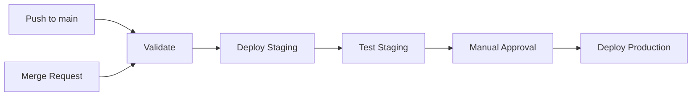

# How to Run Ansible Playbooks in GitLab CI/CD

Author: [nawazdhandala](https://www.github.com/nawazdhandala)

Tags: Ansible, GitLab, CI/CD, DevOps

Description: Set up GitLab CI/CD pipelines to run Ansible playbooks for automated infrastructure deployment with staging and production environments.

---

GitLab CI/CD is a natural fit for running Ansible playbooks. The pipeline-as-code approach maps perfectly to infrastructure automation workflows: lint your playbooks, test them against staging, get approval, and deploy to production. If your team already uses GitLab for source code, adding Ansible deployment pipelines keeps everything in one place.

This post covers setting up GitLab CI/CD for Ansible from scratch, handling secrets, and building multi-stage deployment pipelines.

## Basic Pipeline Setup

GitLab CI/CD uses a `.gitlab-ci.yml` file in the root of your repository. Here is a minimal setup for running Ansible playbooks.

```yaml
# .gitlab-ci.yml
image: python:3.11-slim

stages:
  - lint
  - deploy_staging
  - deploy_production

variables:
  ANSIBLE_HOST_KEY_CHECKING: "false"
  ANSIBLE_FORCE_COLOR: "true"
  PIP_CACHE_DIR: "$CI_PROJECT_DIR/.cache/pip"

# Cache pip packages across pipeline runs
cache:
  key: ansible-deps
  paths:
    - .cache/pip
    - .ansible/collections

# Install Ansible before all jobs
before_script:
  - pip install ansible==8.7.0 ansible-lint
  - ansible-galaxy collection install -r requirements.yml --collections-path .ansible/collections
  - ansible --version
```

## Adding Lint and Syntax Check

Always validate your playbooks before deploying them.

```yaml
# Lint job runs first
lint:
  stage: lint
  script:
    - ansible-lint playbooks/
    - ansible-playbook --syntax-check playbooks/site.yml
  rules:
    - changes:
        - "playbooks/**/*"
        - "roles/**/*"
        - "inventory/**/*"
```

## Setting Up SSH Access

Configure SSH key access so the GitLab runner can connect to your target hosts. Store your SSH private key as a CI/CD variable (Settings > CI/CD > Variables).

```yaml
# SSH setup template that other jobs can extend
.ssh_setup: &ssh_setup
  before_script:
    - pip install ansible==8.7.0
    - ansible-galaxy collection install -r requirements.yml --collections-path .ansible/collections
    # Set up SSH for connecting to target hosts
    - mkdir -p ~/.ssh
    - echo "$SSH_PRIVATE_KEY" > ~/.ssh/id_rsa
    - chmod 600 ~/.ssh/id_rsa
    - ssh-keyscan -H $STAGING_HOST >> ~/.ssh/known_hosts 2>/dev/null || true
    - ssh-keyscan -H $PRODUCTION_HOST >> ~/.ssh/known_hosts 2>/dev/null || true
```

## Staging Deployment

Deploy to staging automatically when code merges to main.

```yaml
deploy_staging:
  stage: deploy_staging
  <<: *ssh_setup
  script:
    # Write vault password from CI variable
    - echo "$ANSIBLE_VAULT_PASSWORD" > .vault_password
    # Run the playbook against staging
    - >
      ansible-playbook
      -i inventory/staging.ini
      --vault-password-file .vault_password
      playbooks/site.yml
  after_script:
    # Clean up sensitive files
    - rm -f .vault_password ~/.ssh/id_rsa
  environment:
    name: staging
    url: https://staging.example.com
  rules:
    - if: $CI_COMMIT_BRANCH == "main"
```

## Production Deployment with Manual Approval

Production deployments should require manual approval.

```yaml
deploy_production:
  stage: deploy_production
  <<: *ssh_setup
  script:
    - echo "$ANSIBLE_VAULT_PASSWORD" > .vault_password
    - >
      ansible-playbook
      -i inventory/production.ini
      --vault-password-file .vault_password
      playbooks/site.yml
  after_script:
    - rm -f .vault_password ~/.ssh/id_rsa
  environment:
    name: production
    url: https://example.com
  rules:
    - if: $CI_COMMIT_BRANCH == "main"
      when: manual  # Require manual click to deploy to production
  needs:
    - deploy_staging  # Only available after staging succeeds
```

## Complete Pipeline Configuration

Here is the full pipeline combining all stages.

```yaml
# .gitlab-ci.yml - Complete Ansible deployment pipeline
image: python:3.11-slim

stages:
  - validate
  - deploy_staging
  - test_staging
  - deploy_production

variables:
  ANSIBLE_HOST_KEY_CHECKING: "false"
  ANSIBLE_FORCE_COLOR: "true"
  PIP_CACHE_DIR: "$CI_PROJECT_DIR/.cache/pip"

cache:
  key: ansible-deps-v1
  paths:
    - .cache/pip

# Shared SSH setup
.ssh_config: &ssh_config
  before_script:
    - apt-get update && apt-get install -y openssh-client
    - pip install ansible==8.7.0
    - ansible-galaxy collection install -r requirements.yml
    - mkdir -p ~/.ssh
    - echo "$SSH_PRIVATE_KEY" > ~/.ssh/id_rsa
    - chmod 600 ~/.ssh/id_rsa
    - echo "$KNOWN_HOSTS" >> ~/.ssh/known_hosts

# Stage 1: Validate playbooks
validate:
  stage: validate
  script:
    - pip install ansible==8.7.0 ansible-lint
    - ansible-lint playbooks/
    - ansible-playbook --syntax-check playbooks/site.yml
    - ansible-inventory -i inventory/staging.ini --list > /dev/null
  rules:
    - if: $CI_PIPELINE_SOURCE == "merge_request_event"
    - if: $CI_COMMIT_BRANCH == "main"

# Stage 2: Deploy to staging
deploy_staging:
  stage: deploy_staging
  <<: *ssh_config
  script:
    - echo "$ANSIBLE_VAULT_PASSWORD" > .vault_pass
    - >
      ansible-playbook
      -i inventory/staging.ini
      --vault-password-file .vault_pass
      -e "deploy_version=$CI_COMMIT_SHORT_SHA"
      playbooks/site.yml
  after_script:
    - rm -f .vault_pass ~/.ssh/id_rsa
  environment:
    name: staging
    url: https://staging.example.com
  rules:
    - if: $CI_COMMIT_BRANCH == "main"

# Stage 3: Test staging deployment
test_staging:
  stage: test_staging
  image: curlimages/curl:latest
  script:
    - curl -f https://staging.example.com/health || exit 1
    - echo "Staging health check passed"
  rules:
    - if: $CI_COMMIT_BRANCH == "main"
  needs:
    - deploy_staging

# Stage 4: Deploy to production (manual)
deploy_production:
  stage: deploy_production
  <<: *ssh_config
  script:
    - echo "$ANSIBLE_VAULT_PASSWORD" > .vault_pass
    - >
      ansible-playbook
      -i inventory/production.ini
      --vault-password-file .vault_pass
      -e "deploy_version=$CI_COMMIT_SHORT_SHA"
      playbooks/site.yml
  after_script:
    - rm -f .vault_pass ~/.ssh/id_rsa
  environment:
    name: production
    url: https://example.com
  rules:
    - if: $CI_COMMIT_BRANCH == "main"
      when: manual
  needs:
    - test_staging
```

## Pipeline Visualization



## Using a Custom Docker Image

Installing Ansible from pip on every pipeline run is slow. Build a custom Docker image with Ansible pre-installed.

```dockerfile
# Dockerfile.ansible-runner
FROM python:3.11-slim

RUN apt-get update && \
    apt-get install -y --no-install-recommends \
    openssh-client \
    git \
    && rm -rf /var/lib/apt/lists/*

RUN pip install --no-cache-dir \
    ansible==8.7.0 \
    ansible-lint \
    jmespath

# Pre-install commonly used collections
RUN ansible-galaxy collection install \
    community.general \
    ansible.posix

ENTRYPOINT ["/bin/bash"]
```

Reference it in your pipeline.

```yaml
# Use custom image instead of python:3.11-slim
image: registry.example.com/ansible-runner:latest
```

## Handling Dynamic Inventories

If your infrastructure is in AWS or another cloud, use dynamic inventory scripts.

```yaml
deploy_aws:
  stage: deploy_staging
  <<: *ssh_config
  script:
    - pip install boto3 botocore
    - echo "$ANSIBLE_VAULT_PASSWORD" > .vault_pass
    # Use AWS dynamic inventory
    - >
      AWS_ACCESS_KEY_ID=$AWS_KEY
      AWS_SECRET_ACCESS_KEY=$AWS_SECRET
      ansible-playbook
      -i inventory/aws_ec2.yml
      --vault-password-file .vault_pass
      playbooks/site.yml
```

## Using GitLab Environments for Tracking

GitLab environments give you a visual history of deployments.

```yaml
deploy_staging:
  environment:
    name: staging
    url: https://staging.example.com
    on_stop: stop_staging  # Optional: define a job to tear down the environment

stop_staging:
  stage: deploy_staging
  script:
    - ansible-playbook -i inventory/staging.ini playbooks/teardown.yml
  environment:
    name: staging
    action: stop
  when: manual
```

## Protected Variables and Environments

For production security:

1. Mark production CI/CD variables as "Protected" so they are only available on protected branches.
2. Set the production environment to require approval from specific team members.
3. Limit production deployments to the `main` branch only.

## Tips for GitLab CI/CD with Ansible

1. Always use `after_script` to clean up SSH keys and vault passwords. This runs even if the main script fails.
2. Use YAML anchors (`&ssh_config` / `*ssh_config`) to avoid duplicating SSH setup across jobs.
3. Store your `known_hosts` as a CI/CD variable to avoid MITM warnings without disabling host key checking entirely.
4. Set `ANSIBLE_FORCE_COLOR: true` to get readable colored output in GitLab's job logs.
5. Use `needs` to create dependencies between jobs. This is more flexible than relying purely on stage ordering.
6. Cache pip packages and Ansible collections to speed up pipeline execution. The `cache` key should change when your requirements change.

GitLab CI/CD with Ansible gives you a complete infrastructure deployment pipeline with built-in approval gates, environment tracking, and audit trails. It is a solid combination for teams that want to move from manual runbook-style deployments to fully automated infrastructure management.
