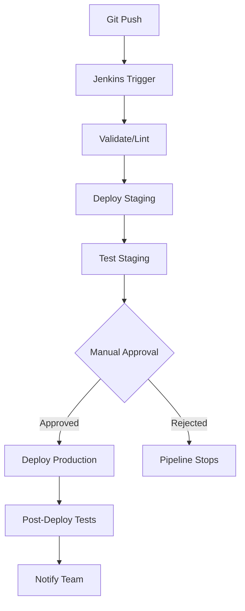

# How to Run Ansible Playbooks in Jenkins Pipelines

Author: [nawazdhandala](https://www.github.com/nawazdhandala)

Tags: Ansible, Jenkins, CI/CD, DevOps

Description: Learn how to integrate Ansible playbooks into Jenkins declarative and scripted pipelines for automated infrastructure deployments.

---

Jenkins is still one of the most widely used CI/CD tools in enterprise environments. If your organization already has Jenkins infrastructure in place, integrating Ansible playbooks into Jenkins pipelines is a practical way to automate deployments without introducing a completely new tool. Jenkins gives you pipeline-as-code through Jenkinsfiles, which pairs well with Ansible's playbook-based approach.

This guide covers setting up Jenkins for Ansible, writing declarative pipelines, handling credentials, and building multi-stage deployment workflows.

## Prerequisites

You need Ansible installed on your Jenkins agent (or controller if you run jobs there). There are two approaches:

1. Install Ansible directly on the Jenkins agent
2. Use a Docker container with Ansible pre-installed

For option 1, install Ansible on the agent.

```bash
# Install Ansible on the Jenkins agent (Ubuntu/Debian)
sudo apt-get update
sudo apt-get install -y python3 python3-pip
pip3 install ansible==8.7.0

# Verify the installation
ansible --version
```

Optionally, install the Ansible plugin for Jenkins (available from the Jenkins plugin manager). This provides an `ansiblePlaybook` step, but you can also just call `ansible-playbook` from a shell step.

## Basic Declarative Pipeline

Here is a minimal Jenkinsfile that runs an Ansible playbook.

```groovy
// Jenkinsfile - Basic Ansible deployment
pipeline {
    agent any

    environment {
        ANSIBLE_HOST_KEY_CHECKING = 'false'
        ANSIBLE_FORCE_COLOR       = 'true'
    }

    stages {
        stage('Checkout') {
            steps {
                checkout scm
            }
        }

        stage('Install Dependencies') {
            steps {
                sh '''
                    pip3 install ansible==8.7.0
                    ansible-galaxy collection install -r requirements.yml
                '''
            }
        }

        stage('Lint') {
            steps {
                sh '''
                    pip3 install ansible-lint
                    ansible-lint playbooks/
                    ansible-playbook --syntax-check playbooks/site.yml
                '''
            }
        }

        stage('Deploy to Staging') {
            steps {
                // Use Jenkins credentials for SSH key
                sshagent(credentials: ['ansible-ssh-key']) {
                    sh '''
                        ansible-playbook \
                            -i inventory/staging.ini \
                            playbooks/site.yml
                    '''
                }
            }
        }
    }

    post {
        failure {
            echo 'Ansible deployment failed!'
            // Add notification here (email, Slack, etc.)
        }
        success {
            echo 'Deployment completed successfully.'
        }
    }
}
```

## Handling Credentials

Jenkins has a built-in credential store. Use it for SSH keys, Ansible Vault passwords, and other secrets.

```groovy
// Jenkinsfile - Using Jenkins credentials with Ansible
pipeline {
    agent any

    environment {
        ANSIBLE_HOST_KEY_CHECKING = 'false'
    }

    stages {
        stage('Deploy') {
            steps {
                // Bind the vault password from Jenkins credentials
                withCredentials([
                    string(credentialsId: 'ansible-vault-pass', variable: 'VAULT_PASS'),
                    sshUserPrivateKey(credentialsId: 'ansible-ssh-key',
                                     keyFileVariable: 'SSH_KEY',
                                     usernameVariable: 'SSH_USER')
                ]) {
                    sh '''
                        # Write vault password to a temporary file
                        echo "$VAULT_PASS" > /tmp/vault_pass.txt

                        # Set up SSH key
                        mkdir -p ~/.ssh
                        cp "$SSH_KEY" ~/.ssh/id_rsa
                        chmod 600 ~/.ssh/id_rsa

                        # Run the playbook
                        ansible-playbook \
                            -i inventory/staging.ini \
                            --vault-password-file /tmp/vault_pass.txt \
                            -u "$SSH_USER" \
                            --private-key ~/.ssh/id_rsa \
                            playbooks/site.yml

                        # Clean up
                        rm -f /tmp/vault_pass.txt ~/.ssh/id_rsa
                    '''
                }
            }
        }
    }
}
```

## Using the Ansible Plugin

If you install the Jenkins Ansible plugin, you get a cleaner syntax.

```groovy
// Jenkinsfile - Using the Ansible plugin
pipeline {
    agent any

    stages {
        stage('Deploy') {
            steps {
                ansiblePlaybook(
                    playbook: 'playbooks/site.yml',
                    inventory: 'inventory/staging.ini',
                    credentialsId: 'ansible-ssh-key',
                    vaultCredentialsId: 'ansible-vault-pass',
                    colorized: true,
                    extras: '-e deploy_version=${BUILD_NUMBER}'
                )
            }
        }
    }
}
```

## Multi-Stage Pipeline with Approval

Here is a production-ready pipeline with staging, testing, approval, and production stages.

```groovy
// Jenkinsfile - Full deployment pipeline
pipeline {
    agent any

    environment {
        ANSIBLE_HOST_KEY_CHECKING = 'false'
        ANSIBLE_FORCE_COLOR       = 'true'
        DEPLOY_VERSION            = "${env.BUILD_NUMBER}"
    }

    stages {
        stage('Validate') {
            steps {
                sh '''
                    ansible-lint playbooks/
                    ansible-playbook --syntax-check playbooks/site.yml
                '''
            }
        }

        stage('Deploy Staging') {
            steps {
                withCredentials([
                    string(credentialsId: 'ansible-vault-pass', variable: 'VAULT_PASS')
                ]) {
                    sshagent(credentials: ['ansible-ssh-key']) {
                        sh '''
                            echo "$VAULT_PASS" > /tmp/vault_pass.txt
                            ansible-playbook \
                                -i inventory/staging.ini \
                                --vault-password-file /tmp/vault_pass.txt \
                                -e "deploy_version=${DEPLOY_VERSION}" \
                                playbooks/site.yml
                            rm -f /tmp/vault_pass.txt
                        '''
                    }
                }
            }
        }

        stage('Test Staging') {
            steps {
                sh '''
                    # Run smoke tests against staging
                    curl -f https://staging.example.com/health || exit 1
                    echo "Staging health check passed"
                '''
            }
        }

        stage('Approval') {
            steps {
                // Wait for manual approval before production deployment
                input message: 'Deploy to production?',
                      ok: 'Deploy',
                      submitter: 'admin,devops-team'
            }
        }

        stage('Deploy Production') {
            steps {
                withCredentials([
                    string(credentialsId: 'ansible-vault-pass', variable: 'VAULT_PASS')
                ]) {
                    sshagent(credentials: ['ansible-ssh-key']) {
                        sh '''
                            echo "$VAULT_PASS" > /tmp/vault_pass.txt
                            ansible-playbook \
                                -i inventory/production.ini \
                                --vault-password-file /tmp/vault_pass.txt \
                                -e "deploy_version=${DEPLOY_VERSION}" \
                                playbooks/site.yml
                            rm -f /tmp/vault_pass.txt
                        '''
                    }
                }
            }
        }
    }

    post {
        failure {
            slackSend(
                channel: '#deployments',
                color: 'danger',
                message: "Ansible deployment FAILED: ${env.JOB_NAME} #${env.BUILD_NUMBER}"
            )
        }
        success {
            slackSend(
                channel: '#deployments',
                color: 'good',
                message: "Ansible deployment SUCCESS: ${env.JOB_NAME} #${env.BUILD_NUMBER}"
            )
        }
        always {
            // Clean up workspace
            cleanWs()
        }
    }
}
```

## Jenkins Ansible Pipeline Flow



## Using Docker Agents

If you do not want to install Ansible on your Jenkins agents, use a Docker container.

```groovy
// Jenkinsfile - Run Ansible in Docker
pipeline {
    agent {
        docker {
            image 'cytopia/ansible:latest'
            args '-v /var/run/docker.sock:/var/run/docker.sock'
        }
    }

    stages {
        stage('Deploy') {
            steps {
                sshagent(credentials: ['ansible-ssh-key']) {
                    sh '''
                        ansible-playbook \
                            -i inventory/staging.ini \
                            playbooks/site.yml
                    '''
                }
            }
        }
    }
}
```

## Parameterized Builds

Let users choose which environment and playbook to run.

```groovy
// Jenkinsfile - Parameterized Ansible deployment
pipeline {
    agent any

    parameters {
        choice(
            name: 'ENVIRONMENT',
            choices: ['staging', 'production'],
            description: 'Target environment'
        )
        string(
            name: 'PLAYBOOK',
            defaultValue: 'site.yml',
            description: 'Playbook to run'
        )
        booleanParam(
            name: 'DRY_RUN',
            defaultValue: true,
            description: 'Run in check mode (dry run)'
        )
    }

    stages {
        stage('Deploy') {
            steps {
                sshagent(credentials: ['ansible-ssh-key']) {
                    sh """
                        ansible-playbook \
                            -i inventory/${params.ENVIRONMENT}.ini \
                            ${params.DRY_RUN ? '--check --diff' : ''} \
                            playbooks/${params.PLAYBOOK}
                    """
                }
            }
        }
    }
}
```

## Tips for Jenkins with Ansible

1. Use `sshagent` instead of manually writing SSH keys to disk. It is cleaner and handles cleanup automatically.
2. The `cleanWs()` step in the `post` block ensures sensitive data does not persist between builds.
3. Use `input` steps for production deployment approval gates.
4. Store credentials in Jenkins' credential store, not in your Jenkinsfile or playbooks.
5. Set `ANSIBLE_FORCE_COLOR: true` to get colored Ansible output in Jenkins console logs. You may also need the AnsiColor plugin.
6. For large playbook runs, increase the Jenkins job timeout to avoid premature termination.

Jenkins and Ansible together give you a flexible deployment pipeline that fits into existing enterprise CI/CD infrastructure. The key is keeping your Jenkinsfile focused on orchestration while your Ansible playbooks handle the actual configuration management.
