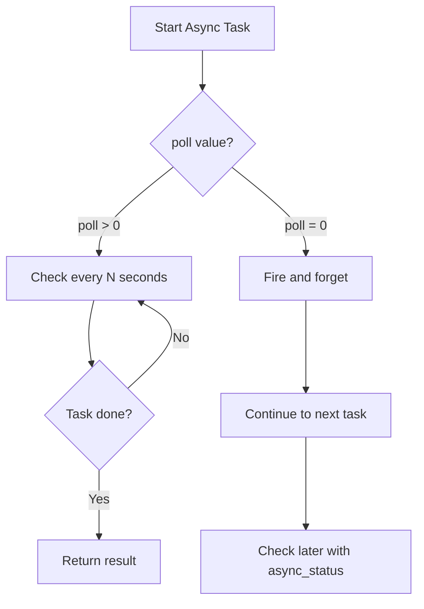

# How to Run Async Tasks in Ansible with async and poll

Author: [nawazdhandala](https://www.github.com/nawazdhandala)

Tags: Ansible, Async, Performance, DevOps

Description: Learn how to run long-running tasks asynchronously in Ansible using async and poll to prevent SSH timeouts and speed up playbook execution.

---

Some tasks take a long time. Package installations, software compilations, database migrations, large file downloads, and backup jobs can all run for minutes or even hours. If you run these synchronously, Ansible holds an SSH connection open the entire time, which can hit SSH timeout limits and block other tasks. The `async` and `poll` keywords let you run tasks in the background and check on them periodically or later.

## How async and poll Work

When you set `async` on a task, Ansible starts the task on the remote host and immediately disconnects (or polls periodically). The task runs as a background process on the remote system.

- `async: N` - Maximum runtime in seconds. If the task takes longer than N seconds, Ansible kills it.
- `poll: N` - How often (in seconds) Ansible checks if the task is done. If set to 0, Ansible fires and forgets.



## Basic Async with Polling

When `poll` is greater than 0, Ansible starts the task, then periodically checks back to see if it finished:

```yaml
# async-poll.yml - Run a long task with periodic status checks
---
- name: Compile and install software
  hosts: build_servers
  become: yes

  tasks:
    - name: Compile application from source
      command: make -j$(nproc) all
      args:
        chdir: /opt/source/myapp
      async: 3600   # Allow up to 1 hour
      poll: 30      # Check every 30 seconds

    - name: This task runs AFTER compilation finishes
      debug:
        msg: "Compilation complete, proceeding with installation"

    - name: Install compiled application
      command: make install
      args:
        chdir: /opt/source/myapp
```

With `poll: 30`, Ansible will show status updates every 30 seconds:

```
TASK [Compile application from source] ****************************************
ASYNC POLL on web1.example.com: jid=820581062177.3135 started=1 finished=0
ASYNC POLL on web1.example.com: jid=820581062177.3135 started=1 finished=0
ASYNC OK on web1.example.com: jid=820581062177.3135
```

## Fire and Forget with poll: 0

Setting `poll: 0` tells Ansible to start the task and immediately move on without waiting:

```yaml
# fire-and-forget.yml - Start tasks without waiting
---
- name: Trigger background jobs
  hosts: all
  become: yes

  tasks:
    - name: Start database backup (runs in background)
      command: /opt/scripts/backup-database.sh
      async: 7200   # Max 2 hours
      poll: 0        # Do not wait
      register: backup_job

    - name: Start log rotation (runs in background)
      command: /opt/scripts/rotate-logs.sh
      async: 600    # Max 10 minutes
      poll: 0
      register: logrotate_job

    - name: Continue with other tasks immediately
      debug:
        msg: "Background jobs started. Backup job ID: {{ backup_job.ansible_job_id }}"

    - name: Do other work while background jobs run
      apt:
        name: htop
        state: present
```

## Checking Async Job Status Later

When you use `poll: 0`, you can check on the task later using the `async_status` module:

```yaml
# async-check-later.yml - Fire and forget, then check later
---
- name: Run parallel background jobs
  hosts: app_servers
  become: yes

  tasks:
    # Start multiple jobs in parallel
    - name: Download large dataset
      get_url:
        url: https://data.example.com/dataset-2gb.tar.gz
        dest: /tmp/dataset.tar.gz
      async: 3600
      poll: 0
      register: download_job

    - name: Generate reports
      command: /opt/scripts/generate-reports.sh --all
      async: 1800
      poll: 0
      register: report_job

    - name: Rebuild search index
      command: /opt/myapp/bin/reindex --full
      async: 3600
      poll: 0
      register: index_job

    # Do other work while the above jobs run
    - name: Update configuration files
      template:
        src: app.conf.j2
        dest: /etc/myapp/app.conf

    - name: Restart web server
      systemd:
        name: nginx
        state: reloaded

    # Now check on the background jobs
    - name: Wait for download to complete
      async_status:
        jid: "{{ download_job.ansible_job_id }}"
      register: download_result
      until: download_result.finished
      retries: 120
      delay: 30  # Check every 30 seconds, up to 120 times (1 hour)

    - name: Wait for reports to complete
      async_status:
        jid: "{{ report_job.ansible_job_id }}"
      register: report_result
      until: report_result.finished
      retries: 60
      delay: 30

    - name: Wait for reindex to complete
      async_status:
        jid: "{{ index_job.ansible_job_id }}"
      register: index_result
      until: index_result.finished
      retries: 120
      delay: 30

    - name: Show all job results
      debug:
        msg:
          - "Download: {{ 'success' if download_result.rc == 0 else 'failed' }}"
          - "Reports: {{ 'success' if report_result.rc == 0 else 'failed' }}"
          - "Reindex: {{ 'success' if index_result.rc == 0 else 'failed' }}"
```

## Running Multiple Async Tasks on Different Hosts

The real power of async shows when you need long-running tasks across many hosts:

```yaml
# parallel-updates.yml - Update all servers in parallel
---
- name: Apply system updates to all servers
  hosts: all
  become: yes

  tasks:
    - name: Start system update on all hosts
      apt:
        upgrade: dist
        update_cache: yes
      async: 3600    # 1 hour max
      poll: 0        # Do not wait
      register: update_job

    - name: Wait for updates to complete on each host
      async_status:
        jid: "{{ update_job.ansible_job_id }}"
      register: update_result
      until: update_result.finished
      retries: 120
      delay: 30
      # Each host is checked independently
```

## Handling Async Failures

You need to handle the case where an async task fails or times out:

```yaml
# async-error-handling.yml - Handle async failures properly
---
- name: Run async tasks with error handling
  hosts: all
  become: yes

  tasks:
    - name: Start long-running migration
      command: /opt/myapp/bin/migrate --all
      async: 1800
      poll: 0
      register: migration_job

    - name: Do other preparatory work
      file:
        path: /opt/myapp/maintenance.flag
        state: touch

    - name: Check migration status
      async_status:
        jid: "{{ migration_job.ansible_job_id }}"
      register: migration_result
      until: migration_result.finished
      retries: 60
      delay: 30
      ignore_errors: yes

    - name: Handle migration success
      block:
        - name: Remove maintenance flag
          file:
            path: /opt/myapp/maintenance.flag
            state: absent

        - name: Restart application
          systemd:
            name: myapp
            state: restarted
      when: migration_result is succeeded

    - name: Handle migration failure
      block:
        - name: Log failure
          debug:
            msg: "Migration failed on {{ inventory_hostname }}: {{ migration_result.stderr | default('unknown error') }}"

        - name: Rollback migration
          command: /opt/myapp/bin/migrate --rollback
      when: migration_result is failed or migration_result is not defined
```

## Async with Loop

You can use async with loops to start multiple background tasks:

```yaml
# async-loop.yml - Start multiple async tasks via loop
---
- name: Download multiple files in parallel
  hosts: all

  tasks:
    - name: Download all required files
      get_url:
        url: "{{ item.url }}"
        dest: "{{ item.dest }}"
      loop:
        - url: https://example.com/file1.tar.gz
          dest: /tmp/file1.tar.gz
        - url: https://example.com/file2.tar.gz
          dest: /tmp/file2.tar.gz
        - url: https://example.com/file3.tar.gz
          dest: /tmp/file3.tar.gz
      async: 600
      poll: 0
      register: download_jobs

    - name: Wait for all downloads to finish
      async_status:
        jid: "{{ item.ansible_job_id }}"
      register: download_results
      until: download_results.finished
      retries: 60
      delay: 10
      loop: "{{ download_jobs.results }}"
```

## Limitations of Async

There are a few things to keep in mind:

1. **Not all modules support async.** Modules that require a persistent connection (like some network modules) may not work with async.

2. **Async tasks do not get privilege escalation by default.** If the task needs `become`, set it on the task.

3. **The async temp directory must be writable.** Ansible creates a temp directory at `~/.ansible_async/` on the remote host to track async job status.

4. **Handlers are not notified until the playbook finishes.** If an async task notifies a handler, the handler runs at the end of the play, not when the async task completes.

```yaml
# async-limitations.yml - Working within async constraints
---
- name: Demonstrate async limitations
  hosts: all
  become: yes

  tasks:
    # Make sure the async directory exists and is writable
    - name: Ensure async temp directory exists
      file:
        path: /root/.ansible_async
        state: directory
        mode: '0700'

    # Async with become works at the task level
    - name: Run privileged async task
      command: apt-get dist-upgrade -y
      become: yes
      async: 3600
      poll: 60
```

## When to Use Async

Use async when:

- Tasks take longer than your SSH timeout (usually 300 seconds)
- You want to run tasks on multiple hosts simultaneously without blocking
- You need to run multiple independent tasks on the same host in parallel
- You are running non-interactive background jobs

Do not use async when:

- Tasks are quick (under 1 minute)
- Tasks depend on each other sequentially
- You need interactive input
- The module does not support it

## Summary

The `async` and `poll` keywords are essential for managing long-running tasks in Ansible. Use `poll: N` for tasks you want to monitor periodically, and `poll: 0` with `async_status` for fire-and-forget patterns. Always set a reasonable `async` timeout, handle failures with `ignore_errors` or `block/rescue`, and remember that the async temp directory needs to be writable on the remote host.
