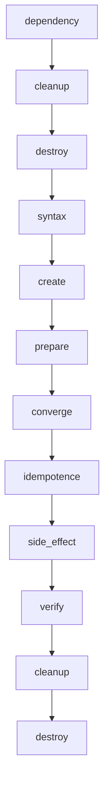

# How to Run Molecule Test Lifecycle

Author: [nawazdhandala](https://www.github.com/nawazdhandala)

Tags: Ansible, Molecule, Testing, CI/CD, DevOps

Description: Understand the complete Molecule test lifecycle from dependency installation through destroy, and learn how to run each phase effectively.

---

When you run `molecule test`, a lot happens behind the scenes. Molecule executes a sequence of phases that together form the complete test lifecycle: installing dependencies, linting, creating instances, preparing them, converging, checking idempotency, verifying, and destroying. Understanding each phase helps you debug failures, optimize your test runs, and build more effective CI/CD pipelines.

## The Full Test Sequence

When you run `molecule test`, Molecule executes these phases in order:

1. **dependency** - Install collection and role dependencies
2. **cleanup** - Run cleanup playbook (if defined)
3. **destroy** - Destroy any existing test instances
4. **syntax** - Check playbook syntax
5. **create** - Create fresh test instances
6. **prepare** - Run the prepare playbook (if defined)
7. **converge** - Apply the role to the instances
8. **idempotence** - Re-run converge and check for changes
9. **side_effect** - Run side effect playbook (if defined)
10. **verify** - Run verification tests
11. **cleanup** - Run cleanup playbook again
12. **destroy** - Destroy test instances



## Running the Full Lifecycle

The simplest way to run everything.

```bash
# Run the complete test lifecycle
molecule test

# Run a specific scenario
molecule test --scenario-name tls

# Run all scenarios
molecule test --all
```

## Running Individual Phases

During development, you rarely want to run the full lifecycle. Instead, you work with individual phases.

```bash
# Create instances without converging
molecule create

# Run the role against existing instances
molecule converge

# Run verification tests
molecule verify

# Check idempotency
molecule idempotence

# Destroy instances when done
molecule destroy
```

The typical development workflow looks like this.

```bash
# 1. Create instances once
molecule create

# 2. Iterate on your role
molecule converge
# make changes to the role
molecule converge
# make more changes
molecule converge

# 3. When you think it is ready, run verification
molecule verify

# 4. Check idempotency
molecule idempotence

# 5. Clean up
molecule destroy
```

## Phase 1: Dependency

This phase installs Ansible Galaxy collections and roles that your scenario depends on.

```yaml
# molecule/default/molecule.yml - dependency configuration
dependency:
  name: galaxy
  options:
    requirements-file: requirements.yml
    force: false  # set to true to always re-download
```

Run it standalone.

```bash
molecule dependency
```

If you see failures here, check that your `requirements.yml` is valid and that Galaxy is reachable.

## Phase 2: Cleanup (Pre-destroy)

The cleanup phase runs before destroy. It is optional and used for tasks like deregistering hosts from external services.

```yaml
# molecule/default/cleanup.yml - cleanup external state
- name: Cleanup
  hosts: all
  tasks:
    - name: Deregister from monitoring system
      ansible.builtin.uri:
        url: "https://monitoring.example.com/api/hosts/{{ inventory_hostname }}"
        method: DELETE
        headers:
          Authorization: "Bearer {{ lookup('env', 'MONITORING_TOKEN') }}"
      ignore_errors: true
      delegate_to: localhost
```

## Phase 3: Destroy

Destroy removes test instances. On the first run of `molecule test`, it removes any leftover instances from a previous run.

```bash
molecule destroy
```

## Phase 4: Syntax

Syntax checking validates your converge playbook and role files.

```bash
molecule syntax
```

This is equivalent to running `ansible-playbook --syntax-check` on your converge playbook. It catches YAML formatting errors and invalid module references, but not logic errors.

## Phase 5: Create

Create provisions the test instances using the configured driver.

```bash
molecule create
```

After creation, you can see the running instances.

```bash
# List current instances and their state
molecule list
```

Example output:

```
Instance Name    Driver Name    Provisioner Name    Scenario Name    Created    Converged
--------------   -----------    ----------------    -------------    -------    ---------
ubuntu2204       docker         ansible             default          true       false
rocky9           docker         ansible             default          true       false
```

## Phase 6: Prepare

The prepare phase runs a playbook that sets up prerequisites for your role. This is for things your role expects to already exist but does not manage.

```yaml
# molecule/default/prepare.yml - set up prerequisites
- name: Prepare
  hosts: all
  become: true
  tasks:
    - name: Update package cache
      ansible.builtin.apt:
        update_cache: true
        cache_valid_time: 3600
      when: ansible_os_family == "Debian"

    - name: Install prerequisite packages
      ansible.builtin.package:
        name:
          - python3
          - python3-pip
          - ca-certificates
        state: present

    - name: Create required directories
      ansible.builtin.file:
        path: "{{ item }}"
        state: directory
        mode: '0755'
      loop:
        - /opt/myapp
        - /etc/myapp
```

Run it standalone.

```bash
molecule prepare
```

## Phase 7: Converge

Converge runs your role against the test instances. This is the main phase you iterate on during development.

```bash
molecule converge
```

You can pass extra Ansible arguments.

```bash
# Converge with verbose output
molecule converge -- -vvv

# Converge with extra variables
molecule converge -- -e "myvar=myvalue"

# Converge with a specific tag
molecule converge -- --tags "configuration"
```

## Phase 8: Idempotence

The idempotence check re-runs the converge playbook and fails if any task reports a change. This ensures your role can be run multiple times without unintended side effects.

```bash
molecule idempotence
```

If idempotence fails, it means one or more tasks in your role are not idempotent. Common causes:

- Shell or command modules without `creates` or `changed_when`
- Templates that change on every run due to timestamps
- Package installations that trigger config changes

```yaml
# Bad: not idempotent (always reports changed)
- name: Run migration script
  ansible.builtin.command:
    cmd: /opt/app/migrate.sh

# Good: idempotent (only runs if needed)
- name: Run migration script
  ansible.builtin.command:
    cmd: /opt/app/migrate.sh
    creates: /opt/app/.migrated
```

## Phase 9: Side Effect

The side effect phase is for testing failure scenarios or external interactions. It is optional and rarely used, but powerful when needed.

```yaml
# molecule/default/side_effect.yml - simulate a failure
- name: Side Effect
  hosts: all
  become: true
  tasks:
    - name: Stop the application to simulate a crash
      ansible.builtin.service:
        name: myapp
        state: stopped

    - name: Remove a critical config file
      ansible.builtin.file:
        path: /etc/myapp/config.yml
        state: absent
```

After the side effect, you might re-converge and verify to test that the role can recover from failures.

## Phase 10: Verify

Verification checks that the role produced the expected state.

```bash
molecule verify
```

With extra options for the verifier.

```bash
# Run specific Testinfra tests
molecule verify -- -k "test_nginx"

# Verbose verification output
molecule verify -- -vvv
```

## Customizing the Test Sequence

You can customize which phases run by using `molecule test` with the `--destroy` flag or by running phases individually.

```bash
# Run test but keep instances after failure (for debugging)
molecule test --destroy=never

# Run test and always destroy, even on failure
molecule test --destroy=always
```

You can also define a custom test sequence in `molecule.yml`.

```yaml
# molecule/default/molecule.yml - custom test sequence
scenario:
  name: default
  test_sequence:
    - dependency
    - cleanup
    - destroy
    - syntax
    - create
    - prepare
    - converge
    - idempotence
    - verify
    - cleanup
    - destroy
```

Remove phases you do not need.

```yaml
# Minimal test sequence (skip lint and idempotence)
scenario:
  name: quick
  test_sequence:
    - destroy
    - create
    - converge
    - verify
    - destroy
```

## Debugging Failed Tests

When a phase fails, here is how to investigate.

```bash
# Keep instances running after failure
molecule test --destroy=never

# Log into the instance for manual inspection
molecule login

# If you have multiple instances, specify which one
molecule login --host ubuntu2204

# Check the Ansible log
molecule converge -- -vvv 2>&1 | tee molecule-debug.log
```

## CI/CD Integration Pattern

In CI pipelines, always run the full lifecycle.

```bash
# CI/CD test command
molecule test --destroy=always
```

For parallel testing of multiple scenarios:

```bash
# Run each scenario in parallel (in CI)
molecule test --scenario-name default &
molecule test --scenario-name tls &
molecule test --scenario-name cluster &
wait
```

## Performance Comparison

Here is a rough comparison of how long each phase takes with Docker:

| Phase | Typical Duration |
|---|---|
| dependency | 5-15 seconds |
| destroy | 1-3 seconds |
| syntax | 1-2 seconds |
| create | 5-15 seconds |
| prepare | 10-30 seconds |
| converge | 30-120 seconds |
| idempotence | 20-60 seconds |
| verify | 5-30 seconds |
| destroy | 1-3 seconds |

Total: typically 2-5 minutes for a well-optimized scenario with Docker.

Understanding the Molecule test lifecycle gives you control over your testing workflow. Run the full lifecycle in CI, use individual phases during development, and customize the sequence when you need something specific. The flexibility is one of Molecule's greatest strengths.
