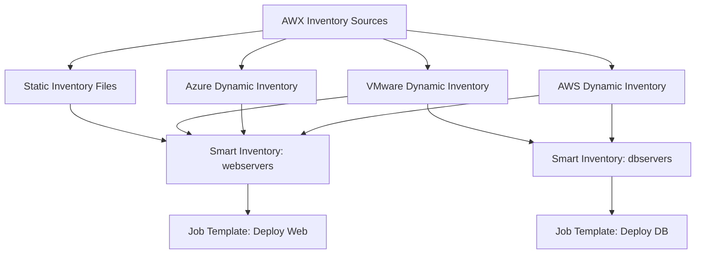

# How to Scale Ansible for Enterprise Environments

Author: [nawazdhandala](https://www.github.com/nawazdhandala)

Tags: Ansible, Enterprise, Scalability, AWX, Ansible Tower

Description: Learn how to scale Ansible for enterprise environments with thousands of hosts using AWX, execution environments, and performance optimization.

---

Running Ansible against 20 servers from your laptop is straightforward. Running it against 5,000 servers across multiple datacenters with 50 team members is a different challenge entirely. Enterprise Ansible requires centralized execution, role-based access control, performance optimization, and audit logging. Here is how to scale.

## Use AWX or Ansible Automation Platform

AWX (the open-source upstream of Red Hat Ansible Automation Platform) provides a web UI, REST API, role-based access control, and job scheduling. It is the foundation of enterprise Ansible.

```yaml
# Deploy AWX using the AWX Operator on Kubernetes
# awx-deployment.yml
apiVersion: awx.ansible.com/v1beta1
kind: AWX
metadata:
  name: awx
  namespace: awx
spec:
  service_type: ClusterIP
  ingress_type: ingress
  hostname: awx.example.com
  postgres_storage_class: gp3
  postgres_storage_requirements:
    requests:
      storage: 50Gi
  projects_persistence: true
  projects_storage_class: gp3
  projects_storage_size: 20Gi
  web_replicas: 2
  task_replicas: 2
  extra_settings:
    - setting: DEFAULT_EXECUTION_ENVIRONMENT
      value: "quay.io/company/ansible-ee:latest"
```

## Execution Environments

Execution environments package Ansible, Python dependencies, and collections into container images. This ensures every job runs with the exact same dependencies.

```dockerfile
# execution-environment/Dockerfile
# Build a custom execution environment
FROM quay.io/ansible/ansible-runner:latest

# Install additional Python packages
COPY requirements.txt /tmp/requirements.txt
RUN pip3 install -r /tmp/requirements.txt

# Install Ansible collections
COPY requirements.yml /tmp/requirements.yml
RUN ansible-galaxy collection install -r /tmp/requirements.yml
```

```yaml
# execution-environment/execution-environment.yml
# Build with ansible-builder
version: 3
dependencies:
  galaxy: requirements.yml
  python: requirements.txt
  system: bindep.txt

images:
  base_image:
    name: quay.io/ansible/ansible-runner:latest

additional_build_steps:
  append_final:
    - RUN pip3 install --upgrade pip
```

```yaml
# execution-environment/requirements.yml
collections:
  - name: community.general
    version: 8.2.0
  - name: amazon.aws
    version: 7.2.0
  - name: community.mysql
    version: 3.8.0
  - name: ansible.posix
    version: 1.5.4
```

Build and push:

```bash
# Build the execution environment
ansible-builder build \
  --tag quay.io/company/ansible-ee:latest \
  --file execution-environment.yml

# Push to registry
podman push quay.io/company/ansible-ee:latest
```

## Performance Optimization for Scale

When managing thousands of hosts, performance tuning is critical:

```ini
# ansible.cfg optimized for large-scale execution
[defaults]
# Run 100 hosts in parallel
forks = 100

# Smart fact gathering with persistent cache
gathering = smart
fact_caching = redis
fact_caching_connection = redis.example.com:6379:0
fact_caching_timeout = 86400

# Use YAML callback for readable output
stdout_callback = yaml
callbacks_enabled = timer, profile_tasks, profile_roles

# Reduce output verbosity in production
display_skipped_hosts = false
display_ok_hosts = true

[ssh_connection]
# SSH pipelining reduces connection overhead
pipelining = true

# Persistent SSH connections
ssh_args = -o ControlMaster=auto -o ControlPersist=600s -o PreferredAuthentications=publickey

# Increase connection timeout for slow networks
timeout = 30

[inventory]
# Enable inventory caching
cache = true
cache_plugin = jsonfile
cache_connection = /tmp/ansible_inventory_cache
cache_timeout = 3600
```

## Inventory Architecture for Scale



Use dynamic inventory that queries your infrastructure:

```yaml
# inventories/aws_ec2.yml
plugin: amazon.aws.aws_ec2
regions:
  - us-east-1
  - us-west-2
  - eu-west-1

keyed_groups:
  - key: tags.Role
    prefix: role
    separator: '_'
  - key: tags.Environment
    prefix: env
    separator: '_'
  - key: placement.region
    prefix: region
    separator: '_'

filters:
  instance-state-name: running
  "tag:ManagedBy": ansible

compose:
  ansible_host: private_ip_address
  ansible_user: "'ubuntu'"

hostnames:
  - tag:Name
  - private-ip-address
```

## Role-Based Access Control

Define who can do what:

```yaml
# AWX RBAC configuration (via API or UI)
# Example team and permission setup

teams:
  - name: web-operations
    organization: engineering
    permissions:
      - inventory: production-webservers
        role: use
      - job_template: deploy-web-application
        role: execute
      - job_template: restart-web-services
        role: execute

  - name: database-admins
    organization: engineering
    permissions:
      - inventory: production-databases
        role: use
      - job_template: deploy-database-changes
        role: execute
      - job_template: database-backup
        role: execute
      - job_template: database-failover
        role: admin

  - name: security-team
    organization: engineering
    permissions:
      - inventory: all-servers
        role: use
      - job_template: security-patch
        role: execute
      - job_template: compliance-audit
        role: execute
```

## Job Templates and Workflows

Create reusable job templates in AWX:

```yaml
# AWX workflow for production deployment
# Defined via API or UI
workflow:
  name: "Production Deployment"
  nodes:
    - name: "Pre-flight Checks"
      job_template: "preflight-checks"
      success_nodes:
        - "Deploy to Canary"
      failure_nodes:
        - "Notify Failure"

    - name: "Deploy to Canary"
      job_template: "deploy-application"
      extra_vars:
        target_group: "canary_servers"
        deploy_serial: 1
      success_nodes:
        - "Canary Verification"
      failure_nodes:
        - "Rollback Canary"

    - name: "Canary Verification"
      job_template: "verify-deployment"
      extra_vars:
        target_group: "canary_servers"
      success_nodes:
        - "Deploy to Production"
      failure_nodes:
        - "Rollback Canary"

    - name: "Deploy to Production"
      job_template: "deploy-application"
      extra_vars:
        target_group: "production_servers"
        deploy_serial: "25%"
      success_nodes:
        - "Production Verification"
      failure_nodes:
        - "Rollback Production"

    - name: "Production Verification"
      job_template: "verify-deployment"
```

## Scaling SSH Connections

For thousands of hosts, SSH becomes a bottleneck. Use strategies to manage connections:

```yaml
# playbooks/large-scale-deploy.yml
# Optimize for deploying to thousands of hosts
- name: Deploy to web fleet
  hosts: webservers
  become: yes
  strategy: free  # Do not wait for slow hosts
  serial: 500     # Process 500 at a time
  max_fail_percentage: 5  # Allow up to 5% failure

  pre_tasks:
    - name: Gather minimal facts
      ansible.builtin.setup:
        gather_subset:
          - '!all'
          - '!min'
          - network

  roles:
    - app_deploy
```

## Monitoring Ansible at Scale

Track Ansible execution metrics:

```yaml
# callback_plugins/metrics.py
# Send execution metrics to Prometheus
# Register this callback in ansible.cfg

# In ansible.cfg:
# [defaults]
# callbacks_enabled = metrics

# The plugin would push metrics like:
# ansible_playbook_duration_seconds
# ansible_task_changed_total
# ansible_task_failed_total
# ansible_hosts_processed_total
```

## Summary

Enterprise Ansible requires centralized orchestration (AWX/AAP), consistent execution environments (container images), performance tuning (pipelining, forks, fact caching), dynamic inventory for cloud environments, and role-based access control. Use workflow templates for multi-stage deployments. Monitor execution metrics. Scale SSH connections with the `free` strategy and serial execution. These practices let Ansible manage thousands of hosts reliably while maintaining the governance and auditability that enterprises require.
