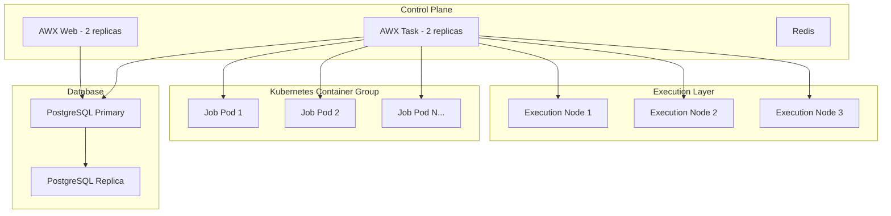

# How to Scale AWX for Large Environments

Author: [nawazdhandala](https://www.github.com/nawazdhandala)

Tags: Ansible, AWX, Scaling, Performance, Kubernetes

Description: Scale AWX to handle hundreds of concurrent jobs and thousands of hosts with instance groups, container groups, and database optimization.

---

A single AWX node works fine when you are running a few dozen jobs per day. But when your organization grows to hundreds of job templates, thousands of managed hosts, and dozens of concurrent users, you need to think about scaling. AWX scales horizontally by adding execution nodes, vertically by tuning resource allocations, and elastically through Kubernetes container groups. This post covers each approach with practical configuration.

## Understanding AWX Capacity

AWX calculates capacity based on the CPU and memory available on each execution node. Each job consumes a portion of that capacity based on its fork count. When all capacity is consumed, new jobs queue.

```bash
# Check current capacity utilization
curl -s -H "Authorization: Bearer ${AWX_TOKEN}" \
  https://awx.example.com/api/v2/instances/ \
  | python3 -c "
import sys, json
data = json.load(sys.stdin)
total_cap = 0
total_used = 0
for inst in data['results']:
    cap = inst['capacity']
    used = inst['consumed_capacity']
    total_cap += cap
    total_used += used
    pct = int(used / cap * 100) if cap > 0 else 0
    print(f'{inst[\"hostname\"]}: {used}/{cap} ({pct}% used), running: {inst[\"jobs_running\"]}')
print(f'Total: {total_used}/{total_cap} ({int(total_used/total_cap*100) if total_cap > 0 else 0}% used)')
"
```

## Scaling Architecture



## Horizontal Scaling: Adding Execution Nodes

The most direct way to increase capacity is to add more execution nodes. In AWX Operator deployments, you add execution nodes by deploying them and registering them with the control plane.

```yaml
# execution-node.yml - Deploy an execution node
---
apiVersion: awx.ansible.com/v1beta1
kind: AWX
metadata:
  name: awx
  namespace: awx
spec:
  # Control plane replicas
  web_replicas: 2
  task_replicas: 2

  # Execution node settings
  extra_settings:
    - setting: DEFAULT_EXECUTION_QUEUE_NAME
      value: "'default'"
```

For standalone execution nodes (not running in Kubernetes), register them via the CLI.

```bash
# Register a standalone execution node with AWX
# On the execution node, install the receptor package
dnf install -y receptor

# Configure receptor to connect to the AWX mesh
cat > /etc/receptor/receptor.conf <<EOF
---
- node:
    id: exec-node-01

- control-service:
    service: control
    filename: /var/run/receptor/receptor.sock

- tcp-peer:
    address: awx-control.example.com:27199
    tls: receptor-tls

- work-command:
    worktype: ansible-runner
    command: ansible-runner
    params: worker
EOF
```

## Container Groups for Elastic Scaling

Container groups are the most scalable option. Instead of running jobs on fixed execution nodes, AWX creates Kubernetes pods on demand. Each job gets its own pod, and the pod is destroyed when the job finishes.

```bash
# Create a container group
curl -s -X POST \
  -H "Authorization: Bearer ${AWX_TOKEN}" \
  -H "Content-Type: application/json" \
  https://awx.example.com/api/v2/instance_groups/ \
  -d '{
    "name": "k8s-elastic",
    "is_container_group": true,
    "credential": 5,
    "pod_spec_override": {
      "apiVersion": "v1",
      "kind": "Pod",
      "metadata": {
        "namespace": "awx-jobs"
      },
      "spec": {
        "serviceAccountName": "awx-job-runner",
        "containers": [
          {
            "name": "worker",
            "image": "quay.io/ansible/awx-ee:latest",
            "resources": {
              "requests": {
                "cpu": "500m",
                "memory": "1Gi"
              },
              "limits": {
                "cpu": "2",
                "memory": "4Gi"
              }
            }
          }
        ],
        "nodeSelector": {
          "workload-type": "ansible-jobs"
        }
      }
    }
  }'
```

Assign templates that have bursty workloads to the container group. AWX launches pods as needed and Kubernetes handles scheduling them across nodes.

## Web and Task Replica Scaling

The AWX web service (API and UI) and the task service (job dispatcher) can both run multiple replicas.

```yaml
# Scale web and task replicas in the AWX CR
spec:
  web_replicas: 3
  task_replicas: 2
```

```bash
# Or scale dynamically with kubectl
kubectl scale deployment awx-web -n awx --replicas=3
kubectl scale deployment awx-task -n awx --replicas=2
```

Guidelines:
- **Web replicas**: Scale based on concurrent API/UI users. 2-3 replicas handle most organizations. Each replica needs about 1 CPU and 2GB RAM.
- **Task replicas**: Scale based on job dispatch volume. Usually 2 is enough since the execution happens on execution nodes, not the task service.

## Database Optimization

The database is often the first bottleneck at scale. AWX hits the database for every API call, job event, and inventory lookup.

```sql
-- Check the most expensive queries
SELECT query, calls, total_exec_time, mean_exec_time
FROM pg_stat_statements
ORDER BY total_exec_time DESC
LIMIT 20;
```

### Database Connection Pooling

Use PgBouncer between AWX and PostgreSQL to reduce connection overhead.

```ini
# pgbouncer.ini
[databases]
awx = host=postgresql.example.com port=5432 dbname=awx

[pgbouncer]
listen_addr = 0.0.0.0
listen_port = 6432
auth_type = scram-sha-256
auth_file = /etc/pgbouncer/userlist.txt
pool_mode = transaction
max_client_conn = 400
default_pool_size = 50
min_pool_size = 10
```

### Database Read Replicas

For read-heavy workloads (lots of API calls, dashboard queries), point read traffic to a PostgreSQL replica.

```sql
-- On the primary, check replication status
SELECT client_addr, state, sent_lsn, write_lsn, replay_lsn
FROM pg_stat_replication;
```

## Job Template Tuning

Poorly configured job templates can waste capacity.

### Fork Count

The `forks` setting on a job template controls how many hosts Ansible manages in parallel. Higher forks use more memory and CPU on the execution node.

```bash
# Set forks to a reasonable number based on playbook complexity
curl -s -X PATCH \
  -H "Authorization: Bearer ${AWX_TOKEN}" \
  -H "Content-Type: application/json" \
  https://awx.example.com/api/v2/job_templates/10/ \
  -d '{"forks": 20}'
```

Rules of thumb:
- Simple tasks (file copy, package install): 50+ forks is fine
- Complex tasks (large templates, heavy computation): 10-20 forks
- Default of 5 is conservative and wastes capacity if you have many hosts

### Job Slicing

Job slicing splits a single job across multiple execution nodes by dividing the inventory into chunks.

```bash
# Enable job slicing with 5 slices
curl -s -X PATCH \
  -H "Authorization: Bearer ${AWX_TOKEN}" \
  -H "Content-Type: application/json" \
  https://awx.example.com/api/v2/job_templates/10/ \
  -d '{"job_slice_count": 5}'
```

A job template targeting 500 hosts with 5 slices creates 5 parallel sub-jobs, each handling 100 hosts. This distributes the work across multiple execution nodes.

## Inventory Sync Performance

Large inventories with thousands of hosts can slow down AWX. Optimize inventory syncs by:

1. **Filtering at the source** - Use filters in your inventory source to exclude hosts you do not manage.
2. **Increasing sync intervals** - Do not sync every minute if your infrastructure does not change that fast.
3. **Using smart inventories carefully** - Complex smart inventory filters against large host pools are expensive.

```bash
# Check inventory sync durations
curl -s -H "Authorization: Bearer ${AWX_TOKEN}" \
  "https://awx.example.com/api/v2/inventory_updates/?order_by=-finished&page_size=10" \
  | python3 -c "
import sys, json
data = json.load(sys.stdin)
for update in data['results']:
    name = update.get('summary_fields', {}).get('inventory_source', {}).get('name', 'unknown')
    elapsed = update.get('elapsed', 0)
    status = update['status']
    print(f'{name:30s} {status:12s} {elapsed:.1f}s')
"
```

## Job Cleanup and Data Retention

AWX stores every job's output in the database. Over months, this adds up to gigabytes of data that slows down queries.

```bash
# Check database size
kubectl exec -it awx-postgres-0 -n awx -- \
  psql -U awx -c "SELECT pg_size_pretty(pg_database_size('awx'));"

# Clean up old job data (keep 60 days)
kubectl exec deployment/awx-task -n awx -- \
  awx-manage cleanup_jobs --days=60

# Set up automated cleanup
kubectl exec deployment/awx-task -n awx -- \
  awx-manage cleanup_jobs --days=60
```

## Monitoring Capacity at Scale

Set up dashboards that track these metrics over time.

```yaml
# Prometheus alerting rules for capacity issues
groups:
  - name: awx-capacity
    rules:
      - alert: AWXCapacityHigh
        expr: >
          sum(awx_instance_consumed_capacity)
          / sum(awx_instance_capacity) > 0.8
        for: 15m
        labels:
          severity: warning
        annotations:
          summary: "AWX capacity utilization above 80%"

      - alert: AWXJobQueueGrowing
        expr: awx_pending_jobs_total > 10
        for: 10m
        labels:
          severity: critical
        annotations:
          summary: "{{ $value }} jobs stuck in queue"
```

## Scaling Recommendations by Size

| Environment | Hosts | Jobs/Day | Web Replicas | Task Replicas | Execution Nodes | DB Spec |
|---|---|---|---|---|---|---|
| Small | < 500 | < 50 | 1 | 1 | 1 (shared) | 2 CPU, 4GB |
| Medium | 500-5000 | 50-500 | 2 | 2 | 2-3 dedicated | 4 CPU, 16GB |
| Large | 5000-50000 | 500-5000 | 3 | 2 | 5-10 or container group | 8 CPU, 32GB |
| Enterprise | 50000+ | 5000+ | 3+ | 3+ | Container group + dedicated | 16 CPU, 64GB + replicas |

## Wrapping Up

Scaling AWX is about removing bottlenecks as they appear. Start with the database since that is usually the first constraint. Add execution nodes or container groups to increase job throughput. Tune fork counts and job slicing to use the capacity you have more efficiently. And clean up old data regularly so the database stays fast. The key insight is that AWX scales horizontally at the execution layer, so your investment in additional nodes pays off linearly in job throughput.
