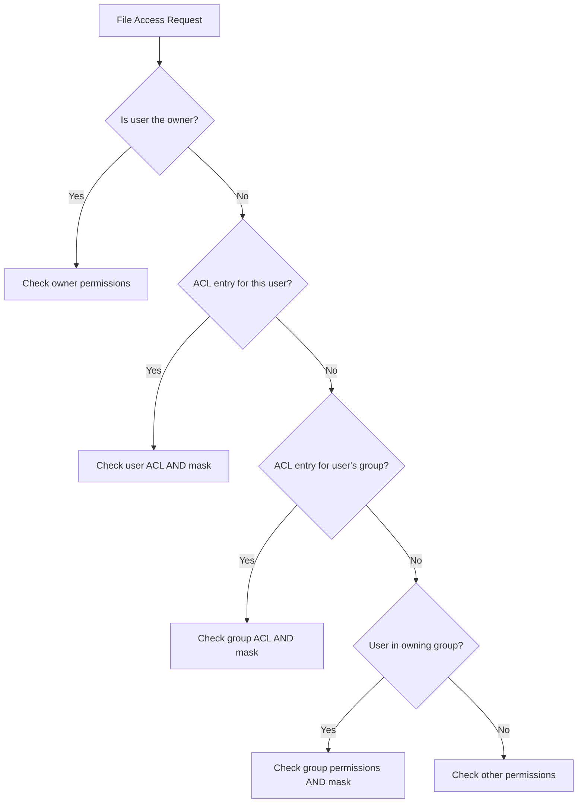

# How to Set ACLs on Files with Ansible

Author: [nawazdhandala](https://www.github.com/nawazdhandala)

Tags: Ansible, Linux, Security, File Management

Description: Learn how to use the Ansible acl module to manage POSIX Access Control Lists on files and directories for fine-grained permission control.

---

Standard Linux file permissions (owner, group, others) work for simple cases, but they fall apart when multiple users or groups need different levels of access to the same file. POSIX Access Control Lists (ACLs) extend the traditional permission model by letting you grant specific permissions to specific users and groups, independently of the file's owner and group. The Ansible `acl` module makes managing these extended permissions straightforward.

## Understanding ACLs

Before diving into Ansible, let us understand what ACLs provide. Standard permissions give you three slots: owner, group, and others. ACLs let you add as many additional user and group entries as you need.

For example, a file owned by `root:root` with mode 640 normally only allows root to read/write and the root group to read. With ACLs, you can additionally grant read access to the `devops` group and read/write access to a specific `deploy` user, without changing the file's ownership.

## Basic ACL Operations

### Granting Permissions to a User

```yaml
# Grant a specific user read access to a config file
- name: Grant deploy user read access to app config
  ansible.posix.acl:
    path: /etc/myapp/config.yml
    entity: deploy
    etype: user
    permissions: r
    state: present
```

### Granting Permissions to a Group

```yaml
# Grant the devops group read and write access to a log directory
- name: Grant devops group rw access to log directory
  ansible.posix.acl:
    path: /var/log/myapp
    entity: devops
    etype: group
    permissions: rw
    state: present
```

### Removing an ACL Entry

```yaml
# Remove a user's ACL entry
- name: Remove contractor access from config
  ansible.posix.acl:
    path: /etc/myapp/config.yml
    entity: contractor
    etype: user
    state: absent
```

## Recursive ACLs on Directories

ACLs can be applied recursively to all files and directories within a path.

```yaml
# Grant the monitoring group read access to all files in the log directory
- name: Set recursive ACL on log directory
  ansible.posix.acl:
    path: /var/log/myapp
    entity: monitoring
    etype: group
    permissions: rx
    recursive: yes
    state: present
```

## Default ACLs

Default ACLs are set on directories and are inherited by new files and subdirectories created within them. This is extremely useful for shared directories where you want consistent permissions.

```yaml
# Set a default ACL so new files in /shared inherit devops group read access
- name: Set default ACL on shared directory
  ansible.posix.acl:
    path: /opt/shared
    entity: devops
    etype: group
    permissions: rwx
    default: yes
    state: present
```

New files created in `/opt/shared` will automatically have an ACL entry granting the `devops` group rwx access. Without default ACLs, new files would only get standard permissions.

```yaml
# Set both regular and default ACLs for a shared project directory
- name: Grant engineering group access to project directory
  ansible.posix.acl:
    path: /opt/projects/webapp
    entity: engineering
    etype: group
    permissions: rwx
    state: present

- name: Set default ACL for new files in project directory
  ansible.posix.acl:
    path: /opt/projects/webapp
    entity: engineering
    etype: group
    permissions: rwx
    default: yes
    state: present
```

## Managing Multiple ACL Entries

Use loops to apply multiple ACL entries to the same path.

```yaml
# Apply multiple ACL entries to the application directory
- name: Set ACLs for multiple groups on app directory
  ansible.posix.acl:
    path: /opt/myapp
    entity: "{{ item.entity }}"
    etype: "{{ item.etype }}"
    permissions: "{{ item.permissions }}"
    recursive: "{{ item.recursive | default(false) }}"
    state: present
  loop:
    - { entity: devops, etype: group, permissions: rwx, recursive: yes }
    - { entity: monitoring, etype: group, permissions: rx, recursive: yes }
    - { entity: auditor, etype: user, permissions: r, recursive: yes }
    - { entity: deploy, etype: user, permissions: rwx, recursive: yes }
```

## Setting ACLs on Multiple Paths

```yaml
# Apply the same ACL to multiple directories
- name: Grant deployment team access to all application directories
  ansible.posix.acl:
    path: "{{ item }}"
    entity: deploy-team
    etype: group
    permissions: rwx
    recursive: yes
    state: present
  loop:
    - /opt/app1
    - /opt/app2
    - /opt/app3
    - /var/log/apps
```

## Prerequisites

The target system needs ACL support. Most modern Linux filesystems (ext4, xfs, btrfs) support ACLs by default, but older systems might need the filesystem mounted with the `acl` option. The `acl` package also needs to be installed.

```yaml
# Ensure ACL tools are available
- name: Install ACL package
  ansible.builtin.package:
    name: acl
    state: present
```

## A Complete Role for Shared Directory Management

Here is a full role that sets up a shared project directory with proper ACLs.

```yaml
# tasks/main.yml - Shared directory setup with ACLs
---
- name: Install ACL package
  ansible.builtin.package:
    name: acl
    state: present

- name: Create shared project directory
  ansible.builtin.file:
    path: "{{ shared_dir }}"
    state: directory
    owner: root
    group: root
    mode: '0770'

- name: Set group sticky bit on shared directory
  ansible.builtin.file:
    path: "{{ shared_dir }}"
    mode: '2770'

- name: Set regular ACLs for teams
  ansible.posix.acl:
    path: "{{ shared_dir }}"
    entity: "{{ item.group }}"
    etype: group
    permissions: "{{ item.perms }}"
    recursive: yes
    state: present
  loop: "{{ shared_dir_acls }}"

- name: Set default ACLs for inheritance
  ansible.posix.acl:
    path: "{{ shared_dir }}"
    entity: "{{ item.group }}"
    etype: group
    permissions: "{{ item.perms }}"
    default: yes
    state: present
  loop: "{{ shared_dir_acls }}"

# vars/main.yml
# shared_dir: /opt/projects/shared
# shared_dir_acls:
#   - { group: developers, perms: rwx }
#   - { group: qa, perms: rx }
#   - { group: management, perms: r }
```

## Reading Current ACLs

You can use the `acl` module to read current ACL settings by omitting the `entity` and `permissions` parameters. This is less common in playbooks but useful for auditing.

```yaml
# Read and display current ACLs on a file
- name: Get current ACLs
  ansible.posix.acl:
    path: /opt/myapp/config.yml
  register: current_acls

- name: Display current ACLs
  ansible.builtin.debug:
    var: current_acls.acl
```

## ACL Interaction with Standard Permissions

ACLs and standard Unix permissions interact in specific ways. The ACL mask entry controls the maximum effective permissions for named users, named groups, and the owning group.



## Troubleshooting ACLs

Check that ACLs are working correctly by examining them on the remote host.

```yaml
# Verify ACLs are set correctly
- name: Check ACLs on directory
  ansible.builtin.command: getfacl /opt/myapp
  register: facl_output
  changed_when: false

- name: Display ACL settings
  ansible.builtin.debug:
    var: facl_output.stdout_lines
```

Common issues include filesystems not mounted with ACL support and the `acl` package not being installed.

## Summary

POSIX ACLs with the Ansible `acl` module solve the age-old problem of complex permission requirements that standard Unix permissions cannot handle. Default ACLs ensure that new files automatically inherit the correct permissions, recursive ACLs update existing file trees, and the loop pattern makes it easy to manage multiple access entries. For shared directories, web server docroots, and any scenario where multiple users or groups need different access levels, ACLs are the right tool. Just remember to install the `acl` package, verify filesystem support, and use default ACLs on directories to handle newly created files.
