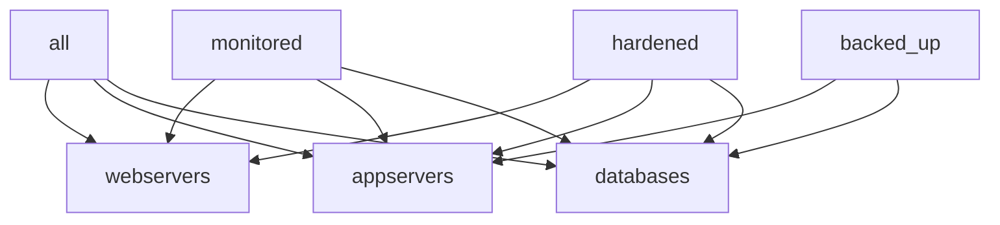

# How to Set Default Groups for All Hosts in Ansible

Author: [nawazdhandala](https://www.github.com/nawazdhandala)

Tags: Ansible, Inventory, Groups, Configuration Management

Description: Learn how to set default groups for all hosts in Ansible inventory to apply shared configurations and variables consistently.

---

Every host in an Ansible inventory automatically belongs to at least two groups: `all` and `ungrouped` (if no other group is assigned). But what if you want every host to also belong to additional groups like `monitored`, `patched`, or `linux_servers`? This post covers several ways to set default groups that apply to all or most hosts in your inventory.

## The Built-in all Group

Ansible automatically creates an `all` group that contains every host in your inventory. You can set variables for this group using `group_vars/all.yml`:

```yaml
# inventory/group_vars/all.yml
# These variables apply to every single host
ansible_user: deploy
ntp_server: ntp.example.com
dns_servers:
  - 10.0.0.53
  - 10.0.0.54
monitoring_enabled: true
```

This is the simplest way to apply defaults. But sometimes you need actual group membership, not just variables. For example, you might have playbooks that target a group name like `monitored` or `hardened`.

## Method 1: Parent Groups with children in INI

In INI format, you can create a parent group that includes all your other groups as children:

```ini
# inventory/hosts.ini
[webservers]
web01 ansible_host=10.0.1.10
web02 ansible_host=10.0.1.11

[appservers]
app01 ansible_host=10.0.2.20
app02 ansible_host=10.0.2.21

[databases]
db01 ansible_host=10.0.3.30

# Create a parent group that includes all other groups
[monitored:children]
webservers
appservers
databases

# Another default group for all servers that need patching
[auto_patched:children]
webservers
appservers
databases
```

Now you can target `monitored` or `auto_patched` in your playbooks and hit every host:

```yaml
# playbooks/setup-monitoring.yml
- hosts: monitored
  roles:
    - monitoring_agent

# playbooks/apply-patches.yml
- hosts: auto_patched
  roles:
    - os_patches
```

## Method 2: Parent Groups in YAML Format

The YAML equivalent is cleaner, especially when you have many groups:

```yaml
# inventory/hosts.yml
all:
  children:
    # Functional groups
    webservers:
      hosts:
        web01:
          ansible_host: 10.0.1.10
        web02:
          ansible_host: 10.0.1.11
    appservers:
      hosts:
        app01:
          ansible_host: 10.0.2.20
        app02:
          ansible_host: 10.0.2.21
    databases:
      hosts:
        db01:
          ansible_host: 10.0.3.30

    # Default groups that include all functional groups
    monitored:
      children:
        webservers:
        appservers:
        databases:
    auto_patched:
      children:
        webservers:
        appservers:
        databases:
    linux_servers:
      children:
        webservers:
        appservers:
        databases:
```

## Method 3: Using the constructed Inventory Plugin

The `constructed` inventory plugin is the most powerful approach. It lets you create groups dynamically based on host variables, and you can add hosts to groups using conditions:

First, enable the plugin in `ansible.cfg`:

```ini
# ansible.cfg
[inventory]
enable_plugins = ansible.builtin.yaml, ansible.builtin.ini, ansible.builtin.constructed
```

Create a constructed inventory file:

```yaml
# inventory/constructed.yml
plugin: ansible.builtin.constructed
strict: false

# Add ALL hosts to these groups unconditionally
groups:
  # Every host gets added to the monitored group
  monitored: true
  # Every host gets added to the managed group
  managed: true
  # Every Linux host (based on a variable) goes in linux_servers
  linux_servers: os_family | default('Linux') == 'Linux'
  # Hosts with monitoring_enabled variable get added
  needs_monitoring: monitoring_enabled | default(true)
```

Use it alongside your regular inventory:

```bash
# Pass both the static inventory and constructed plugin config
ansible-playbook -i inventory/hosts.yml -i inventory/constructed.yml site.yml

# Verify the generated groups
ansible-inventory -i inventory/hosts.yml -i inventory/constructed.yml --graph
```

The constructed plugin evaluates its rules against every host from all other inventory sources. Setting a group condition to `true` means every host matches unconditionally.

## Method 4: Keyed Groups with constructed Plugin

The `keyed_groups` feature of the constructed plugin creates groups based on variable values:

```yaml
# inventory/constructed.yml
plugin: ansible.builtin.constructed
strict: false

# Create groups from host variable values
keyed_groups:
  # Group hosts by their environment variable value
  - key: environment | default('unknown')
    prefix: env
    separator: "_"
  # Group hosts by OS
  - key: os_type | default('linux')
    prefix: os
    separator: "_"
  # Group hosts by datacenter
  - key: datacenter | default('default')
    prefix: dc
    separator: "_"

# Unconditional group membership
groups:
  all_managed: true
```

If a host has `environment: production`, it gets added to `env_production`. If `os_type: ubuntu`, it joins `os_ubuntu`. Every host also goes into `all_managed`.

## Method 5: add_host in a Pre-task Play

You can dynamically add hosts to groups at playbook runtime using the `add_host` module:

```yaml
# playbooks/site.yml
# First play: add all hosts to default groups
- hosts: all
  gather_facts: false
  tasks:
    - name: Add all hosts to the monitored group
      ansible.builtin.add_host:
        name: "{{ inventory_hostname }}"
        groups:
          - monitored
          - managed
          - auto_backup
      changed_when: false

# Second play: use the dynamically created group
- hosts: monitored
  tasks:
    - name: Install monitoring agent
      ansible.builtin.package:
        name: node-exporter
        state: present
```

This approach is less common because it happens at runtime rather than inventory time, but it works when you need dynamic group assignment based on facts gathered during the play.

## Practical Example: Multi-Layer Default Groups

Here is a real-world inventory that uses multiple layers of default groups:

```yaml
# inventory/production.yml
all:
  vars:
    # Defaults for every host
    ansible_user: deploy
    monitoring_enabled: true
    backup_enabled: true
  children:
    # Tier 1: Application groups
    webservers:
      hosts:
        web01:
          ansible_host: 10.0.1.10
        web02:
          ansible_host: 10.0.1.11
      vars:
        http_port: 80
    appservers:
      hosts:
        app01:
          ansible_host: 10.0.2.20
        app02:
          ansible_host: 10.0.2.21
      vars:
        app_port: 8080
    databases:
      hosts:
        db01:
          ansible_host: 10.0.3.30
      vars:
        db_port: 5432

    # Tier 2: Cross-cutting concern groups
    monitored:
      children:
        webservers:
        appservers:
        databases:
      vars:
        prometheus_port: 9100
        alertmanager_url: "http://alerts.example.com:9093"

    backed_up:
      children:
        appservers:
        databases:
      vars:
        backup_schedule: "0 2 * * *"
        backup_retention_days: 30

    hardened:
      children:
        webservers:
        appservers:
        databases:
      vars:
        ssh_permit_root: false
        firewall_enabled: true
```

This creates a structure where:



Every host is in `all`, its functional group, and the relevant cross-cutting groups. Variables from each group layer merge together, with more specific groups taking precedence.

## Using group_vars with Default Groups

Once you have your default groups set up, use `group_vars` directories to keep configurations organized:

```
inventory/
  hosts.yml
  group_vars/
    all.yml              # Global defaults
    monitored.yml        # Monitoring agent config
    backed_up.yml        # Backup agent config
    hardened.yml         # Security hardening settings
    webservers.yml       # Web-specific settings
    appservers.yml       # App-specific settings
    databases.yml        # Database-specific settings
```

```yaml
# inventory/group_vars/monitored.yml
# Configuration for the monitoring agent on all monitored hosts
prometheus_node_exporter_version: "1.7.0"
prometheus_scrape_interval: "15s"
monitoring_labels:
  team: platform
  severity: critical
```

This pattern keeps your inventory clean and your variable assignments predictable. Every host in the `monitored` group picks up the monitoring configuration automatically.

Setting default groups in Ansible is about establishing a clear, layered structure where cross-cutting concerns (monitoring, backups, security) are separated from functional grouping (web, app, database). Use the `children` directive for static group relationships, the `constructed` plugin for dynamic grouping based on variables, and `group_vars` directories to keep the associated configuration organized. This approach scales well from a handful of servers to thousands.
