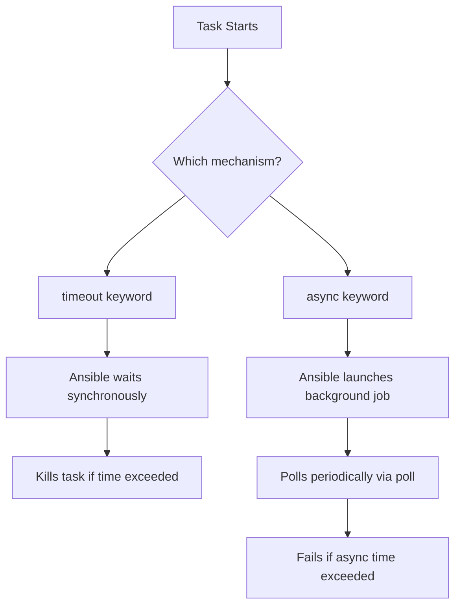

# How to Set Playbook Timeout for Long-Running Tasks

Author: [nawazdhandala](https://www.github.com/nawazdhandala)

Tags: Ansible, Timeout, DevOps, Task Management

Description: Learn how to configure timeouts in Ansible playbooks for long-running tasks to prevent hung processes and manage execution time.

---

Long-running tasks are a reality in infrastructure automation. Database migrations, large file transfers, software compilations, and system updates can all take unpredictable amounts of time. Without proper timeout configuration, a stuck task can block your entire playbook indefinitely. This guide covers every timeout mechanism Ansible provides and when to use each one.

## Types of Timeouts in Ansible

Ansible has several distinct timeout settings, and each one controls a different part of the execution pipeline:

1. **Connection timeout** - How long to wait for an SSH connection
2. **Command timeout** - How long a single command can run
3. **Task timeout** - Maximum time for an individual task
4. **Persistent connection timeout** - Idle timeout for persistent connections
5. **Async timeout** - Time limit for asynchronous tasks

## SSH Connection Timeout

The connection timeout controls how long Ansible waits to establish an SSH connection to a host. This is the most basic timeout and prevents playbooks from hanging when a host is unreachable.

Set it in `ansible.cfg`:

```ini
# ansible.cfg - Configure SSH connection timeout
[defaults]
timeout = 30  # Wait 30 seconds for SSH connection (default is 10)

[ssh_connection]
ssh_args = -o ConnectTimeout=30 -o ConnectionAttempts=3
```

You can also pass it on the command line:

```bash
# Set connection timeout to 60 seconds via command line
ansible-playbook --timeout=60 deploy.yml
```

## Task-Level Timeout

Ansible 2.10 introduced the `timeout` keyword at the task level. This is the most granular timeout control and is perfect for tasks that should complete within a known time window.

```yaml
# database-migration.yml - Apply DB migrations with a timeout
---
- name: Run database migrations
  hosts: db_servers
  become: yes

  tasks:
    - name: Apply schema migrations
      command: /opt/myapp/bin/migrate --apply
      timeout: 300  # Kill the task after 5 minutes
      register: migration_result

    - name: Display migration output
      debug:
        var: migration_result.stdout_lines

    - name: Run data backfill job
      command: /opt/myapp/bin/backfill --batch-size=1000
      timeout: 1800  # 30 minutes max for backfill
```

When a task exceeds its timeout, Ansible kills the process and raises an error. You can handle this with `ignore_errors` or a `block/rescue` structure.

## Handling Timeout Failures Gracefully

Here is how to catch timeout errors and respond appropriately:

```yaml
# safe-migration.yml - Handle timeout failures with block/rescue
---
- name: Safe database migration with timeout handling
  hosts: db_servers
  become: yes

  tasks:
    - name: Run migration with fallback
      block:
        - name: Apply database migration
          command: /opt/myapp/bin/migrate --apply
          timeout: 600  # 10 minute timeout

        - name: Verify migration completed
          command: /opt/myapp/bin/migrate --status
          register: status

        - name: Confirm migration success
          assert:
            that:
              - "'up to date' in status.stdout"
            fail_msg: "Migration did not complete successfully"

      rescue:
        - name: Log the timeout failure
          debug:
            msg: "Migration timed out or failed. Initiating rollback."

        - name: Rollback the migration
          command: /opt/myapp/bin/migrate --rollback
          timeout: 300

        - name: Send alert notification
          uri:
            url: "https://hooks.slack.com/services/T00/B00/xxx"
            method: POST
            body_format: json
            body:
              text: "Database migration failed on {{ inventory_hostname }}"
```

## Async Tasks with Timeout

For very long-running tasks, the `async` keyword is the preferred approach. It lets Ansible start a task and then either poll for completion or fire and forget.

```yaml
# long-build.yml - Compile software with async timeout
---
- name: Build application from source
  hosts: build_servers
  become: yes

  tasks:
    - name: Compile application (may take 20+ minutes)
      command: make -j$(nproc) all
      args:
        chdir: /opt/source/myapp
      async: 3600    # Maximum runtime: 1 hour
      poll: 30       # Check every 30 seconds

    - name: Run test suite
      command: make test
      args:
        chdir: /opt/source/myapp
      async: 1800    # Maximum 30 minutes
      poll: 60       # Check every minute
      register: test_result

    - name: Show test results
      debug:
        var: test_result.stdout_lines
```

The difference between `timeout` and `async`:



## Configuring Default Command Timeout

The `DEFAULT_TIMEOUT` in ansible.cfg sets the default for command and shell module execution:

```ini
# ansible.cfg - Set default timeouts for the project
[defaults]
timeout = 30              # SSH connection timeout
command_warnings = False

[persistent_connection]
command_timeout = 60      # Timeout for individual commands on persistent connections
connect_timeout = 30      # Timeout for persistent connection establishment
connect_retry_timeout = 15
```

## Practical Example: System Update with Timeouts

Here is a real-world playbook for updating servers with appropriate timeouts at each step:

```yaml
# system-update.yml - Patch servers with proper timeout handling
---
- name: Apply system updates with timeouts
  hosts: all
  become: yes
  serial: 5  # Update 5 servers at a time

  vars:
    reboot_timeout: 300
    update_timeout: 1200

  tasks:
    - name: Update apt cache
      apt:
        update_cache: yes
      timeout: 120  # Cache update should finish in 2 minutes

    - name: Apply all security updates
      apt:
        upgrade: safe
        autoremove: yes
      timeout: "{{ update_timeout }}"  # 20 minutes for updates
      register: update_result

    - name: Check if reboot is required
      stat:
        path: /var/run/reboot-required
      register: reboot_needed

    - name: Reboot the server if needed
      reboot:
        reboot_timeout: "{{ reboot_timeout }}"
        pre_reboot_delay: 5
        post_reboot_delay: 30
        msg: "Rebooting for system updates"
      when: reboot_needed.stat.exists

    - name: Wait for all services to be running
      command: systemctl is-system-running
      register: system_status
      until: system_status.stdout == "running"
      retries: 30
      delay: 10
      changed_when: false
      timeout: 600  # 10 minutes total to stabilize
```

## Using wait_for with Timeouts

The `wait_for` module has its own timeout parameter, which is useful for waiting on ports or files:

```yaml
# wait-for-services.yml - Wait for services to come online
---
- name: Wait for services after deployment
  hosts: app_servers

  tasks:
    - name: Wait for application port to be open
      wait_for:
        port: 8080
        host: "{{ inventory_hostname }}"
        delay: 5         # Wait 5 seconds before first check
        timeout: 120     # Give up after 2 minutes
        state: started

    - name: Wait for log file to contain ready message
      wait_for:
        path: /var/log/myapp/startup.log
        search_regex: "Application started successfully"
        timeout: 180     # 3 minutes to start
```

## Environment Variable Override

You can override the timeout using an environment variable in CI/CD pipelines:

```bash
# Override connection timeout via environment variable
export ANSIBLE_TIMEOUT=60

# For persistent connection command timeout
export ANSIBLE_PERSISTENT_COMMAND_TIMEOUT=120

ansible-playbook deploy.yml
```

## Debugging Timeout Issues

When tasks time out unexpectedly, increase verbosity to see what is happening:

```bash
# Run with maximum verbosity to debug timeout issues
ansible-playbook -vvvv deploy.yml --timeout=60 2>&1 | tee playbook.log

# Search the log for timeout-related messages
grep -i "timeout\|timed out\|unreachable" playbook.log
```

## Summary

Timeouts are your safety net against runaway tasks and unresponsive hosts. Use the `timeout` keyword for tasks with predictable durations, `async` for genuinely long-running operations, and connection timeouts to handle unreachable hosts. Always pair timeouts with error handling through `block/rescue` to make your playbooks resilient. The right timeout values depend on your environment, so start generous and tighten them as you learn how long tasks actually take.
