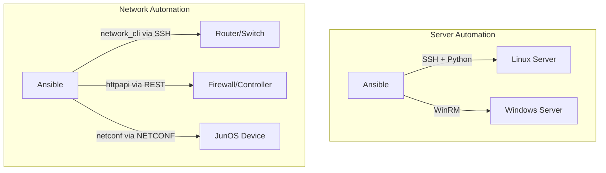

# How to Set Up Ansible for Network Device Automation

Author: [nawazdhandala](https://www.github.com/nawazdhandala)

Tags: Ansible, Network Automation, Infrastructure, DevOps

Description: Get started with Ansible for network device automation covering installation, inventory setup, connection types, and your first network playbook.

---

Network automation has gone from a nice-to-have to a necessity. When you are managing hundreds of switches, routers, and firewalls, making configuration changes one device at a time through SSH sessions is slow, error-prone, and does not scale. Ansible is one of the best tools for network automation because it is agentless (no software to install on network devices), uses a simple YAML syntax, and has built-in support for dozens of network platforms.

This post covers the foundational setup you need to start automating network devices with Ansible. We will go through installation, inventory configuration, connection types, and build your first network playbook.

## What Makes Network Automation Different

Network device automation with Ansible differs from server automation in a few important ways:



Network devices typically do not have Python installed, do not run a general-purpose OS, and interact through a CLI rather than a shell. Ansible handles this through specialized connection plugins that translate tasks into CLI commands or API calls.

## Installation

Start by installing Ansible and the network collections you need:

```bash
# Install Ansible core
pip install ansible-core

# Install common network collections
ansible-galaxy collection install ansible.netcommon
ansible-galaxy collection install cisco.ios
ansible-galaxy collection install cisco.nxos
ansible-galaxy collection install cisco.iosxr
ansible-galaxy collection install arista.eos
ansible-galaxy collection install junipernetworks.junos
ansible-galaxy collection install vyos.vyos

# Install additional Python libraries for NETCONF and REST
pip install ncclient
pip install paramiko
pip install xmltodict
```

## Inventory Configuration

The network inventory looks different from a server inventory because you need to specify connection types and platform-specific variables.

```ini
# inventory/network-hosts.ini
# Network device inventory organized by platform

[ios_routers]
router-core-01 ansible_host=10.0.0.1
router-core-02 ansible_host=10.0.0.2

[ios_switches]
switch-access-01 ansible_host=10.0.1.1
switch-access-02 ansible_host=10.0.1.2
switch-dist-01 ansible_host=10.0.1.10

[nxos_switches]
nexus-core-01 ansible_host=10.0.2.1
nexus-core-02 ansible_host=10.0.2.2

[eos_switches]
arista-spine-01 ansible_host=10.0.3.1
arista-spine-02 ansible_host=10.0.3.2

[junos_routers]
juniper-edge-01 ansible_host=10.0.4.1

[ios_routers:vars]
ansible_network_os=cisco.ios.ios
ansible_connection=ansible.netcommon.network_cli
ansible_user=admin
ansible_password={{ vault_ios_password }}
ansible_become=yes
ansible_become_method=enable
ansible_become_password={{ vault_enable_password }}

[ios_switches:vars]
ansible_network_os=cisco.ios.ios
ansible_connection=ansible.netcommon.network_cli
ansible_user=admin
ansible_password={{ vault_ios_password }}
ansible_become=yes
ansible_become_method=enable
ansible_become_password={{ vault_enable_password }}

[nxos_switches:vars]
ansible_network_os=cisco.nxos.nxos
ansible_connection=ansible.netcommon.network_cli
ansible_user=admin
ansible_password={{ vault_nxos_password }}

[eos_switches:vars]
ansible_network_os=arista.eos.eos
ansible_connection=ansible.netcommon.network_cli
ansible_user=admin
ansible_password={{ vault_eos_password }}
ansible_become=yes
ansible_become_method=enable

[junos_routers:vars]
ansible_network_os=junipernetworks.junos.junos
ansible_connection=ansible.netcommon.netconf
ansible_user=admin
ansible_password={{ vault_junos_password }}

[all_network:children]
ios_routers
ios_switches
nxos_switches
eos_switches
junos_routers
```

## Understanding Connection Types

Ansible provides three main connection types for network devices:

### network_cli (SSH-based CLI)

This is the most common connection type. Ansible connects via SSH and sends CLI commands as if you were typing them manually.

```yaml
# group_vars/ios_devices.yml
# Configuration for SSH-based CLI connection
ansible_connection: ansible.netcommon.network_cli
ansible_network_os: cisco.ios.ios
ansible_user: admin
ansible_ssh_common_args: '-o StrictHostKeyChecking=no'
```

### netconf (NETCONF protocol)

NETCONF uses XML-based RPC over SSH. It is the most structured and reliable protocol, supporting transactions and rollback.

```yaml
# group_vars/junos_devices.yml
# Configuration for NETCONF connection
ansible_connection: ansible.netcommon.netconf
ansible_network_os: junipernetworks.junos.junos
ansible_user: admin
ansible_port: 830
```

### httpapi (REST API)

Some modern network devices expose REST APIs for configuration:

```yaml
# group_vars/api_devices.yml
# Configuration for REST API connection
ansible_connection: ansible.netcommon.httpapi
ansible_network_os: arista.eos.eos
ansible_httpapi_use_ssl: true
ansible_httpapi_validate_certs: false
```

## Your First Network Playbook

Let's start with gathering facts from network devices. This is the equivalent of `ansible.builtin.setup` for servers:

```yaml
# playbook-gather-facts.yml
# Gathers configuration and operational data from all network devices
- name: Gather network device facts
  hosts: ios_routers
  gather_facts: no

  tasks:
    - name: Gather IOS facts
      cisco.ios.ios_facts:
        gather_subset:
          - all
      register: device_facts

    - name: Display device information
      ansible.builtin.debug:
        msg: |
          Hostname: {{ ansible_net_hostname }}
          Model: {{ ansible_net_model }}
          IOS Version: {{ ansible_net_version }}
          Serial: {{ ansible_net_serialnum }}
          Uptime: {{ ansible_net_uptime | default('N/A') }}
```

Note the `gather_facts: no` at the play level. This disables the default fact-gathering (which tries to run Python on the target), and instead we use the platform-specific facts module.

## Backing Up Configurations

Before making any changes, always back up the current configuration:

```yaml
# playbook-backup-configs.yml
# Backs up running configurations from all network devices
- name: Backup network configurations
  hosts: all_network
  gather_facts: no

  tasks:
    - name: Backup IOS running config
      cisco.ios.ios_config:
        backup: yes
        backup_options:
          dir_path: /home/ansible/backups/ios
          filename: "{{ inventory_hostname }}-{{ lookup('pipe', 'date +%Y%m%d-%H%M%S') }}.cfg"
      when: ansible_network_os == 'cisco.ios.ios'

    - name: Backup NX-OS running config
      cisco.nxos.nxos_config:
        backup: yes
        backup_options:
          dir_path: /home/ansible/backups/nxos
          filename: "{{ inventory_hostname }}-{{ lookup('pipe', 'date +%Y%m%d-%H%M%S') }}.cfg"
      when: ansible_network_os == 'cisco.nxos.nxos'

    - name: Backup EOS running config
      arista.eos.eos_config:
        backup: yes
        backup_options:
          dir_path: /home/ansible/backups/eos
          filename: "{{ inventory_hostname }}-{{ lookup('pipe', 'date +%Y%m%d-%H%M%S') }}.cfg"
      when: ansible_network_os == 'arista.eos.eos'
```

## Applying Basic Configuration

Here is a playbook that pushes a set of standard settings to IOS devices:

```yaml
# playbook-base-config.yml
# Applies baseline configuration to Cisco IOS devices
- name: Apply baseline configuration
  hosts: ios_routers
  gather_facts: no

  tasks:
    - name: Configure hostname and domain
      cisco.ios.ios_config:
        lines:
          - hostname {{ inventory_hostname }}
          - ip domain-name corp.local

    - name: Configure NTP servers
      cisco.ios.ios_config:
        lines:
          - ntp server 10.0.0.50
          - ntp server 10.0.0.51
          - clock timezone EST -5

    - name: Configure logging
      cisco.ios.ios_config:
        lines:
          - logging host 10.0.0.100
          - logging trap informational
          - logging source-interface Loopback0
          - service timestamps log datetime msec localtime

    - name: Configure SSH settings
      cisco.ios.ios_config:
        lines:
          - ip ssh version 2
          - ip ssh time-out 60
          - ip ssh authentication-retries 3
          - crypto key generate rsa modulus 2048
        parents: []

    - name: Save running config to startup
      cisco.ios.ios_config:
        save_when: modified
```

## ansible.cfg for Network Automation

Your `ansible.cfg` should be tuned for network devices:

```ini
# ansible.cfg
# Ansible configuration optimized for network automation
[defaults]
inventory = ./inventory/network-hosts.ini
host_key_checking = False
timeout = 30
forks = 20

[persistent_connection]
connect_timeout = 30
command_timeout = 30
connect_retry_timeout = 15

[paramiko_connection]
host_key_auto_add = True
```

The `persistent_connection` settings are important for network devices. They control how long Ansible waits for SSH connections and command responses. Network devices can be slower to respond than servers, so you may need to increase these timeouts.

## Directory Structure

A well-organized project structure makes network automation much easier to maintain:

```
network-automation/
    ansible.cfg
    inventory/
        network-hosts.ini
        group_vars/
            ios_routers.yml
            ios_switches.yml
            nxos_switches.yml
            eos_switches.yml
            junos_routers.yml
        host_vars/
            router-core-01.yml
            router-core-02.yml
    playbooks/
        backup-configs.yml
        baseline-config.yml
        security-hardening.yml
    roles/
        baseline/
        security/
        monitoring/
    backups/
        ios/
        nxos/
        eos/
```

## Testing Connectivity

Before running any playbooks, test that Ansible can reach all your network devices:

```bash
# Test connectivity to all network devices
ansible all_network -i inventory/network-hosts.ini -m ping

# For network devices, use the platform-specific ping
ansible ios_routers -m cisco.ios.ios_ping -a "dest=10.0.0.1 count=3"
```

If you get connection timeouts, check:
- SSH is enabled on the device
- The Ansible control node can reach the device IP
- The username/password are correct
- The enable password (for IOS) is correct

## Tips for Getting Started

**Start with read-only operations.** Gather facts and back up configurations before attempting any changes. This builds confidence and verifies connectivity.

**Use check mode.** Run playbooks with `--check --diff` to see what would change without actually making changes.

**Always back up before modifying.** The `backup: yes` parameter on config modules is your safety net. Use it.

**Handle enable mode.** Cisco IOS requires entering "enable" mode for configuration changes. Set `ansible_become: yes` and `ansible_become_method: enable` in your inventory.

**Be patient with timeouts.** Network devices, especially older ones, can be slow. Increase the `command_timeout` in `ansible.cfg` if you see timeout errors.

Network automation with Ansible transforms how you manage infrastructure. Once you have the basics in place, you can build on this foundation with roles, templates, and more complex workflows that keep your network consistent and auditable.
