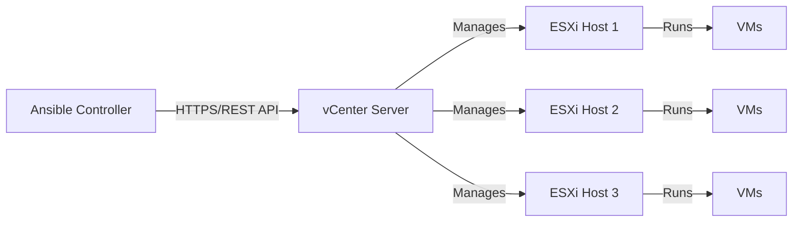

# How to Set Up Ansible for VMware vSphere Automation

Author: [nawazdhandala](https://www.github.com/nawazdhandala)

Tags: Ansible, VMware, vSphere, Automation, Infrastructure

Description: Complete guide to setting up Ansible for VMware vSphere automation including collection installation, authentication, and your first playbook.

---

If you manage a VMware vSphere environment, you know how tedious it gets clicking through the vSphere Client to provision VMs, configure networking, and manage storage. Ansible can automate all of this through the `community.vmware` collection, giving you reproducible infrastructure-as-code for your entire VMware estate. This guide covers everything from initial setup to running your first playbook against vCenter.

## Prerequisites

Before starting, you need:

- A vCenter Server instance (6.7 or later recommended)
- A vCenter user account with appropriate permissions
- Python 3.9 or later
- Ansible Core 2.14 or later

The VMware modules communicate with vCenter through the vSphere API, so you do not need to install any agents on your ESXi hosts or VMs.

## Installing Dependencies

The VMware modules require specific Python libraries to talk to the vSphere API. The most important one is `pyVmomi`, VMware's official Python SDK.

```bash
# Create a dedicated virtual environment for Ansible VMware work
python3 -m venv ~/ansible-vmware-env
source ~/ansible-vmware-env/bin/activate

# Install Ansible and the required Python libraries
pip install ansible-core pyVmomi requests pyvmomi

# Install the VMware community collection
ansible-galaxy collection install community.vmware

# Verify the collection is installed
ansible-galaxy collection list | grep vmware
```

You should see `community.vmware` in the output with its version number.

## Configuring vCenter Authentication

There are several ways to authenticate with vCenter. The most common approach uses environment variables or Ansible variables.

### Using Environment Variables

```bash
# Set vCenter connection details as environment variables
export VMWARE_HOST="vcenter.example.com"
export VMWARE_USER="administrator@vsphere.local"
export VMWARE_PASSWORD="your-vcenter-password"
export VMWARE_VALIDATE_CERTS="false"
```

### Using Ansible Variables (Recommended)

A better approach is to use Ansible Vault to store credentials securely.

```bash
# Create an encrypted vault file for VMware credentials
ansible-vault create group_vars/all/vmware_vault.yml
```

Add the following content when the editor opens:

```yaml
# group_vars/all/vmware_vault.yml (encrypted with ansible-vault)
vault_vcenter_hostname: "vcenter.example.com"
vault_vcenter_username: "administrator@vsphere.local"
vault_vcenter_password: "your-secure-password"
vault_vcenter_validate_certs: false
```

Then reference these in a regular variables file.

```yaml
# group_vars/all/vmware_vars.yml
vcenter_hostname: "{{ vault_vcenter_hostname }}"
vcenter_username: "{{ vault_vcenter_username }}"
vcenter_password: "{{ vault_vcenter_password }}"
vcenter_validate_certs: "{{ vault_vcenter_validate_certs }}"
```

## Project Structure

Organize your VMware automation project with a clear structure.

```
vmware-automation/
├── ansible.cfg
├── inventory/
│   └── hosts.yml
├── group_vars/
│   └── all/
│       ├── vmware_vars.yml
│       └── vmware_vault.yml
├── playbooks/
│   ├── gather-info.yml
│   ├── create-vm.yml
│   └── manage-snapshots.yml
└── roles/
    └── vmware-base/
        └── tasks/
            └── main.yml
```

## Ansible Configuration

Create an `ansible.cfg` file in your project root.

```ini
# ansible.cfg
[defaults]
inventory = inventory/hosts.yml
vault_password_file = ~/.vault_pass.txt
collections_paths = ./collections:~/.ansible/collections
host_key_checking = false
retry_files_enabled = false

[inventory]
enable_plugins = community.vmware.vmware_vm_inventory
```

## Inventory Setup

For VMware automation, you typically run playbooks against localhost since the modules connect to vCenter over the network rather than SSHing into hosts.

```yaml
# inventory/hosts.yml
all:
  hosts:
    localhost:
      ansible_connection: local
      ansible_python_interpreter: "{{ ansible_playbook_python }}"
```

## Your First Playbook: Gathering vSphere Information

Start with a simple playbook that gathers information from your vCenter. This validates your connection and authentication.

```yaml
# playbooks/gather-info.yml
---
- name: Gather VMware vSphere information
  hosts: localhost
  gather_facts: false

  vars:
    vcenter_hostname: "{{ vault_vcenter_hostname }}"
    vcenter_username: "{{ vault_vcenter_username }}"
    vcenter_password: "{{ vault_vcenter_password }}"

  tasks:
    - name: Gather information about all datacenters
      community.vmware.vmware_datacenter_info:
        hostname: "{{ vcenter_hostname }}"
        username: "{{ vcenter_username }}"
        password: "{{ vcenter_password }}"
        validate_certs: false
      register: datacenter_info

    - name: Display datacenter information
      ansible.builtin.debug:
        msg: "Datacenter: {{ item.name }}"
      loop: "{{ datacenter_info.datacenter_info }}"

    - name: Gather information about all clusters
      community.vmware.vmware_cluster_info:
        hostname: "{{ vcenter_hostname }}"
        username: "{{ vcenter_username }}"
        password: "{{ vcenter_password }}"
        validate_certs: false
      register: cluster_info

    - name: Display cluster information
      ansible.builtin.debug:
        msg: "Cluster: {{ item.key }} - Hosts: {{ item.value.hosts | length }}"
      loop: "{{ cluster_info.clusters | dict2items }}"

    - name: Gather information about all ESXi hosts
      community.vmware.vmware_host_info:
        hostname: "{{ vcenter_hostname }}"
        username: "{{ vcenter_username }}"
        password: "{{ vcenter_password }}"
        validate_certs: false
      register: host_info

    - name: Display ESXi host summary
      ansible.builtin.debug:
        msg: "Host: {{ item.key }} - Connection State: {{ item.value.connection_state }}"
      loop: "{{ host_info.hosts | dict2items }}"
```

Run it with:

```bash
# Run the information gathering playbook
ansible-playbook playbooks/gather-info.yml --ask-vault-pass
```

## Connection Architecture

Here is how Ansible communicates with VMware vSphere.



All communication goes through vCenter's API. Ansible never connects directly to ESXi hosts unless you explicitly configure it to (which is rare and generally not recommended).

## Creating a Reusable Role for VMware Defaults

To avoid repeating connection parameters in every task, create a role that sets common defaults.

```yaml
# roles/vmware-base/defaults/main.yml
vmware_hostname: "{{ vcenter_hostname }}"
vmware_username: "{{ vcenter_username }}"
vmware_password: "{{ vcenter_password }}"
vmware_validate_certs: false
vmware_datacenter: "DC01"
vmware_cluster: "Production"
```

```yaml
# roles/vmware-base/tasks/main.yml
---
- name: Verify vCenter connectivity
  community.vmware.vmware_about_info:
    hostname: "{{ vmware_hostname }}"
    username: "{{ vmware_username }}"
    password: "{{ vmware_password }}"
    validate_certs: "{{ vmware_validate_certs }}"
  register: vcenter_about

- name: Display vCenter version
  ansible.builtin.debug:
    msg: "Connected to vCenter {{ vcenter_about.about_info.version }} (Build {{ vcenter_about.about_info.build }})"
```

## Using Module Defaults to Reduce Repetition

Ansible 2.12 introduced `module_defaults` groups, which are perfect for VMware modules since they all share the same connection parameters.

```yaml
# playbooks/create-vm.yml
---
- name: Create virtual machine
  hosts: localhost
  gather_facts: false

  # Set default parameters for all VMware modules in this play
  module_defaults:
    group/community.vmware.vmware:
      hostname: "{{ vcenter_hostname }}"
      username: "{{ vcenter_username }}"
      password: "{{ vcenter_password }}"
      validate_certs: false

  tasks:
    # No need to repeat hostname, username, password in each task
    - name: Create a new virtual machine
      community.vmware.vmware_guest:
        name: "test-vm-01"
        datacenter: "DC01"
        cluster: "Production"
        folder: "/DC01/vm/Development"
        state: poweredon
        guest_id: centos8_64Guest
        disk:
          - size_gb: 50
            type: thin
            datastore: "datastore1"
        hardware:
          memory_mb: 4096
          num_cpus: 2
        networks:
          - name: "VM Network"
            ip: "192.168.1.100"
            netmask: "255.255.255.0"
            gateway: "192.168.1.1"
```

## Troubleshooting Common Issues

### SSL Certificate Errors

If you get SSL errors, the quickest fix is to disable certificate validation. For production, you should add the vCenter CA certificate to your trust store.

```bash
# Download the vCenter CA certificate
curl -k -o /tmp/vcenter-ca.crt https://vcenter.example.com/certs/download.zip

# Or disable validation in your playbook (not recommended for production)
# validate_certs: false
```

### Permission Errors

If modules fail with permission errors, check that your vCenter user has the required privileges. At minimum, you need:

- Virtual Machine > Interaction > Power On/Off
- Virtual Machine > Provisioning > Clone/Deploy
- Resource > Assign virtual machine to resource pool
- Datastore > Allocate space

### PyVmomi Version Compatibility

Some features require specific pyVmomi versions. If you hit unexpected errors, try updating.

```bash
# Upgrade pyVmomi to the latest version
pip install pyVmomi --upgrade

# Check installed version
python3 -c "import pyVim; print(pyVim.__version__)"
```

With this foundation in place, you can start automating your entire VMware infrastructure lifecycle. The community.vmware collection includes modules for managing VMs, networking, storage, clusters, and much more. The key is getting the authentication and project structure right from the start, which is exactly what this guide gives you.
