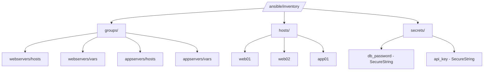

# How to Set Up Ansible Inventory with AWS SSM Parameters

Author: [nawazdhandala](https://www.github.com/nawazdhandala)

Tags: Ansible, AWS, SSM, Parameter Store, Dynamic Inventory

Description: Learn how to store and retrieve Ansible inventory data from AWS Systems Manager Parameter Store for centralized configuration management.

---

AWS Systems Manager (SSM) Parameter Store provides a centralized, encrypted store for configuration data and secrets. It is a natural place to keep Ansible inventory information, especially if your team already uses SSM for other application configuration. This post shows how to build Ansible inventory from SSM parameters and how to use SSM Session Manager as a connection method.

## Two Approaches to SSM + Ansible

There are two distinct ways to combine SSM with Ansible inventory:

1. **SSM Parameter Store as inventory data source**: Store host information in SSM parameters and pull them into a dynamic inventory script
2. **SSM Session Manager as connection plugin**: Use SSM to connect to EC2 instances instead of SSH, eliminating the need for open SSH ports

This post covers both approaches.

## Storing Inventory Data in SSM Parameters

First, organize your inventory data in SSM Parameter Store with a hierarchical path structure:

```bash
# Store group definitions
aws ssm put-parameter \
    --name "/ansible/inventory/groups/webservers/hosts" \
    --value '["web01","web02","web03"]' \
    --type String

aws ssm put-parameter \
    --name "/ansible/inventory/groups/webservers/vars" \
    --value '{"ansible_user":"deploy","http_port":80}' \
    --type String

aws ssm put-parameter \
    --name "/ansible/inventory/groups/appservers/hosts" \
    --value '["app01","app02"]' \
    --type String

aws ssm put-parameter \
    --name "/ansible/inventory/groups/appservers/vars" \
    --value '{"ansible_user":"appuser","app_port":8080}' \
    --type String

# Store host-specific variables
aws ssm put-parameter \
    --name "/ansible/inventory/hosts/web01" \
    --value '{"ansible_host":"10.0.1.10","rack":"A1"}' \
    --type String

aws ssm put-parameter \
    --name "/ansible/inventory/hosts/web02" \
    --value '{"ansible_host":"10.0.1.11","rack":"A2"}' \
    --type String

aws ssm put-parameter \
    --name "/ansible/inventory/hosts/web03" \
    --value '{"ansible_host":"10.0.1.12","rack":"B1"}' \
    --type String

# Store secrets with SecureString type (encrypted with KMS)
aws ssm put-parameter \
    --name "/ansible/inventory/secrets/db_password" \
    --value "super-secret-password" \
    --type SecureString
```

## Dynamic Inventory Script for SSM

Here is a Python script that reads the SSM parameter hierarchy and builds an Ansible inventory:

```python
#!/usr/bin/env python3
# ssm_inventory.py
# Dynamic inventory that reads from AWS SSM Parameter Store

import json
import sys
import os
import boto3

SSM_PREFIX = os.environ.get('SSM_INVENTORY_PREFIX', '/ansible/inventory')
AWS_REGION = os.environ.get('AWS_REGION', 'us-east-1')

def get_ssm_client():
    """Create an SSM client."""
    return boto3.client('ssm', region_name=AWS_REGION)

def get_parameters_by_path(path):
    """Get all parameters under a path."""
    ssm = get_ssm_client()
    params = {}
    paginator = ssm.get_paginator('get_parameters_by_path')

    for page in paginator.paginate(
        Path=path,
        Recursive=True,
        WithDecryption=True,
    ):
        for param in page['Parameters']:
            # Extract the relative path
            relative_key = param['Name'][len(path):].lstrip('/')
            params[relative_key] = param['Value']

    return params

def build_inventory():
    """Build Ansible inventory from SSM parameters."""
    # Get all group definitions
    group_params = get_parameters_by_path(f'{SSM_PREFIX}/groups')
    # Get all host variables
    host_params = get_parameters_by_path(f'{SSM_PREFIX}/hosts')

    inventory = {}
    hostvars = {}

    # Parse group parameters
    # Keys look like: webservers/hosts, webservers/vars
    groups = {}
    for key, value in group_params.items():
        parts = key.split('/')
        if len(parts) == 2:
            group_name, param_type = parts
            if group_name not in groups:
                groups[group_name] = {'hosts': [], 'vars': {}}

            if param_type == 'hosts':
                groups[group_name]['hosts'] = json.loads(value)
            elif param_type == 'vars':
                groups[group_name]['vars'] = json.loads(value)

    inventory.update(groups)

    # Parse host parameters
    # Keys look like: web01, web02
    for key, value in host_params.items():
        hostname = key.split('/')[0]
        try:
            hostvars[hostname] = json.loads(value)
        except json.JSONDecodeError:
            hostvars[hostname] = {'raw_value': value}

    inventory['_meta'] = {'hostvars': hostvars}
    return inventory

if __name__ == '__main__':
    if '--host' in sys.argv:
        hostname = sys.argv[2]
        ssm = get_ssm_client()
        try:
            response = ssm.get_parameter(
                Name=f'{SSM_PREFIX}/hosts/{hostname}',
                WithDecryption=True,
            )
            print(json.dumps(json.loads(response['Parameter']['Value']), indent=2))
        except ssm.exceptions.ParameterNotFound:
            print(json.dumps({}))
    else:
        print(json.dumps(build_inventory(), indent=2))
```

```bash
# Make executable and test
chmod +x ssm_inventory.py
export AWS_REGION=us-east-1

./ssm_inventory.py --list | python3 -m json.tool
ansible -i ssm_inventory.py webservers -m ping
```

## SSM Parameter Store Hierarchy

Here is the structure in Parameter Store:



## Using SSM Session Manager as Connection Plugin

SSM Session Manager lets Ansible connect to EC2 instances without SSH. No open ports, no SSH keys to manage, no bastion hosts.

Install the required collection:

```bash
# Install the community.aws collection
ansible-galaxy collection install community.aws

# Install the Session Manager plugin for AWS CLI
# On macOS
brew install session-manager-plugin

# On Linux (Debian/Ubuntu)
curl "https://s3.amazonaws.com/session-manager-downloads/plugin/latest/ubuntu_64bit/session-manager-plugin.deb" -o "session-manager-plugin.deb"
sudo dpkg -i session-manager-plugin.deb
```

Configure your inventory to use the SSM connection:

```yaml
# inventory/ssm_hosts.yml
all:
  children:
    webservers:
      hosts:
        i-0abc123def456:
          ansible_host: i-0abc123def456
        i-0abc123def789:
          ansible_host: i-0abc123def789
      vars:
        # Use SSM Session Manager instead of SSH
        ansible_connection: community.aws.aws_ssm
        ansible_aws_ssm_region: us-east-1
        ansible_aws_ssm_bucket_name: my-ansible-ssm-bucket
```

The `ansible_host` value is the EC2 instance ID when using SSM, not the IP address.

## Combining SSM Inventory with SSM Connection

Use the AWS EC2 plugin to discover instances and SSM for connections:

```yaml
# inventory/aws_ssm_ec2.yml
plugin: amazon.aws.aws_ec2
regions:
  - us-east-1

filters:
  instance-state-name: running
  "tag:ManagedBy": ansible

keyed_groups:
  - key: tags.Role | default('untagged')
    prefix: role
    separator: "_"

compose:
  # Use instance ID as the host identifier for SSM connections
  ansible_host: instance_id
  # Use SSM connection instead of SSH
  ansible_connection: "'community.aws.aws_ssm'"
  ansible_aws_ssm_region: "'us-east-1'"
  ansible_aws_ssm_bucket_name: "'my-ansible-ssm-bucket'"
```

The EC2 plugin discovers instances and the SSM connection plugin handles the communication. No SSH ports needed.

## Pulling Secrets from SSM in Playbooks

Even if you do not use SSM for the full inventory, you can pull individual secrets during playbook execution:

```yaml
# playbooks/deploy.yml
- hosts: webservers
  tasks:
    - name: Get database password from SSM
      amazon.aws.ssm_parameter:
        name: "/ansible/inventory/secrets/db_password"
        region: us-east-1
        decrypt: true
      register: db_password_param
      delegate_to: localhost

    - name: Configure application with database credentials
      ansible.builtin.template:
        src: app-config.yml.j2
        dest: /opt/app/config.yml
      vars:
        db_password: "{{ db_password_param.parameter.value }}"
```

Or use the `aws_ssm` lookup plugin directly:

```yaml
- hosts: webservers
  vars:
    # Pull secrets at runtime using the lookup plugin
    db_password: "{{ lookup('amazon.aws.ssm_parameter', '/ansible/inventory/secrets/db_password', region='us-east-1', decrypt=true) }}"
  tasks:
    - name: Deploy configuration
      ansible.builtin.template:
        src: app-config.yml.j2
        dest: /opt/app/config.yml
```

## IAM Permissions

Your Ansible control node needs the right IAM permissions to read SSM parameters:

```json
{
    "Version": "2012-10-17",
    "Statement": [
        {
            "Effect": "Allow",
            "Action": [
                "ssm:GetParameter",
                "ssm:GetParameters",
                "ssm:GetParametersByPath"
            ],
            "Resource": "arn:aws:ssm:us-east-1:123456789012:parameter/ansible/inventory/*"
        },
        {
            "Effect": "Allow",
            "Action": [
                "kms:Decrypt"
            ],
            "Resource": "arn:aws:kms:us-east-1:123456789012:key/your-kms-key-id"
        }
    ]
}
```

For SSM Session Manager connections, add:

```json
{
    "Effect": "Allow",
    "Action": [
        "ssm:StartSession",
        "ssm:TerminateSession",
        "ssm:ResumeSession",
        "ssm:DescribeSessions"
    ],
    "Resource": [
        "arn:aws:ec2:us-east-1:123456789012:instance/*",
        "arn:aws:ssm:us-east-1:123456789012:document/AWS-StartSSHSession"
    ]
}
```

## Managing Inventory Updates Through SSM

Update inventory by updating SSM parameters:

```bash
# Add a new host to the webservers group
# First, get the current hosts list
CURRENT=$(aws ssm get-parameter --name "/ansible/inventory/groups/webservers/hosts" --query "Parameter.Value" --output text)

# Add the new host (using jq to manipulate JSON)
NEW=$(echo "$CURRENT" | jq '. + ["web04"]')

# Update the parameter
aws ssm put-parameter \
    --name "/ansible/inventory/groups/webservers/hosts" \
    --value "$NEW" \
    --type String \
    --overwrite

# Add the new host's variables
aws ssm put-parameter \
    --name "/ansible/inventory/hosts/web04" \
    --value '{"ansible_host":"10.0.1.13","rack":"B2"}' \
    --type String
```

Using SSM Parameter Store for Ansible inventory works well in AWS-centric environments where you want a centralized, encrypted, auditable store for infrastructure configuration. The SSM Session Manager connection plugin is a separate but complementary feature that eliminates the need for SSH entirely. Together, they provide a fully AWS-native way to manage and connect to your infrastructure with Ansible.
