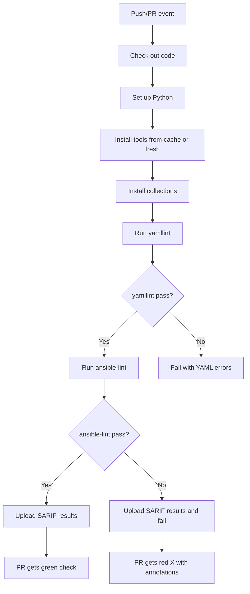

# How to Set Up ansible-lint in GitHub Actions

Author: [nawazdhandala](https://www.github.com/nawazdhandala)

Tags: Ansible, ansible-lint, GitHub Actions, CI/CD

Description: Configure GitHub Actions to run ansible-lint on every push and pull request with caching, collection dependencies, and SARIF reporting.

---

Running ansible-lint in CI ensures that every change to your Ansible codebase meets your team's quality standards. GitHub Actions is a natural choice for this since it integrates directly with your repository and provides feedback on pull requests. In this post, we will build a complete GitHub Actions workflow for ansible-lint, from a basic setup to an advanced configuration with caching, collection dependencies, and SARIF reporting.

## Basic Workflow

Start with a simple workflow that installs ansible-lint and runs it:

```yaml
# .github/workflows/ansible-lint.yml - Basic ansible-lint workflow
---
name: Ansible Lint

on:
  push:
    branches: [main, master]
  pull_request:
    branches: [main, master]

jobs:
  lint:
    name: Run ansible-lint
    runs-on: ubuntu-latest
    steps:
      - name: Check out repository
        uses: actions/checkout@v4

      - name: Set up Python
        uses: actions/setup-python@v5
        with:
          python-version: "3.12"

      - name: Install ansible-lint
        run: pip install ansible-lint

      - name: Run ansible-lint
        run: ansible-lint
```

This workflow triggers on every push to main and on every pull request. It checks out the code, installs ansible-lint, and runs it against the entire repository.

## Adding Collection Dependencies

Most Ansible projects depend on collections. Install them before running the linter:

```yaml
# .github/workflows/ansible-lint.yml - With collection dependencies
---
name: Ansible Lint

on:
  push:
    branches: [main, master]
  pull_request:
    branches: [main, master]

jobs:
  lint:
    name: Run ansible-lint
    runs-on: ubuntu-latest
    steps:
      - name: Check out repository
        uses: actions/checkout@v4

      - name: Set up Python
        uses: actions/setup-python@v5
        with:
          python-version: "3.12"

      - name: Install ansible-lint and dependencies
        run: |
          pip install ansible-lint
          pip install ansible-core

      - name: Install Ansible collections
        run: |
          ansible-galaxy collection install -r collections/requirements.yml
        if: hashFiles('collections/requirements.yml') != ''

      - name: Run ansible-lint
        run: ansible-lint
```

Make sure you have a `collections/requirements.yml` in your repository:

```yaml
# collections/requirements.yml - Required collections
---
collections:
  - name: ansible.posix
    version: ">=1.5.0"
  - name: community.general
    version: ">=8.0.0"
  - name: community.docker
    version: ">=3.0.0"
```

## Adding Caching for Faster Runs

Installing Python packages and Ansible collections on every run is slow. Use caching to speed things up:

```yaml
# .github/workflows/ansible-lint.yml - With caching
---
name: Ansible Lint

on:
  push:
    branches: [main, master]
  pull_request:
    branches: [main, master]

jobs:
  lint:
    name: Run ansible-lint
    runs-on: ubuntu-latest
    steps:
      - name: Check out repository
        uses: actions/checkout@v4

      - name: Set up Python with pip cache
        uses: actions/setup-python@v5
        with:
          python-version: "3.12"
          cache: "pip"

      - name: Cache Ansible collections
        uses: actions/cache@v4
        with:
          path: ~/.ansible/collections
          key: collections-${{ hashFiles('collections/requirements.yml') }}
          restore-keys: |
            collections-

      - name: Install ansible-lint
        run: pip install ansible-lint

      - name: Install Ansible collections
        run: ansible-galaxy collection install -r collections/requirements.yml
        if: hashFiles('collections/requirements.yml') != ''

      - name: Run ansible-lint
        run: ansible-lint
```

## Running yamllint and ansible-lint Together

For comprehensive linting, run yamllint first to catch YAML syntax issues, then ansible-lint:

```yaml
# .github/workflows/lint.yml - Combined YAML and Ansible linting
---
name: Lint

on:
  push:
    branches: [main, master]
  pull_request:
    branches: [main, master]

jobs:
  yamllint:
    name: YAML Lint
    runs-on: ubuntu-latest
    steps:
      - name: Check out repository
        uses: actions/checkout@v4

      - name: Set up Python
        uses: actions/setup-python@v5
        with:
          python-version: "3.12"
          cache: "pip"

      - name: Install yamllint
        run: pip install yamllint

      - name: Run yamllint
        run: yamllint -c .yamllint.yml .

  ansible-lint:
    name: Ansible Lint
    runs-on: ubuntu-latest
    needs: yamllint
    steps:
      - name: Check out repository
        uses: actions/checkout@v4

      - name: Set up Python
        uses: actions/setup-python@v5
        with:
          python-version: "3.12"
          cache: "pip"

      - name: Install ansible-lint
        run: pip install ansible-lint

      - name: Install Ansible collections
        run: ansible-galaxy collection install -r collections/requirements.yml
        if: hashFiles('collections/requirements.yml') != ''

      - name: Run ansible-lint
        run: ansible-lint
```

The `needs: yamllint` directive ensures ansible-lint only runs after yamllint passes.

## SARIF Reporting for GitHub Code Scanning

ansible-lint can output results in SARIF format, which integrates with GitHub's code scanning feature. This shows lint findings directly in pull request file diffs.

```yaml
# .github/workflows/ansible-lint-sarif.yml - With SARIF reporting
---
name: Ansible Lint with Code Scanning

on:
  push:
    branches: [main, master]
  pull_request:
    branches: [main, master]

permissions:
  contents: read
  security-events: write

jobs:
  lint:
    name: Run ansible-lint
    runs-on: ubuntu-latest
    steps:
      - name: Check out repository
        uses: actions/checkout@v4

      - name: Set up Python
        uses: actions/setup-python@v5
        with:
          python-version: "3.12"
          cache: "pip"

      - name: Install ansible-lint
        run: pip install ansible-lint

      - name: Run ansible-lint with SARIF output
        run: ansible-lint --sarif-file ansible-lint-results.sarif || true
        continue-on-error: true

      - name: Upload SARIF results
        uses: github/codeql-action/upload-sarif@v3
        with:
          sarif_file: ansible-lint-results.sarif
        if: always()
```

The `continue-on-error: true` ensures the SARIF file gets uploaded even when ansible-lint finds violations.

## Pull Request Annotations

For inline annotations on pull requests without SARIF, use the parseable output format and a problem matcher:

```yaml
# .github/workflows/ansible-lint.yml - With PR annotations
---
name: Ansible Lint

on:
  pull_request:
    branches: [main, master]

jobs:
  lint:
    name: Run ansible-lint
    runs-on: ubuntu-latest
    steps:
      - name: Check out repository
        uses: actions/checkout@v4

      - name: Set up Python
        uses: actions/setup-python@v5
        with:
          python-version: "3.12"
          cache: "pip"

      - name: Install ansible-lint
        run: pip install ansible-lint

      - name: Run ansible-lint
        run: ansible-lint -f pep8
        env:
          ANSIBLE_FORCE_COLOR: "false"
```

## Only Lint Changed Files

For large repositories, linting only the files changed in a PR saves time:

```yaml
# .github/workflows/ansible-lint-changed.yml - Lint only changed files
---
name: Ansible Lint (Changed Files)

on:
  pull_request:
    branches: [main, master]

jobs:
  lint:
    name: Lint changed Ansible files
    runs-on: ubuntu-latest
    steps:
      - name: Check out repository
        uses: actions/checkout@v4
        with:
          fetch-depth: 0

      - name: Get changed YAML files
        id: changed-files
        uses: tj-actions/changed-files@v44
        with:
          files: |
            **/*.yml
            **/*.yaml
          files_ignore: |
            .github/**
            docker-compose*.yml

      - name: Set up Python
        uses: actions/setup-python@v5
        with:
          python-version: "3.12"
          cache: "pip"
        if: steps.changed-files.outputs.any_changed == 'true'

      - name: Install ansible-lint
        run: pip install ansible-lint
        if: steps.changed-files.outputs.any_changed == 'true'

      - name: Run ansible-lint on changed files
        run: |
          ansible-lint ${{ steps.changed-files.outputs.all_changed_files }}
        if: steps.changed-files.outputs.any_changed == 'true'
```

## Workflow Diagram

Here is how the CI pipeline flows:



## Branch Protection

After setting up the workflow, configure branch protection to require ansible-lint to pass:

1. Go to your repository's Settings
2. Navigate to Branches
3. Add or edit a branch protection rule for `main`
4. Under "Require status checks to pass before merging", search for your ansible-lint job name
5. Enable it

Now no one can merge a PR that fails linting.

Setting up ansible-lint in GitHub Actions is a one-time effort that protects your codebase forever. Start with the basic workflow, add caching to speed things up, and consider SARIF reporting for the best developer experience on pull requests.
