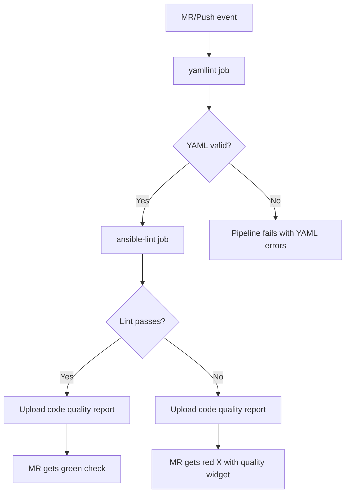

# How to Set Up ansible-lint in GitLab CI

Author: [nawazdhandala](https://www.github.com/nawazdhandala)

Tags: Ansible, ansible-lint, GitLab CI, CI/CD

Description: Configure GitLab CI/CD pipelines to run ansible-lint with caching, collection dependencies, merge request integration, and code quality reports.

---

If your Ansible code lives in GitLab, you should be running ansible-lint in your CI/CD pipeline. GitLab CI has some features that make this particularly nice, including built-in code quality reporting, merge request widgets, and artifact management. This post shows you how to set up ansible-lint in GitLab CI from scratch, with progressively more advanced configurations.

## Basic Pipeline

Create a `.gitlab-ci.yml` file in your repository root:

```yaml
# .gitlab-ci.yml - Basic ansible-lint pipeline
---
stages:
  - lint

ansible-lint:
  stage: lint
  image: python:3.12-slim
  before_script:
    - pip install ansible-lint
  script:
    - ansible-lint
  rules:
    - if: $CI_PIPELINE_SOURCE == "merge_request_event"
    - if: $CI_COMMIT_BRANCH == $CI_DEFAULT_BRANCH
```

This runs ansible-lint on every merge request and every push to the default branch.

## Adding Collection Dependencies

Most projects need Ansible collections installed before linting:

```yaml
# .gitlab-ci.yml - With collection dependencies
---
stages:
  - lint

variables:
  PIP_CACHE_DIR: "$CI_PROJECT_DIR/.pip-cache"

ansible-lint:
  stage: lint
  image: python:3.12-slim
  cache:
    key: pip-cache
    paths:
      - .pip-cache/
  before_script:
    - pip install ansible-lint ansible-core
    - |
      if [ -f collections/requirements.yml ]; then
        ansible-galaxy collection install -r collections/requirements.yml
      fi
  script:
    - ansible-lint
  rules:
    - if: $CI_PIPELINE_SOURCE == "merge_request_event"
    - if: $CI_COMMIT_BRANCH == $CI_DEFAULT_BRANCH
```

## Advanced Pipeline with yamllint

Run both yamllint and ansible-lint in separate jobs for clear feedback:

```yaml
# .gitlab-ci.yml - Combined YAML and Ansible linting
---
stages:
  - yaml-lint
  - ansible-lint

variables:
  PIP_CACHE_DIR: "$CI_PROJECT_DIR/.pip-cache"

.python_setup: &python_setup
  image: python:3.12-slim
  cache:
    key: pip-${CI_JOB_NAME}
    paths:
      - .pip-cache/

yamllint:
  <<: *python_setup
  stage: yaml-lint
  before_script:
    - pip install yamllint
  script:
    - yamllint -c .yamllint.yml .
  rules:
    - if: $CI_PIPELINE_SOURCE == "merge_request_event"
    - if: $CI_COMMIT_BRANCH == $CI_DEFAULT_BRANCH

ansible-lint:
  <<: *python_setup
  stage: ansible-lint
  needs:
    - yamllint
  before_script:
    - pip install ansible-lint
    - |
      if [ -f collections/requirements.yml ]; then
        ansible-galaxy collection install -r collections/requirements.yml
      fi
  script:
    - ansible-lint
  rules:
    - if: $CI_PIPELINE_SOURCE == "merge_request_event"
    - if: $CI_COMMIT_BRANCH == $CI_DEFAULT_BRANCH
```

The `needs: [yamllint]` directive makes ansible-lint wait for yamllint to pass first.

## Caching Ansible Collections

Collections can be large and slow to download. Cache them between pipeline runs:

```yaml
# .gitlab-ci.yml - With comprehensive caching
---
stages:
  - lint

variables:
  PIP_CACHE_DIR: "$CI_PROJECT_DIR/.pip-cache"
  ANSIBLE_COLLECTIONS_PATH: "$CI_PROJECT_DIR/.collections"

ansible-lint:
  stage: lint
  image: python:3.12-slim
  cache:
    - key: pip-cache-v1
      paths:
        - .pip-cache/
    - key:
        files:
          - collections/requirements.yml
        prefix: collections
      paths:
        - .collections/
  before_script:
    - pip install ansible-lint
    - mkdir -p "$ANSIBLE_COLLECTIONS_PATH"
    - |
      if [ -f collections/requirements.yml ]; then
        ansible-galaxy collection install \
          -r collections/requirements.yml \
          -p "$ANSIBLE_COLLECTIONS_PATH"
      fi
  script:
    - ansible-lint
  rules:
    - if: $CI_PIPELINE_SOURCE == "merge_request_event"
    - if: $CI_COMMIT_BRANCH == $CI_DEFAULT_BRANCH
```

The collection cache key is based on the `requirements.yml` file hash. When you update collection versions, the cache automatically invalidates.

## Code Quality Report

GitLab can display code quality reports in merge request widgets. ansible-lint can output in the CodeClimate format that GitLab understands:

```yaml
# .gitlab-ci.yml - With Code Quality report
---
stages:
  - lint

ansible-lint:
  stage: lint
  image: python:3.12-slim
  before_script:
    - pip install ansible-lint
    - |
      if [ -f collections/requirements.yml ]; then
        ansible-galaxy collection install -r collections/requirements.yml
      fi
  script:
    - ansible-lint -f codeclimate > ansible-lint-report.json || true
    - ansible-lint
  artifacts:
    reports:
      codequality: ansible-lint-report.json
    when: always
    expire_in: 1 week
  rules:
    - if: $CI_PIPELINE_SOURCE == "merge_request_event"
    - if: $CI_COMMIT_BRANCH == $CI_DEFAULT_BRANCH
```

The trick here is running ansible-lint twice: once with `-f codeclimate` to generate the report (with `|| true` to not fail on violations), and once normally to actually fail the pipeline if there are errors. The `when: always` on artifacts ensures the report is uploaded even if the job fails.

## JUnit Report for Test Tab

GitLab can also display results in the merge request's Test tab using JUnit format:

```yaml
# .gitlab-ci.yml - With JUnit report
---
ansible-lint:
  stage: lint
  image: python:3.12-slim
  before_script:
    - pip install ansible-lint
  script:
    - ansible-lint --parseable > lint-output.txt 2>&1; echo $? > exit-code.txt
    - |
      python3 -c "
      import xml.etree.ElementTree as ET
      import sys

      root = ET.Element('testsuite', name='ansible-lint', tests='0', failures='0')
      failures = 0
      tests = 0

      with open('lint-output.txt') as f:
          for line in f:
              line = line.strip()
              if ':' in line and not line.startswith('WARNING') and not line.startswith('Finished'):
                  tests += 1
                  tc = ET.SubElement(root, 'testcase', name=line[:80], classname='ansible-lint')
                  fail = ET.SubElement(tc, 'failure', message=line)
                  failures += 1

      root.set('tests', str(max(tests, 1)))
      root.set('failures', str(failures))

      if tests == 0:
          tc = ET.SubElement(root, 'testcase', name='ansible-lint', classname='ansible-lint')

      tree = ET.ElementTree(root)
      tree.write('junit-report.xml', xml_declaration=True, encoding='utf-8')
      "
    - exit $(cat exit-code.txt)
  artifacts:
    reports:
      junit: junit-report.xml
    when: always
  rules:
    - if: $CI_PIPELINE_SOURCE == "merge_request_event"
```

## Using a Custom Docker Image

For faster pipeline runs, build a custom Docker image with all dependencies pre-installed:

```dockerfile
# Dockerfile.lint - Custom linting image
FROM python:3.12-slim

RUN pip install --no-cache-dir \
    ansible-lint \
    ansible-core \
    yamllint

# Pre-install common collections
RUN ansible-galaxy collection install \
    ansible.posix \
    community.general \
    community.docker

ENTRYPOINT ["ansible-lint"]
```

Build and push the image to your GitLab container registry:

```bash
docker build -t registry.gitlab.com/myorg/ansible-lint-image:latest -f Dockerfile.lint .
docker push registry.gitlab.com/myorg/ansible-lint-image:latest
```

Use it in your pipeline:

```yaml
# .gitlab-ci.yml - Using custom image
---
ansible-lint:
  stage: lint
  image: registry.gitlab.com/myorg/ansible-lint-image:latest
  script:
    - ansible-lint
  rules:
    - if: $CI_PIPELINE_SOURCE == "merge_request_event"
    - if: $CI_COMMIT_BRANCH == $CI_DEFAULT_BRANCH
```

## Only Lint Changed Files

For large repositories, lint only the files that changed in the merge request:

```yaml
# .gitlab-ci.yml - Lint only changed files
---
ansible-lint-changes:
  stage: lint
  image: python:3.12-slim
  before_script:
    - pip install ansible-lint
    - apt-get update && apt-get install -y git
  script:
    - |
      CHANGED_FILES=$(git diff --name-only --diff-filter=ACMR \
        origin/$CI_MERGE_REQUEST_TARGET_BRANCH_NAME...HEAD \
        -- '*.yml' '*.yaml' \
        | grep -v '.github/' \
        | grep -v 'docker-compose' || true)

      if [ -n "$CHANGED_FILES" ]; then
        echo "Linting changed files:"
        echo "$CHANGED_FILES"
        echo "$CHANGED_FILES" | xargs ansible-lint
      else
        echo "No Ansible files changed, skipping lint"
      fi
  rules:
    - if: $CI_PIPELINE_SOURCE == "merge_request_event"
```

## Pipeline Flow Diagram



## Merge Request Settings

After setting up the pipeline, configure your GitLab project to require the lint job to pass:

1. Go to Settings > Merge Requests
2. Under "Merge checks", enable "Pipelines must succeed"
3. Optionally, go to Settings > CI/CD > General pipelines and set "Required pipeline configuration"

This prevents anyone from merging code that fails linting.

Setting up ansible-lint in GitLab CI gives your team confidence that every merge request meets your code quality standards. Start with the basic pipeline, add caching for speed, and enable the code quality report for the best merge request experience.
