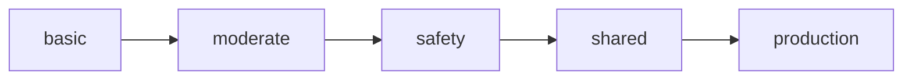

# How to Set Up Ansible Linting with ansible-lint in CI

Author: [nawazdhandala](https://www.github.com/nawazdhandala)

Tags: Ansible, Linting, CI/CD, Code Quality, DevOps

Description: Configure ansible-lint in your CI/CD pipeline to catch playbook errors, enforce best practices, and maintain consistent Ansible code quality.

---

ansible-lint is the standard linting tool for Ansible. It catches common mistakes, enforces best practices, and helps maintain code consistency across your team. Running it in CI ensures that every merge request gets checked before bad playbooks make it to production. It catches things like deprecated modules, missing task names, incorrect YAML formatting, and risky file permissions.

This guide covers installing and configuring ansible-lint, setting up rules, and integrating it into various CI/CD platforms.

## Installing ansible-lint

```bash
# Install the latest version
pip install ansible-lint

# Or pin to a specific version for consistency
pip install ansible-lint==6.22.0

# Verify installation
ansible-lint --version
```

## Basic Configuration

ansible-lint uses a `.ansible-lint` configuration file in your project root.

```yaml
# .ansible-lint
---
# Exclude paths from linting
exclude_paths:
  - .cache/
  - .github/
  - tests/
  - molecule/

# Enable specific profiles (basic, moderate, safety, shared, production)
profile: moderate

# Skip specific rules
skip_list:
  - yaml[line-length]  # Allow long lines in some cases
  - name[casing]       # Allow flexible task naming

# Warn instead of fail on these rules
warn_list:
  - experimental
  - role-name

# Enable specific rules that are off by default
enable_list:
  - no-same-owner

# Set the project directory
project_dir: .

# Use specific parseable output format for CI
parseable: true

# Set severity for mock errors
mock_modules:
  - custom_module
mock_roles:
  - custom_role
```

## Running Locally

Before setting up CI, run ansible-lint locally to understand what it catches.

```bash
# Lint all playbooks in the current directory
ansible-lint

# Lint a specific playbook
ansible-lint playbooks/site.yml

# Lint with a specific profile
ansible-lint -p production playbooks/

# Show all available rules
ansible-lint -L

# Show detailed rule descriptions
ansible-lint -R

# Auto-fix issues that have automatic fixes
ansible-lint --fix playbooks/
```

## Common Rules and How to Fix Them

Here are the rules you will encounter most often and how to fix them.

```yaml
# RULE: name[missing] - All tasks should have a name
# BAD
- apt:
    name: nginx
    state: present

# GOOD
- name: Install nginx
  apt:
    name: nginx
    state: present
```

```yaml
# RULE: yaml[truthy] - Use true/false instead of yes/no
# BAD
- name: Start nginx
  service:
    name: nginx
    enabled: yes
    state: started

# GOOD
- name: Start nginx
  service:
    name: nginx
    enabled: true
    state: started
```

```yaml
# RULE: no-changed-when - Commands that could change state should have changed_when
# BAD
- name: Run database migration
  command: python manage.py migrate

# GOOD
- name: Run database migration
  command: python manage.py migrate
  changed_when: "'No migrations to apply' not in migration_result.stdout"
  register: migration_result
```

```yaml
# RULE: risky-file-permissions - Files should have explicit permissions
# BAD
- name: Create config file
  copy:
    src: app.conf
    dest: /etc/app/config.yml

# GOOD
- name: Create config file
  copy:
    src: app.conf
    dest: /etc/app/config.yml
    mode: '0644'
```

```yaml
# RULE: fqcn[action-core] - Use fully qualified collection names
# BAD
- name: Install package
  apt:
    name: nginx

# GOOD
- name: Install package
  ansible.builtin.apt:
    name: nginx
```

## GitHub Actions Integration

```yaml
# .github/workflows/lint.yml
name: Ansible Lint

on:
  pull_request:
    paths:
      - '**.yml'
      - '**.yaml'
      - 'roles/**'
      - 'playbooks/**'

jobs:
  lint:
    runs-on: ubuntu-latest

    steps:
      - uses: actions/checkout@v4

      - name: Set up Python
        uses: actions/setup-python@v5
        with:
          python-version: '3.11'

      - name: Install ansible-lint
        run: pip install ansible-lint==6.22.0

      # Install collections if your playbooks use them
      - name: Install Ansible collections
        run: |
          if [ -f requirements.yml ]; then
            ansible-galaxy collection install -r requirements.yml
          fi

      - name: Run ansible-lint
        run: ansible-lint --force-color

      # Optionally upload results as a check annotation
      - name: Run ansible-lint with SARIF output
        if: always()
        run: ansible-lint -f sarif > ansible-lint-results.sarif || true

      - name: Upload SARIF file
        if: always()
        uses: github/codeql-action/upload-sarif@v3
        with:
          sarif_file: ansible-lint-results.sarif
```

The SARIF upload creates inline annotations on your pull request, showing lint issues directly on the changed lines.

## GitLab CI Integration

```yaml
# .gitlab-ci.yml
ansible-lint:
  stage: validate
  image: python:3.11-slim
  script:
    - pip install ansible-lint==6.22.0
    - ansible-lint --force-color
  rules:
    - if: $CI_PIPELINE_SOURCE == "merge_request_event"
      changes:
        - "**/*.yml"
        - "**/*.yaml"
        - "roles/**/*"
    - if: $CI_COMMIT_BRANCH == "main"

  # Optional: Generate a code quality report for GitLab
  after_script:
    - ansible-lint -f codeclimate > gl-code-quality-report.json || true
  artifacts:
    reports:
      codequality: gl-code-quality-report.json
    when: always
```

## Jenkins Integration

```groovy
// Jenkinsfile
pipeline {
    agent any

    stages {
        stage('Lint Ansible') {
            steps {
                sh '''
                    pip install ansible-lint==6.22.0
                    ansible-lint --force-color || {
                        echo "ansible-lint found issues!"
                        exit 1
                    }
                '''
            }
        }
    }

    post {
        failure {
            echo 'Ansible lint check failed. Please fix lint issues before merging.'
        }
    }
}
```

## Pre-Commit Hook

Run ansible-lint before code is even committed using pre-commit.

```yaml
# .pre-commit-config.yaml
repos:
  - repo: https://github.com/ansible/ansible-lint
    rev: v6.22.0
    hooks:
      - id: ansible-lint
        additional_dependencies:
          - ansible==8.7.0
```

Install and set up pre-commit.

```bash
pip install pre-commit
pre-commit install
```

## Lint Profiles

ansible-lint has built-in profiles that bundle rules by strictness level.

```yaml
# .ansible-lint - Choose a profile
---
# basic: Essential rules only
# moderate: Best practices (recommended starting point)
# safety: Rules that prevent security issues
# shared: Rules for shared/reusable content
# production: Strictest set, all rules enabled
profile: moderate
```

The profiles build on each other:



## Custom Rules

If your team has specific standards, write custom lint rules.

```python
# custom_rules/check_tags.py
from ansiblelint.rules import AnsibleLintRule


class TaskMustHaveTagsRule(AnsibleLintRule):
    """All tasks must have at least one tag."""
    id = 'custom-tags-required'
    shortdesc = 'Tasks must have tags'
    description = 'All tasks should have at least one tag for selective execution.'
    severity = 'MEDIUM'
    tags = ['custom', 'tags']

    def matchtask(self, task, file=None):
        if not task.get('tags'):
            return True
        return False
```

Reference custom rules in your config.

```yaml
# .ansible-lint
rulesdir:
  - custom_rules/
```

## Gradual Adoption

If you have a large existing codebase, enable ansible-lint gradually.

```yaml
# .ansible-lint - Start permissive, tighten over time
---
profile: basic  # Start with basic, move to moderate, then production

# Skip problematic rules initially
skip_list:
  - fqcn[action-core]
  - name[missing]
  - yaml[truthy]

# Only lint new/changed playbooks initially
exclude_paths:
  - legacy/
  - old_playbooks/
```

## Tips for ansible-lint in CI

1. Pin the ansible-lint version in CI to avoid surprise failures when new rules are added.
2. Start with the `moderate` profile and gradually move to `production` as you fix existing issues.
3. Use the `--fix` flag locally to auto-fix issues before pushing.
4. The SARIF output format integrates with GitHub's code scanning, giving you inline PR annotations.
5. Run ansible-lint on pull requests, not just on the main branch. Catch issues before they are merged.
6. Add `ansible-lint` to your pre-commit hooks so developers catch issues before pushing.

ansible-lint is one of the lowest-effort, highest-value tools you can add to your Ansible CI/CD pipeline. It catches real bugs, enforces consistency, and educates your team about best practices through its clear rule descriptions.
