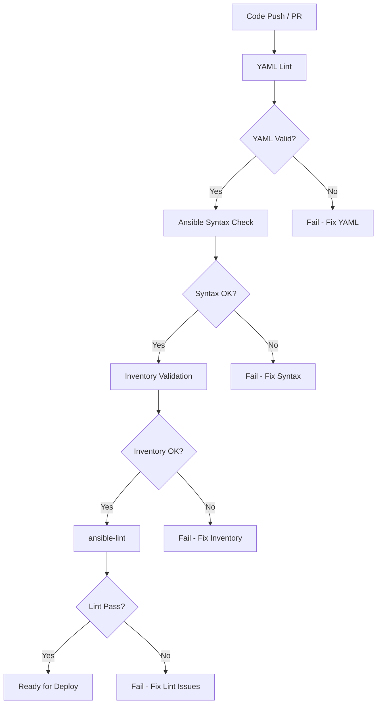

# How to Set Up Ansible Syntax Checking in CI

Author: [nawazdhandala](https://www.github.com/nawazdhandala)

Tags: Ansible, CI/CD, Syntax Checking, Code Quality

Description: Configure Ansible syntax checking in CI/CD pipelines to catch YAML errors, undefined variables, and module issues before deployment.

---

Syntax checking is the absolute minimum validation you should run on Ansible playbooks in CI. It catches YAML parsing errors, undefined variables, invalid module parameters, and other structural problems that would cause your playbook to fail at runtime. Unlike linting (which checks for best practices), syntax checking verifies that your playbook can actually be parsed and loaded by Ansible.

This guide covers the different levels of syntax checking available for Ansible and how to integrate them into your CI/CD pipeline.

## Ansible's Built-in Syntax Check

Ansible has a `--syntax-check` flag that parses the playbook without executing it.

```bash
# Check a single playbook
ansible-playbook --syntax-check playbooks/site.yml

# Check with an inventory (catches inventory-related issues)
ansible-playbook --syntax-check -i inventory/staging.ini playbooks/site.yml

# Check multiple playbooks
ansible-playbook --syntax-check playbooks/*.yml
```

What `--syntax-check` catches:
- YAML parsing errors (bad indentation, missing colons, wrong types)
- Invalid play structure (missing `hosts`, wrong keywords)
- Include/import errors (missing files)
- Some variable issues

What it does NOT catch:
- Runtime errors (failed commands, unreachable hosts)
- Logic errors (wrong variable values, bad conditionals)
- Most template rendering errors
- Module-specific parameter validation

## YAML Validation with yamllint

Before even running Ansible's syntax check, validate the YAML itself with yamllint.

```bash
# Install yamllint
pip install yamllint
```

Create a yamllint configuration.

```yaml
# .yamllint
---
extends: default

rules:
  line-length:
    max: 200
    level: warning
  truthy:
    allowed-values: ['true', 'false', 'yes', 'no']
  comments:
    require-starting-space: true
    min-spaces-from-content: 1
  document-start: disable
  indentation:
    spaces: 2
    indent-sequences: true
```

Run yamllint on your Ansible files.

```bash
# Check all YAML files
yamllint .

# Check specific directories
yamllint playbooks/ roles/ inventory/
```

## Inventory Validation

Validate your inventory files to catch issues early.

```bash
# List the inventory to verify it parses correctly
ansible-inventory -i inventory/staging.ini --list > /dev/null

# Get a graph view of the inventory
ansible-inventory -i inventory/staging.ini --graph

# Verify a specific host is in the inventory
ansible-inventory -i inventory/staging.ini --host webserver01
```

## Check Mode (Dry Run)

Check mode goes a step further than syntax checking. It connects to hosts but does not make changes.

```bash
# Run playbook in check mode (dry run)
ansible-playbook --check -i inventory/staging.ini playbooks/site.yml

# Combine with diff to see what would change
ansible-playbook --check --diff -i inventory/staging.ini playbooks/site.yml
```

Note: Check mode requires actual connectivity to hosts, so it is more of a deployment validation than a CI syntax check.

## Complete CI Validation Script

Here is a script that runs all the syntax checks.

```bash
#!/bin/bash
# scripts/validate-ansible.sh
# Run all Ansible validation checks

set -e

echo "=== Step 1: YAML Lint ==="
yamllint -c .yamllint playbooks/ roles/ inventory/group_vars/ inventory/host_vars/

echo "=== Step 2: Ansible Syntax Check ==="
for playbook in playbooks/*.yml; do
    echo "Checking $playbook..."
    ansible-playbook --syntax-check "$playbook"
done

echo "=== Step 3: Inventory Validation ==="
for inv in inventory/*.ini; do
    echo "Validating $inv..."
    ansible-inventory -i "$inv" --list > /dev/null
done

echo "=== Step 4: Role Syntax Check ==="
# Check roles by running a minimal playbook that includes each role
for role_dir in roles/*/; do
    role_name=$(basename "$role_dir")
    echo "Checking role: $role_name"
    ansible-playbook --syntax-check /dev/stdin <<EOF
---
- hosts: localhost
  gather_facts: false
  roles:
    - $role_name
EOF
done

echo "=== All checks passed ==="
```

## GitHub Actions Integration

```yaml
# .github/workflows/syntax-check.yml
name: Ansible Syntax Check

on:
  pull_request:
    paths:
      - 'playbooks/**'
      - 'roles/**'
      - 'inventory/**'
      - '*.yml'

jobs:
  syntax-check:
    runs-on: ubuntu-latest

    steps:
      - uses: actions/checkout@v4

      - name: Set up Python
        uses: actions/setup-python@v5
        with:
          python-version: '3.11'

      - name: Install tools
        run: |
          pip install ansible==8.7.0 yamllint

      - name: Install collections
        run: |
          if [ -f requirements.yml ]; then
            ansible-galaxy collection install -r requirements.yml
          fi

      - name: YAML lint
        run: yamllint -c .yamllint playbooks/ roles/

      - name: Ansible syntax check
        run: |
          for playbook in playbooks/*.yml; do
            echo "Checking $playbook"
            ansible-playbook --syntax-check "$playbook"
          done

      - name: Inventory validation
        run: |
          for inv in inventory/*.ini; do
            echo "Validating $inv"
            ansible-inventory -i "$inv" --list > /dev/null
          done
```

## GitLab CI Integration

```yaml
# .gitlab-ci.yml
stages:
  - validate
  - lint
  - deploy

yaml-lint:
  stage: validate
  image: python:3.11-slim
  script:
    - pip install yamllint
    - yamllint -c .yamllint playbooks/ roles/
  rules:
    - changes:
        - "**/*.yml"
        - "**/*.yaml"

ansible-syntax:
  stage: validate
  image: python:3.11-slim
  script:
    - pip install ansible==8.7.0
    - |
      for playbook in playbooks/*.yml; do
        echo "Checking $playbook"
        ansible-playbook --syntax-check "$playbook"
      done
  rules:
    - changes:
        - "playbooks/**/*"
        - "roles/**/*"

inventory-check:
  stage: validate
  image: python:3.11-slim
  script:
    - pip install ansible==8.7.0
    - |
      for inv in inventory/*.ini; do
        echo "Validating $inv"
        ansible-inventory -i "$inv" --list > /dev/null
      done
  rules:
    - changes:
        - "inventory/**/*"
```

## Jenkins Integration

```groovy
// Jenkinsfile
pipeline {
    agent any

    stages {
        stage('YAML Lint') {
            steps {
                sh '''
                    pip install yamllint
                    yamllint -c .yamllint playbooks/ roles/
                '''
            }
        }

        stage('Ansible Syntax Check') {
            steps {
                sh '''
                    pip install ansible==8.7.0
                    for playbook in playbooks/*.yml; do
                        echo "Checking $playbook"
                        ansible-playbook --syntax-check "$playbook"
                    done
                '''
            }
        }

        stage('Inventory Validation') {
            steps {
                sh '''
                    for inv in inventory/*.ini; do
                        echo "Validating $inv"
                        ansible-inventory -i "$inv" --list > /dev/null
                    done
                '''
            }
        }
    }
}
```

## Validation Pipeline Flow



## Checking Templates

Ansible templates (Jinja2) are a common source of runtime errors. You can validate them separately.

```python
#!/usr/bin/env python3
# scripts/check_templates.py
"""Validate Jinja2 templates for syntax errors."""
import os
import sys
from jinja2 import Environment, FileSystemLoader, TemplateSyntaxError

def check_templates(template_dir):
    errors = []
    env = Environment(
        loader=FileSystemLoader(template_dir),
        # Use Ansible-style undefined handling
        undefined=lambda *args: ''
    )

    for root, dirs, files in os.walk(template_dir):
        for fname in files:
            if fname.endswith('.j2'):
                rel_path = os.path.relpath(os.path.join(root, fname), template_dir)
                try:
                    env.get_template(rel_path)
                    print(f"  OK: {rel_path}")
                except TemplateSyntaxError as e:
                    errors.append(f"  FAIL: {rel_path} - {e}")
                    print(f"  FAIL: {rel_path} - {e}")

    return errors

if __name__ == '__main__':
    template_dirs = ['roles/*/templates', 'templates']
    all_errors = []

    for pattern in template_dirs:
        import glob
        for tdir in glob.glob(pattern):
            print(f"\nChecking templates in {tdir}/")
            all_errors.extend(check_templates(tdir))

    if all_errors:
        print(f"\n{len(all_errors)} template errors found!")
        sys.exit(1)
    else:
        print("\nAll templates valid!")
```

## Pre-Commit Integration

Run syntax checks before commits are created.

```yaml
# .pre-commit-config.yaml
repos:
  - repo: https://github.com/adrienverge/yamllint
    rev: v1.33.0
    hooks:
      - id: yamllint
        args: [-c, .yamllint]

  - repo: local
    hooks:
      - id: ansible-syntax
        name: Ansible Syntax Check
        entry: bash -c 'for f in "$@"; do ansible-playbook --syntax-check "$f"; done' --
        language: system
        files: 'playbooks/.*\.yml$'
        pass_filenames: true
```

## Tips for Ansible Syntax Checking in CI

1. Layer your checks: YAML lint first (fastest), then Ansible syntax check, then ansible-lint (slowest). Fail fast on the cheapest checks.
2. Run syntax checks on pull requests, not just on main. Catch issues before they are merged.
3. The `--syntax-check` flag does not validate module parameters fully. ansible-lint does a better job for that.
4. Keep your CI validation under 2 minutes. If it takes longer, developers will start ignoring it.
5. Use pre-commit hooks to shift validation even further left. Catch issues before they hit CI.
6. Pin your tool versions (yamllint, ansible, ansible-lint) in CI to avoid random failures from new releases.

Syntax checking is the foundation of Ansible code quality. It is fast, cheap, and catches the most basic errors that would otherwise waste time during actual deployments.
