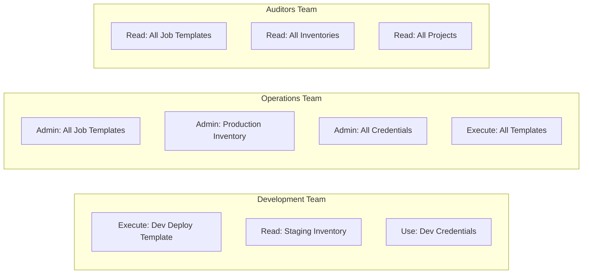

# How to Set Up AWX RBAC (Role-Based Access Control)

Author: [nawazdhandala](https://www.github.com/nawazdhandala)

Tags: Ansible, AWX, RBAC, Security, Access Control

Description: Configure AWX role-based access control to manage who can view, execute, and administer automation resources across teams and organizations.

---

AWX ships with a granular RBAC system that controls who can do what with every resource in the platform. Instead of giving everyone admin access and hoping for the best, you assign specific roles to users and teams. A developer might be able to run certain job templates but not edit them. A team lead might manage inventories but not credentials. An auditor might have read-only access to everything. RBAC makes all of this possible.

## RBAC Concepts in AWX

AWX RBAC is built around a few key concepts:

**Organizations** are the top-level grouping. Every resource (inventory, project, credential, template) belongs to an organization. Users can be members of multiple organizations.

**Teams** are groups of users within an organization. Instead of assigning permissions to individual users, you assign them to teams. When someone joins the team, they get all the team's permissions.

**Roles** are the permissions themselves. Each AWX resource type has a set of roles that control different levels of access.

## Built-in Roles Per Resource Type

Each resource type in AWX has its own set of roles. Here are the most important ones.

**Job Template roles:**
- Admin - Full control, including delete
- Execute - Can launch the template
- Read - Can view the template but not run or edit it

**Inventory roles:**
- Admin - Full control
- Update - Can trigger inventory source syncs
- Ad Hoc - Can run ad hoc commands against the inventory
- Use - Can use the inventory in job templates
- Read - View only

**Project roles:**
- Admin - Full control
- Update - Can trigger SCM updates
- Use - Can reference the project in job templates
- Read - View only

**Credential roles:**
- Admin - Full control
- Use - Can use the credential in job templates (but cannot see the secret value)
- Read - Can see the credential exists but not its value

## Setting Up an Organization Structure

Let us walk through a realistic setup. Say you have a company with development and operations teams, and you want to control who can do what.

```bash
# Create the organization
curl -s -X POST \
  -H "Authorization: Bearer ${AWX_TOKEN}" \
  -H "Content-Type: application/json" \
  https://awx.example.com/api/v2/organizations/ \
  -d '{"name": "Acme Corp", "description": "Main organization"}'
```

```bash
# Create the Development team
curl -s -X POST \
  -H "Authorization: Bearer ${AWX_TOKEN}" \
  -H "Content-Type: application/json" \
  https://awx.example.com/api/v2/teams/ \
  -d '{"name": "Development", "organization": 1}'

# Create the Operations team
curl -s -X POST \
  -H "Authorization: Bearer ${AWX_TOKEN}" \
  -H "Content-Type: application/json" \
  https://awx.example.com/api/v2/teams/ \
  -d '{"name": "Operations", "organization": 1}'

# Create the Auditors team
curl -s -X POST \
  -H "Authorization: Bearer ${AWX_TOKEN}" \
  -H "Content-Type: application/json" \
  https://awx.example.com/api/v2/teams/ \
  -d '{"name": "Auditors", "organization": 1}'
```

## Adding Users to Teams

```bash
# Add user ID 5 to the Development team (team ID 2)
curl -s -X POST \
  -H "Authorization: Bearer ${AWX_TOKEN}" \
  -H "Content-Type: application/json" \
  https://awx.example.com/api/v2/teams/2/users/ \
  -d '{"id": 5}'
```

## Granting Roles to Teams

This is where the real access control happens. You grant specific roles on specific resources to teams (or individual users).

```bash
# Give the Operations team "Admin" role on the production inventory (inventory ID 3)
curl -s -X POST \
  -H "Authorization: Bearer ${AWX_TOKEN}" \
  -H "Content-Type: application/json" \
  https://awx.example.com/api/v2/roles/ROLE_ID/teams/ \
  -d '{"id": TEAM_ID}'
```

To find the role ID, you need to look at the resource's `object_roles` field.

```bash
# Get the roles available on inventory ID 3
curl -s -H "Authorization: Bearer ${AWX_TOKEN}" \
  https://awx.example.com/api/v2/inventories/3/ \
  | python3 -c "
import sys, json
data = json.load(sys.stdin)
for role_name, role_data in data['summary_fields']['object_roles'].items():
    print(f'{role_name}: ID {role_data[\"id\"]} - {role_data[\"description\"]}')
"
```

This outputs something like:

```text
admin_role: ID 45 - Can manage all aspects of the inventory
update_role: ID 46 - May update the inventory
adhoc_role: ID 47 - May run ad hoc commands on the inventory
use_role: ID 48 - Can use the inventory in a job template
read_role: ID 49 - May view settings for the inventory
```

Now grant the role.

```bash
# Give Operations team (ID 3) the admin role (ID 45) on the production inventory
curl -s -X POST \
  -H "Authorization: Bearer ${AWX_TOKEN}" \
  -H "Content-Type: application/json" \
  https://awx.example.com/api/v2/roles/45/teams/ \
  -d '{"id": 3}'
```

## Permission Matrix Example

Here is a practical permission setup for the three teams.



## Granting Read Access to Everything

For auditor-type roles, you want read access across the board. The easiest way is to grant the "Auditor" role at the organization level.

```bash
# Get organization-level roles
curl -s -H "Authorization: Bearer ${AWX_TOKEN}" \
  https://awx.example.com/api/v2/organizations/1/ \
  | python3 -c "
import sys, json
data = json.load(sys.stdin)
for role_name, role_data in data['summary_fields']['object_roles'].items():
    print(f'{role_name}: ID {role_data[\"id\"]} - {role_data[\"description\"]}')
"
```

```bash
# Grant org-level auditor role to the Auditors team
curl -s -X POST \
  -H "Authorization: Bearer ${AWX_TOKEN}" \
  -H "Content-Type: application/json" \
  https://awx.example.com/api/v2/roles/ORG_AUDITOR_ROLE_ID/teams/ \
  -d '{"id": 4}'
```

The organization auditor role grants read access to all resources within that organization.

## User Types

AWX has three user types that work alongside RBAC:

- **Normal User** - Can only access resources they have been explicitly granted roles on.
- **Organization Admin** - Has full control over everything in their organization(s).
- **System Administrator** - Has full control over the entire AWX instance.

```bash
# Check a user's type
curl -s -H "Authorization: Bearer ${AWX_TOKEN}" \
  https://awx.example.com/api/v2/users/5/ \
  | python3 -c "
import sys, json
u = json.load(sys.stdin)
print(f'Username: {u[\"username\"]}')
print(f'Is superuser: {u[\"is_superuser\"]}')
print(f'Is system auditor: {u[\"is_system_auditor\"]}')
"
```

## Testing Permissions

After setting up RBAC, test it by impersonating a user. Create a personal access token for a test user and try operations they should and should not be able to perform.

```bash
# As a developer, try to launch a template they have Execute access on
curl -s -X POST \
  -H "Authorization: Bearer ${DEV_USER_TOKEN}" \
  -H "Content-Type: application/json" \
  https://awx.example.com/api/v2/job_templates/10/launch/

# As a developer, try to delete a template they only have Execute access on
# This should return 403 Forbidden
curl -s -X DELETE \
  -H "Authorization: Bearer ${DEV_USER_TOKEN}" \
  https://awx.example.com/api/v2/job_templates/10/
```

## LDAP and SAML Integration

In most organizations, you do not create AWX users manually. Instead, AWX integrates with your identity provider. Users authenticate via LDAP, SAML, or OAuth2, and AWX maps their group memberships to teams.

For example, if your LDAP group `cn=ops-team,ou=groups,dc=example,dc=com` maps to the AWX "Operations" team, anyone in that LDAP group automatically gets the permissions you assigned to that team. When they are removed from the LDAP group, they lose access.

This is configured in AWX settings under Authentication. The exact configuration depends on your identity provider.

## Common Mistakes

**Giving everyone admin access** - Start with the minimum permissions needed and add more as requested. It is much harder to remove access after people are used to having it.

**Forgetting credential "Use" vs "Admin"** - A user with "Use" on a credential can reference it in templates but cannot see the actual secret. This is by design. Do not give "Admin" on credentials unless the user needs to manage (create/edit/delete) them.

**Not using teams** - Assigning roles to individual users works but does not scale. When someone leaves the team, you have to hunt down and remove all their individual role assignments. With teams, you just remove them from the team.

## Wrapping Up

AWX RBAC is the mechanism that turns AWX from a single-user tool into a multi-team platform. Invest the time to set up organizations, teams, and granular roles early. It is much easier to build a clean permission model from scratch than to retrofit one onto an installation where everyone has been running as admin. Start with the principle of least privilege: give each team exactly the access they need and nothing more.
