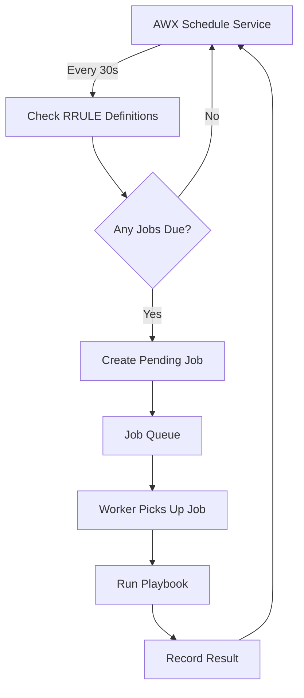

# How to Set Up AWX Schedules for Recurring Jobs

Author: [nawazdhandala](https://www.github.com/nawazdhandala)

Tags: Ansible, AWX, Scheduling, Automation, Cron

Description: Configure AWX schedules to run job templates on recurring intervals using RRULE syntax for automated infrastructure maintenance.

---

AWX schedules let you run job templates on a recurring basis without human intervention. Think of them as a cron replacement that lives inside your automation platform. You set up a schedule, attach it to a job template, and AWX fires it off on time, every time. This is how you automate patching cycles, compliance scans, backup jobs, and anything else that needs to happen regularly.

## How AWX Schedules Work

AWX uses the iCal RRULE format for defining recurrence patterns. If you have worked with calendar invites, you have seen this format before. An RRULE like `DTSTART:20260301T020000Z RRULE:FREQ=WEEKLY;BYDAY=MO,WE,FR` means "start March 1st 2026 at 2 AM UTC, then repeat every Monday, Wednesday, and Friday."

The schedule engine evaluates RRULEs and creates pending jobs at the right times. AWX checks for pending scheduled jobs every 30 seconds.

## Creating a Simple Daily Schedule

Let us start with the most common case: a job that runs once per day.

```bash
# Create a daily schedule for job template ID 10
# Runs every day at 3:00 AM UTC
curl -s -X POST \
  -H "Authorization: Bearer ${AWX_TOKEN}" \
  -H "Content-Type: application/json" \
  https://awx.example.com/api/v2/job_templates/10/schedules/ \
  -d '{
    "name": "Daily Security Scan",
    "description": "Run security compliance scan every day at 3AM UTC",
    "rrule": "DTSTART:20260221T030000Z RRULE:FREQ=DAILY;INTERVAL=1",
    "enabled": true
  }'
```

The `INTERVAL=1` means every day. Set it to `INTERVAL=2` for every other day.

## Weekly Schedule with Specific Days

For jobs that should only run on certain days of the week, use the `BYDAY` parameter.

```bash
# Run a backup job every Tuesday and Thursday at 11 PM UTC
curl -s -X POST \
  -H "Authorization: Bearer ${AWX_TOKEN}" \
  -H "Content-Type: application/json" \
  https://awx.example.com/api/v2/job_templates/12/schedules/ \
  -d '{
    "name": "Database Backup - Tue/Thu",
    "rrule": "DTSTART:20260221T230000Z RRULE:FREQ=WEEKLY;BYDAY=TU,TH",
    "enabled": true
  }'
```

## Monthly Schedule

For monthly jobs like compliance reports or certificate rotation checks.

```bash
# Run on the first Monday of every month at 6 AM UTC
curl -s -X POST \
  -H "Authorization: Bearer ${AWX_TOKEN}" \
  -H "Content-Type: application/json" \
  https://awx.example.com/api/v2/job_templates/15/schedules/ \
  -d '{
    "name": "Monthly Compliance Report",
    "rrule": "DTSTART:20260302T060000Z RRULE:FREQ=MONTHLY;BYDAY=1MO",
    "enabled": true
  }'
```

The `1MO` means "first Monday." Use `2MO` for the second Monday, `-1FR` for the last Friday, and so on.

## Hourly Schedule

For more frequent jobs like health checks or metric collection.

```bash
# Run every 4 hours starting at midnight
curl -s -X POST \
  -H "Authorization: Bearer ${AWX_TOKEN}" \
  -H "Content-Type: application/json" \
  https://awx.example.com/api/v2/job_templates/20/schedules/ \
  -d '{
    "name": "Health Check - Every 4 Hours",
    "rrule": "DTSTART:20260221T000000Z RRULE:FREQ=HOURLY;INTERVAL=4",
    "enabled": true
  }'
```

## Schedule with an End Date

If a schedule should stop after a certain date (for example, a migration window), use the `UNTIL` parameter.

```bash
# Run daily until March 31st 2026
curl -s -X POST \
  -H "Authorization: Bearer ${AWX_TOKEN}" \
  -H "Content-Type: application/json" \
  https://awx.example.com/api/v2/job_templates/10/schedules/ \
  -d '{
    "name": "Migration Window - Daily Check",
    "rrule": "DTSTART:20260221T080000Z RRULE:FREQ=DAILY;UNTIL=20260331T235959Z",
    "enabled": true
  }'
```

You can also limit by count instead of date using `COUNT=10` to run exactly 10 times.

## Schedules with Extra Variables

Scheduled jobs can pass extra variables just like manually launched jobs.

```bash
# Nightly cleanup with extra vars specifying retention days
curl -s -X POST \
  -H "Authorization: Bearer ${AWX_TOKEN}" \
  -H "Content-Type: application/json" \
  https://awx.example.com/api/v2/job_templates/18/schedules/ \
  -d '{
    "name": "Nightly Log Cleanup",
    "rrule": "DTSTART:20260221T040000Z RRULE:FREQ=DAILY;INTERVAL=1",
    "enabled": true,
    "extra_data": {
      "retention_days": 30,
      "target_dirs": ["/var/log/app", "/var/log/nginx"],
      "dry_run": false
    }
  }'
```

The `extra_data` field works the same as `extra_vars` when launching a job manually. These variables are available in your playbook as regular Ansible variables.

## Listing and Managing Schedules

```bash
# List all schedules for a job template
curl -s -H "Authorization: Bearer ${AWX_TOKEN}" \
  "https://awx.example.com/api/v2/job_templates/10/schedules/"

# Disable a schedule without deleting it
curl -s -X PATCH \
  -H "Authorization: Bearer ${AWX_TOKEN}" \
  -H "Content-Type: application/json" \
  https://awx.example.com/api/v2/schedules/5/ \
  -d '{"enabled": false}'

# Delete a schedule
curl -s -X DELETE \
  -H "Authorization: Bearer ${AWX_TOKEN}" \
  https://awx.example.com/api/v2/schedules/5/
```

## Schedule Timing Diagram

Here is how the schedule system works internally.



## Timezone Considerations

RRULE timestamps use UTC. If your team thinks in local time, convert carefully. A job scheduled for "3 AM Eastern" during daylight saving time is `DTSTART:20260221T080000Z` (UTC-5), but shifts to `T070000Z` when daylight saving ends.

The simplest approach is to pick a UTC time that works year-round and document what local time that translates to. If you need exact local-time scheduling, AWX also supports timezone-aware RRULEs.

```bash
# Schedule using a specific timezone
curl -s -X POST \
  -H "Authorization: Bearer ${AWX_TOKEN}" \
  -H "Content-Type: application/json" \
  https://awx.example.com/api/v2/job_templates/10/schedules/ \
  -d '{
    "name": "Daily Maintenance - US Eastern",
    "rrule": "DTSTART;TZID=America/New_York:20260221T030000 RRULE:FREQ=DAILY;INTERVAL=1",
    "enabled": true
  }'
```

## Practical Schedule Patterns

Here are the RRULE patterns for common automation scenarios.

```text
# Every weekday at 9 AM UTC (skip weekends)
DTSTART:20260223T090000Z RRULE:FREQ=WEEKLY;BYDAY=MO,TU,WE,TH,FR

# Every 15 minutes during business hours (use multiple schedules for hour range)
DTSTART:20260221T090000Z RRULE:FREQ=MINUTELY;INTERVAL=15;BYHOUR=9,10,11,12,13,14,15,16,17

# Quarterly on the first day of each quarter
DTSTART:20260401T060000Z RRULE:FREQ=YEARLY;BYMONTH=1,4,7,10;BYMONTHDAY=1

# Every Sunday at midnight (maintenance window)
DTSTART:20260222T000000Z RRULE:FREQ=WEEKLY;BYDAY=SU
```

## Monitoring Scheduled Jobs

Check the unified jobs list to see upcoming and past scheduled runs.

```bash
# Get the next 5 scheduled runs for a schedule
curl -s -H "Authorization: Bearer ${AWX_TOKEN}" \
  "https://awx.example.com/api/v2/schedules/5/" \
  | python3 -c "import sys,json; d=json.load(sys.stdin); print('Next run:', d.get('next_run'))"

# Find failed scheduled jobs in the last week
curl -s -H "Authorization: Bearer ${AWX_TOKEN}" \
  "https://awx.example.com/api/v2/jobs/?launch_type=scheduled&status=failed&created__gt=2026-02-14T00:00:00Z"
```

The `launch_type=scheduled` filter separates scheduled runs from manual launches, which makes it easy to track schedule reliability separately.

## Wrapping Up

AWX schedules replace ad-hoc cron jobs with a centralized, auditable scheduling system. Every run is logged, every failure is visible in the UI, and schedules are tied to job templates that already have their credentials, inventories, and execution environments configured. Start with daily and weekly patterns for your maintenance tasks, and build from there. The RRULE format is flexible enough to handle almost any recurrence pattern you can think of.
