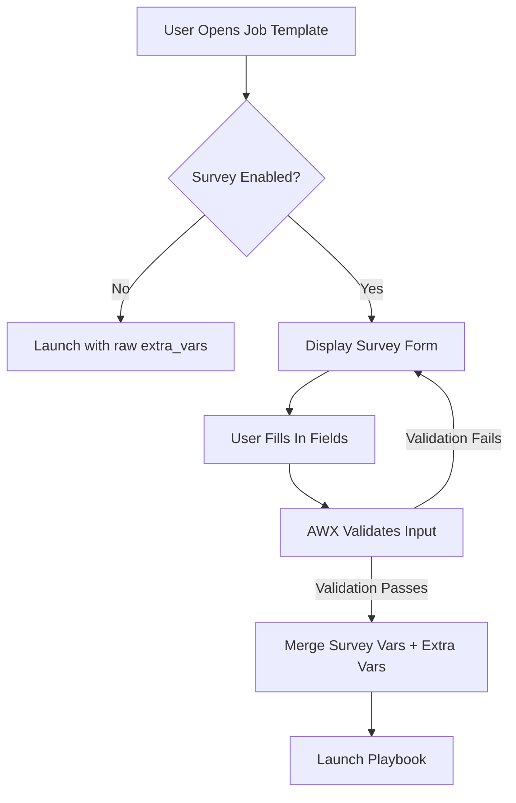

# How to Set Up AWX Surveys for User Input

Author: [nawazdhandala](https://www.github.com/nawazdhandala)

Tags: Ansible, AWX, Surveys, Automation, Self-Service

Description: Set up AWX surveys to collect user input before job execution, enabling self-service automation with controlled parameters.

---

AWX surveys let you build simple forms that collect input from users before a job template runs. Instead of requiring everyone to know which extra variables a playbook expects, you present them with dropdowns, text fields, and checkboxes. This turns complex playbooks into self-service tools that anyone on the team can use safely.

## Why Surveys Matter

Without surveys, launching a job template that needs extra variables means typing raw YAML or JSON into a text box. That works fine for the person who wrote the playbook, but it breaks down when you hand the template off to someone in operations or QA who just wants to deploy version X to environment Y. Surveys bridge that gap by giving users a structured form with validation built in.

## Creating a Survey on a Job Template

You can add a survey to any job template through the AWX UI or the API. Let us start with the API approach since it is scriptable and reproducible.

First, you need an existing job template. Assuming template ID 10 exists, here is how to attach a survey specification.

```bash
# Define and attach a survey to job template ID 10
curl -s -X POST \
  -H "Authorization: Bearer ${AWX_TOKEN}" \
  -H "Content-Type: application/json" \
  https://awx.example.com/api/v2/job_templates/10/survey_spec/ \
  -d '{
    "name": "Deployment Parameters",
    "description": "Fill in deployment details",
    "spec": [
      {
        "question_name": "Target Environment",
        "question_description": "Which environment to deploy to",
        "required": true,
        "type": "multiplechoice",
        "variable": "target_env",
        "choices": ["development", "staging", "production"],
        "default": "staging"
      },
      {
        "question_name": "Application Version",
        "question_description": "Semantic version to deploy",
        "required": true,
        "type": "text",
        "variable": "app_version",
        "min": 5,
        "max": 20,
        "default": "1.0.0"
      },
      {
        "question_name": "Run Database Migrations",
        "question_description": "Should database migrations run during deploy?",
        "required": true,
        "type": "multiplechoice",
        "variable": "run_migrations",
        "choices": ["yes", "no"],
        "default": "no"
      }
    ]
  }'
```

After posting the survey spec, you need to enable it on the template.

```bash
# Enable the survey on the job template
curl -s -X PATCH \
  -H "Authorization: Bearer ${AWX_TOKEN}" \
  -H "Content-Type: application/json" \
  https://awx.example.com/api/v2/job_templates/10/ \
  -d '{"survey_enabled": true}'
```

Now when someone launches template 10 through the UI, they see a clean form instead of a raw YAML input box.

## Survey Field Types

AWX supports several question types, each suited for different kinds of input.

**Text** - A single-line text field. You can set `min` and `max` character limits. Good for version strings, hostnames, or short descriptions.

**Textarea** - A multi-line text area. Useful for passing in lists of items, one per line, or longer configuration snippets.

**Password** - A text field where the input is masked and encrypted at rest. The value is never shown in job logs. Perfect for API keys or temporary credentials.

**Multiple Choice** - A dropdown with predefined options. The user picks exactly one. Best for environment selectors, region pickers, or any controlled set of values.

**Multiple Select** - Like multiple choice but the user can pick more than one option. The variable receives a newline-separated string of selected values.

**Integer** - A number field that validates the input is a whole number. You can set min and max bounds. Great for replica counts, port numbers, or batch sizes.

**Float** - Same as integer but allows decimal points. Rarely needed but useful for thresholds and percentages.

## Using Survey Variables in Playbooks

Survey answers become extra variables passed to the playbook. They work exactly like variables set with `-e` on the command line.

```yaml
# deploy.yml - Uses survey variables directly
---
- name: Deploy application
  hosts: "{{ target_env }}_servers"
  become: true

  tasks:
    - name: Pull application image
      community.docker.docker_image:
        name: "myapp:{{ app_version }}"
        source: pull

    - name: Deploy container
      community.docker.docker_container:
        name: myapp
        image: "myapp:{{ app_version }}"
        state: started
        restart_policy: always
        ports:
          - "8080:8080"

    - name: Run database migrations
      ansible.builtin.command:
        cmd: /opt/myapp/migrate.sh
      when: run_migrations == "yes"

    - name: Verify deployment
      ansible.builtin.uri:
        url: "http://localhost:8080/health"
        status_code: 200
      retries: 5
      delay: 10
```

Notice how `target_env`, `app_version`, and `run_migrations` are used directly as Jinja2 variables. No extra wiring needed.

## Survey with Conditional Logic in the Playbook

Surveys themselves do not support conditional questions (showing field B only if field A has a certain value). But you can handle this in the playbook using `when` conditions.

```yaml
# provision.yml - Handles conditional survey inputs
---
- name: Provision infrastructure
  hosts: localhost
  connection: local

  tasks:
    - name: Create standard VM
      ansible.builtin.debug:
        msg: "Creating {{ vm_count }} VMs of size {{ vm_size }}"

    - name: Attach extra storage
      ansible.builtin.debug:
        msg: "Attaching {{ storage_gb }}GB to each VM"
      when: attach_storage == "yes"

    - name: Configure GPU passthrough
      ansible.builtin.debug:
        msg: "Enabling GPU on {{ gpu_count }} VMs"
      when: vm_size == "gpu-optimized"
```

The survey would include fields for `vm_count`, `vm_size`, `attach_storage`, `storage_gb`, and `gpu_count`. Even though all fields show on the form, the playbook only acts on relevant values based on other selections.

## Setting Default Values Wisely

Defaults in surveys serve two purposes: they speed up common use cases and they act as documentation. A user who sees `staging` pre-filled in the environment dropdown immediately understands what the default path is.

Some tips for defaults:
- Always default to the safest option. If there is a "production" choice, never make it the default.
- For integer fields, set the default to the most common value. If teams usually deploy 3 replicas, default to 3.
- For password fields, you cannot set a visible default (by design). If a credential should come from AWX credentials instead, do not use a survey field at all.

## Survey Spec as Code

Hard-coding survey specs in the UI makes them hard to track and reproduce. Instead, keep them in a JSON file alongside your playbook and apply them with a script.

```json
{
  "name": "Service Restart Parameters",
  "description": "Parameters for the service restart playbook",
  "spec": [
    {
      "question_name": "Service Name",
      "required": true,
      "type": "multiplechoice",
      "variable": "service_name",
      "choices": ["nginx", "postgresql", "redis", "application"],
      "default": "application"
    },
    {
      "question_name": "Restart Strategy",
      "required": true,
      "type": "multiplechoice",
      "variable": "restart_strategy",
      "choices": ["rolling", "all-at-once"],
      "default": "rolling"
    },
    {
      "question_name": "Batch Size",
      "question_description": "Number of hosts to restart at once (rolling only)",
      "required": false,
      "type": "integer",
      "variable": "batch_size",
      "min": 1,
      "max": 50,
      "default": 5
    }
  ]
}
```

```bash
# Apply the survey spec from a JSON file
curl -s -X POST \
  -H "Authorization: Bearer ${AWX_TOKEN}" \
  -H "Content-Type: application/json" \
  https://awx.example.com/api/v2/job_templates/15/survey_spec/ \
  -d @survey-restart.json
```

Store the JSON file in the same Git repo as your playbooks. Now the survey definition is version-controlled and reviewable.

## Survey Flow Overview



## Combining Surveys with RBAC

Surveys become really powerful when combined with AWX role-based access control. You can give a team "Execute" permission on a job template without giving them "Admin" permission. They can fill in the survey and launch the job, but they cannot edit the template or change which playbook it runs. This creates a safe self-service layer where the guardrails are built into the template itself.

## Limitations to Be Aware Of

Surveys have a few rough edges. There is no way to make one question depend on another in the UI. The variable names must be valid Ansible variable names, so no hyphens or spaces. Password-type answers are encrypted, which means you cannot use them in job output or debug statements. And the total survey payload is limited in size, so do not try to pass large configuration blocks through a textarea field. For complex inputs, consider having the playbook pull configuration from a Git repo or an external data source instead.

## Final Thoughts

Surveys turn AWX job templates into self-service tools. They lower the barrier for non-Ansible users to trigger automation safely, and they prevent the "I passed the wrong variable" mistakes that come from free-form extra_vars input. Define your surveys in code, set sensible defaults, and combine them with RBAC to build an automation platform that your whole organization can use without fear.
