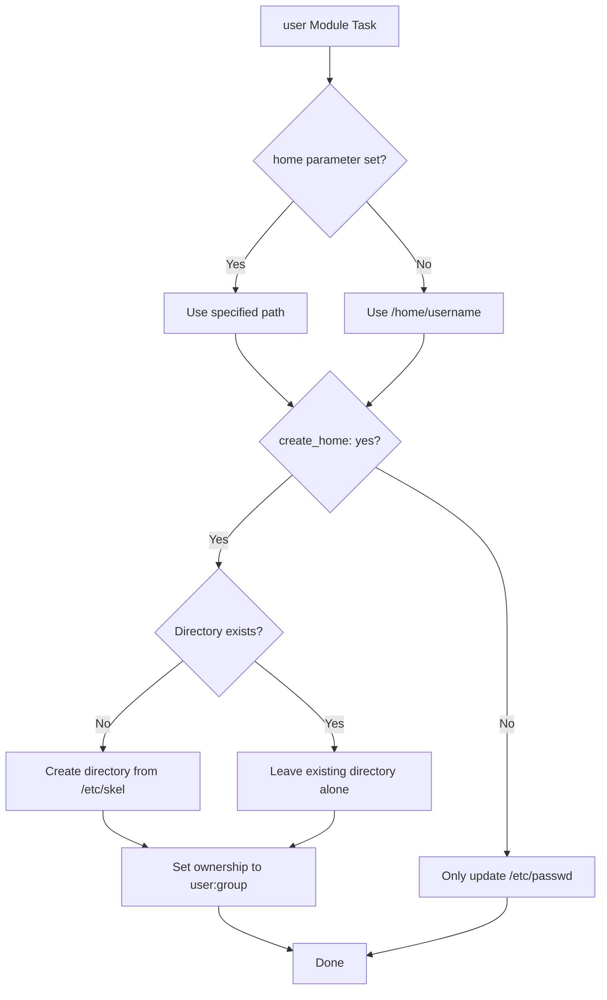

# How to Set User Home Directory with the Ansible user Module

Author: [nawazdhandala](https://www.github.com/nawazdhandala)

Tags: Ansible, User Management, Linux, File System

Description: Learn how to configure and manage user home directories with the Ansible user module including custom paths, skeleton files, and permissions.

---

The home directory is where a user's personal files, configuration, and environment settings live. By default, Linux creates home directories under `/home/<username>`, but there are plenty of situations where you need something different. Application users might need their home under `/opt`, LDAP users might use `/export/home`, and service accounts might not need a home directory at all. The Ansible `user` module gives you full control over home directory configuration.

## Default Home Directory Behavior

When you create a user without specifying a home directory, the system follows its default configuration:

```yaml
# default-home.yml - User with default home directory
- name: Create user with default home
  hosts: all
  become: yes
  tasks:
    - name: Create user alice (home will be /home/alice)
      ansible.builtin.user:
        name: alice
        state: present
```

This creates `/home/alice` and populates it with files from `/etc/skel` (the skeleton directory). The `create_home` parameter defaults to `yes` for regular users.

## Setting a Custom Home Directory

Use the `home` parameter to specify a non-standard location:

```yaml
# custom-home.yml - User with custom home directory
- name: Create user with custom home directory
  hosts: all
  become: yes
  tasks:
    - name: Create application user with /opt home
      ansible.builtin.user:
        name: myapp
        home: /opt/myapp
        create_home: yes
        state: present
```

Ansible creates the directory at the specified path and sets the user as the owner. The parent directory (`/opt` in this case) must already exist.

## The create_home Parameter

The `create_home` parameter controls whether the home directory is actually created on disk:

```yaml
# create-home-options.yml - Different home directory creation options
- name: Home directory creation options
  hosts: all
  become: yes
  tasks:
    # Creates the home directory and populates from /etc/skel
    - name: User with home directory
      ansible.builtin.user:
        name: developer
        home: /home/developer
        create_home: yes
        state: present

    # Sets /opt/worker as home in /etc/passwd but does NOT create the directory
    - name: User without home directory creation
      ansible.builtin.user:
        name: worker
        home: /opt/worker
        create_home: no
        state: present
```

The distinction matters. With `create_home: no`, the user record in `/etc/passwd` will list the home directory path, but the directory will not exist on disk. This is useful when you want to create the directory separately with specific permissions or ownership.

## Home Directory Workflow

Here is how Ansible processes home directory configuration:



## Managing Home Directory Permissions

The `user` module creates the home directory with default permissions (usually 0755 or 0700 depending on your distribution's `umask` setting). If you need specific permissions, add a separate `file` task:

```yaml
# home-permissions.yml - Set specific home directory permissions
- name: Create user with specific home permissions
  hosts: all
  become: yes
  tasks:
    - name: Create user
      ansible.builtin.user:
        name: secureuser
        home: /home/secureuser
        create_home: yes
        state: present

    # Set restrictive permissions on the home directory
    - name: Set home directory to 0700
      ansible.builtin.file:
        path: /home/secureuser
        mode: '0700'
        owner: secureuser
        group: secureuser
        state: directory
```

## Moving a User's Home Directory

The `move_home` parameter lets you relocate a user's home directory when you change the `home` path:

```yaml
# move-home.yml - Move a user's home directory
- name: Move user home directory
  hosts: all
  become: yes
  tasks:
    - name: Move alice's home from /home/alice to /data/alice
      ansible.builtin.user:
        name: alice
        home: /data/alice
        move_home: yes
        state: present
```

When `move_home: yes` is set, Ansible does two things:

1. Updates the home directory path in `/etc/passwd`
2. Moves the contents of the old home directory to the new location

Without `move_home: yes`, only the `/etc/passwd` entry changes. The files stay in the old location, and the new directory is created empty.

**Important**: The parent directory of the new location must exist. If `/data` does not exist, the move will fail.

## Using Skeleton Directory Files

When `create_home: yes` is set, the home directory is populated from `/etc/skel`. You can customize the skeleton directory to include default configuration files for all new users:

```yaml
# customize-skel.yml - Customize skeleton directory before creating users
- name: Set up skeleton directory and create users
  hosts: all
  become: yes
  tasks:
    # Add custom bashrc to skeleton
    - name: Deploy custom .bashrc to skeleton
      ansible.builtin.copy:
        dest: /etc/skel/.bashrc
        content: |
          # Custom bashrc for company servers
          export EDITOR=vim
          export HISTSIZE=10000
          export HISTTIMEFORMAT="%Y-%m-%d %H:%M:%S "
          alias ll='ls -la'
          alias gs='git status'
        mode: '0644'

    # Add custom vimrc to skeleton
    - name: Deploy custom .vimrc to skeleton
      ansible.builtin.copy:
        dest: /etc/skel/.vimrc
        content: |
          set number
          set expandtab
          set tabstop=4
          set shiftwidth=4
          syntax on
        mode: '0644'

    # Now create users who will get these files
    - name: Create new developer users
      ansible.builtin.user:
        name: "{{ item }}"
        create_home: yes
        state: present
      loop:
        - newdev1
        - newdev2
        - newdev3
```

## Specifying a Custom Skeleton Directory

The `skeleton` parameter lets you use a different skeleton directory instead of `/etc/skel`:

```yaml
# custom-skeleton.yml - Use a custom skeleton directory
- name: Create user with custom skeleton
  hosts: all
  become: yes
  tasks:
    # Create a custom skeleton directory for developers
    - name: Create developer skeleton directory
      ansible.builtin.file:
        path: /etc/skel-dev
        state: directory
        mode: '0755'

    - name: Add developer-specific files to custom skeleton
      ansible.builtin.copy:
        dest: /etc/skel-dev/.gitconfig
        content: |
          [core]
            editor = vim
            autocrlf = input
          [pull]
            rebase = true
        mode: '0644'

    # Create user with the developer skeleton
    - name: Create developer with custom skeleton
      ansible.builtin.user:
        name: devuser
        skeleton: /etc/skel-dev
        create_home: yes
        state: present
```

## Home Directories for Application Users

Application users often need a specific directory structure within their home:

```yaml
# app-user-home.yml - Application user with directory structure
- name: Set up application user with full directory structure
  hosts: appservers
  become: yes
  vars:
    app_user: myservice
    app_home: /opt/myservice
  tasks:
    - name: Create application user
      ansible.builtin.user:
        name: "{{ app_user }}"
        home: "{{ app_home }}"
        create_home: yes
        shell: /usr/sbin/nologin
        system: yes
        state: present

    # Create the subdirectory structure the application needs
    - name: Create application subdirectories
      ansible.builtin.file:
        path: "{{ app_home }}/{{ item }}"
        owner: "{{ app_user }}"
        group: "{{ app_user }}"
        mode: '0755'
        state: directory
      loop:
        - bin
        - conf
        - logs
        - data
        - tmp
```

## Home Directories on Shared Storage

When home directories are on NFS or other shared filesystems, you typically do not want Ansible to create them:

```yaml
# nfs-home.yml - Users with NFS home directories
- name: Create users with NFS home directories
  hosts: all
  become: yes
  tasks:
    # NFS mount should already be configured
    - name: Ensure NFS home is mounted
      ansible.posix.mount:
        src: "nfs-server:/export/home"
        path: /home
        fstype: nfs
        opts: "rw,hard,intr"
        state: mounted

    # Create user without creating home (NFS handles it)
    - name: Create user with NFS home
      ansible.builtin.user:
        name: nfsuser
        home: /home/nfsuser
        create_home: no
        state: present
```

## Checking Home Directory Status

You can verify home directory configuration after creation:

```yaml
# verify-home.yml - Verify home directory setup
- name: Verify home directory configuration
  hosts: all
  become: yes
  tasks:
    - name: Get user info
      ansible.builtin.getent:
        database: passwd
        key: developer

    - name: Display home directory from passwd
      ansible.builtin.debug:
        msg: "Home directory: {{ getent_passwd['developer'][4] }}"

    - name: Check if home directory exists on disk
      ansible.builtin.stat:
        path: "{{ getent_passwd['developer'][4] }}"
      register: home_stat

    - name: Display home directory status
      ansible.builtin.debug:
        msg: >
          Home exists: {{ home_stat.stat.exists }},
          Owner UID: {{ home_stat.stat.uid | default('N/A') }},
          Permissions: {{ home_stat.stat.mode | default('N/A') }}
```

## Best Practices

1. **Use `/opt` or `/srv` for application home directories**. Reserve `/home` for human users.

2. **Set `create_home: no` for service accounts** that do not need a home directory. Unnecessary directories are just clutter.

3. **Customize `/etc/skel`** to provide sensible defaults for all new users. This saves time and ensures consistency.

4. **Always set explicit permissions** on home directories. The default varies by distribution, and you do not want to rely on inconsistent defaults.

5. **Be careful with `move_home: yes`**. Moving large home directories can take a long time and cause service disruptions. Plan these moves during maintenance windows.

6. **Do not create home directories on NFS with Ansible**. Let the NFS server handle home directory creation to avoid race conditions and permission issues.

Home directory management with Ansible is mostly about knowing which parameters to set and when. The `user` module handles the heavy lifting, and you just need to tell it where things should go.
