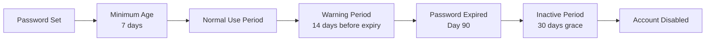

# How to Set User Password Expiry with Ansible

Author: [nawazdhandala](https://www.github.com/nawazdhandala)

Tags: Ansible, Security, Password Policy, Linux

Description: Learn how to configure password expiration policies for Linux users with Ansible, including maximum age, minimum age, and warning periods.

---

Password expiration policies are a compliance requirement in many organizations. Whether you are working toward SOC 2, PCI DSS, or just following internal security standards, you need to enforce password rotation. Ansible gives you multiple ways to manage password aging, from the `user` module's built-in parameters to the `chage` command for more granular control.

## Understanding Password Aging on Linux

Linux tracks password aging through several fields in `/etc/shadow`. Each field controls a different aspect of the password lifecycle:

- **Last change**: The date the password was last changed (days since epoch)
- **Minimum age**: Minimum days before the password can be changed again
- **Maximum age**: Maximum days the password is valid
- **Warning period**: Days before expiry when the user gets warned
- **Inactive period**: Days after expiry before the account is disabled
- **Account expiry**: The date the account itself expires (separate from password expiry)

You can see these values with the `chage -l username` command.

## Password Expiry Parameters in the user Module

The `user` module exposes several password aging parameters:

```yaml
# password-expiry-basic.yml - Set password expiry parameters
- name: Configure password expiry
  hosts: all
  become: yes
  tasks:
    - name: Create user with password expiry settings
      ansible.builtin.user:
        name: developer
        password: "{{ 'TempPass123' | password_hash('sha512', 'salt12345678') }}"
        password_expire_max: 90
        password_expire_min: 7
        state: present
      no_log: yes
```

Here is what each parameter does:

- **password_expire_max**: Maximum number of days a password is valid. After this many days, the user must change their password. This maps to the `chage -M` value.
- **password_expire_min**: Minimum number of days between password changes. This prevents users from rapidly cycling through passwords to get back to their favorite. Maps to `chage -m`.

## Setting Account Expiry Date

The `expires` parameter is different from password expiry. It sets a date when the entire account becomes disabled:

```yaml
# account-expiry.yml - Set account expiration date
- name: Create contractor with account expiry
  hosts: all
  become: yes
  tasks:
    # Account expires on March 31, 2025 (Unix epoch timestamp)
    - name: Create contractor account with expiry date
      ansible.builtin.user:
        name: contractor
        expires: 1743465600
        state: present

    # You can also calculate the epoch from a date string
    - name: Create intern with calculated expiry
      ansible.builtin.user:
        name: intern
        expires: "{{ ('2025-06-30' | to_datetime('%Y-%m-%d')).strftime('%s') | float }}"
        state: present
```

To remove an account expiry (make the account never expire), set `expires` to `-1`:

```yaml
# remove-expiry.yml - Remove account expiration
- name: Remove account expiration
  hosts: all
  become: yes
  tasks:
    - name: Make account permanent
      ansible.builtin.user:
        name: contractor
        expires: -1
        state: present
```

## Password Aging Lifecycle

Here is the timeline of how password aging works:



## Using chage for Full Control

The `user` module covers the basics, but for full password aging control you will want to use `chage` through the `command` module:

```yaml
# full-chage-config.yml - Complete password aging with chage
- name: Configure full password aging policy
  hosts: all
  become: yes
  vars:
    target_user: developer
    max_days: 90
    min_days: 7
    warn_days: 14
    inactive_days: 30
  tasks:
    - name: Set maximum password age
      ansible.builtin.command: "chage -M {{ max_days }} {{ target_user }}"

    - name: Set minimum password age
      ansible.builtin.command: "chage -m {{ min_days }} {{ target_user }}"

    - name: Set warning period before expiry
      ansible.builtin.command: "chage -W {{ warn_days }} {{ target_user }}"

    - name: Set inactive period after expiry
      ansible.builtin.command: "chage -I {{ inactive_days }} {{ target_user }}"
```

## Applying Company-Wide Password Policy

Most organizations need a standard password policy applied to all users. Here is how to do that:

```yaml
# company-password-policy.yml - Apply company-wide password policy
- name: Apply company password policy
  hosts: all
  become: yes
  vars:
    password_policy:
      max_age: 90      # Must change every 90 days
      min_age: 1       # Cannot change more than once per day
      warn_days: 14    # Warn 14 days before expiry
      inactive: 30     # Disable 30 days after expiry
    excluded_users:
      - root
      - nobody
      - daemon
  tasks:
    # Get list of regular users (UID >= 1000)
    - name: Get list of regular users
      ansible.builtin.shell: "awk -F: '$3 >= 1000 && $1 != \"nobody\" {print $1}' /etc/passwd"
      register: regular_users
      changed_when: false

    # Apply policy to each regular user
    - name: Apply password policy to regular users
      ansible.builtin.command: >
        chage
        -M {{ password_policy.max_age }}
        -m {{ password_policy.min_age }}
        -W {{ password_policy.warn_days }}
        -I {{ password_policy.inactive }}
        {{ item }}
      loop: "{{ regular_users.stdout_lines | difference(excluded_users) }}"
```

## Setting Default Password Aging for New Users

Instead of configuring each user individually, you can set defaults that apply to all new users by modifying `/etc/login.defs`:

```yaml
# default-password-aging.yml - Set system-wide defaults
- name: Configure system-wide password aging defaults
  hosts: all
  become: yes
  tasks:
    - name: Set PASS_MAX_DAYS in login.defs
      ansible.builtin.lineinfile:
        path: /etc/login.defs
        regexp: '^PASS_MAX_DAYS'
        line: 'PASS_MAX_DAYS   90'

    - name: Set PASS_MIN_DAYS in login.defs
      ansible.builtin.lineinfile:
        path: /etc/login.defs
        regexp: '^PASS_MIN_DAYS'
        line: 'PASS_MIN_DAYS   1'

    - name: Set PASS_WARN_AGE in login.defs
      ansible.builtin.lineinfile:
        path: /etc/login.defs
        regexp: '^PASS_WARN_AGE'
        line: 'PASS_WARN_AGE   14'

    - name: Set PASS_MIN_LEN in login.defs
      ansible.builtin.lineinfile:
        path: /etc/login.defs
        regexp: '^PASS_MIN_LEN'
        line: 'PASS_MIN_LEN    12'
```

These defaults apply only to newly created users. Existing users keep their current settings.

## Forcing Immediate Password Change

To force a user to change their password at next login:

```yaml
# force-change.yml - Force password change at next login
- name: Force password change at next login
  hosts: all
  become: yes
  tasks:
    - name: Expire password for user
      ansible.builtin.command: "chage -d 0 developer"

    # Alternative: set last change date to epoch 0
    - name: Force password change (alternative method)
      ansible.builtin.user:
        name: another_user
        password: "{{ 'NewTempPass' | password_hash('sha512', 'mysalt123456') }}"
        update_password: always
        state: present
      no_log: yes
```

The `chage -d 0` command sets the last password change date to January 1, 1970, making the system think the password is way past its maximum age.

## Checking Password Expiry Status

Build a report of password expiry status across your fleet:

```yaml
# check-expiry-status.yml - Report on password expiry
- name: Check password expiry status
  hosts: all
  become: yes
  tasks:
    - name: Get password aging info for all users
      ansible.builtin.shell: |
        for user in $(awk -F: '$3 >= 1000 && $1 != "nobody" {print $1}' /etc/passwd); do
          echo "--- $user ---"
          chage -l $user
        done
      register: aging_info
      changed_when: false

    - name: Display password aging report
      ansible.builtin.debug:
        msg: "{{ aging_info.stdout_lines }}"

    # Find users with expired passwords
    - name: Find users with expired passwords
      ansible.builtin.shell: |
        for user in $(awk -F: '$3 >= 1000 && $1 != "nobody" {print $1}' /etc/passwd); do
          if chage -l $user 2>/dev/null | grep -q "password must be changed"; then
            echo "$user"
          fi
        done
      register: expired_users
      changed_when: false

    - name: Report expired passwords
      ansible.builtin.debug:
        msg: "Users with expired passwords: {{ expired_users.stdout_lines | default(['none']) }}"
```

## Exempting Service Accounts from Password Aging

Service accounts should not be subject to password aging. Their passwords (if they even have one) should be managed differently:

```yaml
# exempt-service-accounts.yml - Exempt service accounts from aging
- name: Exempt service accounts from password aging
  hosts: all
  become: yes
  vars:
    service_accounts:
      - nginx
      - redis
      - postgres
      - prometheus
  tasks:
    - name: Disable password aging for service accounts
      ansible.builtin.command: "chage -M -1 -m -1 -W -1 -I -1 {{ item }}"
      loop: "{{ service_accounts }}"
      register: chage_result
      changed_when: false
      failed_when: "chage_result.rc != 0 and 'unknown user' not in chage_result.stderr"
```

Setting values to `-1` effectively disables that aging parameter.

## Best Practices

1. **Set reasonable maximum age**. 90 days is a common standard for compliance frameworks. Shorter periods (30 days) lead to users choosing weaker passwords or writing them down.

2. **Always set a minimum age**. Without a minimum, users can change their password multiple times in a row to cycle back to their previous password, defeating the purpose of rotation.

3. **Use warning periods**. Give users at least 7-14 days of warning before their password expires. Nobody likes being surprised.

4. **Exempt service accounts**. Service accounts should not have password aging. They either use key-based auth or have passwords managed through a secrets manager.

5. **Configure defaults in `/etc/login.defs`**. This ensures new users automatically get the right policy without needing per-user configuration.

6. **Monitor expiry status**. Run regular checks to find accounts with expired passwords. These might indicate inactive accounts that should be removed.

Password expiry management is a key part of server security hygiene. With Ansible, you can enforce consistent policies across your entire infrastructure and ensure compliance requirements are met automatically.
