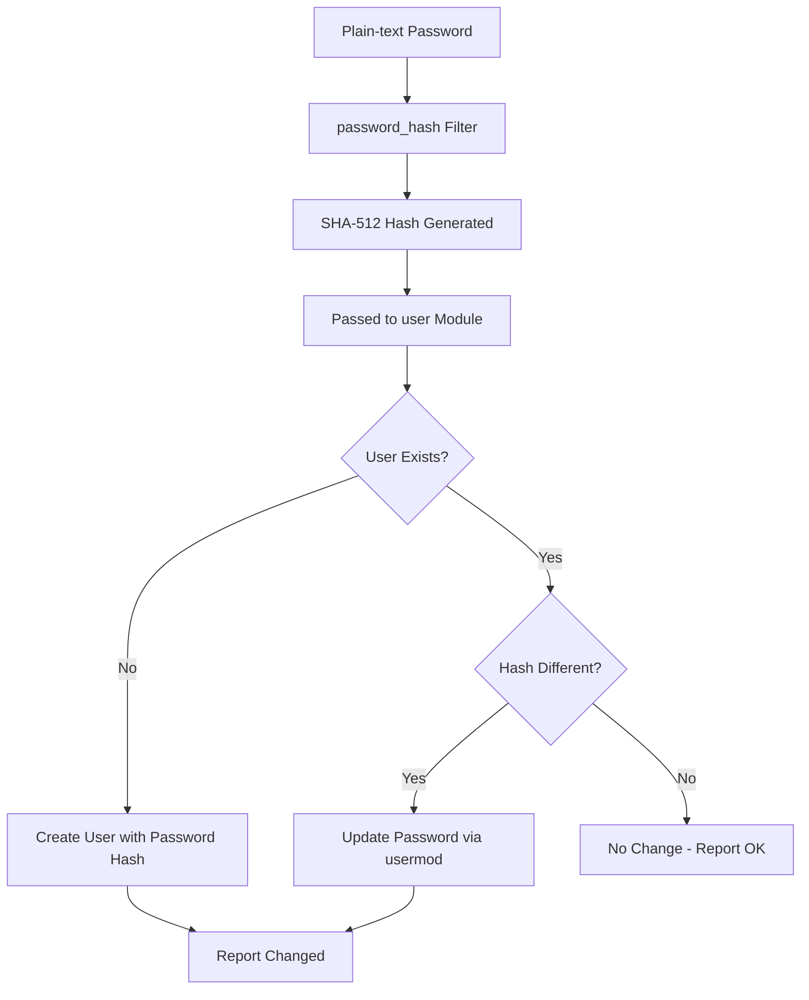

# How to Set User Passwords with the Ansible user Module

Author: [nawazdhandala](https://www.github.com/nawazdhandala)

Tags: Ansible, User Management, Security, Linux

Description: Learn how to set and manage user passwords with the Ansible user module, including password hashing, vault encryption, and update strategies.

---

Setting user passwords with Ansible trips up a lot of people the first time they try it. The `user` module does not accept plain-text passwords. You have to pass in a hashed password, and there are specific formats Ansible expects. In this post, I will walk through the correct way to handle passwords with the Ansible `user` module and cover the common pitfalls.

## Why Ansible Requires Hashed Passwords

Linux stores passwords as hashes in `/etc/shadow`. When you run `passwd` interactively, the system hashes the password for you. But Ansible is not interactive. It writes directly to the shadow file (via `usermod`), so it needs the already-hashed version.

If you pass a plain-text string to the `password` parameter, Ansible will write it as-is to `/etc/shadow`, and the user will never be able to log in because the system will try to match the hash of what they type against your plain-text string.

## Generating a Password Hash

The simplest way to generate a hash is with Python's `crypt` module or Ansible's `password_hash` filter. Here is how to generate one on the command line:

```bash
# Generate a SHA-512 password hash using Python
python3 -c "import crypt; print(crypt.crypt('MySecurePassword123', crypt.mksalt(crypt.METHOD_SHA512)))"
```

The output will look something like `$6$rounds=656000$randomsalt$longhashstring`. The `$6$` prefix means SHA-512, which is the standard on modern Linux systems.

## Setting a Password in a Playbook

Once you have a hash, you can use it directly:

```yaml
# set-password-hash.yml - Set user password with a pre-computed hash
- name: Set user password
  hosts: all
  become: yes
  tasks:
    - name: Create user with password
      ansible.builtin.user:
        name: developer
        password: "$6$rounds=656000$xyzsalt$hashvaluehere"
        state: present
```

But hard-coding hashes in playbooks is a bad idea for multiple reasons. Let me show you better approaches.

## Using the password_hash Filter

Ansible provides a built-in Jinja2 filter called `password_hash` that generates the hash for you at runtime:

```yaml
# set-password-filter.yml - Use password_hash filter
- name: Set user password with filter
  hosts: all
  become: yes
  vars:
    user_password: "MySecurePassword123"
  tasks:
    - name: Create user with hashed password
      ansible.builtin.user:
        name: developer
        password: "{{ user_password | password_hash('sha512') }}"
        state: present
```

This generates a new hash each time the playbook runs, which means Ansible will report the task as "changed" on every run even if the password has not actually changed. That is because a new salt is generated each time, producing a different hash.

## Fixing the Idempotency Problem

To make password setting idempotent, you need to use a fixed salt:

```yaml
# set-password-idempotent.yml - Idempotent password setting
- name: Set user password idempotently
  hosts: all
  become: yes
  vars:
    user_password: "MySecurePassword123"
    # Use a fixed salt so the hash is consistent across runs
    password_salt: "fixedsaltvalue16"
  tasks:
    - name: Create user with consistent password hash
      ansible.builtin.user:
        name: developer
        password: "{{ user_password | password_hash('sha512', password_salt) }}"
        state: present
```

With a fixed salt, the same password always produces the same hash, so Ansible correctly detects that no change is needed on subsequent runs.

## The Password Flow in Ansible

Here is how the password setting process works:



## Securing Passwords with Ansible Vault

You should never store plain-text passwords in your playbooks or variable files, even in a private repository. Use Ansible Vault to encrypt sensitive data:

```bash
# Create an encrypted variable file
ansible-vault create vars/secrets.yml
```

Inside the vault file, define your password:

```yaml
# vars/secrets.yml (encrypted with ansible-vault)
vault_developer_password: "MySecurePassword123"
vault_password_salt: "fixedsaltvalue16"
```

Then reference it in your playbook:

```yaml
# set-password-vault.yml - Use vault-encrypted password
- name: Set user password from vault
  hosts: all
  become: yes
  vars_files:
    - vars/secrets.yml
  tasks:
    - name: Create user with vault-encrypted password
      ansible.builtin.user:
        name: developer
        password: "{{ vault_developer_password | password_hash('sha512', vault_password_salt) }}"
        state: present
```

Run the playbook with the vault password:

```bash
# Run playbook with vault password prompt
ansible-playbook set-password-vault.yml --ask-vault-pass
```

## The update_password Parameter

By default, the `user` module updates the password every time the playbook runs (if the hash is different). You can control this behavior with `update_password`:

```yaml
# password-on-create.yml - Only set password on user creation
- name: Set password only on first creation
  hosts: all
  become: yes
  tasks:
    - name: Create user - password set only once
      ansible.builtin.user:
        name: developer
        password: "{{ 'InitialPassword' | password_hash('sha512', 'mysalt123456') }}"
        update_password: on_create
        state: present
```

The `update_password` parameter accepts two values:

- **always** (default): Sets the password every time, regardless of whether the user exists.
- **on_create**: Only sets the password when creating a new user. If the user already exists, the password is left unchanged.

The `on_create` option is useful when you want to give users an initial password that they can then change themselves.

## Setting Passwords for Multiple Users

Here is how to set passwords for a batch of users:

```yaml
# set-passwords-batch.yml - Set passwords for multiple users
- name: Create multiple users with passwords
  hosts: all
  become: yes
  vars_files:
    - vars/secrets.yml
  vars:
    users:
      - name: alice
        password: "{{ vault_alice_password }}"
      - name: bob
        password: "{{ vault_bob_password }}"
      - name: carol
        password: "{{ vault_carol_password }}"
  tasks:
    - name: Create users with individual passwords
      ansible.builtin.user:
        name: "{{ item.name }}"
        password: "{{ item.password | password_hash('sha512', 'salt' + item.name) }}"
        update_password: on_create
        state: present
      loop: "{{ users }}"
      no_log: yes
```

Notice the `no_log: yes` directive. This prevents Ansible from printing the password hash in the output. Without it, the hash would appear in the console output and any log files, which is a security risk.

## Forcing Password Change on First Login

Sometimes you want users to change their password on first login. You can combine the `user` module with the `chage` command:

```yaml
# force-password-change.yml - Force password reset on first login
- name: Create user and force password change
  hosts: all
  become: yes
  tasks:
    - name: Create the user
      ansible.builtin.user:
        name: newuser
        password: "{{ 'TempPassword123' | password_hash('sha512', 'tempsalt12345') }}"
        state: present

    # Force password change on next login
    - name: Expire password to force change
      ansible.builtin.command: "chage -d 0 newuser"
```

The `chage -d 0` command sets the "last password change" date to the epoch (January 1, 1970), which makes the system think the password is expired. The user will be prompted to set a new password on their next login.

## Common Mistakes

Here are the mistakes I see most often:

1. **Using plain-text passwords**: The `password` parameter expects a hash, not plain text.
2. **Forgetting `no_log`**: Always use `no_log: yes` when passwords are involved.
3. **Using `update_password: always` with random salts**: This causes unnecessary changes on every run.
4. **Not using Ansible Vault**: Even if your repo is private, encrypt your secrets.

Password management with Ansible requires a bit more thought than other user properties, but once you set up the pattern with vault encryption and proper hashing, it becomes routine. The key is getting the hashing right and making sure you never expose plain-text credentials in your logs or version control.
