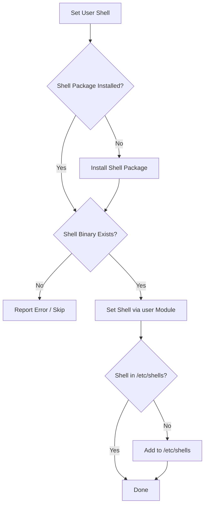

# How to Set User Shell with the Ansible user Module

Author: [nawazdhandala](https://www.github.com/nawazdhandala)

Tags: Ansible, User Management, Linux, Shell Configuration

Description: Learn how to set and change user login shells using the Ansible user module, covering bash, zsh, nologin, and shell validation techniques.

---

The login shell is one of the most basic properties of a Linux user account, but it has real impact on security and usability. Service accounts should never have an interactive shell. Developers often want zsh or fish. And sometimes you need to temporarily disable login by switching someone to `/usr/sbin/nologin`. The Ansible `user` module makes managing shells across your fleet straightforward.

## Setting a Shell During User Creation

The `shell` parameter on the `user` module sets the user's login shell:

```yaml
# set-shell-basic.yml - Set shell during user creation
- name: Create user with specific shell
  hosts: all
  become: yes
  tasks:
    - name: Create developer with bash shell
      ansible.builtin.user:
        name: developer
        shell: /bin/bash
        state: present

    - name: Create sysadmin with zsh shell
      ansible.builtin.user:
        name: sysadmin
        shell: /bin/zsh
        state: present
```

If you do not specify a shell, the system uses whatever is configured as the default in `/etc/default/useradd` (typically `/bin/bash` on most distributions, but sometimes `/bin/sh`).

## Common Shell Paths

Here are the shells you will encounter most often and when to use them:

| Shell | Path | Use Case |
|-------|------|----------|
| Bash | /bin/bash | Default for most human users |
| Zsh | /bin/zsh | Popular alternative with better completions |
| Fish | /usr/bin/fish | User-friendly shell, less POSIX-compatible |
| sh | /bin/sh | POSIX shell, minimal |
| nologin | /usr/sbin/nologin | Prevents interactive login (service accounts) |
| false | /bin/false | Also prevents login (older convention) |

## Changing an Existing User's Shell

The `user` module is idempotent, so you can change an existing user's shell by simply specifying the new value:

```yaml
# change-shell.yml - Change a user's shell
- name: Change user shell
  hosts: all
  become: yes
  tasks:
    - name: Switch developer to zsh
      ansible.builtin.user:
        name: developer
        shell: /bin/zsh
        state: present
```

Ansible compares the current shell with the desired shell. If they match, it reports "ok" and makes no changes. If they differ, it runs `usermod -s /bin/zsh developer` and reports "changed".

## Ensuring the Shell Is Installed

One common issue: you set a user's shell to `/bin/zsh`, but zsh is not installed on the target server. The `user` module will happily set the shell even if the binary does not exist, but the user will get an error when they try to log in.

Always install the shell package first:

```yaml
# install-and-set-shell.yml - Install shell before setting it
- name: Install zsh and set as user shell
  hosts: all
  become: yes
  tasks:
    # Install zsh on the target system first
    - name: Install zsh on Debian/Ubuntu
      ansible.builtin.apt:
        name: zsh
        state: present
      when: ansible_os_family == "Debian"

    - name: Install zsh on RHEL/CentOS
      ansible.builtin.dnf:
        name: zsh
        state: present
      when: ansible_os_family == "RedHat"

    # Now set the shell
    - name: Set user shell to zsh
      ansible.builtin.user:
        name: developer
        shell: /bin/zsh
        state: present
```

## Shell Validation

You can add a validation step to make sure the shell exists before assigning it:

```yaml
# validate-shell.yml - Validate shell exists before setting
- name: Validate and set user shell
  hosts: all
  become: yes
  vars:
    desired_shell: /bin/zsh
  tasks:
    - name: Check if desired shell exists
      ansible.builtin.stat:
        path: "{{ desired_shell }}"
      register: shell_check

    - name: Set user shell if it exists
      ansible.builtin.user:
        name: developer
        shell: "{{ desired_shell }}"
        state: present
      when: shell_check.stat.exists

    - name: Warn if shell is not available
      ansible.builtin.debug:
        msg: "WARNING: {{ desired_shell }} not found on {{ inventory_hostname }}, shell not changed"
      when: not shell_check.stat.exists
```

## Shell Assignment Workflow

Here is the workflow for safely managing user shells:



## The /etc/shells File

Linux maintains a list of valid login shells in `/etc/shells`. Some services (like FTP) check this file to verify a user's shell is legitimate. If you install a non-standard shell, you might need to add it:

```yaml
# add-to-etc-shells.yml - Ensure shell is listed in /etc/shells
- name: Ensure shell is in /etc/shells
  hosts: all
  become: yes
  tasks:
    - name: Install fish shell
      ansible.builtin.apt:
        name: fish
        state: present
      when: ansible_os_family == "Debian"

    - name: Add fish to /etc/shells
      ansible.builtin.lineinfile:
        path: /etc/shells
        line: /usr/bin/fish
        state: present

    - name: Set user shell to fish
      ansible.builtin.user:
        name: developer
        shell: /usr/bin/fish
        state: present
```

## Setting nologin for Service Accounts

For service accounts, you always want to prevent interactive login. The standard approach is using `/usr/sbin/nologin`:

```yaml
# nologin-shell.yml - Set nologin for service accounts
- name: Set nologin shell for service accounts
  hosts: all
  become: yes
  vars:
    service_accounts:
      - nginx
      - redis
      - prometheus
      - grafana
  tasks:
    - name: Ensure service accounts have nologin shell
      ansible.builtin.user:
        name: "{{ item }}"
        shell: /usr/sbin/nologin
        state: present
      loop: "{{ service_accounts }}"
```

The difference between `/usr/sbin/nologin` and `/bin/false` is subtle. Both prevent login, but `nologin` prints a polite message ("This account is currently not available") before disconnecting, while `false` just silently disconnects. Modern convention favors `nologin`.

## Temporarily Disabling Login

You can temporarily disable a user's login by switching them to nologin, then switching back later:

```yaml
# disable-login.yml - Temporarily disable user login
- name: Temporarily disable user login
  hosts: all
  become: yes
  tasks:
    # First, record the current shell so we can restore it later
    - name: Get current shell for user
      ansible.builtin.getent:
        database: passwd
        key: developer

    - name: Save current shell
      ansible.builtin.set_fact:
        saved_shell: "{{ getent_passwd['developer'][5] }}"

    - name: Disable login by setting nologin
      ansible.builtin.user:
        name: developer
        shell: /usr/sbin/nologin
        state: present

    - name: Display saved shell for reference
      ansible.builtin.debug:
        msg: "Previous shell was {{ saved_shell }}, can be restored later"
```

To restore:

```yaml
# restore-login.yml - Restore user's shell
- name: Restore user login shell
  hosts: all
  become: yes
  tasks:
    - name: Restore developer shell to bash
      ansible.builtin.user:
        name: developer
        shell: /bin/bash
        state: present
```

## Per-Environment Shell Configuration

Different environments might require different shell configurations. You can handle this with variables:

```yaml
# env-specific-shell.yml - Environment-specific shells
- name: Configure shells per environment
  hosts: all
  become: yes
  vars:
    # In production, use bash for consistency
    # In development, let people use their preferred shell
    user_shell: "{{ '/bin/zsh' if env == 'development' else '/bin/bash' }}"
  tasks:
    - name: Set user shell based on environment
      ansible.builtin.user:
        name: developer
        shell: "{{ user_shell }}"
        state: present
```

## Setting Shells for Multiple Users

When managing shells for a team, use a loop with per-user shell preferences:

```yaml
# team-shells.yml - Set shells for multiple users
- name: Configure team shells
  hosts: all
  become: yes
  vars:
    team:
      - name: alice
        shell: /bin/zsh
      - name: bob
        shell: /bin/bash
      - name: carol
        shell: /usr/bin/fish
  tasks:
    - name: Collect unique shells needed
      ansible.builtin.set_fact:
        required_shells: "{{ team | map(attribute='shell') | unique | list }}"

    - name: Verify all required shells exist
      ansible.builtin.stat:
        path: "{{ item }}"
      register: shell_checks
      loop: "{{ required_shells }}"

    - name: Set user shells
      ansible.builtin.user:
        name: "{{ item.name }}"
        shell: "{{ item.shell }}"
        state: present
      loop: "{{ team }}"
```

## Best Practices

1. **Always install the shell before assigning it**. A shell that does not exist on the target system will prevent the user from logging in.

2. **Use `/usr/sbin/nologin` for service accounts**, not `/bin/false`. It gives better feedback to anyone who accidentally tries to log in as a service account.

3. **Check `/etc/shells`** when using non-standard shells. Some services refuse to authenticate users whose shell is not listed there.

4. **Standardize shells in production**. Letting everyone use different shells makes troubleshooting harder. Pick one (usually bash) and stick with it for production environments.

5. **Use the full path** when specifying shells. Do not use just `bash` or `zsh`. Always use the absolute path like `/bin/bash`.

Setting the right shell is a small detail that makes a big difference in both security and user experience. Get it right in your Ansible playbooks, and you will never have to SSH into a server to fix someone's shell again.
