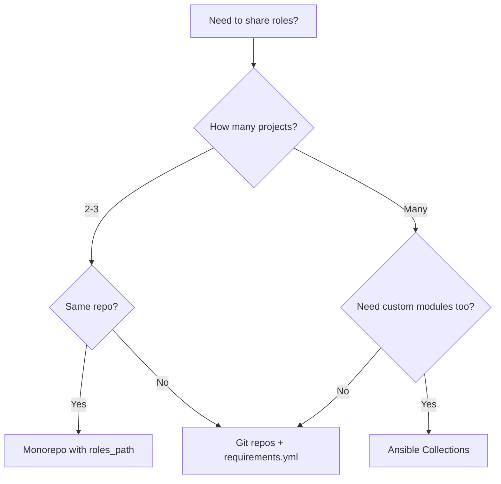

# How to Share Ansible Roles Across Multiple Projects

Author: [nawazdhandala](https://www.github.com/nawazdhandala)

Tags: Ansible, Roles, Reusability, Git

Description: Learn practical strategies for sharing Ansible roles across multiple projects using Git repos, Galaxy, and requirements files.

---

Once you build a well-tested Ansible role, you naturally want to reuse it across multiple projects without copy-pasting. There are several approaches to sharing roles: Git submodules, separate repositories with requirements files, private Galaxy servers, and monorepo patterns. Each has trade-offs. This post covers the most practical methods and helps you choose the right one for your situation.

## The Problem with Copy-Paste

The naive approach is to copy role directories between projects. This breaks down fast because:

- Bug fixes in one copy do not propagate to others
- Different projects drift to different versions
- There is no changelog or version tracking
- You lose the ability to test the role independently

Every approach in this post solves these problems to varying degrees.

## Method 1: Separate Git Repositories + requirements.yml

This is the most common and recommended approach. Each shared role lives in its own Git repository, and projects pull them in via a `requirements.yml` file.

### Setting Up the Role Repository

```bash
# Create a standalone Git repo for the role
mkdir ansible-role-nginx
cd ansible-role-nginx
ansible-galaxy init . --force
git init
git add .
git commit -m "Initial role scaffolding"
```

Build out the role normally, then push it:

```bash
git remote add origin git@github.com:myorg/ansible-role-nginx.git
git push -u origin main
```

Tag releases so projects can pin to specific versions:

```bash
git tag -a v1.0.0 -m "Initial release"
git push origin v1.0.0
```

### Using the Role in a Project

Create a `requirements.yml` file in your project:

```yaml
# requirements.yml
# Roles pulled from Git repositories with version pinning
---
roles:
  - name: nginx
    src: git@github.com:myorg/ansible-role-nginx.git
    version: v1.0.0

  - name: postgresql
    src: git@github.com:myorg/ansible-role-postgresql.git
    version: v2.3.1

  - name: common
    src: git@github.com:myorg/ansible-role-common.git
    version: v1.5.0
```

Install the roles:

```bash
# Install all roles listed in requirements.yml
ansible-galaxy install -r requirements.yml -p roles/
```

The `-p roles/` flag installs them into your project's `roles/` directory.

### Project Structure

```
my-project/
  ansible.cfg
  requirements.yml
  site.yml
  group_vars/
  host_vars/
  roles/
    nginx/        <-- installed from Git
    postgresql/   <-- installed from Git
    common/       <-- installed from Git
    app_deploy/   <-- project-specific role
```

### Keeping roles/ Out of Git

Add `roles/` to your `.gitignore` for externally managed roles and create a Makefile or script to install them:

```bash
# install-roles.sh
#!/bin/bash
# Install shared roles from requirements.yml
ansible-galaxy install -r requirements.yml -p roles/ --force
```

```gitignore
# .gitignore
# Externally managed roles (installed from requirements.yml)
roles/nginx/
roles/postgresql/
roles/common/
# Keep project-specific roles
!roles/app_deploy/
```

## Method 2: Git Submodules

Git submodules link another repository at a specific commit:

```bash
# Add a role as a Git submodule
git submodule add git@github.com:myorg/ansible-role-nginx.git roles/nginx
git submodule add git@github.com:myorg/ansible-role-postgresql.git roles/postgresql
```

After cloning the project, others need to initialize the submodules:

```bash
# Clone with submodules
git clone --recurse-submodules git@github.com:myorg/my-project.git

# Or initialize submodules after cloning
git submodule update --init --recursive
```

Update a submodule to a newer version:

```bash
# Pull the latest changes for a specific role
cd roles/nginx
git fetch
git checkout v2.0.0
cd ../..
git add roles/nginx
git commit -m "Update nginx role to v2.0.0"
```

### Submodule Trade-offs

Pros:
- The exact commit is tracked in your project's Git history
- No extra install step needed (just submodule init)
- Clear visibility into which version is pinned

Cons:
- Git submodules have a steep learning curve
- Contributors who forget `--recurse-submodules` get empty directories
- Updating submodules is more cumbersome than updating `requirements.yml`

## Method 3: Private Galaxy Server (Automation Hub)

If your organization runs Ansible Automation Platform (formerly Tower), you can host roles on a private Automation Hub:

```yaml
# ansible.cfg
[galaxy]
server_list = private_hub, galaxy

[galaxy_server.private_hub]
url=https://hub.internal.company.com/api/galaxy/
token=your-api-token

[galaxy_server.galaxy]
url=https://galaxy.ansible.com/
```

```yaml
# requirements.yml
---
roles:
  - name: myorg.nginx
    src: https://hub.internal.company.com/
    version: 1.0.0
```

This approach works well for enterprises that need access control and audit trails for shared automation content.

## Method 4: Monorepo with roles_path

If all your projects live in a single large repository, you can share roles via a common directory and the `roles_path` configuration:

```
monorepo/
  shared-roles/
    common/
    nginx/
    postgresql/
    security/
  project-alpha/
    ansible.cfg
    site.yml
    roles/
      app_alpha/
  project-beta/
    ansible.cfg
    site.yml
    roles/
      app_beta/
```

Configure each project to look for roles in both the local `roles/` directory and the shared directory:

```ini
# project-alpha/ansible.cfg
[defaults]
roles_path = roles:../shared-roles
```

```ini
# project-beta/ansible.cfg
[defaults]
roles_path = roles:../shared-roles
```

Now both projects can use `common`, `nginx`, and `postgresql` roles while maintaining their own project-specific roles.

### Monorepo Trade-offs

Pros:
- Simple to set up
- All roles are always at the latest version
- Easy to refactor across projects and roles simultaneously

Cons:
- No version pinning (everyone gets the latest)
- Breaking changes in a shared role affect all projects immediately
- Not suitable for teams that need independent release cycles

## Method 5: Ansible Collections

For more structured sharing, especially with custom modules and plugins, package your roles inside an Ansible collection:

```
collections/
  myorg/
    infrastructure/
      roles/
        nginx/
        postgresql/
        common/
      plugins/
        modules/
        filters/
      galaxy.yml
```

```yaml
# collections/myorg/infrastructure/galaxy.yml
---
namespace: myorg
name: infrastructure
version: 1.0.0
readme: README.md
authors:
  - Platform Engineering Team
description: Shared infrastructure roles and plugins
```

Build and publish:

```bash
# Build the collection
ansible-galaxy collection build collections/myorg/infrastructure/

# Install it locally for testing
ansible-galaxy collection install myorg-infrastructure-1.0.0.tar.gz

# Publish to a Galaxy server
ansible-galaxy collection publish myorg-infrastructure-1.0.0.tar.gz
```

Use roles from the collection:

```yaml
# site.yml
---
- hosts: web_servers
  roles:
    - role: myorg.infrastructure.nginx
      vars:
        nginx_port: 8080
```

## CI/CD Integration

Whichever method you choose, automate role installation in your CI/CD pipeline:

```yaml
# .gitlab-ci.yml
deploy:
  stage: deploy
  before_script:
    - pip install ansible
    - ansible-galaxy install -r requirements.yml -p roles/
  script:
    - ansible-playbook site.yml -i inventory/production
```

```yaml
# .github/workflows/deploy.yml
jobs:
  deploy:
    runs-on: ubuntu-latest
    steps:
      - uses: actions/checkout@v4

      - name: Install Ansible
        run: pip install ansible

      - name: Install shared roles
        run: ansible-galaxy install -r requirements.yml -p roles/

      - name: Run playbook
        run: ansible-playbook site.yml -i inventory/production
```

## Choosing the Right Approach



For most teams, the Git repositories with `requirements.yml` approach gives the best balance of simplicity, version control, and flexibility.

## Wrapping Up

Sharing Ansible roles across projects is essential for maintaining consistent infrastructure. Separate Git repositories with `requirements.yml` is the most widely adopted pattern because it gives you version pinning, independent testing, and a clear separation of concerns. Git submodules work if your team is comfortable with them. Monorepos are great for small teams that want simplicity. Collections are the right choice when you also need to share custom modules and plugins. Pick the approach that fits your team's workflow and stick with it.
