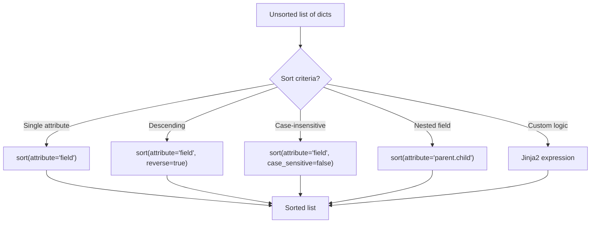

# How to Sort Lists of Dictionaries in Ansible

Author: [nawazdhandala](https://www.github.com/nawazdhandala)

Tags: Ansible, Data Manipulation, Filters, Jinja2

Description: Learn how to sort lists of dictionaries in Ansible by any attribute, with support for reverse order, multiple keys, and case-insensitive sorting.

---

Sorting data is a fundamental operation when you need to process items in a specific order. Whether you are generating configuration files that need entries in alphabetical order, prioritizing tasks by severity, or just making output more readable, Ansible gives you the `sort` filter with the `attribute` parameter to sort lists of dictionaries by any field.

## Basic Sorting by Attribute

The `sort` filter, when given the `attribute` parameter, sorts a list of dictionaries by the specified field.

```yaml
# playbook-basic-sort.yml
# Sorts a list of servers alphabetically by hostname
- name: Sort servers by hostname
  hosts: localhost
  gather_facts: false
  vars:
    servers:
      - hostname: web-03
        ip: 10.0.1.30
      - hostname: web-01
        ip: 10.0.1.10
      - hostname: db-01
        ip: 10.0.2.10
      - hostname: web-02
        ip: 10.0.1.20

  tasks:
    - name: Sort by hostname
      ansible.builtin.debug:
        msg: "{{ servers | sort(attribute='hostname') }}"
```

Output (sorted alphabetically by hostname):

```json
[
    {"hostname": "db-01", "ip": "10.0.2.10"},
    {"hostname": "web-01", "ip": "10.0.1.10"},
    {"hostname": "web-02", "ip": "10.0.1.20"},
    {"hostname": "web-03", "ip": "10.0.1.30"}
]
```

## Sorting in Reverse Order

Add `reverse=true` to sort in descending order:

```yaml
# playbook-reverse-sort.yml
# Sorts servers by CPU usage, highest first
- name: Sort by CPU usage descending
  hosts: localhost
  gather_facts: false
  vars:
    servers:
      - name: web-01
        cpu_percent: 45
      - name: db-01
        cpu_percent: 88
      - name: cache-01
        cpu_percent: 12
      - name: web-02
        cpu_percent: 67

  tasks:
    - name: Sort by CPU usage highest first
      ansible.builtin.set_fact:
        by_cpu_desc: "{{ servers | sort(attribute='cpu_percent', reverse=true) }}"

    - name: Display servers sorted by CPU (descending)
      ansible.builtin.debug:
        msg: "{{ by_cpu_desc | map(attribute='name') | list }}"
```

Result: `["db-01", "web-02", "web-01", "cache-01"]`

## Sorting by Numeric vs String Attributes

When sorting numeric values, Ansible handles the comparison correctly as long as the values are actual numbers (not strings). Be careful when loading data from files or APIs where numbers might come in as strings.

```yaml
# playbook-numeric-sort.yml
# Shows the difference between sorting numeric values vs string representations
- name: Numeric vs string sorting
  hosts: localhost
  gather_facts: false
  vars:
    correct_numbers:
      - name: small
        priority: 1
      - name: large
        priority: 100
      - name: medium
        priority: 10

    string_numbers:
      - name: small
        priority: "1"
      - name: large
        priority: "100"
      - name: medium
        priority: "10"

  tasks:
    - name: Sort actual numbers (correct order)
      ansible.builtin.debug:
        msg: "{{ correct_numbers | sort(attribute='priority') | map(attribute='name') | list }}"

    - name: Sort string numbers (lexicographic, probably wrong)
      ansible.builtin.debug:
        msg: "{{ string_numbers | sort(attribute='priority') | map(attribute='name') | list }}"
```

Numeric sort gives: `["small", "medium", "large"]`
String sort gives: `["small", "large", "medium"]` (because "100" < "10" lexicographically? No, actually "1" < "10" < "100" alphabetically, so it works here, but with values like "9" and "10", "9" > "10" as strings)

To fix string number sorting, convert to int first:

```yaml
    - name: Fix string sorting with json_query
      ansible.builtin.debug:
        msg: >-
          {{ string_numbers | sort(attribute='priority') | list }}
```

## Case-Insensitive Sorting

For string attributes, you can use `case_sensitive=false` to ignore case:

```yaml
# playbook-case-sort.yml
# Sorts names in a case-insensitive manner
- name: Case-insensitive sort
  hosts: localhost
  gather_facts: false
  vars:
    items:
      - name: Zebra
        id: 1
      - name: apple
        id: 2
      - name: Banana
        id: 3
      - name: cherry
        id: 4

  tasks:
    - name: Case-sensitive sort (default - uppercase first)
      ansible.builtin.debug:
        msg: "{{ items | sort(attribute='name') | map(attribute='name') | list }}"

    - name: Case-insensitive sort
      ansible.builtin.debug:
        msg: "{{ items | sort(attribute='name', case_sensitive=false) | map(attribute='name') | list }}"
```

## Sorting by Nested Attributes

You can sort by nested dictionary attributes using dot notation:

```yaml
# playbook-nested-sort.yml
# Sorts instances by a nested attribute (resources.cpu)
- name: Sort by nested attribute
  hosts: localhost
  gather_facts: false
  vars:
    instances:
      - name: app-server
        resources:
          cpu: 4
          memory: 8192
      - name: worker-node
        resources:
          cpu: 16
          memory: 32768
      - name: api-gateway
        resources:
          cpu: 2
          memory: 4096

  tasks:
    - name: Sort by nested CPU attribute
      ansible.builtin.debug:
        msg: "{{ instances | sort(attribute='resources.cpu') | map(attribute='name') | list }}"
```

Result: `["api-gateway", "app-server", "worker-node"]`

## Custom Sort with Jinja2

For complex sorting logic that cannot be expressed with a single attribute, use Jinja2:

```yaml
# playbook-custom-sort.yml
# Implements custom sort order using a priority map
- name: Custom sort logic
  hosts: localhost
  gather_facts: false
  vars:
    tasks_list:
      - name: backup database
        priority: low
      - name: fix critical bug
        priority: critical
      - name: update docs
        priority: low
      - name: patch security issue
        priority: high
      - name: deploy feature
        priority: medium
    priority_order:
      critical: 0
      high: 1
      medium: 2
      low: 3

  tasks:
    - name: Sort tasks by custom priority order
      ansible.builtin.set_fact:
        sorted_tasks: >-
          
          
          
          
          
          
          {{ ns.result }}

    - name: Show sorted tasks
      ansible.builtin.debug:
        msg: "{{ sorted_tasks | map(attribute='name') | list }}"
```

## Stable Sort

Ansible's sort is stable, meaning items that compare equal maintain their original relative order. This is important when you sort by one field and want to preserve the ordering from a previous sort for ties.

```yaml
# playbook-stable-sort.yml
# Demonstrates stable sorting: first by role, then by name within each role
- name: Stable sort demonstration
  hosts: localhost
  gather_facts: false
  vars:
    employees:
      - name: Alice
        department: engineering
        seniority: 5
      - name: Bob
        department: engineering
        seniority: 3
      - name: Carol
        department: sales
        seniority: 7
      - name: David
        department: engineering
        seniority: 5
      - name: Eve
        department: sales
        seniority: 2

  tasks:
    - name: Sort by name first, then by department (stable)
      ansible.builtin.set_fact:
        sorted_emp: >-
          {{ employees
             | sort(attribute='name')
             | sort(attribute='department') }}

    - name: Show result
      ansible.builtin.debug:
        msg: "{{ sorted_emp }}"
```

## Sorting Flow



## Practical Example: Generating Ordered Configuration

```yaml
# playbook-ordered-config.yml
# Generates a sorted DNS zone file from an unordered list of records
- name: Generate sorted DNS zone file
  hosts: localhost
  gather_facts: false
  vars:
    dns_records:
      - name: mail
        type: MX
        priority: 10
        value: mail.example.com
      - name: www
        type: A
        value: 93.184.216.34
        priority: 0
      - name: api
        type: A
        value: 93.184.216.35
        priority: 0
      - name: mail
        type: MX
        priority: 20
        value: mail2.example.com

  tasks:
    - name: Sort records by type, then by name, then by priority
      ansible.builtin.set_fact:
        sorted_records: >-
          {{ dns_records
             | sort(attribute='priority')
             | sort(attribute='name')
             | sort(attribute='type') }}

    - name: Generate zone file
      ansible.builtin.copy:
        content: |
          ; Zone file - generated by Ansible
          ; Records sorted by type, name, priority
          
          {{ record.name }}\tIN\t{{ record.type }}\t{{ record.priority }}\t{{ record.value }}
          
        dest: /tmp/zone.db
```

## Summary

The `sort` filter with `attribute` is the primary tool for ordering lists of dictionaries. Use `reverse=true` for descending order, `case_sensitive=false` for case-insensitive string comparison, and dot notation for nested attributes. For multi-key sorting, take advantage of stable sort by applying sorts in reverse order of priority (sort by the least important key first, then by the most important key last). When you need custom ordering logic that does not fit the built-in comparisons, fall back to Jinja2 expressions.
