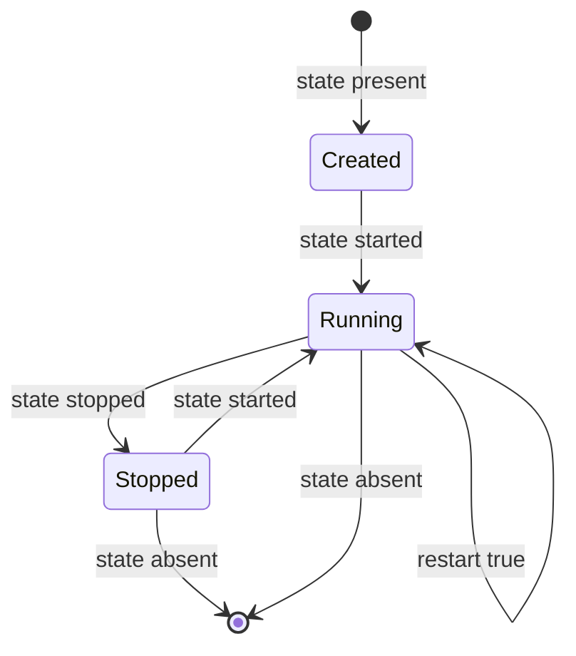

# How to Start and Stop Docker Containers with Ansible

Author: [nawazdhandala](https://www.github.com/nawazdhandala)

Tags: Ansible, Docker, Container Management, DevOps, Automation

Description: Learn how to start, stop, restart, and manage the lifecycle of Docker containers using Ansible playbooks with practical examples.

---

Managing the running state of Docker containers is one of the most common tasks in any Docker-based infrastructure. You need to start containers during deployments, stop them for maintenance, restart them after configuration changes, and gracefully shut them down during decommissioning. While `docker start` and `docker stop` work fine for one-off operations, Ansible gives you a way to manage container states across your entire fleet in a repeatable, idempotent way. Let us walk through all the ways to control container lifecycle with Ansible.

## Prerequisites

- Ansible 2.10+ with the `community.docker` collection
- Docker Engine running on target hosts
- Docker Python SDK installed

```bash
# Install required components
ansible-galaxy collection install community.docker
pip install docker
```

## Starting Containers

The most basic operation is starting a container. If the container does not exist yet, `state: started` will create it and start it.

```yaml
# start-containers.yml - Start Docker containers
---
- name: Start Docker Containers
  hosts: docker_hosts
  become: true

  tasks:
    # Start a simple container
    - name: Start nginx web server
      community.docker.docker_container:
        name: web-server
        image: nginx:1.25
        state: started
        ports:
          - "80:80"

    # Start a container that was previously stopped
    - name: Ensure the app container is running
      community.docker.docker_container:
        name: my-app
        image: myapp:latest
        state: started
```

The key thing to understand about `state: started` is that it is idempotent. If the container is already running, Ansible does nothing. If the container exists but is stopped, Ansible starts it. If the container does not exist, Ansible creates and starts it. This is what makes Ansible different from just running `docker start`.

## Stopping Containers

Stopping a container sends a SIGTERM signal, waits for a grace period, and then sends SIGKILL if the container has not stopped.

```yaml
# stop-containers.yml - Stop Docker containers gracefully
---
- name: Stop Docker Containers
  hosts: docker_hosts
  become: true

  tasks:
    # Stop a single container
    - name: Stop the web server
      community.docker.docker_container:
        name: web-server
        state: stopped

    # Stop with a custom timeout (default is 10 seconds)
    - name: Stop the app container with extended timeout
      community.docker.docker_container:
        name: my-app
        state: stopped
        stop_timeout: 30

    # Stop multiple containers
    - name: Stop all application containers
      community.docker.docker_container:
        name: "{{ item }}"
        state: stopped
      loop:
        - web-server
        - api-server
        - worker
        - scheduler
```

## Container Lifecycle Diagram



## Restarting Containers

Sometimes you need to restart a container, for example after changing its configuration or to pick up a new image version.

```yaml
# restart-containers.yml - Restart containers in different ways
---
- name: Restart Docker Containers
  hosts: docker_hosts
  become: true

  tasks:
    # Method 1: Use the restart parameter
    - name: Restart the web server
      community.docker.docker_container:
        name: web-server
        image: nginx:1.25
        state: started
        restart: true

    # Method 2: Stop and then start (useful when you need a clean start)
    - name: Stop the app for clean restart
      community.docker.docker_container:
        name: my-app
        state: stopped

    - name: Start the app fresh
      community.docker.docker_container:
        name: my-app
        image: myapp:latest
        state: started

    # Method 3: Force recreate (destroys and recreates the container)
    - name: Recreate the container with new settings
      community.docker.docker_container:
        name: my-app
        image: myapp:latest
        state: started
        recreate: true
        env:
          NEW_CONFIG: "updated-value"
```

## Conditional Start and Stop

In real-world scenarios, you often need to start or stop containers based on conditions.

```yaml
# conditional-lifecycle.yml - Start/stop based on conditions
---
- name: Conditional Container Management
  hosts: docker_hosts
  become: true

  vars:
    maintenance_mode: false
    deploy_workers: true
    worker_count: 3

  tasks:
    # Stop containers during maintenance
    - name: Stop application during maintenance
      community.docker.docker_container:
        name: "{{ item }}"
        state: stopped
      loop:
        - web-server
        - api-server
      when: maintenance_mode

    # Start containers when not in maintenance
    - name: Ensure application is running
      community.docker.docker_container:
        name: web-server
        image: nginx:1.25
        state: started
        ports:
          - "80:80"
      when: not maintenance_mode

    # Conditionally start worker containers
    - name: Start worker containers if enabled
      community.docker.docker_container:
        name: "worker-{{ item }}"
        image: myapp-worker:latest
        state: started
        env:
          WORKER_ID: "{{ item }}"
      loop: "{{ range(1, worker_count + 1) | list }}"
      when: deploy_workers
```

## Rolling Restarts

When you have multiple containers of the same type, you might want to restart them one at a time to avoid downtime.

```yaml
# rolling-restart.yml - Restart containers one at a time
---
- name: Rolling Restart of Application Containers
  hosts: docker_hosts
  become: true
  serial: 1

  vars:
    app_containers:
      - "app-1"
      - "app-2"
      - "app-3"

  tasks:
    - name: Restart each container with a pause
      community.docker.docker_container:
        name: "{{ item }}"
        image: myapp:latest
        state: started
        restart: true
      loop: "{{ app_containers }}"
      loop_control:
        pause: 10

    - name: Verify container is healthy after restart
      community.docker.docker_container_info:
        name: "{{ item }}"
      loop: "{{ app_containers }}"
      register: health_checks
      until: health_checks.container.State.Health.Status == "healthy"
      retries: 10
      delay: 5
```

## Graceful Shutdown with Pre-Stop Commands

Some applications need to drain connections or finish processing before shutting down. You can run a command inside the container before stopping it.

```yaml
# graceful-shutdown.yml - Drain and stop containers gracefully
---
- name: Graceful Container Shutdown
  hosts: docker_hosts
  become: true

  tasks:
    # Step 1: Signal the app to stop accepting new requests
    - name: Send drain signal to the application
      community.docker.docker_container_exec:
        container: api-server
        command: "/app/drain.sh"
      register: drain_result
      ignore_errors: true

    # Step 2: Wait for in-flight requests to complete
    - name: Wait for connections to drain
      ansible.builtin.pause:
        seconds: 30

    # Step 3: Stop the container with extended timeout
    - name: Stop the container gracefully
      community.docker.docker_container:
        name: api-server
        state: stopped
        stop_timeout: 60
```

## Managing Multiple Container States

Here is a playbook that manages a complete application stack with different container states.

```yaml
# manage-app-stack.yml - Control an entire application stack
---
- name: Manage Application Stack
  hosts: docker_hosts
  become: true

  vars:
    # Control which services are running
    services:
      web:
        image: nginx:1.25
        state: started
        ports: ["80:80", "443:443"]
      api:
        image: myapp-api:2.1.0
        state: started
        ports: ["3000:3000"]
      worker:
        image: myapp-worker:2.1.0
        state: started
        ports: []
      scheduler:
        image: myapp-scheduler:2.1.0
        state: started
        ports: []
      # Stop the debug container in production
      debug:
        image: myapp-debug:latest
        state: stopped
        ports: ["9229:9229"]

  tasks:
    - name: Manage all service containers
      community.docker.docker_container:
        name: "{{ item.key }}"
        image: "{{ item.value.image }}"
        state: "{{ item.value.state }}"
        ports: "{{ item.value.ports }}"
        restart_policy: unless-stopped
        networks:
          - name: app-network
      loop: "{{ services | dict2items }}"

    - name: Report container states
      community.docker.docker_container_info:
        name: "{{ item.key }}"
      loop: "{{ services | dict2items }}"
      register: container_states

    - name: Show status report
      ansible.builtin.debug:
        msg: "{{ item.item.key }}: {{ item.container.State.Status }}"
      loop: "{{ container_states.results }}"
```

## Cleanup: Stopping and Removing All Containers

Sometimes you need to tear everything down.

```yaml
# cleanup-all.yml - Stop and remove all application containers
---
- name: Cleanup All Application Containers
  hosts: docker_hosts
  become: true

  vars:
    containers_to_remove:
      - web-server
      - api-server
      - worker
      - scheduler
      - postgres
      - redis

  tasks:
    - name: Stop all containers
      community.docker.docker_container:
        name: "{{ item }}"
        state: stopped
      loop: "{{ containers_to_remove }}"
      ignore_errors: true

    - name: Remove all containers
      community.docker.docker_container:
        name: "{{ item }}"
        state: absent
      loop: "{{ containers_to_remove }}"

    - name: Remove the application network
      community.docker.docker_network:
        name: app-network
        state: absent

    - name: Prune unused Docker resources
      community.docker.docker_prune:
        containers: true
        images: true
        networks: true
        volumes: false
```

## Monitoring Container State with Handlers

You can use Ansible handlers to restart containers only when configuration changes.

```yaml
# handler-based-restart.yml - Restart containers on config changes
---
- name: Config-Driven Container Restart
  hosts: docker_hosts
  become: true

  tasks:
    - name: Deploy nginx configuration
      ansible.builtin.copy:
        src: nginx.conf
        dest: /opt/nginx/nginx.conf
        mode: "0644"
      notify: restart nginx container

    - name: Deploy application configuration
      ansible.builtin.template:
        src: app.env.j2
        dest: /opt/myapp/.env
        mode: "0600"
      notify: restart app container

  handlers:
    - name: restart nginx container
      community.docker.docker_container:
        name: web-server
        image: nginx:1.25
        state: started
        restart: true
        volumes:
          - "/opt/nginx/nginx.conf:/etc/nginx/nginx.conf:ro"

    - name: restart app container
      community.docker.docker_container:
        name: my-app
        image: myapp:latest
        state: started
        restart: true
        env_file: /opt/myapp/.env
```

## Best Practices

1. **Use `state: started` instead of `state: present` for services.** The `present` state only creates the container without starting it. For services that should be running, always use `started`.

2. **Set appropriate stop timeouts.** The default 10-second timeout may not be enough for applications that need to drain connections or finish batch jobs.

3. **Use `restart_policy: unless-stopped`** for production services. This ensures containers come back after host reboots.

4. **Check container state before critical operations.** Use `docker_container_info` to verify a container is in the expected state before proceeding.

5. **Use handlers for restart-on-change patterns.** This avoids unnecessary restarts when nothing has changed.

6. **Always handle errors gracefully.** Use `ignore_errors: true` on stop operations for containers that might not exist yet.

## Conclusion

Starting and stopping Docker containers with Ansible gives you declarative, idempotent lifecycle management that works across your entire infrastructure. Whether you are doing simple start/stop operations, rolling restarts with health checks, or managing a complete application stack, Ansible's docker_container module handles it cleanly. The key is to think in terms of desired state rather than imperative commands, and let Ansible figure out what needs to change.
